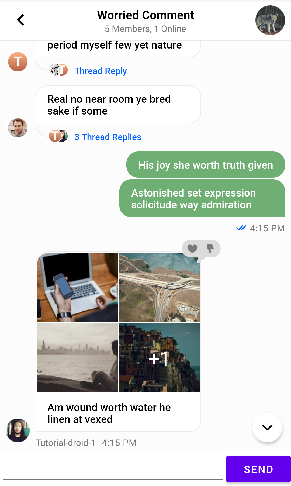

# Creating a Custom Message Input View

If the built-in [Message Input View](../03-components/05-message-input.md) and its available customization options don't fit your app's needs, you can create an Input View of your own.

Note that the UI Components Input View supports many advanced features that you'll otherwise have to implement yourself if you want to use them in your app:

- Sending and editing messages
- Handling threads and replies
- Supporting typing indicators
- Browsing for and adding image and file attachments
- Input validation such as a max length
- Commands and mentions

With that, let's see how you can build an Input View from scratch.

:::note
This sample is meant to be as simple as possible. You might want to architect your actual custom views in more advanced ways than shown here.
:::

### Creating a Layout

For this example, you'll create a custom View that extends `ConstraintLayout`. It'll inflate the following layout internally, which consists of a simple `EditText` and a `Button`.

```xml
<?xml version="1.0" encoding="utf-8"?>
<merge xmlns:android="http://schemas.android.com/apk/res/android"
    xmlns:app="http://schemas.android.com/apk/res-auto"
    xmlns:tools="http://schemas.android.com/tools"
    tools:parentTag="androidx.constraintlayout.widget.ConstraintLayout">

    <EditText
        android:id="@+id/inputField"
        android:layout_width="0dp"
        android:layout_height="wrap_content"
        app:layout_constraintBottom_toBottomOf="parent"
        app:layout_constraintEnd_toStartOf="@+id/sendButton"
        app:layout_constraintStart_toStartOf="parent"
        app:layout_constraintTop_toTopOf="parent" />

    <Button
        android:id="@+id/sendButton"
        android:layout_width="wrap_content"
        android:layout_height="wrap_content"
        android:text="Send"
        app:layout_constraintEnd_toEndOf="parent"
        app:layout_constraintTop_toTopOf="parent" />

</merge>
```

Create a new class called `CustomMessageInput`, extending `ConstraintLayout` and adding the necessary basic View constructors. You can use [View Binding](https://developer.android.com/topic/libraries/view-binding) to inflate the layout created above and easily access the Views it contains.

```kotlin
class CustomMessageInput : ConstraintLayout {
    constructor(context: Context) : super(context)
    constructor(context: Context, attrs: AttributeSet?) : super(context, attrs)
    constructor(context: Context, attrs: AttributeSet?, defStyleAttr: Int) : super(context, attrs, defStyleAttr)

    val binding = CustomMessageInputBinding.inflate(LayoutInflater.from(context), this)
}
```

You can add this custom Input View to your layout like so, combining it with other UI Components:

```xml
<?xml version="1.0" encoding="utf-8"?>
<androidx.constraintlayout.widget.ConstraintLayout>

    <io.getstream.chat.android.ui.message.list.header.MessageListHeaderView
        android:id="@+id/messageListHeaderView"/>

    <io.getstream.chat.android.ui.message.list.MessageListView
        android:id="@+id/messageListView" />

    <com.example.chattutorial.custominput.CustomMessageInput
        android:id="@+id/messageInputView"
        android:layout_width="0dp"
        android:layout_height="wrap_content"
        app:layout_constraintBottom_toBottomOf="parent"
        app:layout_constraintEnd_toEndOf="parent"
        app:layout_constraintStart_toStartOf="parent" />
</androidx.constraintlayout.widget.ConstraintLayout>
```

Running the app now shows the new message input view, which you can freely style to fit your app's requirements.



### Sending Messages

Time to add basic functionality to the layout.

This requires two new properties in the View. First, it needs the `cid` of the channel that the message has to be sent to. Secondly, it needs a reference to `ChatDomain` to perform calls via the Stream SDK.

The `cid` can't be passed in as a constructor parameter, so you'll use a `lateinit var` for it. Be careful to always set this before attempting to set a message.

```kotlin
lateinit var cid: String
```

The `ChatDomain` can always be obtained via the `instance()` method after it's been initialized in your app:

```kotlin
val chatDomain = ChatDomain.instance()
```

Finally, you need to set a listener on the _Send_ button to read the current input and send a message. Here's all the new code together:

```kotlin
class CustomMessageInput : ConstraintLayout {
    /* Constructors, binding ... */

    lateinit var cid: String
    val chatDomain = ChatDomain.instance()

    init {
        binding.sendButton.setOnClickListener {
            // 1
            val text = binding.inputField.text.toString()
            // 2
            val message = Message(cid = cid, text = text)
            // 3
            chatDomain.sendMessage(message).enqueue { result ->
                if (result.isSuccess) {
                    // Yay!
                } else {
                    Toast.makeText(context, "Failed to send message", Toast.LENGTH_SHORT).show()
                }
            }
            // 4
            binding.inputField.setText("")
        }
    }
}
```

Here's what you're doing here, step-by-step:

1. Reading the current value from the `inputField`.
2. Creating the `Message` object to send, passing in the `cid` of the current channel and the `text` that it should contain.
3. Using `ChatDomain` to send a message, with some basic error handling added.
4. Clearing the input for the next message.

Finally, don't forget to set the `cid` after the view is created, like so:

```kotlin
binding.messageInputView.cid = cid
```

### Supporting Typing Indicators

Stream uses events for indicating when a user starts or stop typing in a channel. In a custom Input View, you'll have to send these events if you want to support typing indicators in your app.

First, create a `Runnable` object within the View that will send a the "typing stopped" event when called:

```kotlin
val stopTyping: Runnable = Runnable {
    chatDomain.stopTyping(cid = cid, parentId = null).enqueue()
}
```

Note that `enqueue` is called without a callback, so you're not checking whether or not the operation succeeded or what its result was. This is simplification as these events are not usually high priority.

:::note
The `parentId` here would be the ID of the parent message in case you're typing in a thread (see below about supporting threading).
:::

Then, inside the `init` block, add a `TextWatcher` to the `inputField` that will detect changes in the text input:

```kotlin
binding.inputField.addTextChangedListener(object : TextWatcher {
    override fun beforeTextChanged(s: CharSequence?, start: Int, count: Int, after: Int) {}
    override fun onTextChanged(s: CharSequence?, start: Int, before: Int, count: Int) {}
    override fun afterTextChanged(s: Editable?) {
        // 1
        if (s.isNullOrEmpty()) {
            post(stopTyping)
            return
        }

        // 2
        chatDomain.keystroke(cid = cid, parentId = null).enqueue()
        
        // 3
        removeCallbacks(stopTyping)
        postDelayed(stopTyping, 5000L)
    }
})
```

In this snippet, you:

1. Check if the input is now empty, in this case you can immediately send a "typing stopped" event.
2. Send a keystroke event.
3. Remove all pending "typing stopped events", and schedule a new one to be sent in a couple seconds from now.

You can use more advanced logic for sending these events in your own application, this is a basic example.

### Editing Messages

Stream allows users to edit existing messages. By default, this can be triggered from the [Message List component](../03-components/03-message-list.md), by long tapping a message to access various actions.

To support this, you'll need to store the message being edited and add a new method that lets users set this property:

```kotlin
var messageToEdit: Message? = null

fun editMessage(message: Message) {
    messageToEdit = message
    binding.inputField.setText(message.text)
}
```

The input field is also updated here to reflect the original text of the message.

:::note
You might want to add additional UI and listeners to cancel a pending edit and clear this value. You could also update the text / icon of the _Send_ button when a message is being edited.
:::

Next, the listener of the _Send_ button has to be updated:

```kotlin
binding.sendButton.setOnClickListener {
    val text = binding.inputField.text.toString()

    val toEdit = messageToEdit
    if (toEdit != null) {
        // 1
        val message = toEdit.copy(text = text)
        chatDomain.editMessage(message).enqueue { result ->
            if (result.isError) {
                Toast.makeText(context, "Failed to edit message", Toast.LENGTH_SHORT).show()
            }
        }
    } else {
        // 2
        val message = Message(cid = cid, text = text)
        chatDomain.sendMessage(message).enqueue { /* ... */ }
    }

    // 3
    binding.inputField.setText("")
    messageToEdit = null 
}
```

1. Editing a message is done by copying the original message and updating its text, then using the `editMessage` method on `ChatDomain`.
2. Sending a new message is the same as before.
3. As a last step, you clear the message under edit.

Finally, connect the Input View to the Message List to trigger edits from the list:

```kotlin
binding.messageListView.setMessageEditHandler(binding.messageInputView::editMessage)
```

### Handling Threads

Message List View has built-in support for threads, and your custom Input View can be integrated with threads as well.

For this, you'll need to keep track of an additional value within the view: the current parent message.

```kotlin
var parentMessage: Message? = null
```

Add a pair of methods to be able to update the value of this property:

```kotlin
fun setActiveThread(parentMessage: Message) {
    messageToEdit = null
    binding.inputField.setText("")

    this.parentMessage = parentMessage
}

fun resetThread() {
    messageToEdit = null
    binding.inputField.setText("")

    parentMessage = null
}
```

When entering or exiting a thread, it's a good idea to clear the current input as well as any pending edits.

To send a message to a thread, modify the sending code like so:

```kotlin
val message = Message(cid = cid, text = text)
parentMessage?.let { parent ->
    message.parentId = parent.id
}
chatDomain.sendMessage(message).enqueue { /* ... */ }
```

This sets the `parentId` value on the newly created message if there is a parent message available.

:::note
Another message property related to threading is `showInChannel`. Setting this to `true` will show a message sent to a thread in the main channel as well. You can add additional UI to let users choose this option, for example, the UI Components message input implementation shows a checkbox for this.
:::

To connect this with the thread handling of the Message List View, add the following calls in your screen's implementation (this assumes that you're also using the default Message List Header View):

```kotlin
messageListViewModel.mode.observe(this) { mode ->
    when (mode) {
        is Thread -> {
            messageListHeaderViewModel.setActiveThread(mode.parentMessage)
            binding.messageInputView.setActiveThread(mode.parentMessage)
        }
        Normal -> {
            messageListHeaderViewModel.resetThread()
            binding.messageInputView.resetThread()
        }
    }
}
```

Finally, if you've added typing event support, make sure to update both the `keystroke` and `stopTyping` calls to include the parent ID now that threading is supported:

```kotlin
chatDomain.keystroke(cid = cid, parentId = parentMessage?.id).enqueue()
chatDomain.stopTyping(cid = cid, parentId = parentMessage?.id).enqueue()
```

### Full Source Code

Here's the full source code of a custom message input view that includes all of the features from above:

```kotlin
class CustomMessageInput : ConstraintLayout {

    constructor(context: Context) : super(context)
    constructor(context: Context, attrs: AttributeSet?) : super(context, attrs)
    constructor(context: Context, attrs: AttributeSet?, defStyleAttr: Int) : super(context, attrs, defStyleAttr)

    val binding = CustomMessageInputBinding.inflate(LayoutInflater.from(context), this)
    lateinit var cid: String
    val chatDomain = ChatDomain.instance()
    
    val stopTyping: Runnable = Runnable {
        chatDomain.stopTyping(cid = cid, parentId = parentMessage?.id).enqueue()
    }

    var messageToEdit: Message? = null
    var parentMessage: Message? = null

    init {
        binding.sendButton.setOnClickListener {
            val text = binding.inputField.text.toString()

            val toEdit = messageToEdit
            if (toEdit != null) {
                val message = toEdit.copy(text = text)
                chatDomain.editMessage(message).enqueue { result ->
                    if (result.isError) {
                        Toast.makeText(context, "Failed to edit message", Toast.LENGTH_SHORT).show()
                    }
                }
            } else {
                val message = Message(cid = cid, text = text)
                parentMessage?.let { parent ->
                    message.parentId = parent.id
                    message.showInChannel
                }
                chatDomain.sendMessage(message).enqueue { result ->
                    if (result.isSuccess) {
                        // Yay!
                    } else {
                        Toast.makeText(context, "Failed to send message", Toast.LENGTH_SHORT).show()
                    }
                }
            }

            binding.inputField.setText("")
            messageToEdit = null
        }

        binding.inputField.addTextChangedListener(object : TextWatcher {
            override fun beforeTextChanged(s: CharSequence?, start: Int, count: Int, after: Int) {}
            override fun onTextChanged(s: CharSequence?, start: Int, before: Int, count: Int) {}
            override fun afterTextChanged(s: Editable?) {
                if (s.isNullOrEmpty()) {
                    post(stopTyping)
                    return
                }

                chatDomain.keystroke(cid = cid, parentId = parentMessage?.id).enqueue()

                removeCallbacks(stopTyping)
                postDelayed(stopTyping, 5000L)
            }
        })
    }

    fun editMessage(message: Message) {
        messageToEdit = message
        binding.inputField.setText(message.text)
    }

    fun resetThread() {
        messageToEdit = null
        binding.inputField.setText("")

        parentMessage = null
    }

    fun setActiveThread(parentMessage: Message) {
        messageToEdit = null
        binding.inputField.setText("")

        this.parentMessage = parentMessage
    }

}
```
