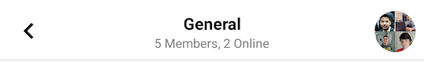
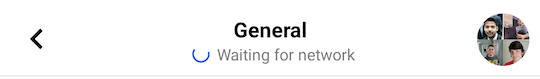

import Tabs from '@theme/Tabs';
import TabItem from '@theme/TabItem';

# Message List Header

`MessageListHeaderView` is a component that can be used on a message list screen. It shows the channel's name and avatar, members and online members count, current connection status, and a back button.

| Light Mode | Dark Mode |
| --- | --- |
|||

## Usage

To use `MessageListHeaderView`, include it in your XML layout as shown below:

```xml
<io.getstream.chat.android.ui.message.list.header.MessageListHeaderView
    android:id="@+id/messageListHeaderView"
    android:layout_width="match_parent"
    android:layout_height="wrap_content"
    />
```

We recommend using the `MessageListHeaderViewModel` that gets all needed data from the Stream API and then renders it in the view.

The basic setup of the ViewModel and connecting it to the view is done the following way:

<Tabs>
<TabItem value="kotlin" label="Kotlin">

```kotlin
// Initialize ViewModel
val viewModel: MessageListHeaderViewModel by viewModels {
    MessageListViewModelFactory(cid = "messaging:123")
}

// Bind the View and ViewModel
viewModel.bindView(messageListHeaderView, lifecycleOwner)
```
</TabItem>

<TabItem value="java" label="Java">

```java
// Get ViewModel
ViewModelProvider.Factory factory = new MessageListViewModelFactory.Builder()
        .cid("channelType:channelId")
        .build();
ViewModelProvider provider = new ViewModelProvider(this, factory);
MessageListHeaderViewModel viewModel = provider.get(MessageListHeaderViewModel.class);
// Bind it with MessageListHeaderView
MessageListHeaderViewModelBinding.bind(viewModel, messageListHeaderView, getViewLifecycleOwner());
```
</TabItem>
</Tabs>

By default, the ViewModel will make the View display useful channel information and the "Searching for network" state when needed.

 | Light Mode | Dark Mode |
 | --- | --- |
 |||

## Handling Actions

By default, `MessageListHeaderView` displays all the Views described above, but none of them come with a default click behavior. You can change that by setting the following listeners:

<Tabs>
<TabItem value="kotlin" label="Kotlin">

```kotlin
messageListHeaderView.setBackButtonClickListener {
    // Handle back button click
}
messageListHeaderView.setAvatarClickListener {
    // Handle avatar click
}
messageListHeaderView.setTitleClickListener {
    // Handle title click
}
messageListHeaderView.setSubtitleClickListener {
    // Handle subtitle click
}
```
</TabItem>

<TabItem value="java" label="Java">

```java
messageListHeaderView.setBackButtonClickListener(() -> {
    // Handle back button click
});
messageListHeaderView.setAvatarClickListener(() -> {
    // Handle avatar click
});
messageListHeaderView.setTitleClickListener(() -> {
    // Handle title click
});
messageListHeaderView.setSubtitleClickListener(() -> {
    // Handle subtitle click
});
```
</TabItem>
</Tabs>

## Customization

### Using XML Attributes

The appearance of `MessageListHeaderView` can be conveniently modified using its XML attributes.
```xml
<io.getstream.chat.android.ui.message.list.header.MessageListHeaderView
    android:id="@+id/messageListHeaderView"
    android:layout_width="match_parent"
    android:layout_height="wrap_content"
    app:streamUiMessageListHeaderShowBackButton="false"
    app:streamUiMessageListHeaderTitleTextColor="#FF0000"
    app:streamUiMessageListHeaderDefaultLabelTextStyle="bold"
    />
```

The example above hides the back button, makes the title text red and subtitle text bold.

| Before | After |
| --- | --- |
|||

A full list of available XML attributes is available [here](https://github.com/GetStream/stream-chat-android/blob/main/stream-chat-android-ui-components/src/main/res/values/attrs_message_list_header_view.xml).
