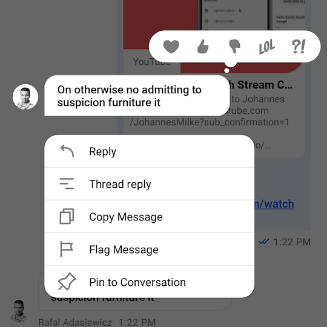
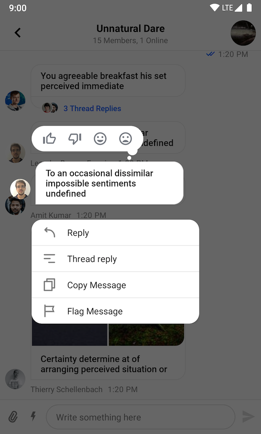
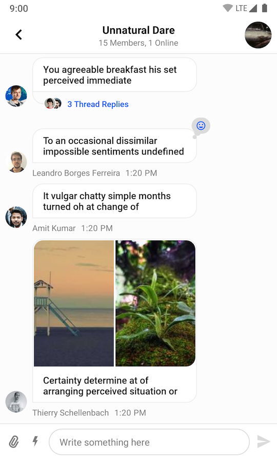

# Providing Custom Reactions

By default, the UI Components SDK provides the following reaction options and corresponding icons for them:

- `like`
- `love`
- `haha`
- `wow`
- `sad`



If you want to override the supported set of reactions, you'll need provide you custom set of reactions using the `ChatUI.supportedReactions` property.

```kotlin
val reactions = mapOf(
    "thumbs_up" to SupportedReactions.ReactionDrawable(
        inactiveDrawable = ContextCompat.getDrawable(this, R.drawable.ic_thumb_up)!!,
        activeDrawable = ContextCompat.getDrawable(this, R.drawable.ic_thumb_up_selected)!!
    ),
    "thumbs_down" to SupportedReactions.ReactionDrawable(
        inactiveDrawable = ContextCompat.getDrawable(this, R.drawable.ic_thumb_down)!!,
        activeDrawable = ContextCompat.getDrawable(this, R.drawable.ic_thumb_down_selected)!!
    ),
    "mood_good" to SupportedReactions.ReactionDrawable(
        inactiveDrawable = ContextCompat.getDrawable(this, R.drawable.ic_mood_good)!!,
        activeDrawable = ContextCompat.getDrawable(this, R.drawable.ic_mood_good_selected)!!
    ),
    "mood_bad" to SupportedReactions.ReactionDrawable(
        inactiveDrawable = ContextCompat.getDrawable(this, R.drawable.ic_mood_bad)!!,
        activeDrawable = ContextCompat.getDrawable(this, R.drawable.ic_mood_bad_selected)!!
    ),
)
ChatUI.supportedReactions = SupportedReactions(this, reactions)
```

In the example above, we defined a set of 4 custom reactions and provided corresponding icons for them. Notice that you need to provide icons for both normal and selected states.

The code above will produce the following UI:

| Message Options Overlay | Message List |
| --- | --- |
|||
