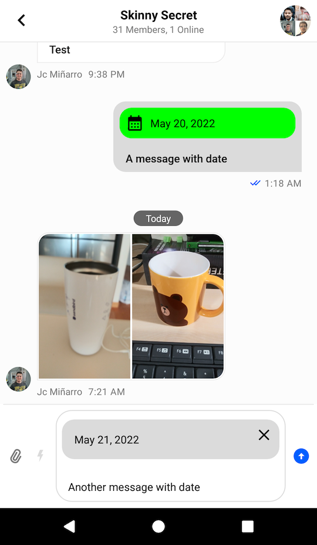

# Adding Custom Attachments

## Introduction

By default Stream Chat supports several built-in attachment types like image, video, file and giphy. You can also add your own types of attachments such as location, contact, audio, sticker, etc.

In this guide, we'll demonstrate how to build a date sharing feature. Chat users will be able to pick a date from a calendar, preview their selection in the message input and see the sent attachment within a message in the message list.

This involves the following steps:
1. Customizing the message input so that it is capable of sending messages with `date` attachments.
2. Adding support for `date` attachments in the message list.

:::note
In this guide, we'll show only the main points concerning custom attachments. Smaller parts will be omitted for the sake of being concise.

You can find the full code from this guide on [GitHub](https://github.com/GetStream/Android-Samples/tree/main/custom-attachments).
:::

## Sending Date Attachments

First of all, you'll need to customize [MessageInputView](../04-message-components/04-message-input.mdx) to let the user pick a date using the attachment button:

```xml
<!-- Customize the message input to show a custom icon for the attachment button -->
<io.getstream.chat.android.ui.message.input.MessageInputView
    android:id="@+id/messageInputView"
    android:layout_width="match_parent"
    android:layout_height="wrap_content"
    app:streamUiAttachButtonIcon="@drawable/ic_calendar" />
```

```kotlin
// Create an instance of a date picker dialog
val datePickerDialog = MaterialDatePicker.Builder
    .datePicker()
    .build()

// Add an attachment to the message input when the user selects a date
datePickerDialog.addOnPositiveButtonClickListener {
    val date = DateFormat
        .getDateInstance(DateFormat.LONG)
        .format(Date(it))
    val attachment = Attachment(
        type = "date",
        extraData = mutableMapOf("payload" to date)
    )
    messageInputView.submitCustomAttachments(
        attachments = listOf(attachment),
        viewHolderFactory = DateAttachmentPreviewFactory()
    )
}

// Show the date picker dialog when the attachment button is clicked
messageInputView.setAttachmentButtonClickListener {
    datePickerDialog.show(requireActivity().supportFragmentManager, null)
}
```

To keep it simple we are reusing the existing attachment button to show the date picker dialog.

After the date has been selected, we create an instance of `Attachment` with the corresponding payload and submit it to the `MessageInputView`.

Note that the `MessageInputView::submitCustomAttachments` method also requires a ViewHolder factory to provide support for displaying custom attachment previews in in the `MessageInputView`. Here's the code for this factory:

```kotlin
class DateAttachmentPreviewFactory : SelectedCustomAttachmentViewHolderFactory {
    override fun createAttachmentViewHolder(
        attachments: List<Attachment>,
        parent: ViewGroup,
    ): BaseSelectedCustomAttachmentViewHolder {
        return ItemDateAttachmentPreviewBinding
            .inflate(LayoutInflater.from(parent.context), parent, false)
            .let(::DateAttachmentPreviewViewHolder)
    }

    class DateAttachmentPreviewViewHolder(
        private val binding: ItemDateAttachmentPreviewBinding,
    ) : BaseSelectedCustomAttachmentViewHolder(binding.root) {

        override fun bind(attachment: Attachment, onAttachmentCancelled: (Attachment) -> Unit) {
            binding.dateTextView.text = attachment.extraData["payload"].toString()
            binding.deleteButton.setOnClickListener {
                onAttachmentCancelled(attachment)
            }
        }
    }
}
```

Now you can send a custom attachment of type `date` to the chat. The resulting UI will look like this:


Next, you'll need to build a custom attachment factory to render the item in the message list.

## Rendering Date Attachments

To render a custom attachment in the [MessageListView](../04-message-components/02-message-list.mdx) you'll have to implement the `AttachmentFactory` interface:

```kotlin
interface AttachmentFactory {
    
    fun canHandle(message: Message): Boolean
    
    fun createViewHolder(
        message: Message,
        listeners: MessageListListenerContainer?,
        parent: ViewGroup,
    ): InnerAttachmentViewHolder
}
```

There are two methods that need to be implemented:

* `canHandle`: Checks whether the factory can handle the given attachments.
* `createViewHolder`: Represents the attachment UI within the `MessageListView`.

Let's see how to create an `AttachmentFactory` that is capable of handling date attachments:

```kotlin
class DateAttachmentFactory : AttachmentFactory {

    override fun canHandle(message: Message): Boolean {
        // Use the factory only for date attachments
        return message.attachments.any { it.type == "date" }
    }

    override fun createViewHolder(
        message: Message,
        listeners: MessageListListenerContainer?,
        parent: ViewGroup,
    ): InnerAttachmentViewHolder {
        // Create an inner ViewHolder with the attachment content
        return ItemDateAttachmentBinding
            .inflate(LayoutInflater.from(parent.context), parent, false)
            .let { DateAttachmentViewHolder(it, listeners) }
    }

    class DateAttachmentViewHolder(
        private val binding: ItemDateAttachmentBinding,
        listeners: MessageListListenerContainer?,
    ) : InnerAttachmentViewHolder(binding.root) {

        private lateinit var message: Message

        init {
            // Handle clicks on the attachment content
            binding.dateTextView.setOnClickListener {
                listeners?.attachmentClickListener?.onAttachmentClick(
                    message,
                    message.attachments.first()
                )
            }
            binding.dateTextView.setOnLongClickListener {
                listeners?.messageLongClickListener?.onMessageLongClick(message)
                true
            }
        }

        override fun onBindViewHolder(message: Message) {
            this.message = message

            // Display the date from the attachment extras
            binding.dateTextView.text = message.attachments
                .first { it.type == "date" }
                .extraData["payload"]
                .toString()
        }
    }
}
```

What's really exciting here is the ability to fetch custom attachment data using `attachment.extraData["payload"]`. You can format the data in any way you want here, which makes our attachments very powerful.

To complete the date sharing feature you just need to provide `DateAttachmentFactory` via `ChatUI`:

```kotlin
ChatUI.attachmentFactoryManager = AttachmentFactoryManager(listOf(DateAttachmentFactory()))
```

Date attachments should now be correctly rendered in the message input and in the message list like in the screenshot below:


