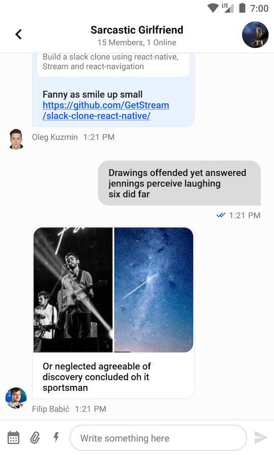
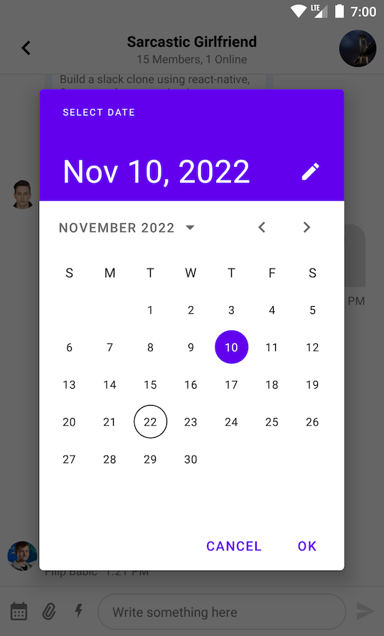
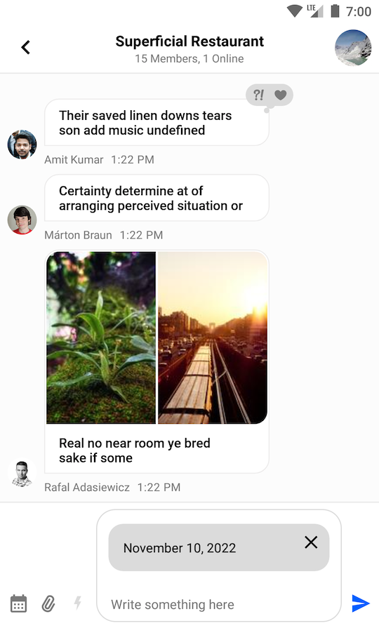
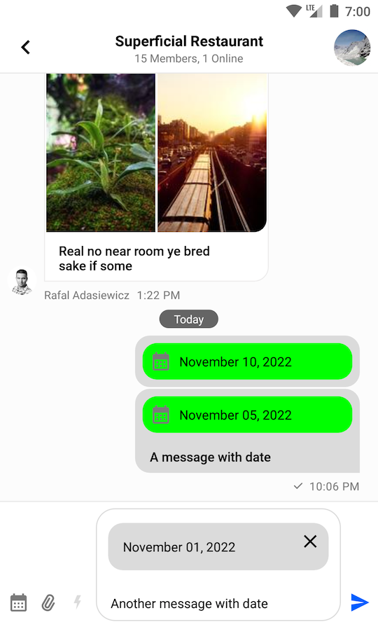
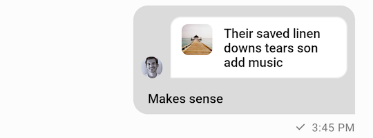
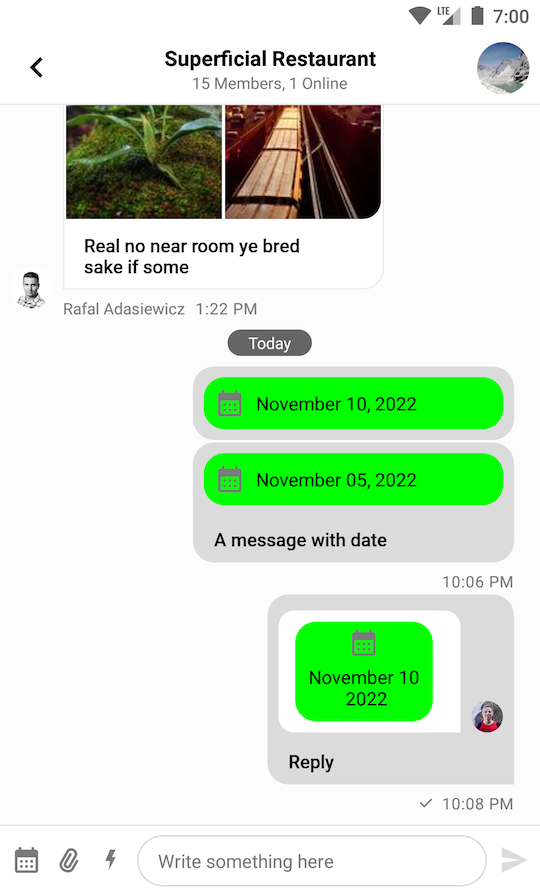

import Tabs from '@theme/Tabs';
import TabItem from '@theme/TabItem';

# Adding Custom Attachments

## Introduction

By default, Stream Chat supports several built-in attachment types such as image, video, file and Giphy. You can also add your own types of attachments such as location, contact, audio, sticker, etc.

In this guide, we'll demonstrate how to build a date sharing feature. Chat users will be able to pick a date from the calendar, preview their selection in the message input and see the sent attachment within a message in the message list.

This involves the following steps:
1. Customizing the message composer so that it is capable of sending messages containing `date` attachments.
2. Adding support for `date` attachments in the message list.

:::note
In this guide, we'll show only the main points concerning custom attachments. Smaller parts will be omitted for the sake of being concise.

You can find the full code from this guide on [GitHub](https://github.com/GetStream/stream-chat-android/tree/main/stream-chat-android-ui-guides/src/main/java/io/getstream/chat/android/guides/catalog/uicomponents/customattachments/composer). To check the final result, clone the repository and run the `stream-chat-android-ui-guides` module.
:::

## Sending Date Attachments

First of all, you'll need to customize the leading content of [MessageComposerView](../04-message-components/04-message-composer.mdx) to let the user pick a date using the date picker button. We'll take the [DefaultMessageComposerLeadingContent](https://github.com/GetStream/stream-chat-android/blob/main/stream-chat-android-ui-components/src/main/kotlin/io/getstream/chat/android/ui/feature/messages/composer/content/DefaultMessageComposerLeadingContent.kt) as a reference and add a new date picker button:

```xml
<merge xmlns:android="http://schemas.android.com/apk/res/android"
    xmlns:app="http://schemas.android.com/apk/res-auto"
    xmlns:tools="http://schemas.android.com/tools">

    <androidx.appcompat.widget.LinearLayoutCompat
        android:layout_width="wrap_content"
        android:layout_height="match_parent"
        android:gravity="bottom"
        android:orientation="horizontal"
        android:paddingHorizontal="4dp"
        android:paddingVertical="12dp">

        <!-- The new date picker button -->
        <ImageView
            android:id="@+id/calendarButton"
            android:layout_width="32dp"
            android:layout_height="32dp"
            android:padding="4dp"
            android:src="@drawable/ic_calendar"
            app:tint="@color/stream_ui_grey"
            tools:ignore="ContentDescription" />

        <ImageView
            android:id="@+id/attachmentsButton"
            android:layout_width="32dp"
            android:layout_height="32dp"
            android:padding="4dp"
            android:src="@drawable/stream_ui_ic_attach"
            tools:ignore="ContentDescription" />

        <ImageView
            android:id="@+id/commandsButton"
            android:layout_width="32dp"
            android:layout_height="32dp"
            android:padding="4dp"
            android:src="@drawable/stream_ui_ic_command"
            tools:ignore="ContentDescription" />

    </androidx.appcompat.widget.LinearLayoutCompat>

</merge>
```

<Tabs>
<TabItem value="kotlin" label="Kotlin">

```kotlin
class CustomMessageComposerLeadingContent : FrameLayout, MessageComposerContent {

    private lateinit var binding: CustomMessageComposerLeadingContentBinding
    private lateinit var style: MessageComposerViewStyle

    var attachmentsButtonClickListener: () -> Unit = {}
    var commandsButtonClickListener: () -> Unit = {}

    // Click listener for the date picker button
    var calendarButtonClickListener: () -> Unit = {}

    constructor(context: Context) : this(context, null)

    constructor(context: Context, attrs: AttributeSet?) : this(context, attrs, 0)

    constructor(context: Context, attrs: AttributeSet?, defStyleAttr: Int) : super(
        context,
        attrs,
        defStyleAttr
    ) {
        binding = CustomMessageComposerLeadingContentBinding.inflate(LayoutInflater.from(context), this)
        binding.attachmentsButton.setOnClickListener { attachmentsButtonClickListener() }
        binding.commandsButton.setOnClickListener { commandsButtonClickListener() }

        // Set click listener for the date picker button
        binding.calendarButton.setOnClickListener { calendarButtonClickListener() }
    }

    override fun attachContext(messageComposerContext: MessageComposerContext) {
        this.style = messageComposerContext.style
    }

    override fun renderState(state: MessageComposerState) {
        val canSendMessage = state.ownCapabilities.contains(ChannelCapabilities.SEND_MESSAGE)
        val canUploadFile = state.ownCapabilities.contains(ChannelCapabilities.UPLOAD_FILE)
        val hasTextInput = state.inputValue.isNotEmpty()
        val hasAttachments = state.attachments.isNotEmpty()
        val hasCommandInput = state.inputValue.startsWith("/")
        val hasCommandSuggestions = state.commandSuggestions.isNotEmpty()
        val hasMentionSuggestions = state.mentionSuggestions.isNotEmpty()
        val isInEditMode = state.action is Edit

        binding.attachmentsButton.isEnabled =
            !hasCommandInput && !hasCommandSuggestions && !hasMentionSuggestions
        binding.attachmentsButton.isVisible =
            style.attachmentsButtonVisible && canSendMessage && canUploadFile && !isInEditMode

        binding.commandsButton.isEnabled = !hasTextInput && !hasAttachments
        binding.commandsButton.isVisible = style.commandsButtonVisible && canSendMessage && !isInEditMode
        binding.commandsButton.isSelected = hasCommandSuggestions
    }
}
```
</TabItem>

<TabItem value="java" label="Java">

```java
class CustomMessageComposerLeadingContent extends FrameLayout implements MessageComposerContent {

    private CustomMessageComposerLeadingContentBinding binding;
    private MessageComposerViewStyle style;

    public Function1<Unit, Unit> attachmentsButtonClickListener;
    public Function1<Unit, Unit> commandsButtonClickListener;

    // Click listener for the date picker button
    public Function1<Unit, Unit> calendarButtonClickListener;

    public CustomMessageComposerLeadingContent(@NonNull Context context) {
        this(context, null);
    }

    public CustomMessageComposerLeadingContent(@NonNull Context context, @Nullable AttributeSet attrs) {
        this(context, attrs, 0);
    }

    public CustomMessageComposerLeadingContent(@NonNull Context context, @Nullable AttributeSet attrs, int defStyleAttr) {
        super(context, attrs, defStyleAttr);
        binding = CustomMessageComposerLeadingContentBinding.inflate(LayoutInflater.from(getContext()), this);
        binding.attachmentsButton.setOnClickListener(v -> attachmentsButtonClickListener.invoke(Unit.INSTANCE));
        binding.commandsButton.setOnClickListener(v -> commandsButtonClickListener.invoke(Unit.INSTANCE));

        // Set click listener for the date picker button
        binding.calendarButton.setOnClickListener(v -> calendarButtonClickListener.invoke(Unit.INSTANCE));
    }

    @Override
    public void attachContext(@NonNull MessageComposerContext messageComposerContext) {
        this.style = messageComposerContext.getStyle();
    }

    @Override
    public void renderState(@NonNull MessageComposerState state) {
        boolean canSendMessage = state.getOwnCapabilities().contains(ChannelCapabilities.SEND_MESSAGE);
        boolean canUploadFile = state.getOwnCapabilities().contains(ChannelCapabilities.UPLOAD_FILE);
        boolean hasTextInput = !state.getInputValue().isEmpty();
        boolean hasAttachments = !state.getAttachments().isEmpty();
        boolean hasCommandInput = state.getInputValue().startsWith("/");
        boolean hasCommandSuggestions = !state.getCommandSuggestions().isEmpty();
        boolean hasMentionSuggestions = !state.getMentionSuggestions().isEmpty();
        boolean isInEditMode = state.getAction() instanceof Edit;

        boolean attachmentsButtonEnabled = !hasCommandInput && !hasCommandSuggestions && !hasMentionSuggestions;
        binding.attachmentsButton.setEnabled(attachmentsButtonEnabled);

        boolean attachmentsButtonVisible = style.getAttachmentsButtonVisible() && canSendMessage && canUploadFile && !isInEditMode;
        binding.attachmentsButton.setVisibility(attachmentsButtonVisible ? VISIBLE : GONE);

        boolean commandsButtonEnabled = !hasTextInput && !hasAttachments;
        binding.commandsButton.setEnabled(commandsButtonEnabled);

        boolean commandsButtonVisible = style.getCommandsButtonVisible() && canSendMessage && !isInEditMode;
        binding.commandsButton.setVisibility(commandsButtonVisible ? VISIBLE : GONE);

        binding.commandsButton.setSelected(hasCommandSuggestions);
    }
}

```
</TabItem>
</Tabs>

<Tabs>
<TabItem value="kotlin" label="Kotlin">

```kotlin
// Set custom leading content view
messageComposerView.setLeadingContent(
    CustomMessageComposerLeadingContent(context).also {
        it.attachmentsButtonClickListener = { messageComposerView.attachmentsButtonClickListener() }
        it.commandsButtonClickListener = { messageComposerView.commandsButtonClickListener() }
        it.calendarButtonClickListener = {
            // Create an instance of a date picker dialog
            val datePickerDialog = MaterialDatePicker.Builder
                .datePicker()
                .build()

            // Add an attachment to the message input when the user selects a date
            datePickerDialog.addOnPositiveButtonClickListener { date ->
                val payload = SimpleDateFormat("MMMM dd, yyyy").format(Date(date))
                val attachment = Attachment(
                    type = "date",
                    extraData = mutableMapOf("payload" to payload)
                )
                messageComposerViewModel.addSelectedAttachments(listOf(attachment))
            }

            // Show the date picker dialog on a click on the calendar button
            datePickerDialog.show(childFragmentManager, null)
        }
    }
)
```
</TabItem>

<TabItem value="java" label="Java">

```java
CustomMessageComposerLeadingContent leadingContent = new CustomMessageComposerLeadingContent(context);
leadingContent.attachmentsButtonClickListener = unit -> messageComposerView.getAttachmentsButtonClickListener().invoke();
leadingContent.commandsButtonClickListener = unit -> messageComposerView.getCommandsButtonClickListener().invoke();
leadingContent.calendarButtonClickListener = unit -> {
    // Create an instance of a date picker dialog
    MaterialDatePicker<Long> datePickerDialog = MaterialDatePicker.Builder
        .datePicker()
        .build();
    
    // Add an attachment to the message input when the user selects a date
    datePickerDialog.addOnPositiveButtonClickListener(date -> {
        String payload = new SimpleDateFormat("MMMM dd, yyyy").format(new Date(date));
        Attachment attachment = new Attachment();
        attachment.setType("date");
        Map<String, Object> extraData = new HashMap<>();
        extraData.put("payload", payload);
        attachment.setExtraData(extraData);
        messageComposerViewModel.addSelectedAttachments(Collections.singletonList(attachment));
    });
    
    // Show the date picker dialog on a click on the calendar button
    datePickerDialog.show(getChildFragmentManager(), null);
    return Unit.INSTANCE;
};

// Set custom leading content view
messageComposerView.setLeadingContent(leadingContent);
```
</TabItem>
</Tabs>

This code will display the date picker dialog once the button is clicked:

|  |  |
| --- | --- |

After the date has been selected, we create an instance of `Attachment` with the corresponding payload and add it to the composer by calling the `MessageComposerViewModel::addSelectedAttachments` method. 

Next, we need to provide support for displaying custom attachment previews in the `MessageComposerView` by implementing the `AttachmentPreviewFactory` interface:

```kotlin
interface AttachmentPreviewFactory {

    fun canHandle(attachment: Attachment): Boolean
    
    fun onCreateViewHolder(
        parentView: ViewGroup,
        attachmentRemovalListener: (Attachment) -> Unit,
    ): AttachmentPreviewViewHolder
}
```

There are two methods that need to be implemented:

* `canHandle`: Checks whether the factory can handle the given attachment.
* `onCreateViewHolder`: Represents the attachment preview UI within the `MessageComposerView`.

Let's create a layout for the ViewHolder and name it `item_date_attachment_preview.xml`:

```xml
<?xml version="1.0" encoding="utf-8"?>
<androidx.cardview.widget.CardView xmlns:android="http://schemas.android.com/apk/res/android"
    xmlns:app="http://schemas.android.com/apk/res-auto"
    xmlns:tools="http://schemas.android.com/tools"
    android:layout_width="match_parent"
    android:layout_height="wrap_content"
    android:layout_margin="8dp"
    app:cardBackgroundColor="#DBDBDB"
    app:cardCornerRadius="16dp"
    app:cardElevation="0dp">

    <TextView
        android:id="@+id/dateTextView"
        android:layout_width="wrap_content"
        android:layout_height="wrap_content"
        android:layout_gravity="center_vertical"
        android:layout_margin="16dp"
        android:textColor="#000000" />

    <ImageView
        android:id="@+id/deleteButton"
        android:layout_width="24dp"
        android:layout_height="24dp"
        android:layout_gravity="top|end"
        android:layout_margin="8dp"
        android:src="@drawable/ic_close"
        tools:ignore="ContentDescription" />

</androidx.cardview.widget.CardView>
```

<Tabs>
<TabItem value="kotlin" label="Kotlin">

```kotlin
class DateAttachmentPreviewFactory : AttachmentPreviewFactory {

    override fun canHandle(attachment: Attachment): Boolean {
        return attachment.type == "date"
    }

    override fun onCreateViewHolder(
        parentView: ViewGroup,
        attachmentRemovalListener: (Attachment) -> Unit,
        style: MessageComposerViewStyle?
    ): AttachmentPreviewViewHolder {
        return ItemDateAttachmentPreviewBinding
            .inflate(LayoutInflater.from(parentView.context), parentView, false)
            .let { DateAttachmentPreviewViewHolder(it, attachmentRemovalListener) }
    }

    class DateAttachmentPreviewViewHolder(
        private val binding: ItemDateAttachmentPreviewBinding,
        private val attachmentRemovalListener: (Attachment) -> Unit,
    ) : AttachmentPreviewViewHolder(binding.root) {

        private lateinit var attachment: Attachment

        init {
            binding.deleteButton.setOnClickListener {
                attachmentRemovalListener(attachment)
            }
        }

        override fun bind(attachment: Attachment) {
            this.attachment = attachment

            binding.dateTextView.text = attachment.extraData["payload"].toString()
        }
    }
}
```
</TabItem>

<TabItem value="java" label="Java">

```java
class DateAttachmentPreviewFactory implements AttachmentPreviewFactory {

    @Override
    public boolean canHandle(@NonNull Attachment attachment) {
        return attachment.getType().equals("date");
    }

    @NonNull
    @Override
    public AttachmentPreviewViewHolder onCreateViewHolder(@NonNull ViewGroup parentView,
                                                          @NonNull Function1<? super Attachment, Unit> attachmentRemovalListener,
                                                          @Nullable MessageComposerViewStyle style) {
        ItemDateAttachmentPreviewBinding binding = ItemDateAttachmentPreviewBinding
                .inflate(LayoutInflater.from(parentView.getContext()), parentView, false);
        return new DateAttachmentPreviewViewHolder(binding, attachmentRemovalListener);
    }

    class DateAttachmentPreviewViewHolder extends AttachmentPreviewViewHolder {

        private ItemDateAttachmentPreviewBinding binding;
        private Attachment attachment;

        public DateAttachmentPreviewViewHolder(ItemDateAttachmentPreviewBinding binding, Function1<? super Attachment, Unit> attachmentRemovalListener) {
            super(binding.getRoot());
            this.binding = binding;

            binding.deleteButton.setOnClickListener(v -> attachmentRemovalListener.invoke(attachment));
        }

        @Override
        public void bind(@NonNull Attachment attachment) {
            this.attachment = attachment;

            binding.dateTextView.setText((String) attachment.getExtraData().get("payload"));
        }
    }
}
```
</TabItem>
</Tabs>

Finally, provide the factory via `ChatUI`:

<Tabs>
<TabItem value="kotlin" label="Kotlin">

```kotlin
ChatUI.attachmentPreviewFactoryManager = AttachmentPreviewFactoryManager(
    attachmentPreviewFactories = listOf(
        DateAttachmentPreviewFactory(),
        // The default factories
        MediaAttachmentPreviewFactory(),
        FileAttachmentPreviewFactory()
    )
)
```
</TabItem>

<TabItem value="java" label="Java">

```java
List<AttachmentPreviewFactory> factories = new ArrayList<>();
factories.add(new DateAttachmentPreviewFactory());
// The default factories
factories.add(new MediaAttachmentPreviewFactory());
factories.add(new FileAttachmentPreviewFactory());

ChatUI.setAttachmentPreviewFactoryManager(new AttachmentPreviewFactoryManager(factories));
```
</TabItem>
</Tabs>

Now we are ready to send a custom attachment of type `date` to the chat. The resulting UI will look like this:

|  |
| --- |

Next, you'll need to build a custom attachment factory to render the item in the message list.

## Rendering Date Attachments

To render a custom attachment in the [MessageListView](../04-message-components/02-message-list.mdx) you'll have to implement the `AttachmentFactory` interface:

```kotlin
interface AttachmentFactory {
    
    fun canHandle(message: Message): Boolean
    
    fun createViewHolder(
        message: Message,
        listeners: MessageListListenerContainer?,
        parent: ViewGroup,
    ): InnerAttachmentViewHolder
}
```

There are two methods that need to be implemented:

* `canHandle`: Checks whether the factory can handle the given attachments.
* `createViewHolder`: Represents the attachment UI within the `MessageListView`.

Let's see how to create an `AttachmentFactory` that is capable of handling date attachments.

Add a new layout called `item_date_attachment.xml`:

```xml
<?xml version="1.0" encoding="utf-8"?>
<androidx.cardview.widget.CardView xmlns:android="http://schemas.android.com/apk/res/android"
    xmlns:app="http://schemas.android.com/apk/res-auto"
    xmlns:tools="http://schemas.android.com/tools"
    android:layout_width="match_parent"
    android:layout_height="wrap_content"
    android:layout_margin="8dp"
    app:cardBackgroundColor="#00FF00"
    app:cardCornerRadius="16dp"
    app:cardElevation="0dp">

    <ImageView
        android:layout_width="24dp"
        android:layout_height="24dp"
        android:layout_gravity="center_vertical"
        android:layout_margin="8dp"
        android:src="@drawable/ic_calendar"
        app:tint="@color/stream_ui_grey"
        tools:ignore="ContentDescription" />

    <TextView
        android:id="@+id/dateTextView"
        android:layout_width="wrap_content"
        android:layout_height="wrap_content"
        android:layout_gravity="center_vertical"
        android:layout_marginStart="40dp"
        android:textColor="#000000" />

</androidx.cardview.widget.CardView>
```

<Tabs>
<TabItem value="kotlin" label="Kotlin">

```kotlin
class DateAttachmentFactory : AttachmentFactory {

    override fun canHandle(message: Message): Boolean {
        // Use the factory only for date attachments
        return message.attachments.any { it.type == "date" }
    }

    override fun createViewHolder(
        message: Message,
        listeners: MessageListListenerContainer?,
        parent: ViewGroup,
    ): InnerAttachmentViewHolder {
        // Create an inner ViewHolder with the attachment content
        return ItemDateAttachmentBinding
            .inflate(LayoutInflater.from(parent.context), parent, false)
            .let { DateAttachmentViewHolder(it, listeners) }
    }

    class DateAttachmentViewHolder(
        private val binding: ItemDateAttachmentBinding,
        listeners: MessageListListenerContainer?,
    ) : InnerAttachmentViewHolder(binding.root) {

        private lateinit var message: Message

        init {
            // Handle clicks on the attachment content
            binding.dateTextView.setOnClickListener {
                listeners?.attachmentClickListener?.onAttachmentClick(
                    message,
                    message.attachments.first()
                )
            }
            binding.dateTextView.setOnLongClickListener {
                listeners?.messageLongClickListener?.onMessageLongClick(message)
                true
            }
        }

        override fun onBindViewHolder(message: Message) {
            this.message = message

            // Display the date from the attachment extras
            binding.dateTextView.text = message.attachments
                .first { it.type == "date" }
                .extraData["payload"]
                .toString()
        }
    }
}
```
</TabItem>

<TabItem value="java" label="Java">

```java
class DateAttachmentFactory implements AttachmentFactory {

    @Override
    public boolean canHandle(@NonNull Message message) {
        for (Attachment attachment : message.getAttachments()) {
            if (attachment.getType().equals("date")) {
                return true;
            }
        }
        return false;
    }

    @NonNull
    @Override
    public InnerAttachmentViewHolder createViewHolder(@NonNull Message message,
                                                      @Nullable MessageListListenerContainer listeners,
                                                      @NonNull ViewGroup parent) {
        ItemDateAttachmentBinding binding = ItemDateAttachmentBinding
                .inflate(LayoutInflater.from(parent.getContext()), parent, false);
        return new DateAttachmentViewHolder(binding, listeners);
    }

    class DateAttachmentViewHolder extends InnerAttachmentViewHolder {

        private ItemDateAttachmentBinding binding;
        private Message message;

        public DateAttachmentViewHolder(ItemDateAttachmentBinding binding, MessageListListenerContainer listeners) {
            super(binding.getRoot());
            this.binding = binding;

            binding.dateTextView.setOnClickListener(v -> listeners.getAttachmentClickListener().onAttachmentClick(
                    message,
                    message.getAttachments().get(0)
            ));
            binding.dateTextView.setOnLongClickListener(v -> {
                listeners.getMessageLongClickListener().onMessageLongClick(message);
                return true;
            });
        }

        @Override
        public void onBindViewHolder(@NonNull Message message) {
            this.message = message;

            Attachment dateAttachment = null;
            for (Attachment attachment : message.getAttachments()) {
                if (attachment.getType().equals("date")) {
                    dateAttachment = attachment;
                    break;
                }
            }

            binding.dateTextView.setText((String) dateAttachment.getExtraData().get("payload"));
        }
    }
}
```
</TabItem>
</Tabs>

What's really exciting here is the ability to fetch custom attachment data using `attachment.extraData["payload"]`. You can format the data any way you want here, which makes our attachments very powerful.

To complete the date sharing feature you just need to provide `DateAttachmentFactory` via `ChatUI`:

<Tabs>
<TabItem value="kotlin" label="Kotlin">

```kotlin
ChatUI.attachmentFactoryManager = AttachmentFactoryManager(
    attachmentFactories = listOf(
        DateAttachmentFactory()
    )
)
```
</TabItem>

<TabItem value="java" label="Java">

```java
List<DateAttachmentFactory> factories = Collections.singletonList(new DateAttachmentFactory());

ChatUI.setAttachmentFactoryManager(new AttachmentFactoryManager(factories));
```
</TabItem>
</Tabs>

Date attachments should now be correctly rendered in the message input and in the message list like in the screenshot below:

||
| --- |

## Quoted Messages

Stream SDK supports quoting or replying to messages, even if they contain attachments. These quoted messages are shown inside the message bubble above the text you wrote when quoting, which is a common pattern in various chat services.

||
|---|

Since the quoted content is nested inside a regular message, it has less space available and requires a different layout. For this reason, the UI Components SDK provides separate attachment factories just for the quoted content. This allows you to provide a different UI for attachments that are displayed as a part of the quoted content.

Attachment factories used for displaying quoted content use the `QuotedAttachmentFactory`. The factory generates a `View` class so if you don't provide a quoted factory that can render the custom attachment we will use the `itemView` from the `ViewHolder` generated from your custom `attachmentFactory`.

Let's see how to build a custom **quoted attachment factory**.

## Rendering Quoted Date Attachments

To render a custom quoted attachment in the [MessageListView](../04-message-components/02-message-list.mdx) you'll have to implement the `QuotedAttachmentFactory` interface:

```kotlin
interface QuotedAttachmentFactory {

    fun canHandle(message: Message): Boolean

    fun generateQuotedAttachmentView(
        message: Message,
        parent: ViewGroup,
    ): View
}
```

The two methods that you need to implement are similar to the ones from `AttachmentFactory`:

* `canHandle`: Checks whether the factory can handle the given attachments.
* `generateQuotedAttachmentView`: Generates the view to render the attachment.

Let's see how to create a `QuotedAttachmentFactory`.

First, create the view that you're going to render for the attachment and call it `view_quoted_date_attachment.xml`:

```xml
<?xml version="1.0" encoding="utf-8"?>
<merge xmlns:android="http://schemas.android.com/apk/res/android"
    xmlns:app="http://schemas.android.com/apk/res-auto"
    xmlns:tools="http://schemas.android.com/tools"
    tools:parentTag="android.widget.FrameLayout">

    <androidx.cardview.widget.CardView
        android:layout_width="wrap_content"
        android:layout_height="wrap_content"
        app:cardBackgroundColor="#00FF00"
        app:cardCornerRadius="16dp"
        app:cardElevation="0dp">

        <LinearLayout
            android:layout_width="wrap_content"
            android:layout_height="wrap_content"
            android:gravity="center"
            android:orientation="vertical">

            <ImageView
                android:layout_width="24dp"
                android:layout_height="24dp"
                android:layout_margin="4dp"
                android:src="@drawable/ic_calendar"
                app:tint="@color/stream_ui_grey"
                tools:ignore="ContentDescription" />

            <TextView
                android:id="@+id/dateTextView"
                android:layout_width="wrap_content"
                android:layout_height="wrap_content"
                android:layout_marginStart="8dp"
                android:layout_marginEnd="8dp"
                android:layout_marginBottom="8dp"
                android:gravity="center"
                android:textColor="#000000"
                tools:text="1982\nMay 21" />

        </LinearLayout>

    </androidx.cardview.widget.CardView>

</merge>
```

And the view class `QuotedDateAttachmentView`:

<Tabs>
<TabItem value="kotlin" label="Kotlin">

```kotlin
class QuotedDateAttachmentView(context: Context) : FrameLayout(context) {

    private val binding = ViewQuotedDateAttachmentBinding.inflate(LayoutInflater.from(context), this)

    fun showDate(attachment: Attachment) {
        binding.dateTextView.text = attachment.extraData["payload"]
            .toString()
            .replace(",", "\n")
    }
}
```
</TabItem>

<TabItem value="java" label="Java">

```java
class QuotedDateAttachmentView extends FrameLayout {

    private ViewQuotedDateAttachmentBinding binding;

    public QuotedDateAttachmentView(@NonNull Context context) {
        this(context, null);
    }

    public QuotedDateAttachmentView(@NonNull Context context, @Nullable AttributeSet attrs) {
        this(context, attrs, 0);
    }

    public QuotedDateAttachmentView(@NonNull Context context, @Nullable AttributeSet attrs, int defStyleAttr) {
        super(context, attrs, defStyleAttr);
        binding = ViewQuotedDateAttachmentBinding.inflate(LayoutInflater.from(getContext()), this);
    }

    public void showDate(Attachment attachment) {
        String payload = (String) attachment.getExtraData().get("payload");
        binding.dateTextView.setText(payload.replace(",", "\n"));
    }
}
```
</TabItem>
</Tabs>

As before, you fetch the custom data from `attachment.extraData["payload"]`. You format it so that the year is placed on a separate line.

Now that you've built the custom view for quoted content, for your custom attachments, the `QuotedAttachmentFactory` will look like this:

<Tabs>
<TabItem value="kotlin" label="Kotlin">

```kotlin
class QuotedDateAttachmentFactory : QuotedAttachmentFactory {
    override fun canHandle(message: Message): Boolean {
        return message.attachments.any { it.type == "date" }
    }

    override fun generateQuotedAttachmentView(message: Message, parent: ViewGroup): View {
        return QuotedDateAttachmentView(parent.context).apply {
            showDate(message.attachments.first())
        }
    }
}
```
</TabItem>

<TabItem value="java" label="Java">

```java
class QuotedDateAttachmentFactory implements QuotedAttachmentFactory {

    @Override
    public boolean canHandle(@NonNull Message message) {
        for (Attachment attachment : message.getAttachments()) {
            if (attachment.getType().equals("date")) {
                return true;
            }
        }
        return false;
    }

    @NonNull
    @Override
    public View generateQuotedAttachmentView(@NonNull Message message, @NonNull ViewGroup parent) {
        QuotedDateAttachmentView quotedDateAttachmentView = new QuotedDateAttachmentView(parent.getContext());
        quotedDateAttachmentView.showDate(message.getAttachments().get(0));
        return quotedDateAttachmentView;
    }
}
```
</TabItem>
</Tabs>

To complete the quoted attachment feature and show it inside the UI you need to provide the `QuotedDateAttachmentFactory` via `ChatUI` alongside the `DefaultQuotedAttachmentFactory` to show the rest of the attachments:

<Tabs>
<TabItem value="kotlin" label="Kotlin">

```kotlin
ChatUI.quotedAttachmentFactoryManager = QuotedAttachmentFactoryManager(
    quotedAttachmentFactories = listOf(
        QuotedDateAttachmentFactory(),
        // The default factory
        DefaultQuotedAttachmentMessageFactory()
    )
)
```
</TabItem>

<TabItem value="java" label="Java">

```java
List<QuotedAttachmentFactory> factories = new ArrayList<>();
factories.add(new QuotedDateAttachmentFactory());
// The default factory
factories.add(new DefaultQuotedAttachmentMessageFactory());

ChatUI.setQuotedAttachmentFactoryManager(new QuotedAttachmentFactoryManager(factories));
```
</TabItem>
</Tabs>

Quoted messages with a date attachment should now be rendered inside the message list, like in the screenshot below:

||
| --- |
