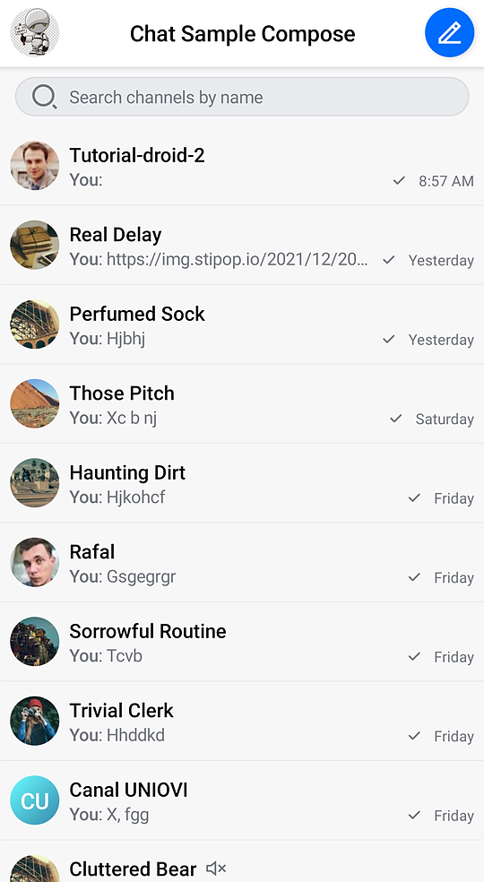
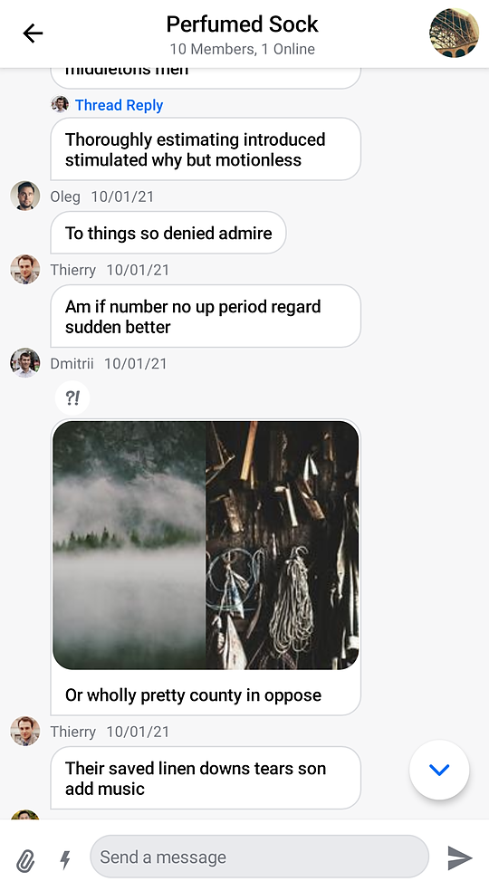
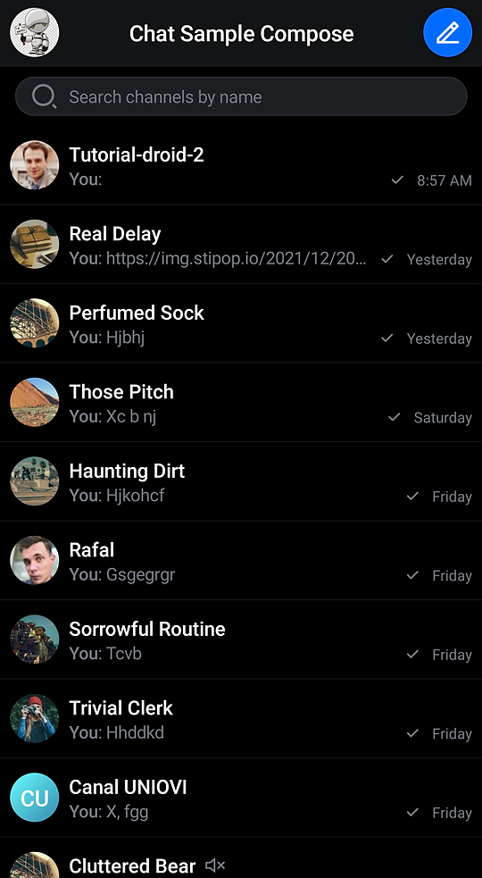
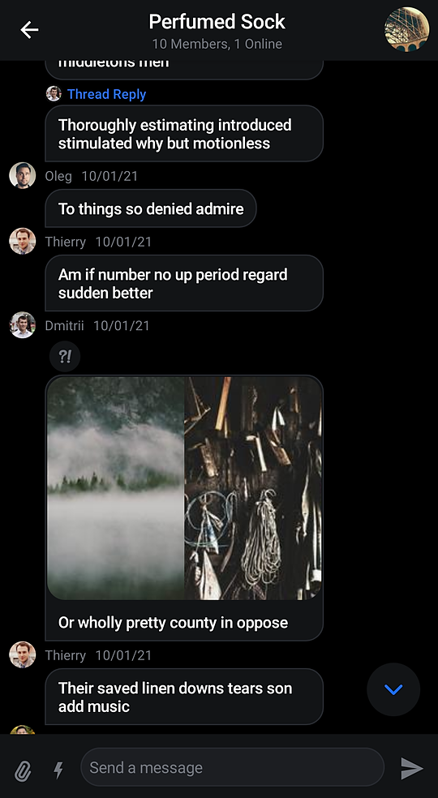

# Overview

The **Compose UI Components** library includes pre-built Jetpack Compose components that let you easily load and display data from the Stream Chat API, without much code!

> Not using Compose yet? Check out our XML-based [UI Components](../03-ui/01-overview.md).

|||
| --- | --- |
|  |  |

This library builds on top of the offline library and provides three types of components:

* **Screen components**: Fully built screens that work out-of-the-box, but offer limited much customization.
* **Bound components**: Fully built components that represent a part of the screen and are **bound** to `ViewModel`s we provide, for business logic, events, and state handling. These provide extensive behavior and UI customization.
* **Stateless components**: Simple components that rely on pure state and know nothing about our `ViewModel`s. Fully customizable.

The [sample app](#sample-app) showcases the Compose UI Components in action.

See the individual pages for these components to learn more about them.

**Channel components**:

* [Channels Screen](03-channel-components/01-channels-screen.md)
* [Channel List Header](03-channel-components/02-channel-list-header.md)
* [Channel List](03-channel-components/03-channel-list.md)
* [Channel Info](03-channel-components/04-channel-info.md)

**Message components**:

* [Messages Screen](04-message-components/01-messages-screen.md)
* [Message List Header](04-message-components/02-message-list-header.md)
* [Message List](04-message-components/03-message-list.md)
* [Message Composer](04-message-components/04-message-composer.md)
* [Attachments Picker](04-message-components/05-attachments-picker.md)
* [Selected Message Overlay](04-message-components/06-selected-message-overlay.md)

## Requirements

To use the Compose UI Components, you have to set up your project to work with Jetpack Compose, as per the [official documentation](https://developer.android.com/jetpack/compose/setup).

Once you're done, add the necessary dependencies, as described on the [Dependencies](../01-basics/02-dependencies.md#ui-components) page.

And that's it! You should be able to use our Compose UI Components in your app to start building a rich chat experience!

:::note
If you're looking to explore the setup and our components in a step-by-step way, check out our [Compose In-App Messaging Tutorial](https://getstream.io/chat/compose/tutorial/).
:::

## ViewModels

Our **bound component** require a `ViewModel` to connect to for state and event handling. Some of our components build the `ViewModel` by default, but you'll likely want to build your own instances to get more control over their lifecycle.

These are Jetpack [ViewModels](https://developer.android.com/topic/libraries/architecture/viewmodel), so they allow the components to retain data across configuration changes. It's your responsibility to create these in the correct scope, usually in a Fragment or Activity.

For example, if you want to add the `MessageList` component to your UI, you can do it like so:

```kotlin
// 1
val factory =
    MessagesViewModelFactory(
        context = this,
        clipboardManager = getSystemService(CLIPBOARD_SERVICE) as ClipboardManager,
        chatClient = ChatClient.instance(),
        chatDomain = ChatDomain.instance(),
        channelId = intent.getStringExtra(KEY_CHANNEL_ID)!!,
        enforceUniqueReactions = true,
        messageLimit = 30
    )
// 2
val listViewModel: MessageListViewModel by viewModels { factory }

// 3
setContent {
    ChatTheme {
        MessageList(
            modifier = Modifier
                .padding(it)
                .fillMaxSize(),
            viewModel = listViewModel // 4
        )
    }
}
```

1. Create the `ViewModel` factory, providing any necessary parameters.
2. Build the `ViewModel`, using the Android `ViewModel` APIs and the `factory` you created.
3. Set the content of your `Activity` or `Fragment` and call the `MessageList` component.
4. Pass in the `ViewModel` to the component.

By passing in the `ViewModel`, the component knows where to fetch the data from and where to delegate various events, like selecting a message or tapping on a thread reply.

You can learn more about each component's setup and usages on their individual pages.

## Sample App

The [Compose UI Components sample app](https://github.com/GetStream/stream-chat-android/tree/main/stream-chat-android-compose-sample) is an open-source and fully functional messaging application that lets you explore and test our API. It features channels, threads, reactions, various attachments, UI updates and offline storage.

All built using our Compose UI Components and the offline library.

|||
| --- | --- |
|  |  |


## Customization

Our Compose UI Components offer different ways of customization:

* **Behavior**: Through event handlers for clicks, taps, dismiss requests and more.
* **Appearance**: Through different parameters for shapes, colors or a Compose `Modifier`, you can customize the component appearance.
* **Content**: Some components provide [slot APIs](https://developer.android.com/jetpack/compose/layouts/basics#slot-based-layouts), composable function parameters that let you define (or override) their internal content.
* **Design style**: By using our `ChatTheme` component as the root of all of your UI, you can define the colors, typography, shapes, attachment factories and reaction types all our components use. Through this, you can apply your own design style to all Compose UI Components.

To learn what level of customization each component exposes, check out their respective documentation pages. If you want to learn about general customization, read our [ChatTheme](02-general-customization/01-chat-theme.md) page.
