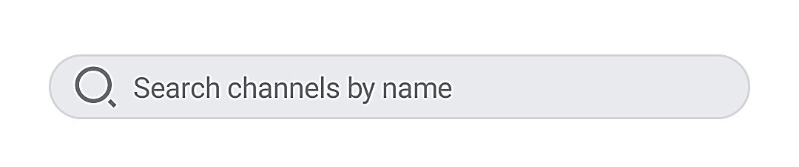

# Component Architecture

The Jetpack Compose SDK exposes three types of components:

* **Screen components**: out-of-the-box, screen-sized composables. 
* **Bound components**: composables bound to our ViewModels for state handling. 
* **Stateless components**: low-level, stateless composables for full customizability.

:::note
All components from the SDK have to be wrapped in a [`ChatTheme`](./05-general-customization/01-chat-theme.md) which provides theming and other customization options. You don't have to individually wrap components in `ChatTheme`, but it has to be present somewhere above the Chat components in the hierarchy.
:::

Let's go through each type to see what the difference is and how to use them.

## Screen Components

Complete screen solutions that connect all the operations you need to give users a Chat experience.

These components are **very easy to use** and they display entire screens for you with default behavior. They allow you to explore the SDK's features in a breeze, however, they offer **limited customization**.

We have two screen components:

* [`ChannelsScreen`](./03-channel-components/01-channels-screen.md): Builds a screen that shows a header with user information, the list of channels the current user is a member of, and a search input to filter those channels by name.
* [`MessagesScreen`](./04-message-components/01-messages-screen.md): Builds a full chat experience, with a header that shows information about the channel, a list that supports messages (including attachments, reactions, replies, threads, and more) and a message composer that lets you write messages and send attachments.

### Usage

To use either the `ChannelsScreen` or the `MessagesScreen` component within your `Activity` or `Fragment`, you just need to call it within `setContent()`:

```kotlin
override fun onCreate(savedInstanceState: Bundle?) {
    super.onCreate(savedInstanceState)

    setContent {
        ChatTheme { // Theme wrapper
            ChannelsScreen(
                title = stringResource(id = R.string.app_name),
                onItemClick = ::openMessages,
                onHeaderClickAction = {
                    // Header action
                },
                onBackPressed = { finish() }
            )
        }
    }
}
```

This will give you a fully-working screen:


You can learn more about [`ChannelsScreen`](./03-channel-components/01-channels-screen.md) and [`MessagesScreen`](./04-message-components/01-messages-screen.md) on their respective pages.

## Bound Components

These components serve a specific use-case and are *bound* to a ViewModel. The ViewModel provides the components with data, and handles input events that the components receive.

These components display UI for a **portion of the screen**, and they **offer more customization** than Screen components.

They usually represent features on the screen like the header, input, search field, or a list of data. Some of these components are:

* `MessageList`: Connects to the API using the ViewModel, shows a list of messages or empty or loading states, handles pagination, item taps and long taps and more.
* `ChannelList`: Same as the `MessageList`, but for channels.
* `MessageComposer`: Holds an input field to write new messages in, allows you to send attachments, and shows different states when replying or editing a message.
* `AttachmentPicker`: Allows you to pick and choose from system media, files, or media capture to send attachments.

### Usage

These components are great because you can combine them with any other UI you build, to form custom screens. Again, to use the components, all you need to do is call them within `setContent()` in your `Activity` or `Fragment`:

```kotlin
override fun onCreate(savedInstanceState: Bundle?) {
    super.onCreate(savedInstanceState)

    // Your ViewModel instance
    val channelListViewModel: ChannelListViewModel by viewModels { ... }
    
    setContent {
        ChatTheme { // Theme wrapper
            ChannelList(
                viewModel = channelListViewModel,
                onChannelClick = ::openMessages,
            )
        }
    }
}
```

You can go build these components in two ways:

* Providing an instance of our `ViewModel` yourself - this lets you control the lifecycle of the VM, or customize the behavior of your UI, by calling functions directly on the VM.
* Using the default argument for `ViewModel` - this is less work, but you can't control the lifecycle of the VM, nor can you call functions on it to support custom behavior. 

Either way, these components connect all the required operations related to them and they expose more customization, as you can override both behavior and UI, like the items in the list. The snippet above will produce the following screen:


You can combine this component with your custom UI, with other components from the SDK, or use it on its own. You can learn more about each of these components in the **Channel Components** and **Message Components** sections.

## Stateless Components

These are pure components that rely just on state and expose various events you can handle yourself. These components don't depend on a `ViewModel`, allowing you to decide where the data comes from. 

They offer fully customizable behavior as well as customizable UI where it makes sense. Some of these components are:

* `Avatar`: Shows an image provided as a parameter, in a shape defined by the `ChatTheme`. Fully customizable in terms of size, shape, alignment and more.
* `SearchInput`: Shows a leading icon for search, an input field to write your query and a trailing icon to clear the input. The leading icon can be fully customized, as well as the listeners for state changes.
* `MessageList` and `ChannelList`: We offer stateless alternatives to some `ViewModel` powered components, if you don't want to use our `ViewModel` and want to customize the behavior, as well as the UI. 

### Usage

These components don't do much on their own and they require state to render. You can use them like before, by calling them in `setContent()`, but they require more parameters to set up:

```kotlin
override fun onCreate(savedInstanceState: Bundle?) {
    super.onCreate(savedInstanceState)

    setContent {
        var queryState by remember { mutableStateOf("") } // The query state

        SearchInput(
            query = queryState, // Connect the value to the state holder
            modifier = Modifier.fillMaxWidth().padding(16.dp), // Customize the looks
            onValueChange = {
                queryState = it // Change the value when typing
            }
        )
    }
}
```

As you can see, these components are still fairly easy to use, but do require instructions on what state they show and how they look. This snippet will produce the following UI:



You can customize the component to add a background, touch event handlers, elevation and more. 

<!-- TODO WIP PAGE You can find most stateless components in the **Utility Components** section. -->
