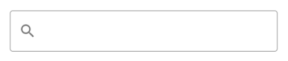

# Component Architecture

You've already learned that the Jetpack Compose SDK exposes three types of components:

* Out-of-box components
* ViewModel-powered components
* Stateless components

Let's go through each type to see what the difference is and how to use them.

## Out-of-box components

Complete out-of-box solutions that connect all the operations you need to give users a Chat experience.

These components are **very easy to use** and they build entire screens for you, with default behavior. However, they offer **very limited customization** and are great to explore the default behavior of our features.

Currently we only have two out-of-box components:

* `ChannelsScreen` : Builds a screen that shows a header with user information, a list of channels the current user is a member of and a search input to filter those channels by id.
* `MessagesScreen`: Builds a full chat experience, with a header that shows information about the channel, a list that supports messages, attachments, reactions, replies, threads and more and a message composer, that lets you write messages and send attachments. 

### Example usage

To use either the `ChannelsScreen` or the `MessagesScreen` component within your `Activity` or `Fragment`, you just need to call it within `setContent()`:

```kotlin
override fun onCreate(savedInstanceState: Bundle?) {
    super.onCreate(savedInstanceState)

    setContent {
        ChatTheme { // Theme wrapper
            ChannelsScreen(
                title = stringResource(id = R.string.app_name),
                onItemClick = ::openMessages,
                onHeaderClickAction = {
                    // header action
                },
                onBackPressed = { finish() }
            )
        }
    }
}
```

This will give you a fully-working screen, as seen below.


You can learn more about the [ChannelsComponent](./channel-components/channels-screen) and [MessagesComponent](./message-components/messages-screen) in their respective pages. 

## ViewModel-powered components

Next are components which serve a specific use-case and are powered by a `ViewModel`.

These components **offer more customization** and are OoB solutions for a **portion of the screen**.

They usually represent features on the screen, like the header, input, search or list of data. Some of these components are:

* `MessageList`: Connects to the API using the `ViewModel`, shows a list of messages or empty or loading states, allows for pagination, item taps and long taps and more.
* `ChannelList`: Same as the `MessageList`, but for channels.
* `MessageComposer`: Holds an input field to write new messages in, allows you to send attachments and shows different states when replying or editing a message.
* `AttachmentPicker`: Allows you to pick and choose from system media, files or media capture, to send attachments.

### Example usage

These components are great because you can combine them with any other UI you build, to form custom screens. Again, to use the components, all you need to do is call them within `setContent()` in your `Activity` or `Fragment`:

```kotlin
override fun onCreate(savedInstanceState: Bundle?) {
    super.onCreate(savedInstanceState)

    setContent {
        ChatTheme { // theme wrapper
            ChannelList(
                viewModel = myViewModel, // your ViewModel instance
                onChannelClick = ::openMessages 
            )
        }
    }
}
```

You can go about two ways of building these components:

* Providing an instance of our `ViewModel` yourself - this lets you control the lifecycle of the VM, or customize the behavior of your UI, by calling functions directly on the VM.
* Using the default argument `ViewModel` - this is less work, but you can't control the lifecycle of the VM, nor can you call functions on it to support custom behavior. 

Either way, these components connect all the required operations related to them and they expose more customization, as you can override both behavior and UI, like the items in the list. The snippet above will produce the following screen:


You can combine this component with your custom UI, within `ChatTheme()`, with other components from the SDK, or use it as a standalone. You'll learn more about each of these components in the **Channel Components** and **Message Components** sections.

## Stateless components

Finally come our pure components that rely just on state and expose various events you can handle yourself. These components don't depend on a `ViewModel`, allowing you to decide where the data comes from. 

They usually offer fully customizable behavior and customizable UI, where it makes sense. Some of these components are:

* `Avatar`: Shows an image provided as a parameter, in a shape defined by the `ChatTheme`. Fully customizable in terms of size, shape, alignment and more.
* `SearchInput`: Shows a leading icon for search, an input field to write your query and a trailing icon to clear the input. The leading icon can be fully customized, as well as the listeners for state changes.
* `MessageList` and `ChannelList`: We offer stateless alternatives to some `ViewModel` powered components, if you don't want to use our `ViewModel` and want to customize the behavior, as well as the UI. 

### Example Usage

These components don't do much on their own and they require state to render. You can use them like before, by calling them in `setContent()`, but they require more parameters to set up:

```kotlin
override fun onCreate(savedInstanceState: Bundle?) {
    super.onCreate(savedInstanceState)

    setContent {
        var queryState by remember { mutableStateOf("") } // the query state

        SearchInput(
            query = queryState, // connect the value to the state holder
            modifier = Modifier.fillMaxWidth().padding(16.dp), // customize the looks
            onValueChange = {
                queryState = it // change the value when typing
            }
        )
    }
}
```

As you can see, these components are still fairly easy to use, but do require instructions on what state they show and how they look. This snippet will produce the UI as seen in the photo below.



You can customize the component to add a background, touch event handlers, elevation and much more. You'll learn more about stateless components, in the **Utility Components** section.
