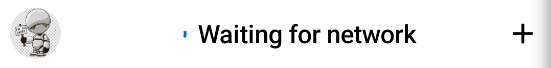

# ChannelListHeader

The `ChannelListHeader` component allows you to build a header for the channel screen. It sets up the following:

* `Avatar`: Shows the current user image. The style is applied from the `ChatTheme` wrapper.
* `ChannelHeaderTitle`: A component that either shows the title of the header, or a `NetworkLoadingView` if there's no network available.
* `action`: A customizable trailing action shown at the end of the header, exposed as a parameter.  `DefaultChannelListHeaderAction` by default.

Let's see how to use the header.

## Usage

To use the `ChannelListHeader`, you can just add it to your UI, within `setContent()`:

```kotlin
override fun onCreate(savedInstanceState: Bundle?) {
    super.onCreate(savedInstanceState)
        
    setContent {
            
        ChatTheme {
            ChannelListHeader(
                modifier = Modifier.fillMaxWidth(),
                currentUser = user,
                title = "My Awesome App"
            )
        }
    }
}
```

:::note 

The `ChannelListHeader` can be used without any parameters, but we advise that you pass in the title of your app, the current user, as well as the action handlers.

:::

This snippet will produce the UI as shown below.


Next, let's see how to handle actions in the header.

## Handling Actions

The `ChannelListHeader` exposes two main actions you can override and handle yourself, as per the signature:

```kotlin
@Composable
fun ChannelListHeader(
  ..., // state
  onAvatarClick: (User?) -> Unit = {},
  onHeaderActionClick: () -> Unit = {},
  action: (@Composable () -> Unit)? = { DefaultChannelListHeaderAction(onHeaderActionClick) }
)
```

* `onAvatarClick`: Handler when the user taps on their own avatar.
* `onHeaderActionClick`: Handler when the user taps on the trailing action. This is only used if you don't override the `action` parameter, which defines the UI for the trailing icon.

:::note 

The `action` parameter uses the `onHeaderActionClick` parameter for the default header action. If you want to keep the same UI but override the behavior, you need to change `onHeaderActionClick`. Otherwise, skip over to **Customization** to learn how to customize the action UI.

:::

To override the actions, you can use the following approach:

```kotlin
ChannelListHeader(
    ..., // state
    onHeaderActionClick = {}, // default header action
    onAvatarClick = {} // avatar click action
)
```

These two parameters let you gain more control over the behavior of the `ChannelListHeader`. Let's see how to customize the appearance next.

## Customization

In terms of UI customization, the `ChannelListHeader` exposes the following properties:

```kotlin
@Composable
fun ChannelListHeader(
    modifier: Modifier = Modifier,
    title: String = "",
    currentUser: User? = ChatClient.instance().getCurrentUser(),
    isNetworkAvailable: Boolean = true,
    action: (@Composable () -> Unit)? = { 
        DefaultChannelListHeaderAction(onHeaderActionClick)
    },
    ... // action handlers
)
```

* `modifier`: Modifier for the root component styling. You can add things like a background, elevation, padding and more.
* `title`: The text to show when you're connected to the Internet.
* `currentUser`: The state of the current user, for the `Avatar`.
* `isNetworkAvailable`: If we should show the title or the `NetworkLoadingView`.
* `action`: Customizable composable function parameter, that overrides the trailing action. This allows you to either override the default behavior, but keep the UI - by overriding `onHeaderActionClick`, or overriding both the UI and behavior, by changing the `action` parameter from the default to your own.

Here's an example of customizing the UI of the header:

```kotlin
ChannelListHeader(
    // customizing the appearance
    modifier = Modifier.fillMaxWidth(), 
    isNetworkAvailable = false,
    currentUser = user,
    title = "My Chat App",
    action = { // customizing the trailing action
        Icon(
            modifier = Modifier.clickable {
                // click handler for the custom action
            },
            imageVector = Icons.Default.Add,
            contentDescription = "Add",
            tint = ChatTheme.colors.textHighEmphasis
        )
    }
)
```

By passing in various pieces of data, you control which image is loaded for the `Avatar`, what title is shown, if you need to show the `NetworkLoadingView` or not and finally, what action to show at the end of the header. 

By overriding the `action` parameter, you replace the default action UI with your custom UI, and by adding a `clickable {}` modifier, you can add click actions on the custom component. This allows you to customize both the UI and behavior!

The snippet above will produce the following UI.



You can also choose to build a completely custom header and integrate with the rest of our components. To learn how to do that, read our [Building Custom Screens](../07-guides/06-building-custom-screens.md) guide.
