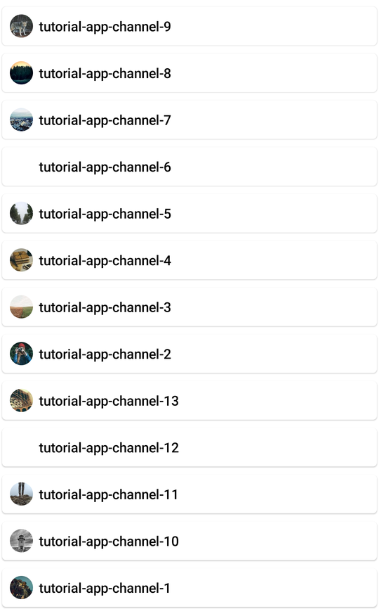

# ChannelList

The `ChannelList` component allows us to build paginated list of `Channel` items, with exposed long tap and single tap actions. We support two versions of the `ChannelList` component:

* **ViewModel-powered**: This version connects itself to the `ChannelListViewModel` and loads all the required data. It also connects long item tap and pagination events to the `ViewModel`.
* **Stateless**: This is a stateless version of the list, which doesn't know about the `ViewModel` and depends on pure state from external sources, to render its UI.

:::note 

The **ViewModel-powered** version of the list uses the **stateless** list internally. That way, when providing the same state to either component, the behavior will be the same. 

:::

Based on the provided state, the component shows the following UI:

* `LoadingView`: If we're loading the initial data.
* `EmptyView`: If there is no data and we've finished loading.
* `Channels`: A list of channels with various actions like item taps and long taps and pagination.

Let's see how to show a list of channels.

## Usage

To use the **ViewModel-powered** `ChannelList`, add it to your UI, within `setContent()`:

```kotlin
override fun onCreate(savedInstanceState: Bundle?) {
    super.onCreate(savedInstanceState)

    setContent {
        ChatTheme {
            ChannelList(modifier = Modifier.fillMaxSize())
        }
    }
}
```

This is a very basic and crude example, that just shows a list of channels with pagination. Even though the state handling is set up, we recommend passing in action handlers or a `ChannelListViewModel` instance and consuming the internal state, to react to single and long item taps.

The snippet above will generate the following UI.


In order to fully utilize the `Channel` items, let's see how to handle actions and state from the ViewModel.

## Handling Actions & State

If you've chosen the **ViewModel-powered** version of the `ChannelList` component, we recommend either providing your own instance of the `ViewModel`, or overriding default actions to react to state changes. To support that, the `ChannelList` signature exposes the following parameters:

```kotlin
@Composable
fun ChannelList(
    viewModel: ChannelListViewModel = viewModel(
        factory = ... // our default factory
    ),
    onLastItemReached: () -> Unit = { viewModel.loadMore() },
    onChannelClick: (Channel) -> Unit = {},
    onChannelLongClick: (Channel) -> Unit = { viewModel.onChannelSelected(it) },
    ... // other UI-related parameters
)
```

* `viewModel`: The instance of the `ChannelListViewModel`, that this component reads data from and sends event to. Pass in your own instance if you want more control over your business logic, such as changing `Channel` filters or sort order in runtime.
* `onLastItemReached`: Handler when reaching the last item in the list, to trigger pagination. You don't need to override this if you're using the default `viewModel`, but if you're using a custom one, you can add custom behavior.
* `onChannelClick`: Handler when the user taps on an item. Useful for starting the `MessagesScreen` in your app.
* `onChannelLongClick`: Handler when the user long taps on an item. By default, this updates state in the `viewModel`, which you can read to show custom UI and `Channel` actions, if you're using a custom `ViewModel` instance. Override if you're using the default `viewModel` and you want to change the behavior.

An example of using the default `viewModel`, but overriding the behavior would be the following:

```kotlin
override fun onCreate(savedInstanceState: Bundle?) {
    super.onCreate(savedInstanceState)


    setContent {
        ChatTheme {
            // custom state holder
            var selectedChannel by remember { mutableStateOf<Channel?>(null) }

            Box(modifier = Modifier.fillMaxSize()) {
                ChannelList(
                    modifier = Modifier.fillMaxSize(),
                    onChannelLongClick = { // custom long tap handler
                        selectedChannel = it
                    },
                    onChannelClick = ::openMessages // single tap handler
                )

                // show custom UI once the state changes
                if (selectedChannel != null) {
                    
                }
            }
        }
    }
}
```

In the example above, we created a `selectedChannel` state holder, which we use to show some custom UI if the data is not null. We update the state when the user long taps on an item.

We also provide a custom `onChannelClick` handler, to open the `MessagesScreen` with the selected item. This will produce the same UI, but with user-defined actions.

Alternatively, you can override the default `ViewModel` and read the internal state:

```kotlin
override fun onCreate(savedInstanceState: Bundle?) {
    super.onCreate(savedInstanceState)


    setContent {
        ChatTheme {
            Box(modifier = Modifier.fillMaxSize()) {
                ChannelList(
                    modifier = Modifier.fillMaxSize(),
                    viewModel = listViewModel, // passing in our ViewModel
                    onChannelClick = ::openMessages
                )

                // reading ViewModel state
                if (listViewModel.selectedChannel != null) {
                        // show some custom UI
                }
            }
        }
    }
}
```

The behavior will be the same and you gain more control over the `ViewModel`.

We recommend that you create an instance of our `ViewModel` if you're thinking of using our predefined state and operations. If you're looking into a more low-level solution, with more control, you can use the **stateless** version of our components.

## Customization

If you're looking to customize the UI of the `ChannelList`, there are two ways you can do so, as per the signature:

```kotlin
@Composable
fun ChannelList(
    modifier: Modifier = Modifier,
    itemContent: @Composable (Channel) -> Unit = {
        DefaultChannelItem(
            item = it,
            viewModel.user.value,
            onChannelClick = onChannelClick,
            onChannelLongClick = onChannelLongClick
        )
    },
    ... // state & actions
)
```

* `modifier`: The modifier parameter, for the root component. You can apply a background, elevation, padding, shape, touch handlers and much more.
* `itemContent`: Customizable composable function that allows you to fully override the UI and behavior of channel items. This will be applied to each item in the list, and you'll gain access to the `Channel` inside the lambda, when building your custom UI.

An example of customizing `Channel` items in the list is the following:

```kotlin
ChannelList(
    ..., // state and actions
    itemContent = { // customize the channel items
        val painter = ... // load appropriate image

        Card(modifier = Modifier.padding(2.dp).fillMaxWidth()) {
            Row(
                modifier = Modifier.padding(8.dp).fillMaxWidth(),
                verticalAlignment = Alignment.CenterVertically
            ) {
                Avatar(
                    modifier = Modifier.padding(end = 6.dp).size(24.dp),
                    painter = painter
                )

                Text(
                    text = it.id,
                	style = ChatTheme.typography.bodyBold,
                	maxLines = 1,
            	)
        	}
    	}
	}
)
```

This simple example shows how you can build your own channel item, by overriding the `itemContent` parameter. The snippet above will generate the following UI.



As you can see, the items are now within a card and show just the image and the text. You can customize the items to any extent, whatever your design specification might require.
