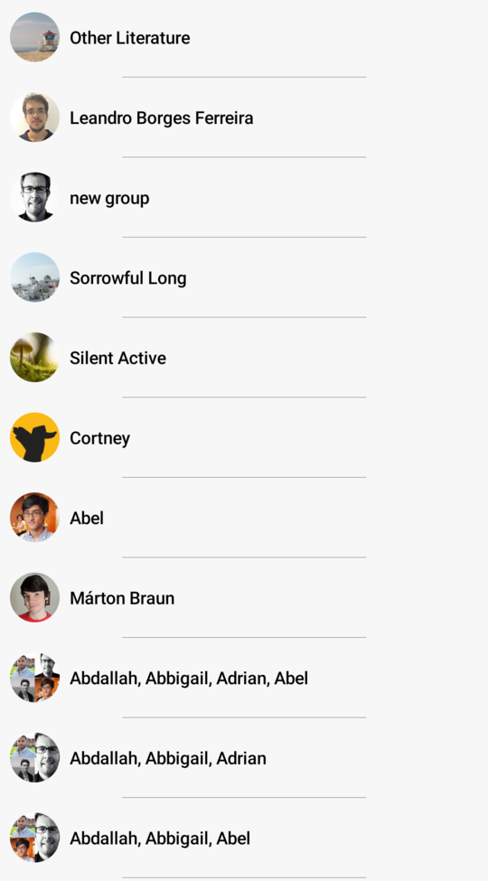

# DefaultChannelItem

The `DefaultChannelItem` component represents the `ChannelList` items that are shown by default, if you don't customize its `itemContent`.

However, you can also use the `DefaultChannelItem`, and customize its Slot APIs, in case you want only replace a specific part of the default UI. 

:::note 
The `DefaultChannelItem` is great if you want default UI or replace specific slots, however, you can still completely override the `itemContent` parameter of the `ChannelList`, if you need even more custom UI.
:::

Let's see how to use and customize this component.

## Usage

To use the `DefaultChannelItem`, it's best to override the `itemContent` parameter in the `ChannelList` and use it for the channel items:

```kotlin
override fun onCreate(savedInstanceState: Bundle?) {
    super.onCreate(savedInstanceState)

    setContent {
        val user by ... // fetch user from ChatDomain or ViewModel

        ChatTheme {
            ChannelList(
                itemContent = { channelItem -> // Customize the channel items
                    DefaultChannelItem(
                        channelItem = channelItem,
                        currentUser = user,
                        onChannelLongClick = { },
                        onChannelClick = { },
                    )
                }
            )
        }
    }
}
```

This is a very basic and crude example of a `ChannelList`, where you override the `itemContent`.

The snippet above will generate the following UI.


In order to fully utilize the `DefaultChannelItem` let's see how to handle its actions and how to customize its Slot APIs.

## Handling Actions

The `DefaultChannelItem` signature exposes the following actions that can be intercepted:

```kotlin
@Composable
fun DefaultChannelItem(
    onChannelClick: (Channel) -> Unit,
    onChannelLongClick: (Channel) -> Unit,
    ... // state and other UI-related customization options 
)
```

* `onChannelClick`: Handler for the user tapping on an item. Useful for starting the `MessagesScreen` in your app.
* `onChannelLongClick`: Handler for the user long tapping on an item. Useful when you want to control how state changes or what UI you want to show, when the user selects an item in the list.

Here's an example of using the default component, but overriding the behavior:

```kotlin
override fun onCreate(savedInstanceState: Bundle?) {
    super.onCreate(savedInstanceState)

    setContent {
        ChatTheme {
            ChannelList(
                itemContent = { channelItem ->
                    DefaultChannelItem(
                        channelItem = channelItem,
                        currentUser = user,
                        onChannelLongClick = { viewModel.selectChannel(it.channel) },
                        onChannelClick = ::openMessages,
                    )
                }
            )
        }
    }
}
```

In the example above, we customized the `onChannelLongClick`  and `onChannelClick` action handlers, to open the messages screen when the user taps on an item, or to store the selected channel state in the `ViewModel`, on long taps.

This way, you get more control over what happens when the user interacts with the items, but you still have the default UI that you don't have to implement.

Read on to learn how to customize the UI.

## Customization

If you're looking to customize the UI of the `DefaultChannelItem`, there are a few ways you can do so, as per the signature:

```kotlin
@Composable
fun DefaultChannelItem(
    ..., // state and action handlers
    modifier: Modifier = Modifier,
    leadingContent: @Composable RowScope.(ChannelItem) -> Unit = {
        ChannelAvatar(
            modifier = Modifier
                .padding(horizontal = 8.dp)
                .size(40.dp),
            channel = it.channel,
            currentUser = currentUser
        )
    },
    detailsContent: @Composable RowScope.(ChannelItem) -> Unit = {
        ChannelDetails(
            channel = it.channel,
            isMuted = it.isMuted,
            currentUser = currentUser,
            modifier = Modifier
                .weight(1f)
                .wrapContentHeight()
        )
    },
    trailingContent: @Composable RowScope.(ChannelItem) -> Unit = {
        ChannelLastMessageInfo(
            channel = it.channel,
            currentUser = currentUser,
            modifier = Modifier
                .padding(horizontal = 8.dp)
                .wrapContentHeight()
                .align(Alignment.Bottom)
        )
    },
    divider: @Composable ColumnScope.() -> Unit = {
        Spacer(
            modifier = Modifier
                .fillMaxWidth()
                .height(0.5.dp)
                .background(color = ChatTheme.colors.borders)
        )
    },
)
```

* `modifier`: The modifier parameter for the root component. You can apply a background, elevation, padding, shape, touch handlers and much more.
* `leadingContent`: Customizable composable function that allows you to override the content that appears at the start of the list item. By default, it represents a `ChannelAvatar`.
* `detailsContent`: Customizable composable function that allows you to override the center part of the list item. By default, it represents the `ChannelDetails` that show its name and the last message preview.
* `trailingContent`: Customizable composable function that allows you to override the content that appears at the end of the list item. By default, it represents the `ChannelLastMessageInfo` that shows the unread message indicator if there are unread messages and the last message read state.
* `divider`: Customizable composable function that allows you to override the content that appears at the bottom of the list item, as a divider.

Here's a simple example for building your own channel item, by overriding the mentioned parameters:

```kotlin
override fun onCreate(savedInstanceState: Bundle?) {
    super.onCreate(savedInstanceState)

    setContent {
        val user by listViewModel.user.collectAsState() // fetch user

        ChatTheme {
            ChannelList(
                itemContent = { channelItem -> // Customize the channel items
                    CustomChannelListItem(channelItem = channelItem, user = user)
                }
            )
        }
    }
}

@Composable
fun CustomChannelListItem(channelItem: ChannelItem, user: User?) {
    DefaultChannelItem(
        channelItem = channelItem,
        currentUser = user,
        onChannelLongClick = { },
        onChannelClick = { },
        divider = { // Override the divider
            Spacer(
                modifier = Modifier
                    .fillMaxWidth(0.5f)
                    .height(0.5.dp)
                    .align(CenterHorizontally)
                    .background(color = ChatTheme.colors.textLowEmphasis)
            )
        },
        trailingContent = { // Replace the trailing content with a spacer
            Spacer(modifier = Modifier.width(8.dp))
        },
        detailsContent = { // Replace the details content with a simple Text
            Text(
                text = ChatTheme.channelNameFormatter.format(it.channel),
                style = ChatTheme.typography.bodyBold
            )
        }
    )
}
```

As you can see, it's very easy to override and completely replace the Slot APIs in our `DefaultChannelItem`. In the example, you replaced the `trailingContent` with a simple `Spacer` for some padding and the `detailsContent` with a `Text` that shows the channel name.

You also changed the `divider`, to fill only half of the screen width and to be centered in the item.

The snippet above will generate the following UI:



It was really easy to provide a completely custom UI for the channel items, while still keeping the same functionality and actions of the rest of the screen and the list items.
