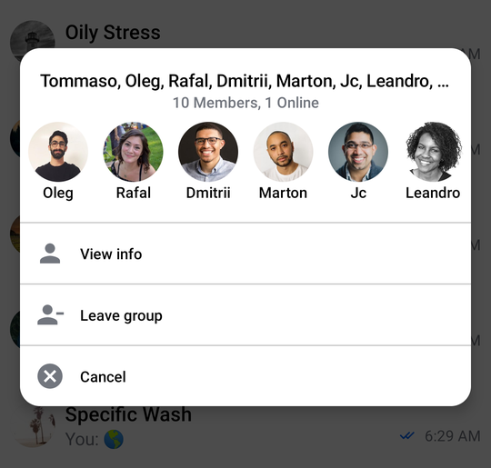

# ChannelInfo

The `ChannelInfo` component is used to show information about a `Channel`, and it also provides various actions that the user can take.

This includes the following:
- The name and member counts of the channel
- The list of members with their avatars
- A list of available channel options related to the channel

It also exposes a callback when the user selects a channel option from the list. Let's see how to use the `Channelnfo` in your code.

## Usage

If you're using the [`ChannelScreen`](./01-channels-screen.mdx) component, you don't have to do anything. The `ChannelInfo` component and its logic will be integrated into the UI.

If you're looking to build a custom UI, you can add the `ChannelInfo` component on top of your UI, within a `Box`, like so:

```kotlin
@Composable
fun MyCustomUi() {
    // Data for the component
    val user by listViewModel.user.collectAsState()
    val selectedChannel = listViewModel.selectedChannel

    Box(modifier = Modifier.fillMaxSize()) {
        // The rest of your content

        if (selectedChannel != null) {
            ChannelInfo(
                modifier = Modifier // Aligning the content to the bottom
                    .fillMaxWidth()
                    .wrapContentHeight()
                    .align(Alignment.BottomCenter),
                selectedChannel = selectedChannel,
                user = user,
                onChannelOptionClick = { listViewModel.onChannelAction(it) },
            )
        }
    }
}
```

For the `ChannelInfo` component to work, you need to provide a the `selectedChannel` and `user` parameters.

In the example above, you fetch the data from a `ChannelListViewModel` that you use in the rest of the UI. But you can also provide the data manually, if you decide not to use our components, like the `ChannelList`.

Notice how you also show the `ChannelInfo` only if the `selectedChannel` is not null. This is a smart way of knowing when to show the info and when to hide it.

With a bit of extra code for the rest of the content, when selecting a channel, the snippet above will produce the next UI:


This just represents the `ChannelInfo` component, the rest of the UI can be whatever your implementation requires.

Finally, you can see a list of `ChannelOption` items, which are different depending on whether you're an admin for this channel or just a member. Clicking these will trigger channel actions, let's see how to handle these.

## Handling Actions

`ChannelInfo` exposes one action you can handle, as per the signature:

```kotlin
@Composable
fun ChannelInfo(
    ..., // state & styling,
    onChannelOptionClick: (ChannelListAction) -> Unit,
)
```

* `onChannelOptionClick`: Handler when the user taps on any channel option in the list.

By providing this handler, you can choose what happens when the user selects options like "Leave Group", "Delete Conversation", "Cancel" and more. You can react to these actions, update your UI state and show new UI if needed.

An example of providing a handler can be seen here:

```kotlin
ChannelInfo(
    ..., // State and styling
    onChannelOptionClick = { action ->
        if (action is ViewInfo) {
            startActivity(ChannelInfoActivity.newInstance(this, action.channel.id))
        } else {
            listViewModel.onChannelAction(action)
        }
    }
)
```

In the snippet above, you set up a `onChannelOptionClick` handler to open a new `Activity` if the user decides to view more info, otherwise, you send the action to the `listViewModel` and store it to update the state.

## Customization

This component offers the following customization options:

```kotlin
@Composable
fun ChannelInfo(
	..., // state and actions
    modifier: Modifier = Modifier,
    shape: Shape = ChatTheme.shapes.bottomSheet,
)
```

* `modifier`: Used to style the root of the `ChannelInfo`, which is a `Card` component. Useful for the component size and padding, background, alignment and more.
* `shape`: Used for the `Card` shape. By default, we position the element at the bottom of the screen with the top corners being rounded, which imitates a bottom drawer component. If you want to use the `ChannelInfo` as a dialog, you can change the shape to have all round corners, or to be flat.

Here's an example of customizing this component to imitate a dialog:

```kotlin
ChannelInfo(
    modifier = Modifier
        .padding(16.dp) // Adding padding to the component
        .wrapContentWidth() // Wrap width and height
        .wrapContentHeight()
        .align(Alignment.Center), // Centering the component
    shape = RoundedCornerShape(16.dp), // Rounded corners for all sides
    ... // State
)
```

This code will produce the following UI:



The `ChannelInfo` component now looks more like a dialog, that displays over other elements. This is just an example of how easy it is to apply UI customization to our components.
