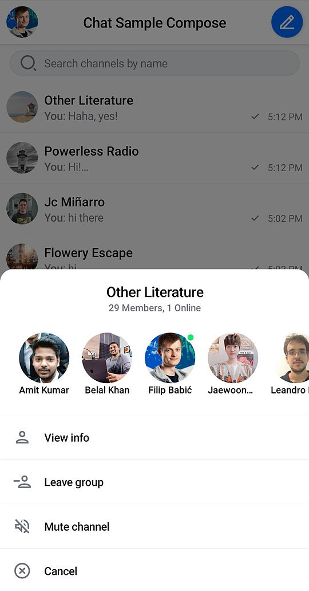

# ChannelsScreen

The easiest way to set up a screen that shows the active user's channels and gives them the ability to search for a specific channel is to use the `ChannelsScreen`.

`ChannelsScreen` sets up the following functionality internally:

* Header with the information of the current user and customizable title and action.
* Search input that can be shown or hidden that allows users to search for channels by name.
* List of user's channels with pagination, based on defined filters and sorting.
* Menu with detailed channel information, shown when long clicking on a `Channel` in the list.

It also sets up all the business logic and styles the UI according to our default design system.

Let's see how to integrate the component.

## Usage

To use `ChannelsScreen`, you just need to call it within `setContent()` in your `Activity` or `Fragment`:

```kotlin
override fun onCreate(savedInstanceState: Bundle?) {
    super.onCreate(savedInstanceState)

    setContent {
        ChatTheme {
            ChannelsScreen()
        }
    }
}
```

:::note 
The `ChannelsScreen` can be used without any parameters, but we advise that you pass in the title of your app, as well as the action handlers.
:::

This small snippet will produce a fully-working solution, as shown in the image below.

 

To get a better feel of the component, you'll want to customize its actions.

## Handling Actions

When it comes to action handlers exposed in the `ChannelsScreen` signature you have access to the following:

```kotlin
fun ChannelsScreen(
    ..., // Filters and UI customization
    onHeaderActionClick: () -> Unit = {},
    onHeaderAvatarClick: () -> Unit = {},
    onItemClick: (Channel) -> Unit = {},
    onViewChannelInfoAction: (Channel) -> Unit = {},
    onBackPressed: () -> Unit = {},
)
```

There are four main action handlers you can use with the `ChannelsScreen`:

* `onHeaderActionClick`: Handler for the default header trailing icon click action.
* `onHeaderAvatarClick`: Handler for the clicks on the user avatar in the header.  
* `onItemClick`: Handler for a `Channel` being clicked.
* `onViewChannelInfoAction`: Handler for the **View info** action selected in `SelectedChannelMenu`. 
* `onBackPressed`: Handler for the system back button being clicked.

All of these actions are empty by default, but if you want to customize them, you can do the following:

```kotlin
override fun onCreate(savedInstanceState: Bundle?) {
    super.onCreate(savedInstanceState)

    setContent {
        ChatTheme {
            ChannelsScreen(
                onItemClick = {
                    // Open messages screen          
                },
                onHeaderActionClick = {
                    // Handle the header click action
                },
                onHeaderAvatarClick = {
                    // Handle the header avatar clicks
                },
                onViewChannelInfoAction = {
                    // Show UI to view more channel info
                },
                onBackPressed = { finish() },
            )
        }
    }
}
```

## Customization

`ChannelsScreen` is one of our **screen components** and as such it doesn't offer much customization. As with any component, you can customize the content theme and styling by wrapping it the [`ChatTheme`](../03-general-customization/01-chat-theme.mdx).

When it comes to UI and behavior customization in the `ChannelsScreen` signature you have access to the following:

```kotlin
fun ChannelsScreen(
    filters: FilterObject? = null,
    querySort: QuerySort<Channel> = QuerySort.desc("last_updated"),
    title: String = "Stream Chat",
    isShowingHeader: Boolean = true,
    isShowingSearch: Boolean = true,
    channelLimit: Int = ChannelListViewModel.DEFAULT_CHANNEL_LIMIT,
    memberLimit: Int = ChannelListViewModel.DEFAULT_MEMBER_LIMIT,
    messageLimit: Int = ChannelListViewModel.DEFAULT_MESSAGE_LIMIT,
    ... // Action handlers
)
```

* `filters`: These filters are applied to the channel query, meaning you can customize what data to show in the list. By default they are null which signals us to use default messaging channel filters.
* `querySort`: Like with filters, these are applied to the list data and affect its sorting order.
* `title`: The title of the `ChannelListHeader`.
* `isShowingHeader`: Flag that affects if we show the `ChannelListHeader`. `true` by default.
* `isShowingSearch`: Flag that affects if we show the `SearchInput`. `false` by default.
* `channelLimit` The limit of channels queried per page.
* `memberLimit` The limit of members requested per channel.
* `messageLimit` The limit of messages requested per channel item.

:::note
Even though `ChannelsScreen` offers limited customization, you can still achieve a unique look and feel by modifying `ChatTheme` parameters.
For more information on how to do so read our [ChatTheme](../03-general-customization/01-chat-theme.mdx) page.
:::

<!-- TODO WIP PAGE If you want to build a custom Channels screen UI or override the default the behavior, follow our Building Custom Screens (../07-guides/05-building-custom-screens.mdx) guide. -->
