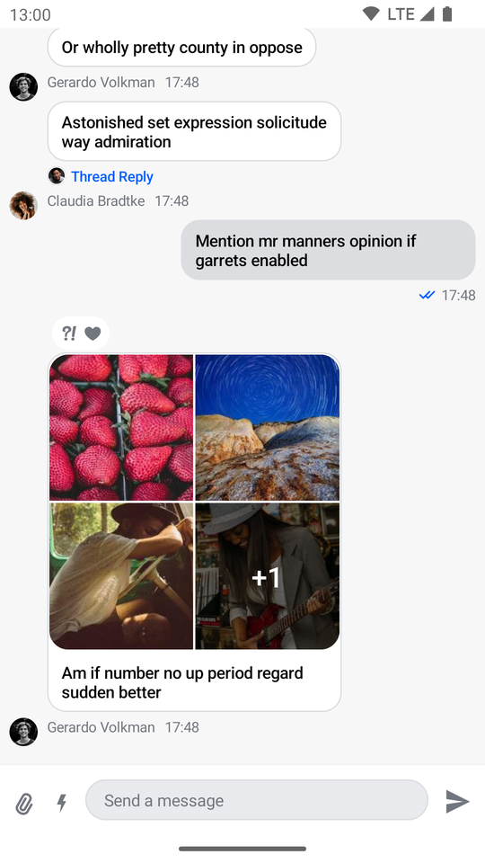

# MessagesScreen

The `MessagesScreen` component is the second screen component in the SDK, which sets up the following components and `ViewModel`s as needed, within a `Scaffold`:

* `MessageListHeader`: Displays a back button, the name of the channel or thread and a channel avatar, in a `Row`. 
* `MessageList` and `MessageListViewModel`: Loads messages data and shows different states based on the data such as loading, empty and loaded states. Also sets up various action handlers, such as long and single item taps, as well as pagination and an option to scroll to the bottom.
* `MessageComposer` and `MessageComposerViewModel`: Sets up and handles the message input, as well as attachments and message actions like editing and replying.
* `SelectedMessageOverlay`: Shown when the user long taps and selects a message. Allows the user to react to messages and apply different actions, like deleting, editing, replying, starting a thread and more.
* `AttachmentPicker` and `AttachmentPickerViewModel`: Allows the user to select images, files and media capture, to send to the channel.

The `MessagesScreen` is very complex and sets up many interactions between different components. This is why we recommend reading our [Building Messages Screen](../07-guides/02-building-messages-screen.md) guide, for more information on this component and other internal components.

## Usage

The benefit of a screen component solution is that the integration is very easy. All you need to do, to integrate the `MessagesScreen` in your app, is to call it within `setContent()` in your `Activity` or `Fragment` and pass in your `channelId`:

```kotlin
override fun onCreate(savedInstanceState: Bundle?) {
    super.onCreate(savedInstanceState)
    // load the ID of the channel you've opened
    val channelId = intent.getStringExtra(KEY_CHANNEL_ID) ?: return

    setContent {
        ChatTheme {
            MessagesScreen(channelId = channelId)
        }
    }
}
```

This small snippet of code will render the UI as shown below.


The component shows a navigation action and the information about the channel, members and the channel image in the header. It also shows a list of paginated messages, which support attachments, threads, replies, deleted messages and more. Finally, you can access the composer, to send new messages or attachments.

Next, learn more about handling screen actions.

## Handling Actions

The `MessagesScreenComponent` exposes two actions, as per the signature:

```kotlin
@Composable
fun MessagesScreen(
    ..., // state
    onBackPressed: () -> Unit = {},
    onHeaderActionClick: () -> Unit = {}
)
```

`onBackPressed`: Handler when the user taps on the header back button.

`onHeaderActionClick`: Handler when the user taps on the header title. Useful for showing the channel information.

Here's an example of overriding the custom behavior:

```kotlin
    override fun onCreate(savedInstanceState: Bundle?) {
        super.onCreate(savedInstanceState)
        val channelId = intent.getStringExtra(KEY_CHANNEL_ID) ?: return

        setContent {
            ChatTheme {
                MessagesScreen(
                    ..., // state
                    onBackPressed = { finish() }, // navigation handler
                    onHeaderActionClick = {
                        // show conversation info
                    }
                )
            }
        }
    }
```

This way, you can customize what happens when the user taps on the back arrow, as well as when tapping on the channel information.

## Customization

Given that the `MessagesScreen` is an screen level solution, it offers very limited customization. Currently, the only option offered in the signature is the following:

```kotlin
@Composable
fun MessagesScreen(
    showHeader: Boolean = true,
    ... // action handlers and state
)
```

* `showHeader`: If we're showing the messages header or not.

In case you pass in `false` as `showHeader`, you'll get the following UI.



As you can see, the header is removed from the screen, rendering only the list and the composer. If you want more customization of this screen, read our [Building Messages Screen](../07-guides/02-building-messages-screen.md) and [Building Custom Screens](../07-guides/06-building-custom-screens.md) guides.
