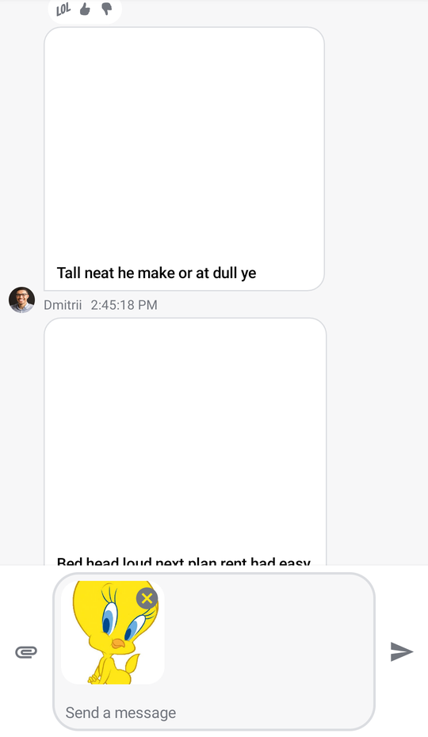
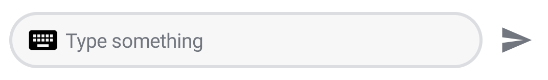

# MessageComposer

The `MessageComposer` is arguably one of the most important components when building the Chat experience. It allows users to send messages and attachments to the chat, effectively participating in communication.

There are two versions of the composer that we provide:

* **Bound**: This version relies on a `ViewModel` to set up all of its operations, like sending, editing and replying to a message, as well as handling UI state when the user performs different message actions. 
* **Stateless**: This is a stateless version of the composer that doesn't know about `ViewModel`s or business logic. It exposes several actions and customization options that let you override the behavior and UI of the component.

:::note 

The **bound** version of the composer uses the **stateless** composer internally. That way, when providing the same state to either component, the behavior will be the same. 

Additionally, we cannot provide a default `ViewModel`, as it requires the `channelId` to send data, so you'll have to build an instance yourself.

:::

Internally, it sets up the following components:

* `MessageInputOptions`: These options are shown at the top of the composer, when a message is being edited, or we're replying to another message. They allow you to cancel the message action.
* `integrations`: By default, we show the attachment integration in our composer, so that users can send image, file and media capture attachments. You can override this to support custom integrations, by default `DefaultComposerIntegrations` are shown.
* `MessageInput`: The core part of the composer, where the user can write new messages. It also shows the `MessageInputAttachments` component, if the user adds attachments for uploading.
* `IconButton`: Represents the **Send** button, to send a new message, with or without attachments.

Let's see how to integrate the `MessageComposer` in your UI.

## Usage

The easiest way to use the `MessageComposer` is by combining it with the rest of our components, like so:

```kotlin
@Composable
fun MyCustomUi() {
    val isShowingAttachments = listViewModel.isShowingAttachments
    val selectedMessage = listViewModel.currentMessagesState.selectedMessage
    val user by listViewModel.user.collectAsState()

    // 1 - Box to allow for element overlay and overlap
    Box(modifier = Modifier.fillMaxSize()) {
        Scaffold(modifier = Modifier.fillMaxSize(),
            bottomBar = { // 2 - MessageComposer as the bottomBar
                MessageComposer(
                    modifier = Modifier
                        .fillMaxWidth()
                        .wrapContentHeight()
                        .align(Alignment.Center),
                    viewModel = composerViewModel,
                    // customize the composer actions
                    onSendMessage = {
                        composerViewModel.onSendMessage(it)
                        listViewModel.onMessageSent()
                    },
                    onAttachmentsClick = { listViewModel.onShowAttachments(true) },
                    onCancelAction = {
                        listViewModel.dismissAllMessageActions()
                        composerViewModel.onDismissMessageActions()
                    }
                )
            }
        ) { // 3 - MessageList as the content
            MessageList(
                modifier = Modifier
                    .padding(it)
                    .fillMaxSize(),
                viewModel = listViewModel,
                onThreadClick = { message ->
                    composerViewModel.setMessageMode(Thread(message))
                    listViewModel.onMessageThreadClick(message)
                }
            )
        }

        // 4 - Show AttachmentsPicker if needed
        if (isShowingAttachments) {
            AttachmentsPicker(
                attachmentsPickerViewModel = attachmentsPickerViewModel,
                modifier = Modifier
                    .align(Alignment.BottomCenter)
                    .height(350.dp),
                onAttachmentsSelected = { attachments ->
                    listViewModel.onShowAttachments(false)
                    composerViewModel.onAttachmentsSelected(attachments)
                },
                onDismiss = {
                    listViewModel.onShowAttachments(false)
                    attachmentsPickerViewModel.onDismiss()
                }
            )
        }

        // 5 - Show SelectedMessageOverlay if needed
        if (selectedMessage != null) {
            SelectedMessageOverlay(
                defaultReactionOptions(selectedMessage.ownReactions),
                defaultMessageOptions(selectedMessage, user, listViewModel.isInThread),
                selectedMessage,
                onMessageAction = { action ->
                    composerViewModel.onMessageAction(action)
                    listViewModel.onMessageAction(action)
                }, onDismiss = { listViewModel.removeOverlay() })
        }
    }
}
```

Because it doesn't make sense to use the `MessageComposer` as a standalone component, this example shows how to build a messages screen with a list and the composer, through four steps:

* **Step 1**: You set up a `Box` that allows you to show UI on top of other elements, like the `AttachmentsPicker`. You also set up a `Scaffold`, which dedicates space for the `topBar`, `bottomBar` and the main `content`.
* **Step 2**: You set up the `MessageComposer`, as the `bottomBar` parameter. This will render the composer on the bottom of the screen.
* **Step 3**: You provide a `MessageList` component as the `content` parameter of the `Scaffold`.
* **Step 4**: You show the `AttachmentsPicker` outside of the `Scaffold`, within the `Box` component, if `isShowingMessages` is `true`. This will show the picker above the rest of the UI, at the bottom of the screen.
* **Step 5**: You show the `SelectedMessageOverlay`, within the `Box` again, if the `selectedMessage` is not `null`. This is used to show an overlay centered in the screen, when the user long taps on a message.

:::note

Notice how there are many actions and components in place here. This allows you to customize the UI to whatever your needs may be, as well as customize the behavior to update your UI state accordingly.

Also bear in mind you have to provide the `AttachmentsPickerViewModel`, `MessageListViewModel` and `MessageComposerViewModel` in this case. 

:::

The provided snippet will render the following UI.



Notice how the composer shows the attachments we've selected in the input area, how it shows the message actions at the top, as well as integrations on the left side and the send button on the right side.

Next, you'll want to handle and customize the actions of the `MessageComposer`.

## Handling Actions

The composer offers three actions you can customize, as per the signature:

```kotlin
@Composable
fun MessageComposer(
    onSendMessage: (String) -> Unit = { viewModel.onSendMessage(it) },
    onAttachmentsClick: () -> Unit = {},
    onValueChange: (String) -> Unit = { viewModel.onInputChange(it) },
    onAttachmentRemoved: (Attachment) -> Unit = { viewModel.removeSelectedAttachment(it) },
    onCancelAction: () -> Unit = { viewModel.onDismissMessageActions() },
)
```

* `onSendMessage`: Handler when the user taps on the **Send** button. By default it propagates the action to the `MessageComposerViewModel`.
* `onAttachmentsClick`: Handler when the user taps on the default attachments integrations. Empty by default.
* `onValueChange`: Handler when the value in the composer changes. By default, it updates the `ViewModel`.
* `onAttachmentRemoved`: Handler when the user removes an attachment from selected attachments, in the input area. By default, it updates the `ViewModel`.
* `onCancelAction`: Handler when the user cancels the current message action, usually `Edit` or `Reply` actions. This updates the `MessageComposerViewModel` and removes those actions from the UI.

To customize these actions, simply pass in a lambda function for each when building your custom UI with our `MessageComposer`, like in the example above.

## Customization

In terms of UI customization, the `MessageComposer` offers four options, as per the signature:

```kotlin
@Composable
fun MessageComposer(
    modifier: Modifier = Modifier,
    integrations: @Composable RowScope.() -> Unit = {
        DefaultComposerIntegrations(onAttachmentsClick)
    },
    label: @Composable () -> Unit = { DefaultComposerLabel() },
    input: @Composable RowScope.() -> Unit = {
        MessageInput(
            modifier = Modifier
                .fillMaxWidth()
                .weight(1f),
            label = label,
            value = viewModel.input,
            attachments = viewModel.selectedAttachments,
            activeAction = viewModel.activeAction,
            onValueChange = onValueChange,
            onAttachmentRemoved = onAttachmentRemoved
        )
    }
)
```

* `modifier`: Modifier for root component styling. This is useful to set the composer alignment, size, padding and more.
* `integrations`: Composable lambda function that lets you override the `DefaultComposerIntegrations` that we provide, with custom ones. This lets you decide what type of integrations you want in your app.
* `label`: Composable lambda function that allows you to override the `DefaultComposerLabel`, with a custom label for the `MessageInput`.
* `input`: Composable lambda function which allows you to completely override the look of the composer's `MessageInput` component. You can either provide a custom component here, or use our `MessageInput` and customize it with its parameters.

An example of customizing the `MessageComposer` component is the following:

```kotlin
@Composable
fun MyCustomComposer() {
    MessageComposer(
        modifier = Modifier
            .fillMaxWidth()
            .wrapContentHeight(),
        viewModel = composerViewModel,
        integrations = {}, // removing integrations
        input = { // building a custom input
            MessageInput(
                modifier = Modifier
                    .fillMaxWidth()
                    .weight(7f)
                    .padding(start = 8.dp),
                value = composerViewModel.input,
                attachments = composerViewModel.selectedAttachments,
                activeAction = composerViewModel.activeAction,
                onValueChange = { composerViewModel.onInputChange(it) },
                onAttachmentRemoved = { composerViewModel.removeSelectedAttachment(it) },
                label = { // adding custom labels to the input
                    Row(
                        Modifier.wrapContentWidth(),
                        verticalAlignment = Alignment.CenterVertically
                    ) {
                        Icon(
                            imageVector = Icons.Default.Keyboard,
                            contentDescription = null
                        )

                        Text(
                            modifier = Modifier.padding(start = 4.dp),
                            text = "Type something",
                            color = ChatTheme.colors.textLowEmphasis
                        )
                    }
                }
            )
        }
    )
}
```

Notice how you've removed the integrations by passing in an empty composable function, how you override the `input` parameter to provide a `MessageInput` that's more suitable to your needs, and how within the `input` you can customize the `label` parameter, when the input is empty.

This snippet will provide the following UI.

 

If you want a completely custom UI for the composer with custom behavior, please read our [Creating a Custom Message Input](../07-guides/03-custom-message-input.md) guide.
