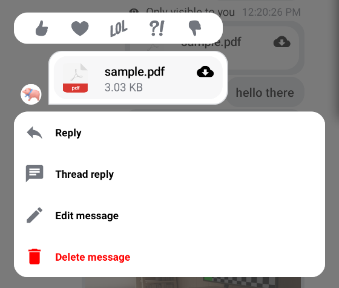

# SelectedMessageOverlay

The `SelectedMessageOverlay` component allows you to show different message options to the user when they select a message in the `MessageList`. This is usually done through long tapping on an item.

This is a **stateless component** that you can easily add to your UI if you're building a custom Messages screen. Internally, it sets up the following components:

* Reaction options: Shows a list of reactions the user can use to react to the message. Those reactions are shown as `ReationOptionItem`s in a `Row`.
* Selected message: Shows the currently selected message. This UI is much simpler than the message item UI used to show messages in a list.
* Message options: Shows a list of actions the user can take with the selected message, such as **delete**, **edit**, **reply to** and **start a thread** actions.

Let's see how to use it!

## Usage

If you're using the [`MessagesScreen`](./01-messages-screen.md), the `SelectedMessageOverlay` is already set up for you. To use the `SelectedMessageOverlay` in your custom screens, simply add it to your UI, like so:

```kotlin
// The rest of your UI
if (selectedMessage != null) {
    SelectedMessageOverlay(
        // Message options
        messageOptions = defaultMessageOptions(selectedMessage, user, listViewModel.isInThread),
        // Message to show
        message = selectedMessage,
        onMessageAction = { action ->
            // Handle message action
        },
        onDismiss = { 
            // Handle dismiss
        }
    )
}
```

As you can see, adding the overlay is very simple. If a `selectedMessage` exists, you pass in the message options you want to expose to the user, as well as the selected message. The reactions you show are taken from the [`ChatTheme`](../05-general-customization/01-chat-theme.md) component and everything else required to show the component is taken care internally.

The small snippet of code above produces the following UI:



As you can see, the reactions you can take are shown on the top, followed by the selected message and finally by message actions.

You can also see the overlay has a darker background, which if tapped will dismiss the component.

## Handling Actions

`SelectedMessageOverlay` exposes the following actions:

```kotlin
@Composable
fun SelectedMessageOverlay(
    ..., // State and options
    onMessageAction: (MessageAction) -> Unit,
    onDismiss: () -> Unit,
)
```

* `onMessageAction`: Handler for the user triggering any message actions, such as **reply**, **edit**, **delete**, **react** and others.
* `onDismiss`: Handler for when the component is dismissed by clicking outside of the component UI.

To handle these actions, you can override them like so:

```kotlin
if (selectedMessage != null) {
    SelectedMessageOverlay(
        ..., // State and options
        onMessageAction = { action ->
            composerViewModel.onMessageAction(action)
			listViewModel.onMessageAction(action)
        },
        onDismiss = {
			listViewModel.removeOverlay()
        }
    )
}
```

In the snippet above, you propagate the `action` to the `composerViewModel` and `listViewModel`, for them to store the latest action. This will update the UI accordingly.

Alternatively, you call `listViewModel.removeOverlay()` to remove the overlay from the screen, in `onDismiss()`. It's important to note that `onMessageAction()` calls `removeOverlay()` internally, to hide the overlay.

Next, let's see how to customize the overlay.

## Customization

You can customize the reactions you show, as well as the message options in this component:

```kotlin
@Composable
fun SelectedMessageOverlay(
    reactionTypes: Map<String, Int> = ChatTheme.reactionTypes,
    messageOptions: List<MessageOption>,
    ... // message and actions
)
```

* `reactionTypes`: Allows you customize which reactions show in the overlay. By default it uses `ChatTheme.reactionTypes` that is exposed through the `ChatTheme` component.
* `messageOptions`: Allows you to customize which message options are shown in the overlay. You can use `defaultMessageOptions()` to get the default actions that we expose in our SDK.

If you want to customize these options or reactions, you can set up custom reactions, using the [`ChatTheme`](../05-general-customization/01-chat-theme.md)'s `reactionTypes` parameter.
