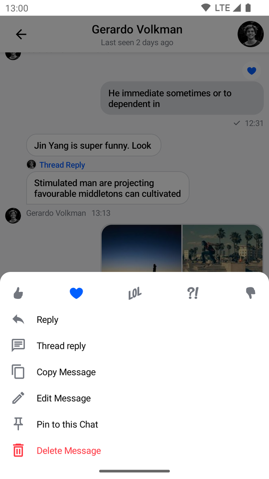
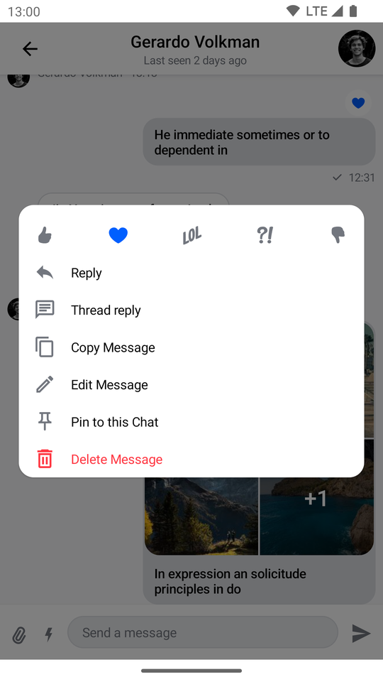
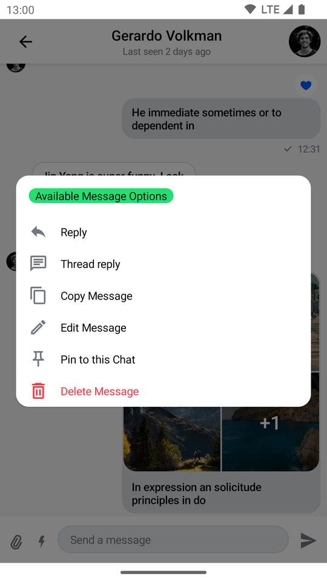

# SelectedMessageMenu

The `SelectedMessageMenu` component allows you to show different message options to the user when they select a message in the `MessageList`. This is usually done by long tapping on a message item.

This is a **stateless component** that you can easily add to your UI if you're building a custom Messages screen. Internally, it sets up the following components:

* Reaction options: Shows a list of reactions the user can use to react to the message. Those reactions are shown as `ReactionOptionItem`s in a `Row`.
* Message options: Shows a list of actions the user can take with the selected message, such as **delete**, **edit**, **reply to** and **start a thread** actions.

Let's see how to use it!

## Usage

If you're using the [`MessagesScreen`](./01-messages-screen.mdx), the `SelectedMessageMenu` is already set up for you. To use the `SelectedMessageMenu` in your custom screens, simply add it to your UI, like so:

```kotlin
// The rest of your UI
if (selectedMessage != null) {
    SelectedMessageMenu(
        // Use a Modifier to customize the appearance
        modifier = Modifier
            .align(Alignment.BottomCenter),
        // Specify the message options you provide to the user
        messageOptions = defaultMessageOptionsState(selectedMessage = selectedMessage,
            currentUser = user,
            isInThread = listViewModel.isInThread),
        // Specify the message upon which the options are exerted
        message = selectedMessage,
        onMessageAction = { action ->
            // Handle message action
        },
        onDismiss = {
            // Handle dismiss
        }
    )
}
```

As you can see, adding the menu is very simple. If a `selectedMessage` exists, you pass in the message options you want to expose to the user, as well as the selected message. The reactions you show are taken from the [`ChatTheme`](../02-general-customization/01-chat-theme.mdx) component and everything else required to show the component is taken care internally.

The small snippet of code above produces the following UI:



As you can see, the reactions you can take are shown on the top followed by message actions.

You can also see the overlay has a darker background, which if tapped will dismiss the component as will pressing the system back button.

## Handling Actions

`SelectedMessageMenu` exposes the following actions:

```kotlin
@Composable
fun SelectedMessageMenu(
    ..., // State and options
    onMessageAction: (MessageAction) -> Unit,
    onDismiss: () -> Unit = {},
)
```

* `onMessageAction`: Handler for the user triggering any message actions, such as **reply**, **edit**, **delete**, **react** and others.
* `onDismiss`: Handler for when the component is dismissed by clicking outside of the component UI or pressing the system back button.

To handle these actions, you can override them like so:

```kotlin
if (selectedMessage != null) {
    SelectedMessageMenu(
        ..., // State and options
        onMessageAction = { action ->
            composerViewModel.onMessageAction(action)
			listViewModel.onMessageAction(action)
        },
        onDismiss = {
			listViewModel.removeOverlay()
        }
    )
}
```

In the snippet above, you propagate the `action` to the `composerViewModel` and `listViewModel`, for them to store the latest action. This will update the UI accordingly.

Alternatively, you call `listViewModel.removeOverlay()` to remove the overlay from the screen, in `onDismiss()`. It's important to note that `onMessageAction()` calls `removeOverlay()` internally, to hide the overlay.

Next, let's see how to customize the overlay.

## Customization

You can customize the reactions you show, as well as the message options in this component:

```kotlin
@Composable
fun SelectedMessageMenu(
    reactionTypes: Map<String, Int> = ChatTheme.reactionTypes,
    messageOptions: List<MessageOption>,
    ... // message and actions
)
```

* `reactionTypes`: Allows you customize which reactions show in the overlay. By default it uses `ChatTheme.reactionTypes` that is exposed through the `ChatTheme` component.
* `messageOptions`: Allows you to customize which message options are shown in the overlay. You can use `defaultMessageOptions()` to get the default actions that we expose in our SDK.

If you want to customize these options or reactions, you can set up custom reactions, using the [`ChatTheme`](../02-general-customization/01-chat-theme.mdx)'s `reactionTypes` parameter.

By default `SelectedMessageMenu` is made to resemble a bottom sheet, however it can be stylised in order to look like a completely different component.

```kotlin
SelectedMessageMenu(
    // Use a Modifier to customize the appearance
    modifier = Modifier
        .align(Alignment.Center)
        .padding(horizontal = 20.dp)
        .wrapContentSize(),
    // Assign a different shape to the Composable element
    shape = ChatTheme.shapes.attachment,
    messageOptions = defaultMessageOptionsState(selectedMessage = selectedMessage,
        currentUser = user,
        isInThread = listViewModel.isInThread),
    message = selectedMessage,
    onMessageAction = { action ->
        // Handle message action
    },
    onDismiss = {
        // Handle dismiss
    }
)
```

The code above will produce the following UI:



`SelectedMessageMenu` provides you with Composable slots that are ready for more extensive customisations.

```kotlin
    public fun SelectedMessageMenu(
        ...,
        headerContent: @Composable ColumnScope.() -> Unit = {
        // Header content
        },
        bodyContent: @Composable ColumnScope.() -> Unit = {
        // Body content
        }
    )
```

By default the `headerContent` slot contains `ReactionOptions` while the `bodyContent` slot contains `MessageOptions`. If you decide you like the behavior that `SelectedMessageMenu` provides, but do not need it's default content you can easily override one or both of it's content slots.

```kotlin
if (selectedMessage != null) {
        ...,
        // Custom header content
        headerContent = {
            Text(modifier = Modifier
                .padding(horizontal = 16.dp, vertical = 8.dp)
                .background(shape = ChatTheme.shapes.avatar, color = ChatTheme.colors.infoAccent)
                .padding(horizontal = 8.dp),
                style = ChatTheme.typography.body,
                color = ChatTheme.colors.textHighEmphasis,
                text = "Available Message Options")
        }
    )
```

In the example above we've replaced the default argument assigned to `headerContent` with a simple text label by passing a lambda containing `Text`.

Our resulting UI Looks like this:




