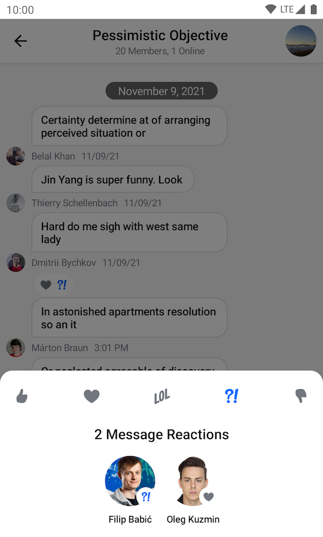
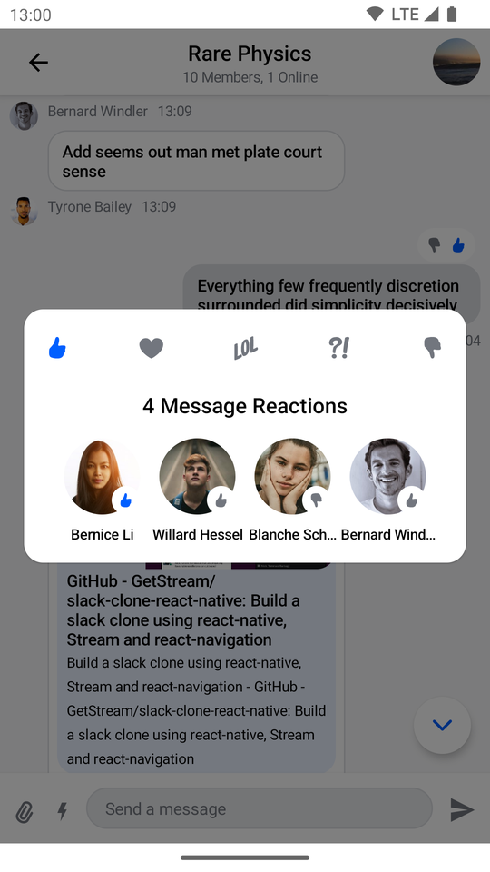
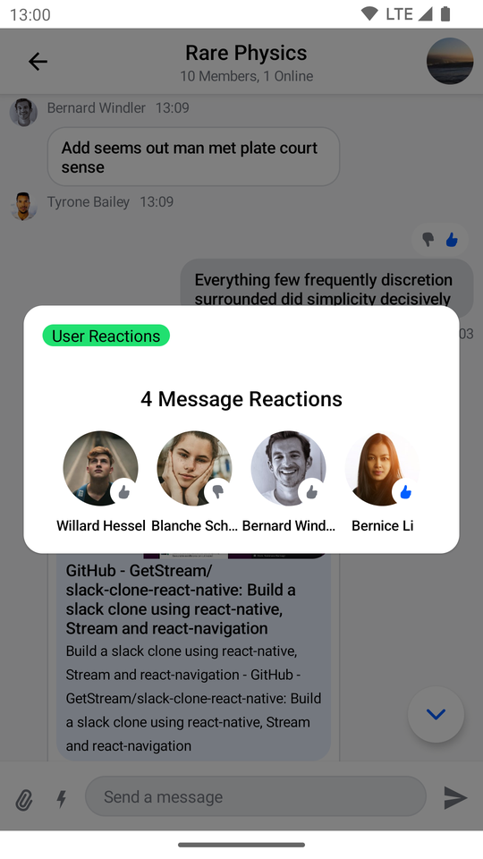

# SelectedReactionsMenu

The `SelectedReactionsMenu` component allows you to show a list of user reactions left for the message when they select message reactions in the `MessageList`. This is usually done by tapping on message item reaction.

This is a **stateless component** that you can easily add to your UI if you're building a custom Messages screen. Internally, it sets up the following components:

* **Reaction options**: Shows a list of reactions the user can use to react to the message. Those reactions are shown as `ReactionOptionItem`s.
* **User reactions**: Shows a list of reactions left for the message.

Let's see how to use it!

## Usage

If you're using the [`MessagesScreen`](./01-messages-screen.mdx), the `SelectedReactionsMenu` is already set up for you. To use the `SelectedReactionsMenu` in your custom screens, simply add it to your UI, like so:

```kotlin
// The rest of your UI
if (selectedMessageState is SelectedMessageReactionsState) {
    val selectedMessage = selectedMessageState.message
    SelectedReactionsMenu(
        modifier = Modifier.align(Alignment.BottomCenter),
        // The currently logged-in user
        currentUser = user,
        // The message whose reactions you selected
        message = selectedMessage,
        onMessageAction = { action ->
            // Handle message action
        },
        onDismiss = { 
            // Handle dismiss
        }
    )
}

```

As you can see, adding the menu is very simple. If the `selectedMessageState` is an instance of `SelectedMessageReactionsState`, you pass in the message options you want to expose to the user, as well as the selected message. The reactions you show are taken from the [`ChatTheme`](../02-general-customization/01-chat-theme.mdx) component and everything else required to show the component is taken care of internally.

The small snippet of code above produces the following UI:



The component shows reactions from the [`ChatTheme`](../02-general-customization/01-chat-theme.mdx) on the top, followed by the message actions you passed in.

The menu overlay has a darker background and tapping it will dismiss the component, as will pressing the system back button.

## Handling Actions

`SelectedReactionsMenu` exposes the following actions:

```kotlin
@Composable
fun SelectedMessageMenu(
    ..., // State and options
    onMessageAction: (MessageAction) -> Unit,
    onDismiss: () -> Unit = {},
)
```

* `onMessageAction`: Handler for the user triggering any message actions, such as **reply**, **edit**, **delete**, **react** and others.
* `onDismiss`: Handler for when the component is dismissed by clicking outside of the component UI or pressing the system back button.

To handle these actions, you can override them like so:

```kotlin
if (selectedMessageState is SelectedMessageReactionsState) {
    SelectedMessageMenu(
        ..., // State and options
        onMessageAction = { action ->
            composerViewModel.onMessageAction(action)
			listViewModel.onMessageAction(action)
        },
        onDismiss = {
			listViewModel.removeOverlay()
        }
    )
}
```

In the snippet above, you propagate the `action` to the `composerViewModel` and `listViewModel`, for them to store the latest action. This will update the UI accordingly.

Alternatively, you call `listViewModel.removeOverlay()` to remove the overlay from the screen, in `onDismiss()`. It's important to note that `onMessageAction()` calls `removeOverlay()` internally, to hide the overlay.

Next, let's see how to customize the overlay.

## Customization

You can customize the reactions you show, as well as the message options in this component:

```kotlin
@Composable
fun SelectedReactionsMenu(
    reactionTypes: Map<String, Int> = ChatTheme.reactionTypes,
    ... // Message and actions
)
```

* `reactionTypes`: Allows you customize which reactions show in the overlay. By default it uses `ChatTheme.reactionTypes` that is exposed through the [`ChatTheme`](../02-general-customization/01-chat-theme.mdx) component.

If you want to customize these options or reactions, you can set up custom reactions, using the [`ChatTheme`](../02-general-customization/01-chat-theme.mdx)'s `reactionTypes` parameter.

By default `SelectedReactionsMenu` looks like a bottom sheet, however you can customize it to look like a completely different component, such as a dialog, a drawer or whatever helps you retain the look and feel of your app.

```kotlin
if (selectedMessageState is SelectedMessageReactionsState){
    // Use a Modifier to customize the appearance
    SelectedReactionsMenu(
        // Use a Modifier to customize the appearance
        modifier = Modifier
            .align(Alignment.Center)
            .padding(horizontal = 20.dp)
            .wrapContentSize(),
        // Assign a different shape to the Composable element
        shape = ChatTheme.shapes.attachment,
        currentUser = user,
        onMessageAction = { action ->
            // Handle message action
        },
        onDismiss = { 
            // Handle dismiss 
        },
        ...
    )
}
```

The code above will produce the following UI:



`SelectedMessageMenu` provides you with Composable slots that are ready for more extensive customizations.

```kotlin
@Composable
fun SelectedReactionsMenu(
    ...,
    headerContent: @Composable ColumnScope.() -> Unit = {
        // Header content
    },
    centerContent: @Composable ColumnScope.() -> Unit = {
        // Center content
    }
)
```
* `headerContent`: Allows you to customize what content you show on the top part of the menu. By default it shows `ReactionOptions`
* `centerContent`: Allows you to customize what content you show on the center part of the menu. By default it shows `UserReactions`

You can easily override either slot:

```kotlin
if (selectedMessageState is SelectedMessageReactionsState) {
    SelectedReactionsMenu(
            ...,
            // Custom header content
            headerContent = {
                Text(
                    modifier = Modifier
                        .padding(horizontal = 16.dp, vertical = 8.dp)
                        .background(shape = ChatTheme.shapes.avatar, color = ChatTheme.colors.infoAccent)
                        .padding(horizontal = 8.dp),
                    style = ChatTheme.typography.body,
                    color = ChatTheme.colors.textHighEmphasis,
                    text = "User Reactions")
            }
        )
}
```

The example above shows how to replace the header content with a custom `Text`.

The UI Looks like this:




