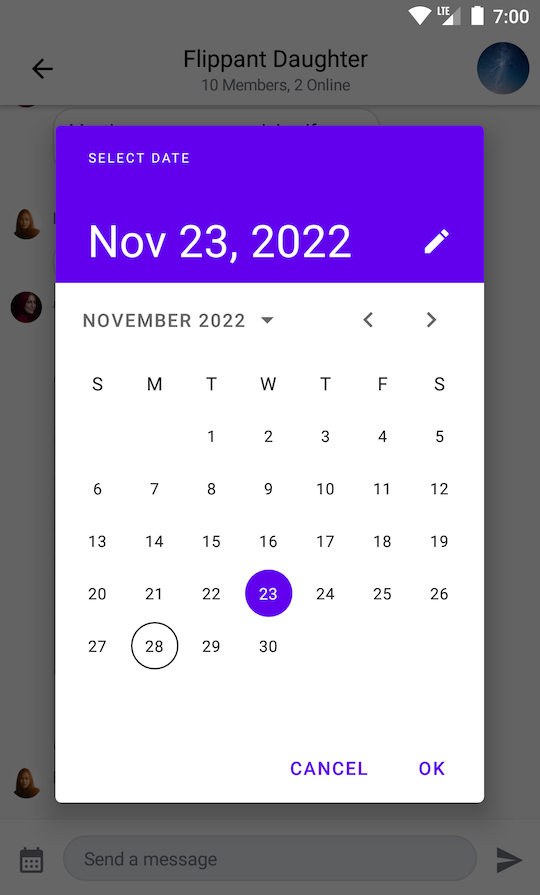
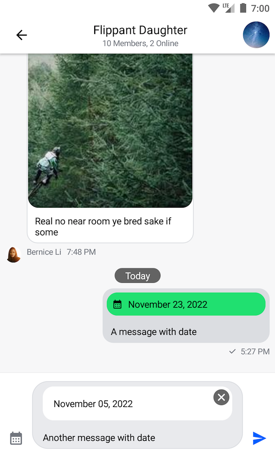

# Adding Custom Attachments

## Introduction

Stream Chat SDK comes with the support for several built-in attachment types like images, URLs, gifs and videos. However, you can also introduce your own custom attachment types.

This involves doing the following steps:
1. Providing a way of sending messages with custom attachments
1. Providing a custom `AttachmentFactory` that will be responsible for:  
  - Rendering attachment previews in the message input
  - Rendering attachment contents in the message list
  - Providing a text representation for a message preview in the channel list  

Let's see how to build a date sharing feature. Chat users will be able to pick a date from the calendar and send it to a channel as a custom Attachment.

:::note
All the code from this guide is available on [GitHub](https://github.com/GetStream/Android-Samples/tree/main/compose-custom-attachments)
:::

## Sending Date Attachments

To begin with, you'll need a custom message composer with a button to pick dates. Here's the code for this component:

```kotlin
@Composable
fun CustomMessageComposer(
    viewModel: MessageComposerViewModel,
    onDateSelected: (Long) -> Unit,
) {
    val activity = LocalContext.current as AppCompatActivity

    MessageComposer(
        modifier = Modifier
            .fillMaxWidth()
            .wrapContentHeight(),
        viewModel = viewModel,
        integrations = {
            IconButton(
                modifier = Modifier
                    .size(48.dp)
                    .padding(12.dp),
                content = {
                    Icon(
                        painter = painterResource(id = R.drawable.ic_calendar),
                        contentDescription = null,
                        tint = ChatTheme.colors.textLowEmphasis
                    )
                },
                onClick = {
                    MaterialDatePicker.Builder
                        .datePicker()
                        .build()
                        .apply {
                            show(activity.supportFragmentManager, null)
                            addOnPositiveButtonClickListener {
                                onDateSelected(it)
                            }
                        }
                }
            )
        }
    )
}
```

Next, you'll need to create a custom messages screen that makes use of the custom message composer that we've created above.

```kotlin
@Composable
fun CustomMessagesScreen(
    channelId: String,
    onBackPressed: () -> Unit = {}
) {
    val factory = MessagesViewModelFactory(
        context = LocalContext.current,
        channelId = channelId,
    )

    val messageListViewModel = viewModel(MessageListViewModel::class.java, factory = factory)
    val composerViewModel = viewModel(MessageComposerViewModel::class.java, factory = factory)

    val messageMode = messageListViewModel.messageMode
    val currentUser by messageListViewModel.user.collectAsState()

    SystemBackPressedHandler(isEnabled = true, onBackPressed = onBackPressed)

    Box(modifier = Modifier.fillMaxSize()) {
        Scaffold(
            modifier = Modifier.fillMaxSize(),
            topBar = {
                MessageListHeader(
                    modifier = Modifier.height(56.dp),
                    channel = messageListViewModel.channel,
                    currentUser = currentUser,
                    messageMode = messageMode,
                    onBackPressed = onBackPressed
                )
            },
            bottomBar = {
                // 1
                CustomMessageComposer(
                    viewModel = composerViewModel,
                    onDateSelected = {
                        // 2
                        val date = DateFormat
                            .getDateInstance(DateFormat.LONG)
                            .format(Date(it))
                        val attachment = Attachment(
                            type = "date",
                            extraData = mutableMapOf("payload" to date)
                        )
                        // 3
                        composerViewModel.addSelectedAttachments(listOf(attachment))
                    }
                )
            }
        ) {
            MessageList(
                modifier = Modifier
                    .padding(it)
                    .background(ChatTheme.colors.appBackground)
                    .fillMaxSize(),
                viewModel = messageListViewModel,
                onThreadClick = { message ->
                    composerViewModel.setMessageMode(MessageMode.MessageThread(message))
                    messageListViewModel.openMessageThread(message)
                }
            )
        }
    }
}
```

In the snippet above, you:

1. Unitlized our `CustomMessageComposer` for the messages screen.
2. Created a custom attachment of type "date".
3. Submitted the attachment to the message composer.

Finally, you'll need to create an Activity which uses the newly created messages screen.

```kotlin
class MessagesActivity : AppCompatActivity() {

    override fun onCreate(savedInstanceState: Bundle?) {
        super.onCreate(savedInstanceState)
        val channelId = requireNotNull(intent.getStringExtra(KEY_CHANNEL_ID))

        setContent {
            ChatTheme {
                CustomMessagesScreen(
                    channelId = channelId,
                    onBackPressed = { finish() }
                )
            }
        }
    }

    companion object {
        private const val KEY_CHANNEL_ID = "channelId"

        fun getIntent(context: Context, channelId: String): Intent {
            return Intent(context, MessagesActivity::class.java).apply {
                putExtra(KEY_CHANNEL_ID, channelId)
            }
        }
    }
}
```

Now you can send a custom attachment of type "date" to the chat:



Now let's see how to render "date" attachments in our UI.

## Rendering Date Attachments


:::note
[Attachment Factory](../02-general-customization/02-attachment-factory.mdx)
:::


`AttachmentFactory`

The `AttachmentFactory` class allows you to build your own attachments to display

Let's see how to create an attachment factory that is capable of handling date attachments:

```kotlin
@ExperimentalStreamChatApi
val dateAttachmentFactory: AttachmentFactory = AttachmentFactory(
    canHandle = { attachments -> attachments.any { it.type == "date" } },
    content = @Composable { modifier, attachmentState ->
      // Composable that represents the UI of "date" attachments in the message list
    },
    previewContent = { modifier, attachments, onAttachmentRemoved ->
      // Composable that represents the UI of "date" attachments in the message input
    },
    textFormatter = { attachment -> 
      // String representation of the attachment in the channel list
    },
)
```

Let's start with creating a component for the message input.

```kotlin
@Composable
fun DateAttachmentPreviewContent(
    attachments: List<Attachment>,
    onAttachmentRemoved: (Attachment) -> Unit,
    modifier: Modifier = Modifier,
) {
    val attachment = attachments.first { it.type == "date" }
    val formattedDate = attachment.extraData["payload"].toString()

    Box(
        modifier = modifier
            .wrapContentHeight()
            .clip(RoundedCornerShape(16.dp))
            .background(color = ChatTheme.colors.barsBackground)
    ) {
        Text(
            modifier = Modifier
                .align(Alignment.CenterStart)
                .padding(16.dp)
                .fillMaxWidth(),
            text = formattedDate,
            style = ChatTheme.typography.body,
            maxLines = 1,
            color = ChatTheme.colors.textHighEmphasis
        )

        CancelIcon(
            modifier = Modifier
                .align(Alignment.TopEnd)
                .padding(4.dp),
            onClick = { onAttachmentRemoved(attachment) }
        )
    }
}
```

Then, create a component that will be rendered in the message list.

```kotlin
@Composable
fun DateAttachmentContent(
    attachmentState: AttachmentState,
    modifier: Modifier = Modifier,
) {
    val attachment = attachmentState.message.attachments.first { it.type == "date" }
    val formattedDate = attachment.extraData["payload"].toString()

    Column(
        modifier = modifier
            .fillMaxWidth()
            .padding(4.dp)
            .clip(ChatTheme.shapes.attachment)
            .background(ChatTheme.colors.infoAccent)
            .padding(8.dp)
    ) {
        Row(
            horizontalArrangement = Arrangement.spacedBy(8.dp),
            verticalAlignment = Alignment.CenterVertically
        ) {
            Icon(
                modifier = Modifier.size(16.dp),
                painter = painterResource(id = R.drawable.ic_calendar),
                contentDescription = null,
                tint = ChatTheme.colors.textHighEmphasis,
            )

            Text(
                text = formattedDate,
                style = ChatTheme.typography.body,
                maxLines = 1,
                color = ChatTheme.colors.textHighEmphasis
            )
        }
    }
}
```

Finally, you need to generate a string for channel list items:

```kotlin
attachment.extraData["payload"].toString()
```

And you `dateAttachmentFactory` will look like that:

```kotlin
@ExperimentalStreamChatApi
val dateAttachmentFactory: AttachmentFactory = AttachmentFactory(
    canHandle = { attachments -> attachments.any { it.type == "date" } },
    content = @Composable { modifier, attachmentState ->
        DateAttachmentContent(
            modifier = modifier,
            attachmentState = attachmentState
        )
    },
    previewContent = { modifier, attachments, onAttachmentRemoved ->
        DateAttachmentPreviewContent(
            modifier = modifier,
            attachments = attachments,
            onAttachmentRemoved = onAttachmentRemoved
        )
    },
    textFormatter = { attachment -> 
      attachment.extraData["payload"].toString()
    },
)
```

You'll need to provide your new attachment factory via `ChatTheme`:

```kotlin
class MessagesActivity : AppCompatActivity() {

    override fun onCreate(savedInstanceState: Bundle?) {
        super.onCreate(savedInstanceState)
        val channelId = requireNotNull(intent.getStringExtra(KEY_CHANNEL_ID))

        val customFactories = listOf(dateAttachmentFactory)
        val defaultFactories = StreamAttachmentFactories.defaultFactories()

        setContent {
            ChatTheme(attachmentFactories = customFactories + defaultFactories) {
                CustomMessagesScreen(
                    channelId = channelId,
                    onBackPressed = { finish() }
                )
            }
        }
    }

    companion object {
        private const val KEY_CHANNEL_ID = "channelId"

        fun getIntent(context: Context, channelId: String): Intent {
            return Intent(context, MessagesActivity::class.java).apply {
                putExtra(KEY_CHANNEL_ID, channelId)
            }
        }
    }
}
```

The final result will look like this:


