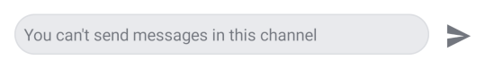
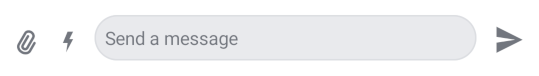

# Implementing Own Capabilities

Each `Channel` has a list of capabilities that can be performed in it, such as muting a user, deleting messages and many
others. Not all channels should have the same capabilities neither should all users, which is where own capabilities
come into play.

Inside of `Channel` you will find a property with a signature `ownCapabilities: Set<String>`. Which channel capabilities
this set contains depends on the current user’s role (e.g. admin, guest, etc.), the channel type (e.g. messaging,
livestream, etc.) and channel level settings. You can read more about channel
capabilities [here](https://getstream.io/chat/docs/android/channel_capabilities/?language=kotlin) and more about channel
level settings [here](https://getstream.io/chat/docs/android/channel-level_settings/).

## Integrating channel capabilities into the UI

If you are using our bound UI components in combination with our `ViewModel`s, then own capabilities work out of the box without any
additional effort from your side, otherwise you will have to pass the correct set of capabilities to individual components.

Different components have different ways of passing own capabilities to them, so we’ll go through them individually.
Capabilities that were a part of the minimal chat experience before the introduction of own capabilities will be highlighted in bold with an asterisk next to them.

:::note
As a safety precaution, by default an empty set is passed wherever `ownCapabilities: Set<String>` is required. This gives the user no capabilities. Passing a set containing all capabilities will give the user potentially dangerous capabilities such as the ability to delete any message.
:::

### MessageComposer

```kotlin
@Composable
public fun MessageComposer(
    messageComposerState: MessageComposerState,
    ..., // State, handlers and content slots
    integrations: @Composable RowScope.(MessageComposerState) -> Unit = {
        // Default content, uses own capabilities to regulate integrations
    },
    trailingContent: @Composable (MessageComposerState) -> Unit = {
        // Default content, uses own capabilities to regulate the send button
    },
)
```
The file containing `MessageComposer` can be found [here](https://github.com/GetStream/stream-chat-android/blob/main/stream-chat-android-compose/src/main/java/io/getstream/chat/android/compose/ui/messages/composer/MessageComposer.kt).

`MessageComposer` contains a parameter `messageComposerState: MessageComposerState`. This class holds all the necessary
state to make `MessageComposer` work, including a set of own capabilities. These are used by the default components
hosted in the `MessageComposer`.

Let's take a look at `MessageComposerState`:

```kotlin
public data class MessageComposerState(
    ..., // State
    val ownCapabilities: Set<String> = setOf()
)
```
The file containing `MessageComposerState` can be found [here](https://github.com/GetStream/stream-chat-android/blob/main/stream-chat-android-ui-common/src/main/kotlin/io/getstream/chat/android/ui/common/state/messages/composer/MessageComposerState.kt).

`MessageComposer` regulates the following capabilities:

- **send-message * **
- **send-links * **
- **upload-file * **
- **send-typing-events * **

:::note
Own capabilities are publicly exposed inside `MessageComposerController` and `MessageComposerViewModel` as `ownCapabilities: StateFlow<Set<String>>`.

For this component, as well as all the other examples, the capabilities in bold are a part of the "default" behavior that is set up for most users in the dashboard.
:::

### SelectedMessageMenu

```kotlin
@Composable
public fun SelectedMessageMenu(
    message: Message,
    messageOptions: List<MessageOptionItemState>,
    ownCapabilities: Set<String>,
    ..., // Handlers and customization options
    headerContent: @Composable ColumnScope.() -> Unit = {
        // Default content, uses own capabilities to regulate sending reactions
    },
    centerContent: @Composable ColumnScope.() -> Unit = {
        // Default content
    },
)
```
The file containing `SelectedMessageMenu` can be found [here](https://github.com/GetStream/stream-chat-android/blob/main/stream-chat-android-compose/src/main/java/io/getstream/chat/android/compose/ui/components/selectedmessage/SelectedMessageMenu.kt).

`SelectedMessageMenu` regulates the following capability:

- **send-reaction * **

More capabilities can be regulated by creating the appropriate list of message options.
You can use the following function provided by the SDK to do so:

```kotlin
@Composable
public fun defaultMessageOptionsState(
    selectedMessage: Message,
    currentUser: User?,
    isInThread: Boolean,
    ownCapabilities: Set<String>,
): List<MessageOptionItemState>
```

This function uses `ownCapabilities` to produce the correct list of `MessageOptionItemState`.

`defaultMessageOptionsState` regulates the following capabilities:

- **send-reply * **
- pin-message
- delete-any-message
- **delete-own-message * **
- update-any-message
- **update-own-message * **

:::note
Own capabilities are publicly exposed inside `MessageListViewModel` as `ownCapabilities: StateFlow<Set<String>>`.
:::

### SelectedReactionsMenu

```kotlin
@Composable
public fun SelectedReactionsMenu(
    message: Message,
    currentUser: User?,
    ownCapabilities: Set<String>,
    ..., // Handlers and customization options
    headerContent: @Composable ColumnScope.() -> Unit = {
        // Default content, uses own capabilities to regulate sending reactions
    },
    centerContent: @Composable ColumnScope.() -> Unit = {
        // Default content
    },
)
```
The file containing `SelectedReactionsMenu` can be found [here](https://github.com/GetStream/stream-chat-android/blob/main/stream-chat-android-compose/src/main/java/io/getstream/chat/android/compose/ui/components/selectedmessage/SelectedReactionsMenu.kt).

`SelectedReactionsMenu` menu regulates the following capability:

- **send-reaction * **

### SelectedChannelMenu

```kotlin
@Composable
public fun SelectedChannelMenu(
    selectedChannel: Channel,
    ..., // State, handlers and content
    centerContent: @Composable ColumnScope.() -> Unit = {
        // Default content, uses own capabilities to regulate
        // deleting and leaving channels
    },
)
```
The file containing `SelectedChannelMenu` can be found [here](https://github.com/GetStream/stream-chat-android/blob/main/stream-chat-android-compose/src/main/java/io/getstream/chat/android/compose/ui/channels/info/SelectedChannelMenu.kt).

`SelectedChannelMenu` contains a `Channel` value. It uses the `ownCapabilities` property contained by that `Channel`
value to leverage own capabilities inside the default center content.

`SelectedChannelMenu` regulates the following capabilities:

- **leave-channel * **
- delete-channel

## Other capabilities

There are channel capabilities which are not implemented in the SDK because we do not offer the corresponding components
or the functionality.
You can implement these yourself after creating the correct components.

These are as follows:

- freeze-channel
- set-channel-cooldown
- search-message
- update-channel
- update-channel-members
- ban-channel-members

Additionally, the capability '**send-typing-events ***' is implemented in our `MessageComposerController` used by
our `MessageComposerViewModel`.
Please keep this in mind should you wish to not use our `ViewModel`s.

# How capabilities affect the UI

Let's take `MessageComposer` into consideration.
If we left it with the default, empty set of own capabilities we would get the following result:

||
|---|

This leaves the user unable to perform any action provided by the composer.
Ideally, you should let your Dashboard App settings regulate capabilities, but if you wish to control them manually, you can do so.

Take a look at the object called `ChannelCapabilities`:

```kotlin
public object ChannelCapabilities {
    /** Ability to ban channel members. */
    public const val BAN_CHANNEL_MEMBERS: String = "ban-channel-members"
    ... // Other capabilities
}
```
The file containing `ChannelCapabilities` can be found [here](https://github.com/GetStream/stream-chat-android/blob/main/stream-chat-android-core/src/main/java/io/getstream/chat/android/models/ChannelCapabilities.kt).

This object contains all relevant channel capabilities as type safe properties.
You can use the properties to build a set containing only the capabilities you want enabled for the user.

If you were to enable the user to send messages, links, attachments and typing events, you would build a set as follows:

```kotlin
val customOwnCapabilities = setOf(
    ChannelCapabilities.SEND_MESSAGE,
    ChannelCapabilities.SEND_LINKS,
    ChannelCapabilities.UPLOAD_FILE,
    ChannelCapabilities.SEND_TYPING_EVENTS
)
```

Then use it to create `MessageComposerState`:

```kotlin
val messageComposerState = MessageComposerState(
    ownCapabilities = customOwnCapabilities
)
```

And finally pass the `MessageComposerState` to the stateless `MessageComposer` component:

```kotlin
MessageComposer(
    messageComposerState = messageComposerState,
    ..., // State, handlers and content.
)
```

This enables the following capabilities:

- **send-message * **
- **send-links * **
- **upload-file * **
- **send-typing-events * **

And results in `MessageComposer` having the following appearance:

||
|---|

:::note
Please note that providing custom client side capabilities leaves you in charge of making sure that users are not awarded with dangerous capabilities and that different clients are in sync.
This is why it is recommended to fetch own capabilities that are provided to you by the server.
:::