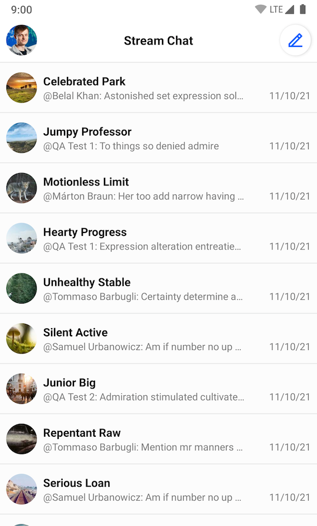
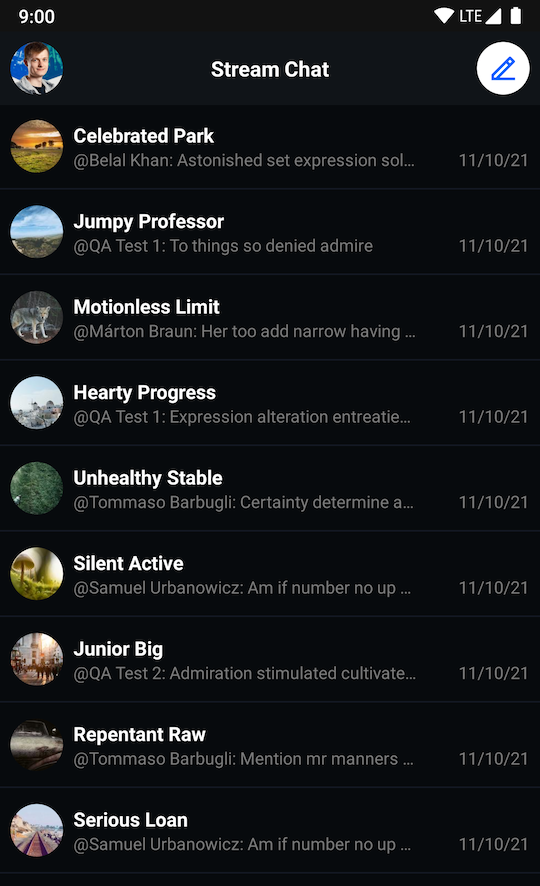

# Building a Channel List Screen

The SDK provides two components, `ChannelListHeaderView` and `ChannelListView` which work best together to display the channel and other useful information.

This is what a screen made up of these two components looks like:

| Light Mode | Dark Mode |
| --- | --- |
|||

To add these Views to your app, first create them in an XML layout:

```xml
<?xml version="1.0" encoding="utf-8"?>
<androidx.constraintlayout.widget.ConstraintLayout xmlns:android="http://schemas.android.com/apk/res/android"
    xmlns:app="http://schemas.android.com/apk/res-auto"
    android:layout_width="match_parent"
    android:layout_height="match_parent"
    >

    <io.getstream.chat.android.ui.channel.list.header.ChannelListHeaderView
        android:id="@+id/channelListHeaderView"
        android:layout_width="match_parent"
        android:layout_height="wrap_content"
        app:layout_constraintEnd_toEndOf="parent"
        app:layout_constraintStart_toStartOf="parent"
        app:layout_constraintTop_toTopOf="parent"
        />

    <io.getstream.chat.android.ui.channel.list.ChannelListView
        android:id="@+id/channelListView"
        android:layout_width="0dp"
        android:layout_height="0dp"
        android:layout_marginTop="8dp"
        app:layout_constraintBottom_toBottomOf="parent"
        app:layout_constraintEnd_toEndOf="parent"
        app:layout_constraintStart_toStartOf="parent"
        app:layout_constraintTop_toBottomOf="@id/channelListHeaderView"
        />

</androidx.constraintlayout.widget.ConstraintLayout>
```

The Android SDK comes with ViewModels for its components which are responsible for providing all necessary data.

You can create these ViewModels the following way, providing any necessary parameters using a ViewModel factory:

```kotlin
val channelListHeaderViewModel: ChannelListHeaderViewModel by viewModels()
val channelListFactory: ChannelListViewModelFactory = ChannelListViewModelFactory(
    filter = Filters.and(
        Filters.eq("type", "messaging"),
        Filters.`in`("members", listOf(ChatDomain.instance().currentUser.id)),
    ),
    sort = QuerySort.desc(Channel::lastUpdated),
    limit = 30,
)
val channelListViewModel: ChannelListViewModel by viewModels { channelListFactory }
```

Then, use `bindView` to connect the ViewModel and the View, populating the View with data and handling its input events.

```kotlin
channelListHeaderViewModel.bindView(channelListHeaderView, viewLifecycleOwner)
channelListViewModel.bindView(channelListView, viewLifecycleOwner)
```

> Note that `bindView` sets listeners on the view and the ViewModel. Any additional listeners should be set _after_ calling `bindView`.

From that point, `ChannelListHeaderView` will be able to display the current user avatar as well as online status, while `ChannelListView` will display different channels view states, as well as the channel’s pagination, which will be handled automatically.

`ChannelListViewModelFactory` allows customizing _filter_ and _sort_ options. You can find more about possible options [here](https://getstream.io/chat/docs/android/query_channels/?language=java#common-filters-by-use-case).
