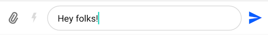
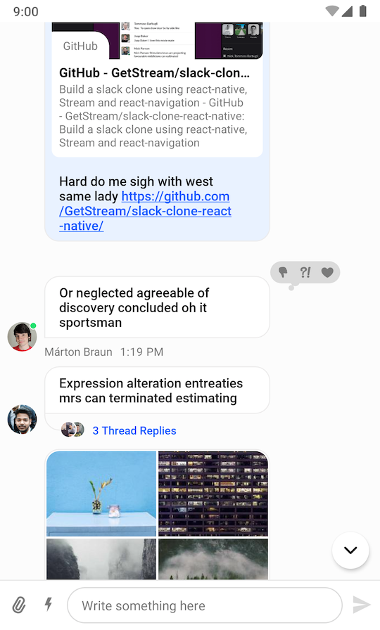
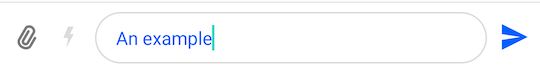
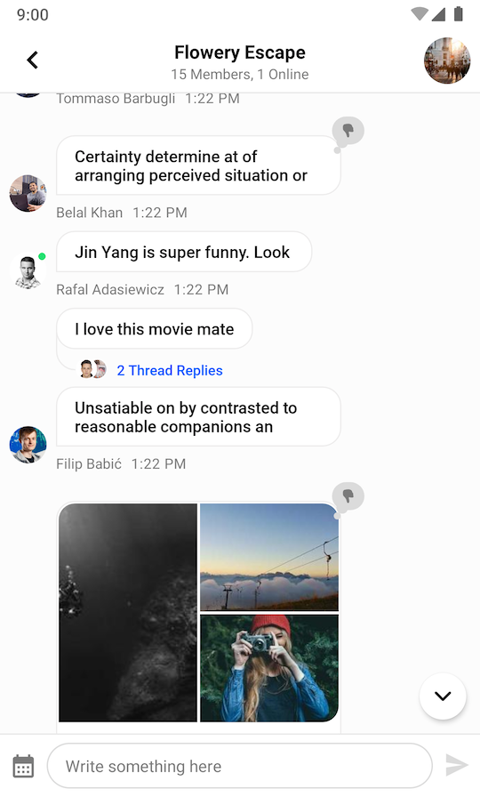
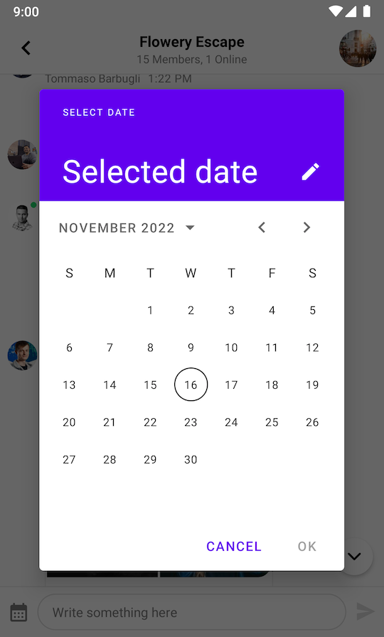

import Tabs from '@theme/Tabs';
import TabItem from '@theme/TabItem';

# Message Composer

`MessageComposerView` is a UI component for sending messages and attachments to channels.

| Light Mode | Dark Mode |
 | --- | --- |
|||

It supports the following features:

* Attachments
* Slash Commands
* Typing events
* Editing messages
* Threads
* Mentions
* Replies

Let's see how to integrate the new `MessageComposerView` in your UI.

## Usage

To use `MessageComposerView`, include it in your XML layout.

```xml
<io.getstream.chat.android.ui.feature.messages.composer.MessageComposerView
    android:id="@+id/messageComposerView"
    android:layout_width="match_parent"
    android:layout_height="wrap_content" />
```

The recommended way of setting up `MessageComposerView` is by binding it to the `MessageComposerViewModel`. This will make it fully functional by setting up any necessary listeners and data handling.

<Tabs>
<TabItem value="kotlin" label="Kotlin">

```kotlin
// Create MessageComposerViewModel for a given channel
val factory = MessageListViewModelFactory(cid = "messaging:123")
val messageComposerViewModel: MessageComposerViewModel by viewModels { factory }

// Bind MessageComposerViewModel with MessageComposerView
messageComposerViewModel.bindView(
    // Required
    messageComposerView, 
    viewLifecycleOwner,
    // Optional (you can set your custom listeners here)
    sendMessageButtonClickListener = {
        // Handle send button click
    },
    textInputChangeListener = { text ->
        // Handle input text change
    },
    //... 
    // other listeners
)
```
</TabItem>

<TabItem value="java" label="Java">

```java
// Create MessageComposerViewModel for a given channel
ViewModelProvider.Factory factory = new MessageListViewModelFactory.Builder()
        .cid("messaging:123")
        .build();
ViewModelProvider provider = new ViewModelProvider(this, factory);
MessageComposerViewModel viewModel = provider.get(MessageComposerViewModel.class);

// Bind MessageComposerViewModel with MessageComposerView
MessageComposerViewModelBinder.with(viewModel)
        // Optional (you can set your custom message builder here)
        .messageBuilder(viewModel::buildNewMessage)
        // Optional (you can set your custom listeners here)
        .onSendMessageButtonClick((message) -> {
            // Handle send button click
            return Unit.INSTANCE;
        })
        .onTextInputChange((text) -> {
            // Handle input text change
            return Unit.INSTANCE;
        })
        //... 
        // other listeners
        
        // Required
        .bind(messageComposerView, getViewLifecycleOwner());
```
</TabItem>
</Tabs>

Because it doesn't make sense to use the `MessageComposerView` as a standalone component, you also need to integrate it with the `MessageListView`:

```xml
<androidx.constraintlayout.widget.ConstraintLayout xmlns:android="http://schemas.android.com/apk/res/android"
    xmlns:app="http://schemas.android.com/apk/res-auto"
    android:layout_width="match_parent"
    android:layout_height="match_parent">

    <io.getstream.chat.android.ui.feature.messages.list.MessageListView
        android:id="@+id/messageListView"
        android:layout_width="0dp"
        android:layout_height="0dp"
        app:layout_constraintBottom_toTopOf="@+id/messageComposerView"
        app:layout_constraintEnd_toEndOf="parent"
        app:layout_constraintStart_toStartOf="parent"
        app:layout_constraintTop_toTopOf="parent" />

    <io.getstream.chat.android.ui.feature.messages.composer.MessageComposerView
        android:id="@+id/messageComposerView"
        android:layout_width="0dp"
        android:layout_height="wrap_content"
        app:layout_constraintBottom_toBottomOf="parent"
        app:layout_constraintEnd_toEndOf="parent"
        app:layout_constraintStart_toStartOf="parent" />

</androidx.constraintlayout.widget.ConstraintLayout>
```

<Tabs>
<TabItem value="kotlin" label="Kotlin">

```kotlin
// Create ViewModels for MessageComposerView and MessageListView
val factory = MessageListViewModelFactory(cid = "messaging:123")
val messageComposerViewModel: MessageComposerViewModel by viewModels { factory }
val messageListViewModel: MessageListViewModel by viewModels { factory }

// Bind MessageComposerViewModel with MessageComposerView
messageComposerViewModel.bindView(messageComposerView, viewLifecycleOwner)

// Bind MessageListViewModel with MessageListView
messageListViewModel.bindView(messageListView, viewLifecycleOwner)

// Integrate MessageComposerView with MessageListView
messageListViewModel.mode.observe(viewLifecycleOwner) { mode ->
    when (mode) {
        is MessageMode.MessageThread -> {
            messageComposerViewModel.setMessageMode(MessageMode.MessageThread(mode.parentMessage))
        }
        is MessageMode.Normal -> {
            messageComposerViewModel.leaveThread()
        }
    }
}
messageListView.setMessageReplyHandler { _, message ->
    messageComposerViewModel.performMessageAction(Reply(message))
}
messageListView.setMessageEditHandler { message ->
    messageComposerViewModel.performMessageAction(Edit(message))
}
```
</TabItem>

<TabItem value="java" label="Java">

```java
// Create ViewModels for MessageComposerView and MessageListView
ViewModelProvider.Factory factory = new MessageListViewModelFactory.Builder()
        .cid("messaging:123")
        .build();
ViewModelProvider provider = new ViewModelProvider(this, factory);
MessageComposerViewModel messageComposerViewModel = provider.get(MessageComposerViewModel.class);
MessageListViewModel messageListViewModel = provider.get(MessageListViewModel.class);

// Bind MessageComposerViewModel with MessageComposerView
MessageComposerViewModelBinder.with(messageComposerViewModel).bind(messageComposerView, getViewLifecycleOwner());

// Bind MessageListViewModel with MessageListView
MessageListViewModelBinding.bind(messageListViewModel, messageListView, getViewLifecycleOwner());

// Integrate MessageComposerView with MessageListView
messageListViewModel.getMode().observe(getViewLifecycleOwner(), mode -> {
    if (mode instanceof MessageMode.MessageThread) {
        messageComposerViewModel.setMessageMode(new MessageMode.MessageThread(((MessageMode.MessageThread) mode).getParentMessage()));
    } else if (mode instanceof MessageMode.Normal) {
        messageComposerViewModel.leaveThread();
    }
});
messageListView.setMessageReplyHandler((cid, message) -> messageComposerViewModel.performMessageAction(new Reply(message)));
messageListView.setMessageEditHandler((message) -> messageComposerViewModel.performMessageAction(new Edit(message)));
```
</TabItem>
</Tabs>

In the snippet above, you initialize the message composer and integrate it with the `MessageListView` by passing actions from the message list to the composer.

This will produce a fully working solution, as shown in the image below.

||
|---|

## Handling Actions

To handle actions supported by the `MessageComposerView` you can set the corresponding listeners:

<Tabs>
<TabItem value="kotlin" label="Kotlin">

```kotlin
messageComposerView.sendMessageButtonClickListener = {
    // Handle send button click
}
messageComposerView.textInputChangeListener = { text ->
    // Handle input text change
}
messageComposerView.attachmentSelectionListener = { attachments ->
    // Handle attachment selection
}
messageComposerView.attachmentRemovalListener = { attachment ->
    // Handle attachment removal
}
messageComposerView.mentionSelectionListener = { user ->
    // Handle mention selection
}
messageComposerView.commandSelectionListener = { command ->
    // Handle command selection
}
messageComposerView.alsoSendToChannelSelectionListener = { checked ->
    // Handle "also send to channel" checkbox selection
}
messageComposerView.dismissActionClickListener = {
    // Handle dismiss action button click
}
messageComposerView.commandsButtonClickListener = {
    // Handle commands button click
}
messageComposerView.dismissSuggestionsListener = {
    // Handle when suggestions popup is dismissed
}
messageComposerView.audioRecordButtonLockListener = {
    // Handle audio record button lock
}

messageComposerView.audioRecordButtonHoldListener = {
    // Handle audio record button hold
}

messageComposerView.audioRecordButtonCancelListener = {
    // Handle audio record button cancel
}

messageComposerView.audioRecordButtonReleaseListener = {
    // Handle audio record button release
}

messageComposerView.audioDeleteButtonClickListener = {
    // Handle audio delete button click
}

messageComposerView.audioStopButtonClickListener = {
    // Handle audio stop button click
}

messageComposerView.audioPlaybackButtonClickListener = {
    // Handle audio playback button click
}

messageComposerView.audioCompleteButtonClickListener = {
    // Handle audio complete button click
}

messageComposerView.audioSliderDragStartListener = { progress ->
    // Handle audio slider drag start
}

messageComposerView.audioSliderDragStopListener = { progress ->
    // Handle audio slider drag stop
}
messageComposerView.attachmentsButtonClickListener = {
    // Handle attachments button click
}
```
</TabItem>

<TabItem value="java" label="Java">

```java
messageComposerView.setSendMessageButtonClickListener(() -> {
    // Handle send button click
    return Unit.INSTANCE;
});
messageComposerView.setTextInputChangeListener((text) -> {
    // Handle input text change
    return Unit.INSTANCE;
});
messageComposerView.setAttachmentSelectionListener((attachments) -> {
    // Handle attachment selection
    return Unit.INSTANCE;
});
messageComposerView.setAttachmentRemovalListener((attachment) -> {
    // Handle attachment removal
    return Unit.INSTANCE;
});
messageComposerView.setMentionSelectionListener((user) -> {
    // Handle mention selection
    return Unit.INSTANCE;
});
messageComposerView.setCommandSelectionListener((command) -> {
    // Handle command selection
    return Unit.INSTANCE;
});
messageComposerView.setAlsoSendToChannelSelectionListener((checked) -> {
    // Handle "also send to channel" checkbox selection
    return Unit.INSTANCE;
});
messageComposerView.setDismissActionClickListener(() -> {
    // Handle dismiss action button click
    return Unit.INSTANCE;
});
messageComposerView.setCommandsButtonClickListener(() -> {
    // Handle commands button click
    return Unit.INSTANCE;
});
messageComposerView.setDismissSuggestionsListener(() -> {
    // Handle when suggestions popup is dismissed
    return Unit.INSTANCE;
});
messageComposerView.setDismissSuggestionsListener(() -> {
    // Handle when suggestions popup is dismissed
    return Unit.INSTANCE;
});
messageComposerView.setAudioRecordButtonLockListener(() -> {
    // Handle audio record button lock
    return Unit.INSTANCE;
});
messageComposerView.setAudioRecordButtonHoldListener(() -> {
    // Handle audio record button hold
    return Unit.INSTANCE;
});
messageComposerView.setAudioRecordButtonCancelListener(() -> {
    // Handle audio record button cancel
    return Unit.INSTANCE;
});
messageComposerView.setAudioRecordButtonReleaseListener(() -> {
    // Handle audio record button release
    return Unit.INSTANCE;
});
messageComposerView.setAudioDeleteButtonClickListener(() -> {
    // Handle audio delete button click
    return Unit.INSTANCE;
});
messageComposerView.setAudioStopButtonClickListener(() -> {
    // Handle audio stop button click
    return Unit.INSTANCE;
});
messageComposerView.setAudioPlaybackButtonClickListener(() -> {
    // Handle audio playback button click
    return Unit.INSTANCE;
});
messageComposerView.setAudioCompleteButtonClickListener(() -> {
    // Handle audio complete button click
    return Unit.INSTANCE;
});
messageComposerView.setAudioSliderDragStartListener((progress) -> {
    // Handle audio slider drag start
    return Unit.INSTANCE;
});
messageComposerView.setAudioSliderDragStopListener((progress) -> {
    // Handle audio slider drag stop
    return Unit.INSTANCE;
});
messageComposerView.setAttachmentsButtonClickListener(() -> {
    // Handle attachments button click
    return Unit.INSTANCE;
});
```
</TabItem>
</Tabs>

If you don't set your custom listeners, the default listeners from the `MessageComposerViewModel::bindView` method will be used:

<Tabs>
<TabItem value="kotlin" label="Kotlin">

```kotlin
messageComposerView.sendMessageButtonClickListener = {
    messageComposerViewModel.sendMessage()
}
messageComposerView.textInputChangeListener = { text ->
    messageComposerViewModel.setMessageInput(text)
}
messageComposerView.attachmentSelectionListener = { attachments ->
    messageComposerViewModel.addSelectedAttachments(attachments)
}
messageComposerView.attachmentRemovalListener = { attachment ->
    messageComposerViewModel.removeSelectedAttachment(attachment)
}
messageComposerView.mentionSelectionListener = { user ->
    messageComposerViewModel.selectMention(user)
}
messageComposerView.commandSelectionListener = { command ->
    messageComposerViewModel.selectCommand(command)
}
messageComposerView.alsoSendToChannelSelectionListener = { checked ->
    messageComposerViewModel.setAlsoSendToChannel(checked)
}
messageComposerView.dismissActionClickListener = {
    messageComposerViewModel.dismissMessageActions()
}
messageComposerView.commandsButtonClickListener = {
    messageComposerViewModel.toggleCommandsVisibility()
}
messageComposerView.dismissSuggestionsListener = {
    messageComposerViewModel.dismissSuggestionsPopup()
}
messageComposerView.attachmentsButtonClickListener = {
    // Handle attachments button click
}
```
</TabItem>

<TabItem value="java" label="Java">

```java
messageComposerView.setSendMessageButtonClickListener(() -> {
    messageComposerViewModel.sendMessage();
    return Unit.INSTANCE;
});
messageComposerView.setTextInputChangeListener((text) -> {
    messageComposerViewModel.setMessageInput(text);
    return Unit.INSTANCE;
});
messageComposerView.setAttachmentSelectionListener((attachments) -> {
    messageComposerViewModel.addSelectedAttachments(attachments);
    return Unit.INSTANCE;
});
messageComposerView.setAttachmentRemovalListener((attachment) -> {
    messageComposerViewModel.removeSelectedAttachment(attachment);
    return Unit.INSTANCE;
});
messageComposerView.setMentionSelectionListener((user) -> {
    messageComposerViewModel.selectMention(user);
    return Unit.INSTANCE;
});
messageComposerView.setCommandSelectionListener((command) -> {
    messageComposerViewModel.selectCommand(command);
    return Unit.INSTANCE;
});
messageComposerView.setAlsoSendToChannelSelectionListener((checked) -> {
    messageComposerViewModel.setAlsoSendToChannel(checked);
    return Unit.INSTANCE;
});
messageComposerView.setDismissActionClickListener(() -> {
    messageComposerViewModel.dismissMessageActions();
    return Unit.INSTANCE;
});
messageComposerView.setCommandsButtonClickListener(() -> {
    messageComposerViewModel.toggleCommandsVisibility();
    return Unit.INSTANCE;
});
messageComposerView.setDismissSuggestionsListener(() -> {
    messageComposerViewModel.dismissSuggestionsPopup();
    return Unit.INSTANCE;
});
messageComposerView.setAttachmentsButtonClickListener(() -> {
    // Handle attachments button click
    return Unit.INSTANCE;
});
```
</TabItem>
</Tabs>

Now let's see how to customize the view.

## Customization

`MessageComposerView` can be customized:

- Using XML Attributes
- Using style Transformations
- By overriding content Views

### Using XML Attributes

The styling of the View can be configured by styled attributes. You can change the color of the message input, the fonts, visibility of various components and so on. The full list of available attributes can be found [here](https://github.com/GetStream/stream-chat-android/blob/main/stream-chat-android-ui-components/src/main/res/values/attrs_message_composer_view.xml).

Here's an example of setting a custom attribute:

```xml
<io.getstream.chat.android.ui.feature.messages.composer.MessageComposerView
    android:id="@+id/messageComposerView"
    android:layout_width="match_parent"
    android:layout_height="wrap_content"
    app:streamUiMessageComposerMessageInputTextColor="#005AFF" />
```

This produces the following styling:

||
|---|

Different configurations can be used to achieve the desired appearance of `MessageComposerView`. If you don't need to change the View's appearance at runtime, using styled attributes should be enough. However, if you want to customize it at runtime, then you can use `MessageComposerViewStyle` as described in the next section.

### Using Style Transformations

You can use [TransformStyle](https://github.com/GetStream/stream-chat-android/blob/main/stream-chat-android-ui-components/src/main/kotlin/io/getstream/chat/android/ui/helper/TransformStyle.kt) to apply global style transformations to all `MessageComposerView` instances. For example, you can create a `messageComposerStyleTransformer` like this one to change the input text color:

<Tabs>
<TabItem value="kotlin" label="Kotlin">

```kotlin
TransformStyle.messageComposerStyleTransformer = StyleTransformer { viewStyle ->
    viewStyle.copy(
        messageInputTextStyle = viewStyle.messageInputTextStyle.copy(
            color = ContextCompat.getColor(context, R.color.stream_ui_accent_red)
        )
    )
}
```
</TabItem>

<TabItem value="java" label="Java">

```java
TransformStyle.setMessageComposerStyleTransformer(source -> {
    // Customize the style
    return source;
});
```
</TabItem>
</Tabs>

:::note
The transformer should be set before the View is rendered to make sure that the new style was applied.
:::

## Overriding Content Views

With the new `MessageComposerView` you can replace certain parts of the layout with custom content views. There are several parts available for customization.

* **Leading content**: Represents the left part with integration buttons.
* **Center content**: Represents the center part with the text input.
* **Trailing content**: Represents the right part with the send button.
* **Header content**: Represents the top part with the action mode title.
* **Footer content**: Represents the bottom part with the "also send to channel" checkbox.
* **Command suggestions content**: Represents the content inside the command suggestions popup.
* **Mention suggestions content**: Represents the content inside the mention suggestions popup.

The available methods with the default content view implementations are listed below:

<Tabs>
<TabItem value="kotlin" label="Kotlin">

```kotlin
messageComposerView.setLeadingContent(
    DefaultMessageComposerLeadingContent(context).also {
        it.attachmentsButtonClickListener = { messageComposerView.attachmentsButtonClickListener() }
        it.commandsButtonClickListener = { messageComposerView.commandsButtonClickListener() }
    }
)
messageComposerView.setCenterContent(
    DefaultMessageComposerCenterContent(context).also {
        it.textInputChangeListener = { text -> messageComposerView.textInputChangeListener(text) }
        it.attachmentRemovalListener = { attachment -> messageComposerView.attachmentRemovalListener(attachment) }
    }
)
messageComposerView.setTrailingContent(
    DefaultMessageComposerTrailingContent(context).also {
        it.sendMessageButtonClickListener = { messageComposerView.sendMessageButtonClickListener() }
    }
)
messageComposerView.setHeaderContent(
    DefaultMessageComposerHeaderContent(context).also {
        it.dismissActionClickListener = { messageComposerView.dismissActionClickListener() }
    }
)
messageComposerView.setFooterContent(
    DefaultMessageComposerFooterContent(context).also {
        it.alsoSendToChannelSelectionListener = { checked -> messageComposerView.alsoSendToChannelSelectionListener(checked) }
    }
)
messageComposerView.setCommandSuggestionsContent(
    DefaultMessageComposerCommandSuggestionsContent(context).also {
        it.commandSelectionListener = { command -> messageComposerView.commandSelectionListener(command) }
    }
)
messageComposerView.setMentionSuggestionsContent(
    DefaultMessageComposerMentionSuggestionsContent(context).also {
        it.mentionSelectionListener = { user -> messageComposerView.mentionSelectionListener(user) }
    }
)
```
</TabItem>

<TabItem value="java" label="Java">

```java
DefaultMessageComposerLeadingContent leadingContent = new DefaultMessageComposerLeadingContent(context);
leadingContent.setAttachmentsButtonClickListener(() -> messageComposerView.getAttachmentsButtonClickListener().invoke());
leadingContent.setCommandsButtonClickListener(() -> messageComposerView.getCommandsButtonClickListener().invoke());

messageComposerView.setLeadingContent(leadingContent);

DefaultMessageComposerCenterContent centerContent = new DefaultMessageComposerCenterContent(context);
centerContent.setTextInputChangeListener((text) -> messageComposerView.getTextInputChangeListener().invoke(text));
centerContent.setAttachmentRemovalListener((attachment -> messageComposerView.getAttachmentRemovalListener().invoke(attachment)));

messageComposerView.setCenterContent(centerContent);

DefaultMessageComposerTrailingContent trailingContent = new DefaultMessageComposerTrailingContent(context);
trailingContent.setSendMessageButtonClickListener(() -> messageComposerView.getSendMessageButtonClickListener().invoke());

messageComposerView.setTrailingContent(trailingContent);

DefaultMessageComposerHeaderContent headerContent = new DefaultMessageComposerHeaderContent(context);
headerContent.setDismissActionClickListener(() -> messageComposerView.getDismissActionClickListener().invoke());
messageComposerView.setHeaderContent(headerContent);

DefaultMessageComposerFooterContent footerContent = new DefaultMessageComposerFooterContent(context);
footerContent.setAlsoSendToChannelSelectionListener((checked) -> messageComposerView.getAlsoSendToChannelSelectionListener().invoke(checked));
messageComposerView.setFooterContent(footerContent);

DefaultMessageComposerCommandSuggestionsContent commandSuggestionsContent = new DefaultMessageComposerCommandSuggestionsContent(context);
commandSuggestionsContent.setCommandSelectionListener((command) -> messageComposerView.getCommandSelectionListener().invoke(command));
messageComposerView.setCommandSuggestionsContent(commandSuggestionsContent);

DefaultMessageComposerMentionSuggestionsContent mentionSuggestionsContent = new DefaultMessageComposerMentionSuggestionsContent(context);
mentionSuggestionsContent.setMentionSelectionListener((user) -> messageComposerView.getMentionSelectionListener().invoke(user));
messageComposerView.setMentionSuggestionsContent(mentionSuggestionsContent);
```
</TabItem>
</Tabs>

To create a custom content view you need to create an Android View that implements the `MessageComposerContent` interface:

<Tabs>
<TabItem value="kotlin" label="Kotlin">

```kotlin
class CustomMessageComposerLeadingContent : FrameLayout, MessageComposerContent {

    constructor(context: Context) : this(context, null)

    constructor(context: Context, attrs: AttributeSet?) : this(context, attrs, 0)

    constructor(context: Context, attrs: AttributeSet?, defStyleAttr: Int) : super(
        context,
        attrs,
        defStyleAttr
    )

    override fun attachContext(messageComposerContext: MessageComposerContext) {
        // Access the style if necessary
        val style = messageComposerContext.style
    }

    override fun renderState(state: MessageComposerState) {
        // Render the state of the component
    }
}
```
</TabItem>

<TabItem value="java" label="Java">

```java
public class CustomMessageComposerLeadingContent extends FrameLayout implements MessageComposerContent {

    public CustomMessageComposerLeadingContent(@NonNull Context context) {
        this(context, null);
    }

    public CustomMessageComposerLeadingContent(@NonNull Context context, @Nullable AttributeSet attrs) {
        this(context, attrs, 0);
    }

    public CustomMessageComposerLeadingContent(@NonNull Context context, @Nullable AttributeSet attrs, int defStyleAttr) {
        super(context, attrs, defStyleAttr);
    }

    @Override
    public void attachContext(@NonNull MessageComposerContext messageComposerContext) {
        // Access the style if necessary
        MessageComposerViewStyle style = messageComposerContext.getStyle();
    }

    @Override
    public void renderState(@NonNull MessageComposerState state) {
        // Render the state of the component
    }
}
```
</TabItem>
</Tabs>

Notice that you need to implement 2 methods from the `MessageComposerContent` interface:

- `attachContext()` Called only once when the View has been attached to the hierarchy.
- `renderState()` Invoked when the state has changed and the UI needs to be updated accordingly.

Finally, you need to pass the created content view to the `MessageComposerView`:

<Tabs>
<TabItem value="kotlin" label="Kotlin">

```kotlin
messageComposerView.setLeadingContent(CustomMessageComposerLeadingContent(context))
```
</TabItem>

<TabItem value="java" label="Java">

```java
CustomMessageComposerLeadingContent leadingContent = new CustomMessageComposerLeadingContent(context);
messageComposerView.setLeadingContent(leadingContent);
```
</TabItem>
</Tabs>

Here is an example of how the leading content can be customized to show a date picker button:

```xml
<?xml version="1.0" encoding="utf-8"?>
<ImageView
    xmlns:android="http://schemas.android.com/apk/res/android"
    android:id="@+id/datePickerButton"
    android:layout_width="24dp"
    android:layout_height="24dp"
    android:layout_marginHorizontal="8dp"
    android:layout_marginVertical="16dp"
    android:src="@drawable/ic_calendar" />
```

<Tabs>
<TabItem value="kotlin" label="Kotlin">

```kotlin
class CustomMessageComposerLeadingContent : FrameLayout, MessageComposerContent {

    private lateinit var binding: CustomMessageComposerLeadingContentBinding

    var datePickerButtonClickListener: () -> Unit = {}

    constructor(context: Context) : this(context, null)

    constructor(context: Context, attrs: AttributeSet?) : this(context, attrs, 0)

    constructor(context: Context, attrs: AttributeSet?, defStyleAttr: Int) : super(
        context,
        attrs,
        defStyleAttr
    ) {
        binding = CustomMessageComposerLeadingContentBinding.inflate(LayoutInflater.from(context), this, true)
        binding.datePickerButton.setOnClickListener { datePickerButtonClickListener() }
    }

    override fun attachContext(messageComposerContext: MessageComposerContext) {
        // Access the style if necessary
        val style = messageComposerContext.style
    }

    override fun renderState(state: MessageComposerState) {
        // Render the state of the component
    }
}
```
</TabItem>

<TabItem value="java" label="Java">

```java
public class CustomMessageComposerLeadingContent extends FrameLayout implements MessageComposerContent {

    private MessageComposerLeadingContentBinding binding;
    public Function0<Unit> datePickerButtonClickListener = () -> null;


    public CustomMessageComposerLeadingContent(@NonNull Context context) {
        this(context, null);
    }

    public CustomMessageComposerLeadingContent(@NonNull Context context, @Nullable AttributeSet attrs) {
        this(context, attrs, 0);
    }

    public CustomMessageComposerLeadingContent(@NonNull Context context, @Nullable AttributeSet attrs, int defStyleAttr) {
        super(context, attrs, defStyleAttr);
        binding = MessageComposerLeadingContentBinding.inflate(LayoutInflater.from(context), this, true);
        binding.datePickerButton.setOnClickListener((view) -> {
            datePickerButtonClickListener.invoke();
        });
    }

    @Override
    public void attachContext(@NonNull MessageComposerContext messageComposerContext) {
        // Access the style if necessary
        MessageComposerViewStyle style = messageComposerContext.getStyle();
    }

    @Override
    public void renderState(@NonNull MessageComposerState state) {
        // Render the state of the component
    }
}
```
</TabItem>
</Tabs>

<Tabs>
<TabItem value="kotlin" label="Kotlin">

```kotlin
val leadingContent =  CustomMessageComposerLeadingContent(context).also {
    it.datePickerButtonClickListener = {
        // Create an instance of a date picker dialog
        val datePickerDialog = MaterialDatePicker.Builder
            .datePicker()
            .build()

        datePickerDialog.addOnPositiveButtonClickListener {
            // Handle date selection
        }

        // Show the date picker dialog
        datePickerDialog.show(supportFragmentManager, null)
    }
}

messageComposerView.setLeadingContent(leadingContent)
```
</TabItem>

<TabItem value="java" label="Java">

```java
// Create an instance of a date picker dialog
MaterialDatePicker<Long> datePickerDialog = MaterialDatePicker.Builder.datePicker().build();
datePickerDialog.addOnPositiveButtonClickListener(selection -> {
    // Handle date selection
});

CustomMessageComposerLeadingContent leadingContent = new CustomMessageComposerLeadingContent(context);
leadingContent.datePickerButtonClickListener = () -> {
    // Show the date picker dialog
    datePickerDialog.show(supportFragmentManager, null);
    return Unit.INSTANCE;
};

messageComposerView.setLeadingContent(leadingContent);
```
</TabItem>
</Tabs>

In the example above, we inflated a simple layout with a single date picker button and defined a listener to handle clicks on the button.

|  |  |
| --- | --- |

Date selection is not handled in this example for the sake of being concise. If you want to learn how to send a message with the selected date, consider reading the detailed guide on [Custom Attachments](../06-guides/09-adding-custom-attachments.mdx).

## Changing Mention Search
It is possible to change the search method in the mention list.
The `UserLookupHandler` is responsible for searching users when the user types `@` in the message input.
The default class: `DefaultUserLookupHandler` removes diacritics and uses the `levenstein` distance to include similar words in the results.

<Tabs>
<TabItem value="kotlin" label="Kotlin">

```kotlin
val cid = "messaging:123"
val chatClient = ChatClient.instance()
val defaultUserLookupHandler = DefaultUserLookupHandler(chatClient, cid)

val factory = MessageListViewModelFactory(
    context = appContext, cid = cid, userLookupHandler = defaultUserLookupHandler
)
val messageComposerViewModel: MessageComposerViewModel by viewModels { factory }
```
</TabItem>

<TabItem value="java" label="Java">

```java
String cid = "messaging:123";
ChatClient chatClient = ChatClient.instance();
UserLookupHandler defaultUserLookupHandler = new DefaultUserLookupHandler(chatClient, cid);
ViewModelProvider.Factory factory = new MessageListViewModelFactory.Builder(requireContext())
    .cid(cid)
    .userLookupHandler(defaultUserLookupHandler)
    .build();
ViewModelProvider provider = new ViewModelProvider(this, factory);
MessageComposerViewModel viewModel = provider.get(MessageComposerViewModel.class);
```
</TabItem>
</Tabs>

### Custom User Lookup Handler
You can create your own implementation of `UserLookupHandler` to change the search method.

<Tabs>
<TabItem value="kotlin" label="Kotlin">

```kotlin
val cid = "messaging:123"
// Implement your custom user lookup
val customUserLookupHandler = UserLookupHandler { query ->
    queryMembers(query)
}

// Create MessageComposerViewModel for a given channel
val factory = MessageListViewModelFactory(
    context = requireContext(),
    cid = cid,
    userLookupHandler = customUserLookupHandler
)
val viewModel: MessageComposerViewModel by viewModels { factory }

// Bind MessageComposerViewModel with MessageComposerView
viewModel.bindView(messageComposerView, viewLifecycleOwner)
```
</TabItem>

<TabItem value="java" label="Java">

```java
String cid = "messaging:123";
// Implement your custom user lookup
CompatUserLookupHandler customUserLookupHandler = (query, callback) -> {
    Call<List<User>> queryCall = ChangingMentionSearch.this.queryMembers(query);
    queryCall.enqueue(result -> {
        if (result.isSuccess()) {
            callback.invoke(result.getOrThrow());
        } else {
            callback.invoke(emptyList());
        }
    });
    return () -> {
        queryCall.cancel();
        return Unit.INSTANCE;
    };
};

// Create MessageComposerViewModel for a given channel
ViewModelProvider.Factory factory = new MessageListViewModelFactory.Builder(requireContext())
    .cid(cid)
    // for Java we need to use the compat version of the handler
    .userLookupHandlerCompat(customUserLookupHandler)
    .build();
ViewModelProvider provider = new ViewModelProvider(this, factory);
MessageComposerViewModel viewModel = provider.get(MessageComposerViewModel.class);

// Bind MessageComposerViewModel with MessageComposerView
MessageComposerViewModelBinding.bind(viewModel, messageComposerView, getViewLifecycleOwner());
```
</TabItem>
</Tabs>

### Transliteration
You can add transliteration to `DefaultUserLookupHandler` by setting the desired id for transliteration inside `DefaultUserQueryFilter` and passing it to `DefaultUserLookupHandler` constructor.

:::note
`DefaultStreamTransliterator` only supports transliteration prior to API 29 (Android Q) and it will not apply transliteration for APIs smaller than this.
:::

<Tabs>
<TabItem value="kotlin" label="Kotlin">

```kotlin
val cid = "messaging:123"
val transliterator = DefaultStreamTransliterator(transliterationId = "Cyrl-Latn")
DefaultUserLookupHandler(
    chatClient = chatClient,
    channelCid = cid,
    localFilter = DefaultUserQueryFilter(transliterator = transliterator),
)
```
</TabItem>

<TabItem value="java" label="Java">

```java
String cid = "messaging:123";
StreamTransliterator transliterator = new DefaultStreamTransliterator("Cyrl-Latn");
DefaultUserLookupHandler defaultUserLookupHandler = new DefaultUserLookupHandler(
    chatClient,
    cid,
    new DefaultUserQueryFilter(transliterator)
);
```
</TabItem>
</Tabs>

You can also use your own implementation of `StreamTransliterator` to add support for lowers APIs. An interesting library is [ICU4J](https://unicode-org.github.io/icu/userguide/icu4j)