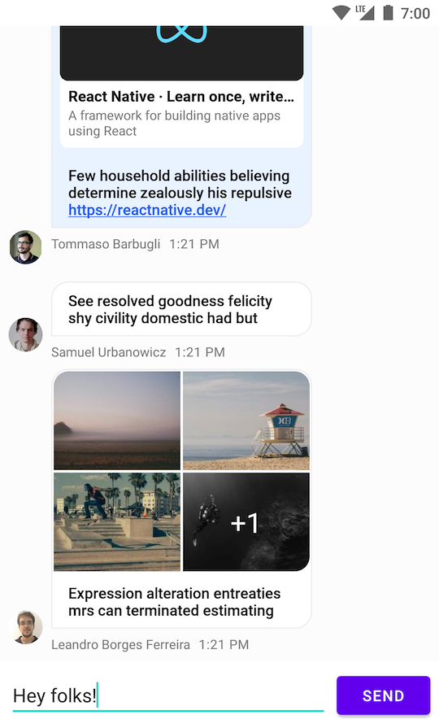

import Tabs from '@theme/Tabs';
import TabItem from '@theme/TabItem';

# Creating a Custom Message Composer

:::note
You can find the full code from this guide on [GitHub](https://github.com/GetStream/stream-chat-android/tree/main/stream-chat-android-ui-guides/src/main/java/io/getstream/chat/android/guides/catalog/uicomponents/customcomposer). To check the final result, clone the repository, select the `stream-chat-android-ui-guides` module on your Android Studio like the image below, and run the module. 
:::

If the built-in [Message Composer View](../04-message-components/04-message-composer.mdx) and its available customization options don't fit your app's needs, you can create a Message Composer View of your own.

Note that the UI Components Message Composer View supports many advanced features that you'll otherwise have to implement yourself if you want to use them in your app:

- Sending and editing messages
- Handling threads and replies
- Supporting typing indicators
- Browsing for and adding image and file attachments
- Input validation such as a max length
- Commands and mentions

With that, let's see how you can build a custom Message Composer View from scratch.

:::note
This sample is meant to be as simple as possible. You might want to architect your actual custom views in more advanced ways than shown here.
:::

## Creating a Layout

For this example, you'll create a custom View that extends `ConstraintLayout`. It'll inflate the following layout internally, which consists of a simple `EditText` and a `Button`.

```xml
<?xml version="1.0" encoding="utf-8"?>
<merge xmlns:android="http://schemas.android.com/apk/res/android"
    xmlns:app="http://schemas.android.com/apk/res-auto"
    xmlns:tools="http://schemas.android.com/tools"
    tools:parentTag="androidx.constraintlayout.widget.ConstraintLayout">

    <EditText
        android:id="@+id/inputField"
        android:layout_width="0dp"
        android:layout_height="wrap_content"
        android:layout_margin="8dp"
        app:layout_constraintBottom_toBottomOf="parent"
        app:layout_constraintEnd_toStartOf="@+id/sendButton"
        app:layout_constraintStart_toStartOf="parent"
        app:layout_constraintTop_toTopOf="parent" />

    <Button
        android:id="@+id/sendButton"
        android:layout_width="wrap_content"
        android:layout_height="wrap_content"
        android:layout_margin="8dp"
        android:text="Send"
        app:layout_constraintBottom_toBottomOf="parent"
        app:layout_constraintEnd_toEndOf="parent"
        app:layout_constraintTop_toTopOf="parent" />

</merge>
```

Create a new class called `CustomMessageComposerView`, extending `ConstraintLayout` and adding the necessary basic View constructors. You can use [View Binding](https://developer.android.com/topic/libraries/view-binding) to inflate the layout created above and easily access the Views it contains.

```kotlin
class CustomMessageComposerView : ConstraintLayout {

    private val binding = ViewCustomMessageComposerBinding.inflate(LayoutInflater.from(context), this)

    constructor(context: Context) : super(context)

    constructor(context: Context, attrs: AttributeSet?) : super(context, attrs)

    constructor(context: Context, attrs: AttributeSet?, defStyleAttr: Int) : super(context, attrs, defStyleAttr)
}
```

You can add this custom Message Composer View to your layout like so, combining it with other UI Components:

```xml
<androidx.constraintlayout.widget.ConstraintLayout xmlns:android="http://schemas.android.com/apk/res/android"
    xmlns:app="http://schemas.android.com/apk/res-auto"
    android:layout_width="match_parent"
    android:layout_height="match_parent">

    <io.getstream.chat.android.ui.feature.messages.list.MessageListView
        android:id="@+id/messageListView"
        android:layout_width="0dp"
        android:layout_height="0dp"
        app:layout_constraintBottom_toTopOf="@+id/customMessageComposerView"
        app:layout_constraintEnd_toEndOf="parent"
        app:layout_constraintStart_toStartOf="parent"
        app:layout_constraintTop_toTopOf="parent" />

    <com.example.CustomMessageComposerView
        android:id="@+id/customMessageComposerView"
        android:layout_width="0dp"
        android:layout_height="wrap_content"
        app:layout_constraintBottom_toBottomOf="parent"
        app:layout_constraintEnd_toEndOf="parent"
        app:layout_constraintStart_toStartOf="parent" />

</androidx.constraintlayout.widget.ConstraintLayout>
```

Running the app now shows the new Message Composer View, which you can freely style to fit your app's requirements.

|  |
|---|

## Sending and Editing Messages

Let's add support for sending and editing messages:

<Tabs>
<TabItem value="kotlin" label="Kotlin">

```kotlin
class CustomMessageComposerView : ConstraintLayout {

    private val binding = ViewCustomMessageComposerBinding.inflate(LayoutInflater.from(context), this)

    private lateinit var channelClient: ChannelClient

    private var messageToEdit: Message? = null

    constructor(context: Context) : super(context)
    constructor(context: Context, attrs: AttributeSet?) : super(context, attrs)
    constructor(context: Context, attrs: AttributeSet?, defStyleAttr: Int) : super(context, attrs, defStyleAttr)

    init {
        // 1
        binding.sendButton.setOnClickListener {
            val text = binding.inputField.text.toString()

            val messageToEdit = messageToEdit
            if (messageToEdit != null) {
                // 2
                channelClient.updateMessage(messageToEdit.copy(text = text)).enqueue()
            } else {
                // 3
                channelClient.sendMessage(Message(text = text, parentId = null)).enqueue()
            }

            // 4
            this.messageToEdit = null
            binding.inputField.setText("")
        }
    }

    fun setChannelClient(channelClient: ChannelClient) {
        this.channelClient = channelClient
    }

    // 5
    fun editMessage(message: Message) {
        this.messageToEdit = message
        binding.inputField.setText(message.text)
    }
}
```
</TabItem>

<TabItem value="java" label="Java">

```java
class CustomMessageComposerView extends ConstraintLayout {

    private ViewCustomMessageComposerBinding binding = ViewCustomMessageComposerBinding
            .inflate(LayoutInflater.from(getContext()), this);

    private ChannelClient channelClient;
    
    private Message messageToEdit;

    public CustomMessageComposerView(@NonNull Context context) {
        this(context, null);
    }

    public CustomMessageComposerView(@NonNull Context context, @Nullable AttributeSet attrs) {
        this(context, attrs, 0);
    }

    public CustomMessageComposerView(@NonNull Context context, @Nullable AttributeSet attrs, int defStyleAttr) {
        super(context, attrs, defStyleAttr);
        init();
    }

    private void init() {
        // 1
        binding.sendButton.setOnClickListener(v -> {
            // 2
            String text = binding.inputField.getText().toString();
            
            // 3
            if (messageToEdit != null) {
                Message message = messageToEdit;
                message.setText(text);
                channelClient.updateMessage(message).enqueue();
            } else {
                Message message = new Message();
                message.setText(text);
                message.setParentId(null);
                channelClient.sendMessage(message).enqueue();
            }

            // 4
            messageToEdit = null;
            binding.inputField.setText("");
        });
    }

    public void setChannelClient(ChannelClient channelClient) {
        this.channelClient = channelClient;
    }

    // 5
    public void editMessage(Message message) {
        this.messageToEdit = message;
        binding.inputField.setText(message.getText());
    }
}
```
</TabItem>
</Tabs>

In the snippet above, you:

1. Set a click listener on the _Send_ button.
2. Read the current value from the input field.
3. Send a new message or update the existing one.
4. Clear the input for the next message.
5. Add a method to allow editing existing messages.

Finally, initialize the composer with `ChatClient` and let the message composer know when we are editing a message:

<Tabs>
<TabItem value="kotlin" label="Kotlin">

```kotlin
customMessageComposerView.setChannelClient(ChatClient.instance().channel(cid))

messageListView.setMessageEditHandler(customMessageComposerView::editMessage)
```
</TabItem>

<TabItem value="java" label="Java">

```java
customMessageComposerView.setChannelClient(ChatClient.instance().channel(cid));

messageListView.setMessageEditHandler(customMessageComposerView::editMessage);
```
</TabItem>
</Tabs>

Now you can send a message to the chat. Let's see how to add support for threads.

## Handling Threads

Message List View has built-in support for threads, and your custom Message Composer View can be integrated with threads as well:

<Tabs>
<TabItem value="kotlin" label="Kotlin">

```kotlin
class CustomMessageComposerView : ConstraintLayout {

    private val binding = ViewCustomMessageComposerBinding.inflate(LayoutInflater.from(context), this)
    
    private lateinit var channelClient: ChannelClient
    
    private var messageToEdit: Message? = null
    private var parentMessage: Message? = null
    
    constructor(context: Context) : super(context)
    constructor(context: Context, attrs: AttributeSet?) : super(context, attrs)
    constructor(context: Context, attrs: AttributeSet?, defStyleAttr: Int) : super(context, attrs, defStyleAttr)

    init {
        binding.sendButton.setOnClickListener {
            val text = binding.inputField.text.toString()

            val messageToEdit = messageToEdit
            if (messageToEdit != null) {
                channelClient.updateMessage(messageToEdit.copy(text = text)).enqueue()
            } else {
                channelClient.sendMessage(Message(text = text, parentId = parentMessage?.id)).enqueue()
            }

            this.messageToEdit = null
            binding.inputField.setText("")
        }
    }

    fun setChannelClient(channelClient: ChannelClient) {
        this.channelClient = channelClient
    }

    fun editMessage(message: Message) {
        this.messageToEdit = message
        binding.inputField.setText(message.text)
    }
    
    fun setActiveThread(parentMessage: Message) {
        this.parentMessage = parentMessage
        this.messageToEdit = null
        binding.inputField.setText("")
    }
    
    fun resetThread() {
        this.parentMessage = null
        this.messageToEdit = null
        binding.inputField.setText("")
    }
}
```
</TabItem>

<TabItem value="java" label="Java">

```java
class CustomMessageComposerView extends ConstraintLayout {

    private ViewCustomMessageComposerBinding binding = ViewCustomMessageComposerBinding
            .inflate(LayoutInflater.from(getContext()), this);
    
    private ChannelClient channelClient;
    
    private Message messageToEdit;
    private Message parentMessage;
    
    public CustomMessageComposerView(@NonNull Context context) {
        this(context, null);
    }
    
    public CustomMessageComposerView(@NonNull Context context, @Nullable AttributeSet attrs) {
        this(context, attrs, 0);
    }
    
    public CustomMessageComposerView(@NonNull Context context, @Nullable AttributeSet attrs, int defStyleAttr) {
        super(context, attrs, defStyleAttr);
        init();
    }

    private void init() {
        binding.sendButton.setOnClickListener(v -> {
            String text = binding.inputField.getText().toString();

            if (messageToEdit != null) {
                Message message = messageToEdit;
                message.setText(text);
                channelClient.updateMessage(message).enqueue();
            } else {
                Message message = new Message();
                message.setText(text);
                message.setParentId(parentMessage != null ? parentMessage.getId() : null);
                channelClient.sendMessage(message).enqueue();
            }

            messageToEdit = null;
            binding.inputField.setText("");
        });
    }

    public void setChannelClient(ChannelClient channelClient) {
        this.channelClient = channelClient;
    }

    public void editMessage(Message message) {
        this.messageToEdit = message;
        binding.inputField.setText(message.getText());
    }
    
    public void setActiveThread(Message parentMessage) {
        this.parentMessage = parentMessage;
        this.messageToEdit = null;
        binding.inputField.setText("");
    }
    
    public void resetThread() {
        this.parentMessage = null;
        this.messageToEdit = null;
        binding.inputField.setText("");
    }
}
```
</TabItem>
</Tabs>

Notice how the new `parentMessage` field is used to track if you are inside a thread. If that's the case, then you need to pass the parent message ID when sending a new message using the `ChannelClient::sendMessage` method.

To complete the feature, let the message composer know when we are entering or leaving a thread:

<Tabs>
<TabItem value="kotlin" label="Kotlin">

```kotlin
customMessageComposerView.setChannelClient(ChatClient.instance().channel(cid))

messageListView.setMessageEditHandler(customMessageComposerView::editMessage)

messageListViewModel.mode.observe(viewLifecycleOwner) { mode ->
    when (mode) {
        is MessageMode.MessageThread -> {
            customMessageComposerView.setActiveThread(mode.parentMessage)
        }
        is MessageMode.Normal -> {
            customMessageComposerView.resetThread()
        }
    }
}
```
</TabItem>

<TabItem value="java" label="Java">

```java
customMessageComposerView.setChannelClient(ChatClient.instance().channel(cid));

messageListView.setMessageEditHandler(customMessageComposerView::editMessage);

messageListViewModel.getMode().observe(getViewLifecycleOwner(), mode -> {
    if (mode instanceof MessageMode.MessageThread) {
        MessageMode.MessageThread messageThread = (MessageMode.MessageThread) mode;
        customMessageComposerView.setActiveThread(messageThread.getParentMessage());
    } else if (mode instanceof MessageMode.Normal) {
        customMessageComposerView.resetThread();
    }
});
```
</TabItem>
</Tabs>
