# Customizing Image and Video Previews

## Introduction

The UI Components Chat SDK allows you to customize how image and video attachments are displayed.

:::note
Video thumbnails are a paid feature, with the pricing listed [here](https://getstream.io/chat/pricing/). They are enabled by default but can be turned off by setting the `ChatUI` property `videoThumbnailsEnabled` to `false`. You can read more about disabling video thumbnails in the [configuration documentation](../02-general-customization/02-chatui.mdx#disabling-video-thumbnails)
:::

## Customization

Attachments are rendered inside various Chat UI Components such as `MessageListView` or `MessageComposerView`. Different components allow you to stylize attachment rendering in different ways.

### MessageListView

Internally, `MessageListView` uses `MediaAttachmentsGroupView` to present media (image and video) attachments in a tiled manner.

By default, it looks like so:

| Default Image and Video Attachment Previews (Light Mode) | Default Image and Video Attachment Previews (Dark Mode) |
|---|---|
| 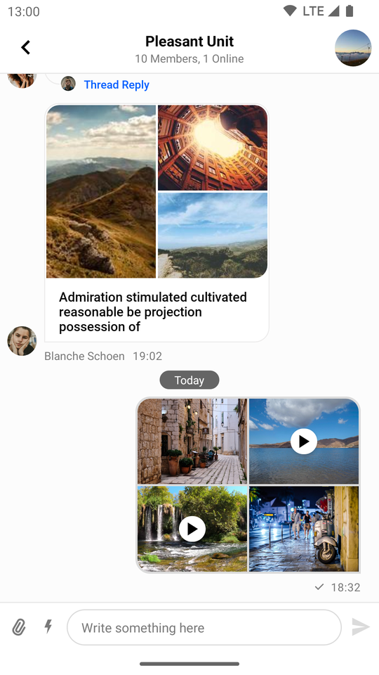 | 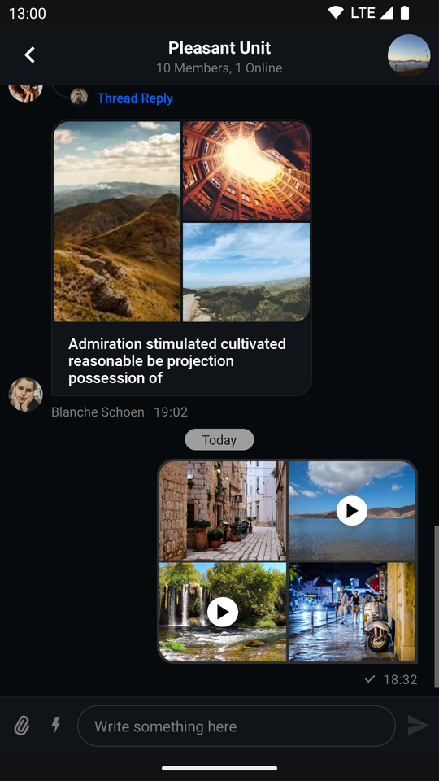 |

We'll start changing it by replacing the stock play button in favor of a flatter, semi-transparent design.

First, create a new style which will transform the design of the video icon:

```xml
<style name="StreamTheme.MediaAttachmentViewStyle" parent="@style/StreamUiTheme">
    <item name="streamUiMediaAttachmentPlayVideoIconTint">@color/stream_ui_literal_white</item>
    <item name="streamUiMediaAttachmentPlayVideoIconBackgroundColor">@color/stream_ui_literal_black</item>
    <item name="streamUiMediaAttachmentPlayVideoIconCornerRadius">10dp</item>
    <item name="streamUiMediaAttachmentPlayVideoIconElevation">0dp</item>
    <item name="streamUiMediaAttachmentPlayVideoIconPadding">6dp</item>
</style>
```

:::note
Only certain attributes were used here, you can find the rest in the [source file](https://github.com/GetStream/stream-chat-android/blob/main/stream-chat-android-ui-components/src/main/res/values/attrs_media_attachment_view.xml).
:::

Next, add it to your Stream theme:

```xml
<style name="StreamTheme" parent="@style/StreamUiTheme">
    <item name="streamUiMessageListMediaAttachmentStyle">@style/StreamTheme.MediaAttachmentViewStyle</item>
</style>
```

And finally, override `streamUiTheme`:

```xml
<style name="AppTheme" parent="Theme.MaterialComponents.DayNight.NoActionBar">
    <item name="streamUiTheme">@style/StreamTheme</item>
</style>
```

The result should look like so:

| Custom Image and Video Attachment Previews (Light Mode) | Custom Image and Video Attachment Previews (Dark Mode) |
|---|---|
| 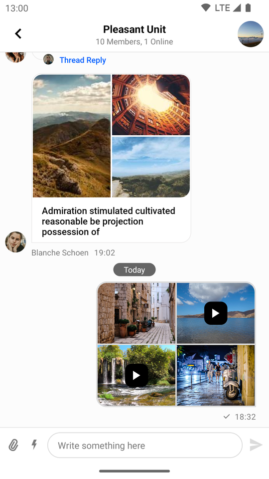 | 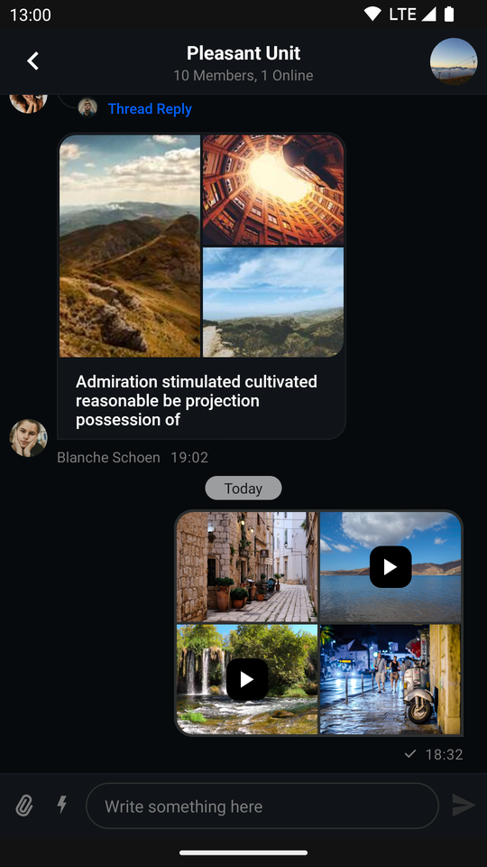 |

### MessageComposerView

By default, attachments inside `MessageComposerView` look like so:

| Default Image and Video Attachment Previews (Light Mode) | Default Image and Video Attachment Previews (Dark Mode) |
|---|---|
| 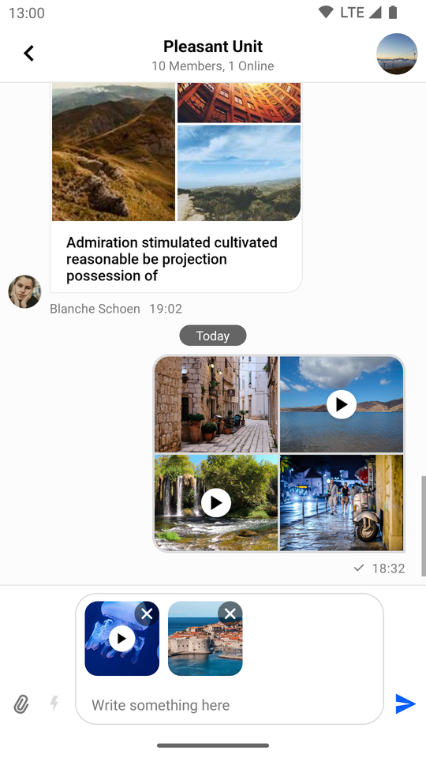 | 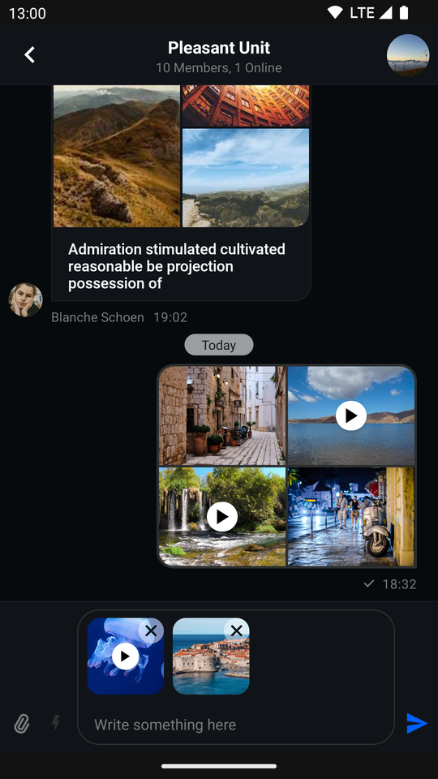 |

This component offers a more direct styling approach compared to `MessageListView`. You can simply add attributes to the `MessageComposerView` declaration in your XML layout.

All we need to do to replicate the custom UI we created for `MessageListView` is the following:

```xml {5-7}
<io.getstream.chat.android.ui.feature.messages.composer.MessageComposerView
    android:id="@+id/messageComposerView"
    android:layout_width="match_parent"
    android:layout_height="wrap_content"
    app:streamUiMessageComposerMessageInputVideoCornerRadius="10dp"
    app:streamUiMessageComposerMessageInputVideoAttachmentIconDrawableTint="@color/white"
    app:streamUiMessageComposerMessageInputVideoAttachmentIconBackgroundColor="@color/stream_ui_literal_black"
    />
```

:::note
Only certain attributes were used here, you can find the rest in the [source file](https://github.com/GetStream/stream-chat-android/blob/main/stream-chat-android-ui-components/src/main/res/values/attrs_message_composer_view.xml).
:::

Which results in the following UI:

| Custom Image and Video Attachment Previews (Light Mode) | Custom Image and Video Attachment Previews (Dark Mode) |
|---|---|
| 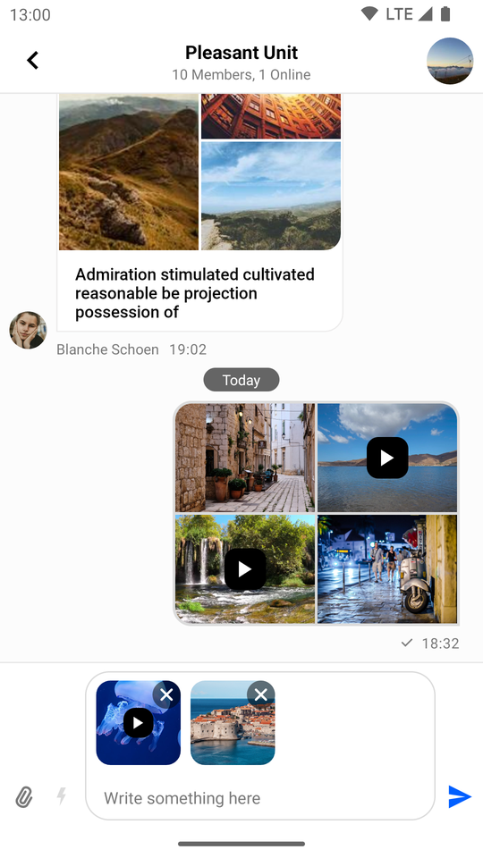 | 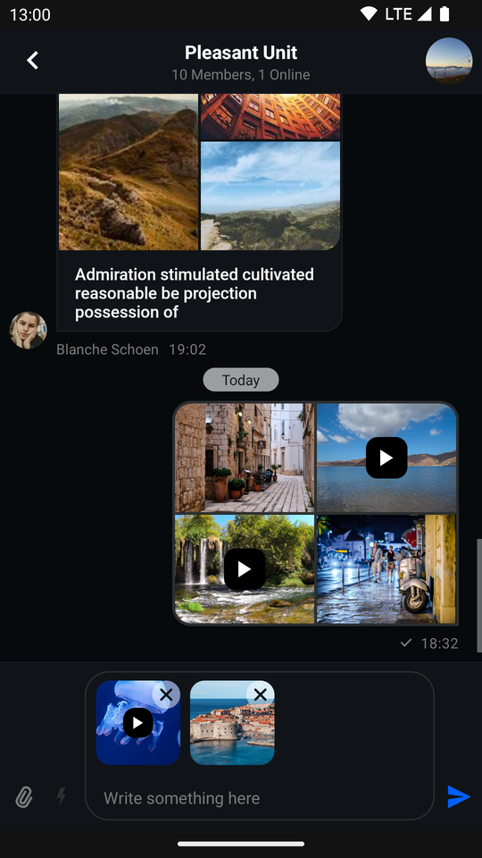 |

### Attachment Gallery

The attachment gallery is used for previewing image and video attachments. Although it is not an individual UI Component in itself, but rather a feature-complete `Activity`, it still offers a degree of customization.

The default appearance of the gallery looks like this:

| Default Image and Video Attachment Gallery (Light Mode) | Default Image and Video Attachment Gallery with Overview (Light Mode) |
|---|---|
| 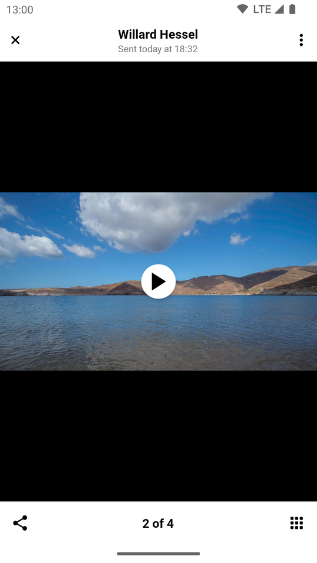 | 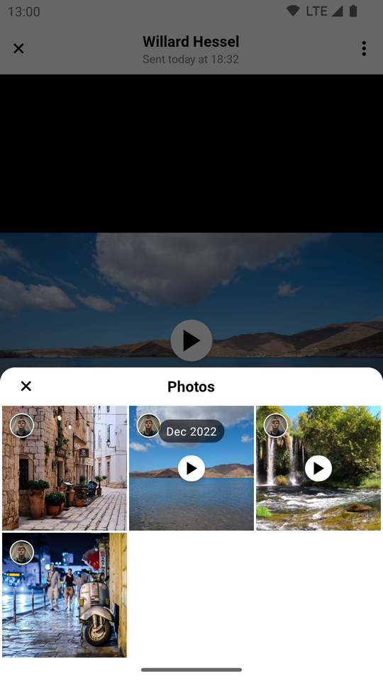 |

| Default Image and Video Attachment Gallery (Dark Mode) | Default Image and Video Attachment Gallery with Overview (Dark Mode) |
|---|---|
| 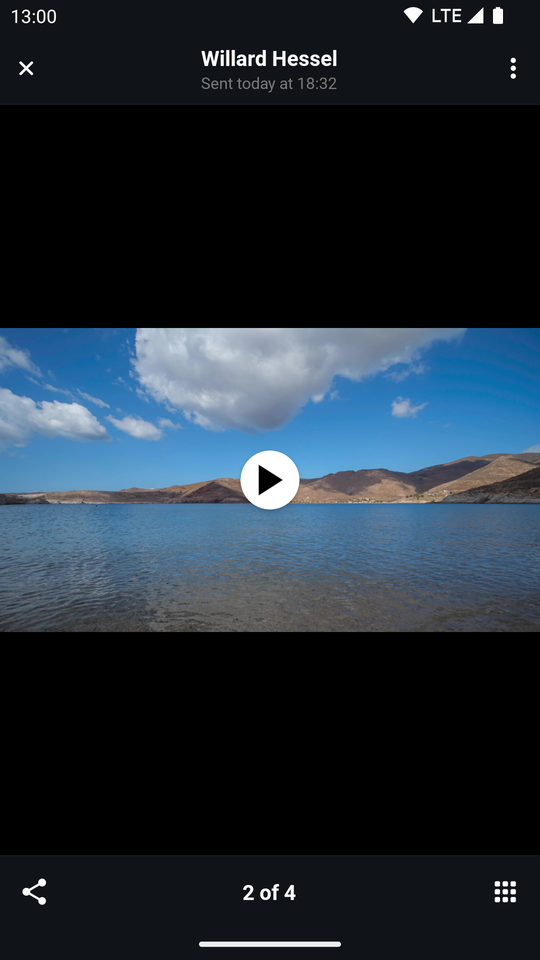 | 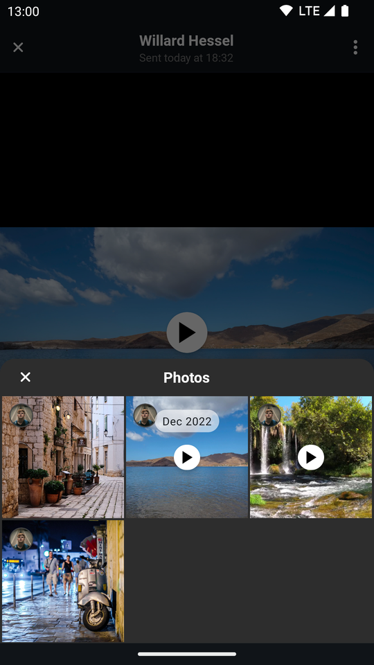 |

Let's replicate the changes we made in the previous sections.

First, create a style that changes the way video attachments are rendered inside the main viewing area of the gallery:

```xml
<style name="StreamTheme.AttachmentGalleryVideoAttachmentsStyle" parent="@style/StreamUiTheme">
    <item name="streamUiAttachmentGalleryViewMediaPlayVideoIconTint">@color/stream_ui_literal_white</item>
    <item name="streamUiAttachmentGalleryViewMediaPlayVideoIconBackgroundColor">@color/stream_ui_literal_black</item>
    <item name="streamUiAttachmentGalleryViewMediaPlayVideoIconElevation">0dp</item>
    <item name="streamUiAttachmentGalleryViewMediaPlayVideoIconCornerRadius">10dp</item>
    <item name="streamUiAttachmentGalleryViewMediaPlayVideoIconPadding">8dp</item>
</style>
```

:::note
Only certain attributes were used here, you can find the rest in the [source file](https://github.com/GetStream/stream-chat-android/blob/main/stream-chat-android-ui-components/src/main/res/values/attrs_attachment_gallery_video_attachments.xml).
:::

Second, create one that changes the way video attachments are rendered inside the overview:

```xml
<style name="StreamTheme.MediaAttachmentGridViewStyle" parent="@style/StreamUiTheme">
    <item name="streamUiMediaAttachmentGridViewPlayVideoIconTint">@color/stream_ui_literal_white</item>
    <item name="streamUiMediaAttachmentGridViewPlayVideoIconBackgroundColor">@color/stream_ui_literal_black</item>
    <item name="streamUiMediaAttachmentGridViewPlayVideoIconElevation">0dp</item>
    <item name="streamUiMediaAttachmentGridViewPlayVideoIconCornerRadius">10dp</item>
    <item name="streamUiMediaAttachmentGridViewPlayVideoIconPadding">4dp</item>
</style>
```

:::note
Only certain attributes were used here, you can find the rest in the [source file](https://github.com/GetStream/stream-chat-android/blob/main/stream-chat-android-ui-components/src/main/res/values/attrs_media_attachment_grid_view.xml).
:::

Then, add them to your Stream theme:

```xml
<style name="CustomStreamUiTheme" parent="@style/StreamUiTheme">
    <item name="streamUiAttachmentGalleryVideoAttachmentsStyle">@style/StreamTheme.AttachmentGalleryVideoAttachmentsStyle</item>
    <item name="streamUiMediaAttachmentGridViewStyle">@style/StreamTheme.MediaAttachmentGridViewStyle</item>
</style>
```

Afterwards, override `streamUiTheme` in your custom gallery `Activity` theme:

```xml
<style name="CustomAttachmentGalleryTheme" parent="StreamUi.AttachmentGallery">
    <item name="streamUiTheme">@style/CustomStreamUiTheme</item>
</style>
```

Finally, override the default attachment gallery `Activity` theme inside your manifest:

```xml
<activity
    android:name="io.getstream.chat.android.ui.feature.gallery.AttachmentGalleryActivity"
    android:theme="@style/CustomAttachmentGalleryTheme"
    tools:replace="android:theme" />
```

Now the attachment gallery should look like so:

| Custom Image and Video Attachment Gallery (Light Mode) | Custom Image and Video Attachment Gallery with Overview (Light Mode) |
|---|---|
| 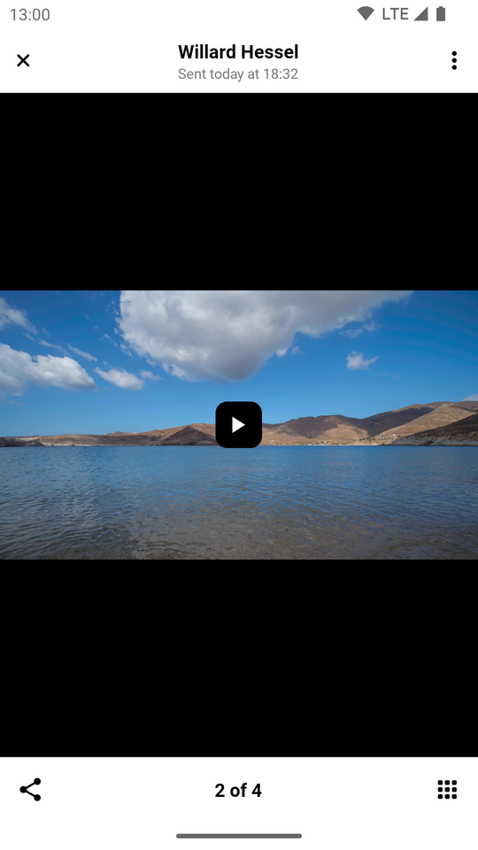 | 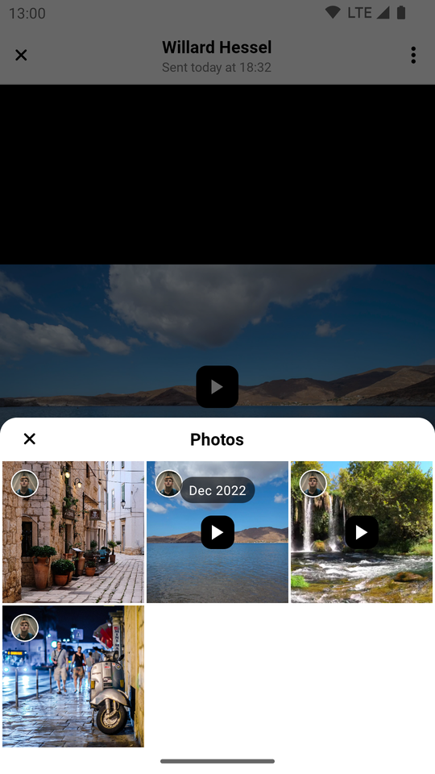 |

| Custom Image and Video Attachment Gallery (Dark Mode) | Custom Image and Video Attachment Gallery with Overview (Dark Mode) |
|---|---|
| 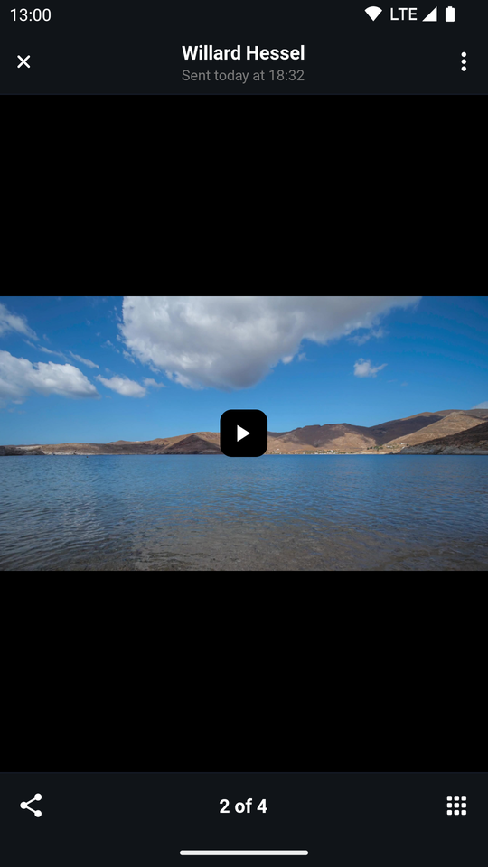 | 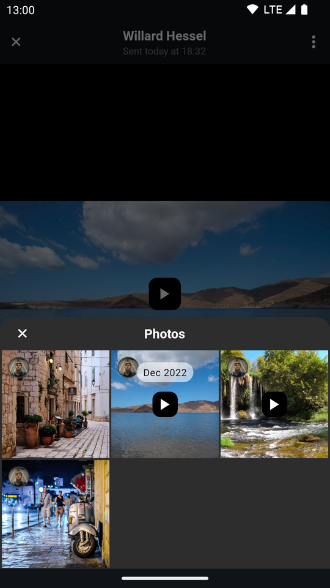 |