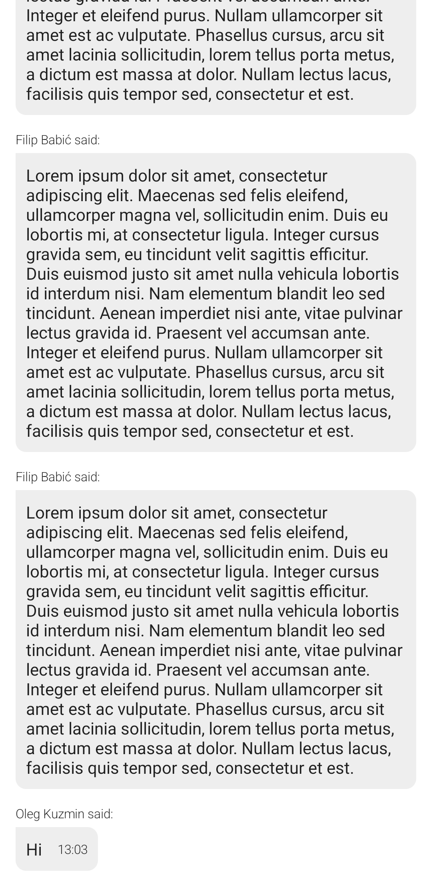

# Custom Message List

On this page you'll learn how to create a simple message list screen, without using any of our SDK's UI components. We will only use the low-level `ChatClient` for state, a completely custom view model and Jetpack Compose for the UI.



## Custom View Model

First, we create a view model that receives a `ChatClient` instance. It exposes a `uiState` property of type `StateFlow<MessageListUiState>`. This allows the UI layer to observe state changes and update the UI accordingly.

Next, we define the `getMessages(cid: String)` method. It receives the `cid` (channel id) as an argument from [the UI](#custom-ui) and calls the `chatClient.watchChannelAsState` method, passing the `cid` to it. This returns a `StateFlow<ChannelState>`, which represents the state of that specific channel. We store this state in the `channelStateFlow` variable.

Finally, we start collecting `channelStateFlow` and it's `messages: StateFlow<List<Message>>` property, and update `_uiState` accordingly.

Here is the full code for the view model:

```kotlin
class CustomMessageListViewModel(val chatClient: ChatClient = ChatClient.instance()) : ViewModel() {
    private val _uiState = MutableStateFlow(MessageListUiState())
    val uiState = _uiState.asStateFlow()

    fun getMessages(cid: String) { // cid will be provided in the UI, see section below
        val channelStateFlow: StateFlow<ChannelState?> = chatClient.watchChannelAsState(
            cid = cid,
            messageLimit = 30,
            coroutineScope = viewModelScope
        )

        viewModelScope.launch {
            channelStateFlow.collect { channelState ->
                if (channelState != null) {
                    channelState.messages.collect { messages ->
                        _uiState.update { it.copy(messages = messages, error = null) }
                    }
                } else {
                    _uiState.update { it.copy(error = "Cannot load messages") }
                }
            }
        }
    }
}

data class MessageListUiState(
    val messages: List<Message> = emptyList(),
    val error: String? = null,
)
```

## Custom UI

For the UI, we create a composable called `CustomMessageListScreen` that gets the view model that we defined in the [previous section](#custom-view-model) and the `cid` (channel id) as parameters.

:::note
The `cid` (channel id) is usually provided when the app navigates from a [channel list screen](02-custom-channel-list.mdx) to a message list screen, like we have here.
:::

The composable then starts observing our view model's `uiState: StateFlow` property for changes and triggers message list loading by calling the view model's `getMessages` method with the channel `cid`.

Next, we pass the state to other functions to build the appropriate UI.

```kotlin
@Composable
fun CustomMessageListScreen(
    viewModel: CustomMessageListViewModel = viewModel(), // We use a custom view model, see section above
    cid: String?,
) {
    val uiState by viewModel.uiState.collectAsStateWithLifecycle()

    LaunchedEffect(key1 = Unit) { cid?.let { viewModel.getMessages(it) } }

    if (uiState.error == null) {
        CustomMessageList(messages = uiState.messages)
    } else {
        Error(message = uiState.error!!)
    }
}
```

The other composable functions used to create the screen are listed below:
```kotlin
@Composable
private fun CustomMessageList(messages: List<Message>) {
    LazyColumn(
        modifier = Modifier.fillMaxSize(),
        contentPadding = PaddingValues(all = 15.dp),
        verticalArrangement = Arrangement.spacedBy(15.dp),
        reverseLayout = true,
    ) {
        items(messages) { message ->
            if (message.text != "") CustomMessageListItem(message = message)
        }
    }
}

@Composable
private fun CustomMessageListItem(message: Message) {
    val timeFormat = SimpleDateFormat("HH:mm", Locale.getDefault())

    Column {
        Text(text = "${message.user.name} said:", fontSize = 12.sp, fontWeight = FontWeight.Light)
        Spacer(modifier = Modifier.height(5.dp))
        Row(
            horizontalArrangement = Arrangement.SpaceBetween,
            verticalAlignment = Alignment.CenterVertically,
            modifier = Modifier
                .background(
                    color = Color(0xFFEEEEEE),
                    shape = RoundedCornerShape(topStart = 0.dp, topEnd = 10.dp, bottomEnd = 10.dp, bottomStart = 10.dp)
                )
                .padding(all = 10.dp)
        ) {
            Text(text = message.text)
            Spacer(modifier = Modifier.width(15.dp))
            message.createdAt?.let {
                Text(text = timeFormat.format(it), fontSize = 12.sp, fontWeight = FontWeight.Light)
            }
        }
    }
}

@Composable
private fun Error(message: String) {
    Box(
        modifier = Modifier.fillMaxSize(),
        contentAlignment = Alignment.Center
    ) {
        Text(text = message)
    }
}
```

## Paginating Messages

#### Check if the message list is scrolled to the end 

To create simple pagination for the message list, we first extend the `LazyListState` class with a composable function named `OnListEndReached`.

This function takes two parameters: `buffer` and `handler`. `handler` is a lambda that will be executed when the end of the list (considering the `buffer`) is reached.

Inside the function, a `derivedStateOf` block is used to create a boolean state that determines whether `handler` should be called. This state, named `shouldCallHandler`, is _true_ when the index of the last visible item equals the total number of items minus the buffer.

Finally, a `LaunchedEffect` block is used to call the handler function when `shouldCallHandler` is _true_. This effect is re-launched every time `shouldCallHandler` changes. In other words, `handler` will be called every time the user scrolls the list to its end (considering the buffer).

```kotlin
@Composable
fun LazyListState.OnListEndReached(buffer: Int = 0, handler: () -> Unit) {
    val shouldCallHandler by remember {
        derivedStateOf {
            layoutInfo.visibleItemsInfo.lastOrNull()?.let { lastVisibleItem ->
                lastVisibleItem.index == layoutInfo.totalItemsCount - 1 - buffer
            } ?: false
        }
    }

    LaunchedEffect(shouldCallHandler) {
        if (shouldCallHandler) handler()
    }
}
```

#### Load more messages in the View Model

In order to support pagination, we must add a method to the View Model that will load more messages when the list reaches the end. In our case, we'll fetch older messages:

```kotlin
fun loadMoreMessages(cid: String) {
    chatClient.loadOlderMessages(cid = cid, messageLimit = 30).enqueue(
        onError = { streamError ->
            Log.e("[Messages]", "Cannot load more messages. Error: ${streamError.message}")
        }
    )   
}
```

#### Put everything together in the UI

To make it work, we just need to make a few changes to the UI.

We add a new lambda parameter named `onListEndReached` to the `CustomMessageList` composable and we use the list state `OnListEndReached` extension method what we created earlier:

```kotlin
private fun CustomMessageList(messages: List<Message>, onListEndReached: () -> Unit) {
    val listState = rememberLazyListState()
    listState.OnListEndReached(buffer = 5, handler = onListEndReached)

    LazyColumn(
        // ...
        state = listState,
        // ...
    ) {
        // ...
    }
}
```

In `CustomMessageListScreen`, we call the view model method that loads more messages when the `onListEndReached` lambda is called:

```kotlin
// ...
CustomMessageList(
    // ...
    onListEndReached = { cid?.let { viewModel.loadMoreMessages(it) } }
)
//...
```

Now, when the user scrolls to the end of the list, older messages will be loaded.

:::note
There might be edge cases that are not covered by this pagination implementation. Its purpose is to demonstrate how more messages can be fetched in a pagination scenario. Make sure you test your production implementation.
:::

## More Resources
<!-- TODO link to State plugin (explain watchChannelAsState) -->

If you want to learn how to use and customize our Compose UI Components, see [this](../compose/overview.mdx) page.