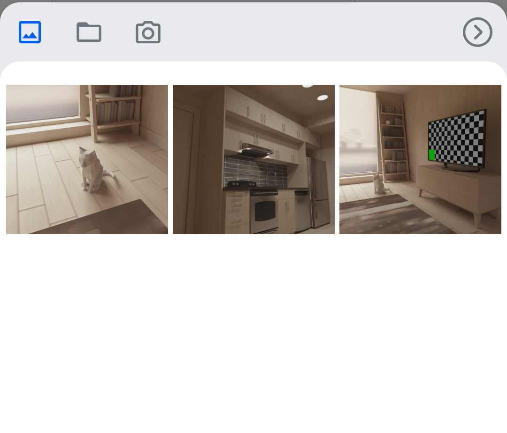
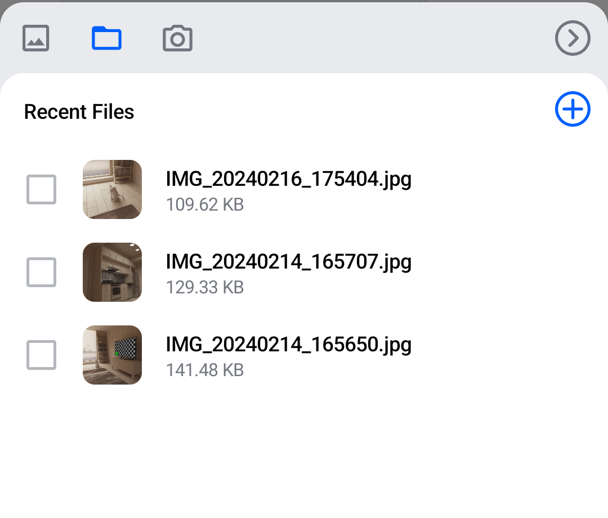
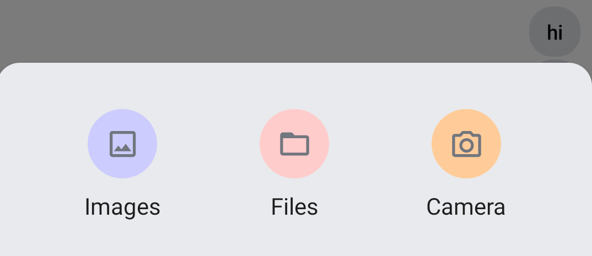
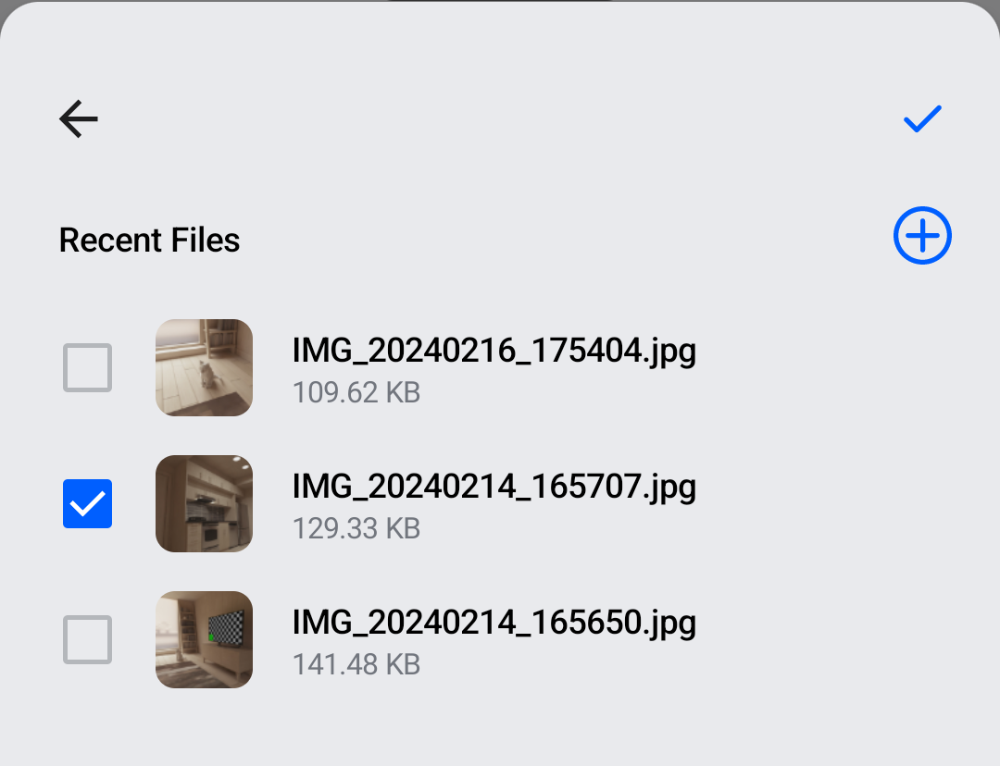

# Custom Attachments Picker

The `AttachmentsPicker` component allows users to pick media, files or capture media attachments. You can find more info about it [here](../compose/message-components/attachments-picker.mdx).

By default, it looks like below:

| Default - _Images_ tab selected                                           | Default - _Files_ tab selected                                            |
|---------------------------------------------------------------------------|---------------------------------------------------------------------------|
|  |  |

When we're done, our custom attachments picker will look this this:

| Custom - Attachment type menu                                            | Custom - File picker with _Back_ and _Submit_                            |
|--------------------------------------------------------------------------|--------------------------------------------------------------------------|
|  |  |

Although `AttachmentsPicker` can be customized extensively, as you can read [here](../compose/message-components/attachments-picker.mdx#customization), for this example we'll create our own component. We'll mostly keep the signature of the standard `AttachmentsPicker` and rely on the default `tabFactories` parameter value to show pickers for several attachments types (_Images_, _Files_, _Camera_).

## Main Composable

Let's define the main composable for our custom attachment picker. Notice that it expects an `AttachmentsPickerViewModel`, which is part of our SDK. Also, notice the usage of `ChatTheme.attachmentsPickerTabFactories` as a default value for the `tabFactories` parameter. It provides the standard selector content for _Images_, _Files_ and _Camera_ attachment type.

```kotlin
@Composable
private fun CustomAttachmentsPicker(
    attachmentsPickerViewModel: AttachmentsPickerViewModel,
    onAttachmentsSelected: (List<Attachment>) -> Unit,
    onDismiss: () -> Unit,
    tabFactories: List<AttachmentsPickerTabFactory> = ChatTheme.attachmentsPickerTabFactories,
) {
    var shouldShowMenu by remember { mutableStateOf(true) }
    var selectedOptionIndex by remember { mutableStateOf(-1) }

    Box( // Gray overlay
        modifier = Modifier
            .fillMaxSize()
            .background(ChatTheme.colors.overlay)
            .clickable(
                onClick = onDismiss,
                indication = null,
                interactionSource = remember { MutableInteractionSource() },
            ),
    ) {
        Card(
            modifier = Modifier
                .heightIn(max = 350.dp)
                .align(Alignment.BottomCenter)
                .clickable(
                    indication = null,
                    onClick = {},
                    interactionSource = remember { MutableInteractionSource() },
                ),
            elevation = 4.dp,
            shape = ChatTheme.shapes.bottomSheet,
            backgroundColor = ChatTheme.colors.inputBackground,
        ) {
            Box(modifier = Modifier.padding(vertical = 24.dp)) {
                if (shouldShowMenu) {
                    // Show the menu with Images, Files, Camera options
                    // See implementation in dedicated section below
                    AttachmentsTypeMenu(
                        tabFactories = tabFactories,
                        onClick = {
                            selectedOptionIndex = it
                            shouldShowMenu = false
                        },
                    )
                } else {
                    // Show the selected tabFactory content, with a back and submit buttons toolbar
                    Column(
                        modifier = Modifier.padding(horizontal = 8.dp),
                    ) {
                        // See implementation in dedicated section below
                        AttachmentsPickerToolbar(
                            onBackClick = {
                                shouldShowMenu = true
                                selectedOptionIndex = -1
                            },
                            isSubmitEnabled = attachmentsPickerViewModel.hasPickedAttachments,
                            onSubmitClick = {
                                onAttachmentsSelected(attachmentsPickerViewModel.getSelectedAttachments())
                            },
                        )

                        tabFactories.getOrNull(selectedOptionIndex)
                            ?.PickerTabContent(
                                onAttachmentPickerAction = { pickerAction ->
                                    when (pickerAction) {
                                        AttachmentPickerBack -> onDismiss.invoke()
                                        AttachmentPickerPollCreation -> Unit
                                    }
                                },
                                attachments = attachmentsPickerViewModel.attachments,
                                onAttachmentItemSelected = attachmentsPickerViewModel::changeSelectedAttachments,
                                onAttachmentsChanged = { attachmentsPickerViewModel.attachments = it },
                                onAttachmentsSubmitted = {
                                    onAttachmentsSelected(attachmentsPickerViewModel.getAttachmentsFromMetaData(it))
                                },
                            )
                    }
                }
            }
        }
    }
}
```

## Attachment Type Menu

The attachment type menu (_Images_, _Files_, _Camera_) is drawn by a simple composable that shows a menu item for each `tabFactory`.

```kotlin
@Composable
private fun AttachmentsTypeMenu(
    tabFactories: List<AttachmentsPickerTabFactory>,
    onClick: (Int) -> Unit,
) {
    Row(
        modifier = Modifier.fillMaxWidth(),
        horizontalArrangement = Arrangement.SpaceEvenly,
        verticalAlignment = Alignment.CenterVertically,
    ) {
        tabFactories.forEachIndexed { index, tabFactory ->
            AttachmentsTypeMenuItem(
                tabFactory = tabFactory,
                isEnabled = tabFactory.isPickerTabEnabled(),
                index = index,
                onClick = onClick,
            )
        }
    }
}
```

Each menu item is represented by a circle with a label underneath. So we need a `Column`, a circle-shaped `Box` with a certain background color, and a `Text`.

```kotlin
@Composable
private fun AttachmentsTypeMenuItem(
    tabFactory: AttachmentsPickerTabFactory,
    isEnabled: Boolean,
    index: Int,
    onClick: (Int) -> Unit,
) {
    Column(
        modifier = Modifier.clickable(enabled = isEnabled) { onClick(index) },
        horizontalAlignment = Alignment.CenterHorizontally,
    ) {
        val backgroundColor: Color
        val label: String

        when (tabFactory.attachmentsPickerMode) {
            is Images -> {
                backgroundColor = Color(0xFFCCCCFF)
                label = "Images"
            }
            is Files -> {
                backgroundColor = Color(0xFFFFCCCC)
                label = "Files"
            }
            is MediaCapture -> {
                backgroundColor = Color(0xFFFFCC99)
                label = "Camera"
            }
            else -> {
                backgroundColor = Color.LightGray
                label = "Other"
            }
        }

        Box(
            modifier = Modifier
                .padding(8.dp)
                .size(48.dp)
                .background(backgroundColor, shape = CircleShape),
            contentAlignment = Alignment.Center,
        ) {
            tabFactory.PickerTabIcon(isEnabled, isSelected = false)
        }
        Text(text = label)
    }
}
```

## Picker Toolbar

Above each picker, we draw a toolbar with _Back_ and _Submit_ buttons. _Back_ navigates to the menu and _Submit_ attaches the selected file to the message contents.

```kotlin
@Composable
private fun AttachmentsPickerToolbar(
    onBackClick: () -> Unit,
    isSubmitEnabled: Boolean,
    onSubmitClick: () -> Unit,
) {
    Row(
        modifier = Modifier.fillMaxWidth(),
        horizontalArrangement = Arrangement.SpaceBetween
    ) {
        IconButton(onClick = onBackClick) {
            Icon(
                painter = painterResource(id = R.drawable.ic_back),
                contentDescription = "Back",
                modifier = Modifier.size(24.dp),
            )
        }
        IconButton(
            enabled = isSubmitEnabled,
            onClick = onSubmitClick
        ) {
            Icon(
                painter = painterResource(id = R.drawable.ic_check),
                contentDescription = "Submit Attachments",
                modifier = Modifier.size(24.dp),
                tint = if (isSubmitEnabled) {
                    ChatTheme.colors.primaryAccent
                } else {
                    ChatTheme.colors.textLowEmphasis
                },
            )
        }
    }
}
```

## Usage

We'll place our custom attachments picker in a screen that contains other components, like a header, a messages list and a message composer. We'll also use the `BackHandler` standard component.

In order to show the attachments picker, we'll use an `isShowingAttachments` flag. We'll wrap all components in a `Box`, so that the attachments picker appears on top of other content.

```kotlin
fun CustomScreen(cid: String, onBackClick: () -> Unit = {}) {
    val viewModelFactory = MessagesViewModelFactory(LocalContext.current, channelId = cid)
    val listViewModel = viewModel(modelClass = MessageListViewModel::class.java, factory = viewModelFactory)
    val composerViewModel = viewModel(modelClass = MessageComposerViewModel::class.java, factory = viewModelFactory)
    val attachmentsPickerViewModel = viewModel(modelClass = AttachmentsPickerViewModel::class.java, factory = viewModelFactory)
    
    val isShowingAttachments = attachmentsPickerViewModel.isShowingAttachments

    val backAction = remember(composerViewModel, attachmentsPickerViewModel) {
        {
            // First close the attachments picker, if visible, then call onBackClick
            when {
                attachmentsPickerViewModel.isShowingAttachments -> {
                    attachmentsPickerViewModel.changeAttachmentState(false)
                }
                else -> onBackClick()
            }
        }
    }
    BackHandler(enabled = true, onBack = backAction) // Standard SDK component

    Box(modifier = Modifier.fillMaxSize(), contentAlignment = Alignment.BottomCenter) {
        // Screen content
        Scaffold(
            topBar = {
                // MessageListHeader
            },
            bottomBar = {
                // MessageComposer
            },
            content = {
                // MessageList
            }
        )

        // Attachments picker
        if (isShowingAttachments) {
            CustomAttachmentsPicker(
                attachmentsPickerViewModel = attachmentsPickerViewModel,
                onAttachmentsSelected = { attachments ->
                    attachmentsPickerViewModel.changeAttachmentState(false)
                    composerViewModel.addSelectedAttachments(attachments)
                },
                onDismiss = {
                    attachmentsPickerViewModel.changeAttachmentState(false)
                    attachmentsPickerViewModel.dismissAttachments()
                }
            )
        }
    }
}
```

## More Resources
If you want to learn how to use our Compose UI Components, see [this](../compose/overview.mdx) page.

Also, check the other pages in this Cookbook to find out how to create custom versions of our components.