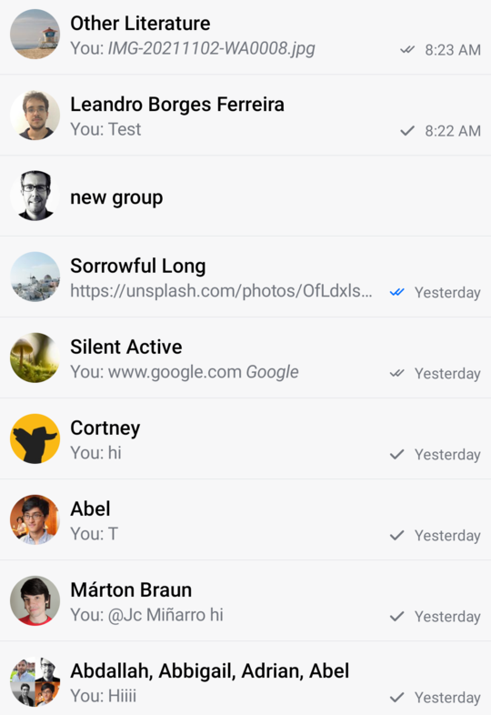
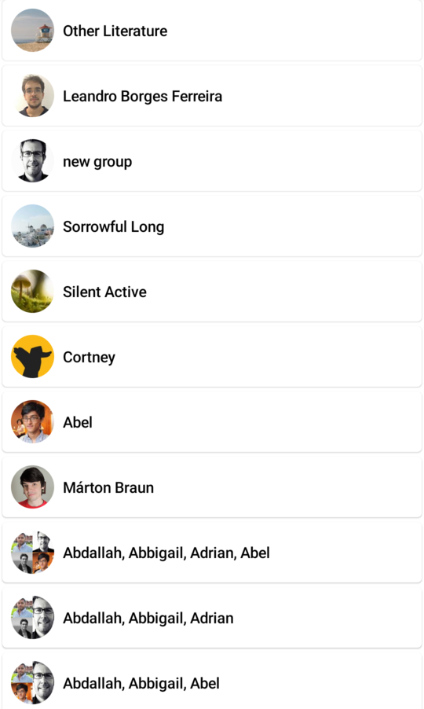

# Channel Items

The `ChannelItem` component represents the `ChannelList` items that are shown by default if you don't customize its `channelContent`.

However, you can also use the `ChannelItem` and customize its Slot APIs, in case you want only to replace a specific part of the default UI.

:::note
The `ChannelItem` is great if you want the default UI or replace specific slots, when building a `ChannelList`.
:::

Let's see how to use and customize this component.

## Usage

To use the `ChannelItem`, it's best to override the `channelContent` parameter in the `ChannelList` and use it for the channel items:

```kotlin
val listViewModel: ChannelListViewModel by viewModels { ChannelViewModelFactory() }

override fun onCreate(savedInstanceState: Bundle?) {
    super.onCreate(savedInstanceState)

    setContent {
        val user by listViewModel.user.collectAsState() // Fetch user

        ChatTheme {
            ChannelList(
                channelContent = { channelItem -> // Customize the channel items
                    ChannelItem(
                        channelItem = channelItem,
                        currentUser = user,
                        onChannelClick = {},
                        onChannelLongClick = {}
                    )
                }
            )
        }
    }
}
```

This is a very basic and crude example of a `ChannelList`, where you override the `channelContent`.

The snippet above will generate the following UI.

||
|---|

To fully utilize the `ChannelItem` let's see how to handle its actions and how to customize its Slot APIs.

## Handling Actions

The `ChannelItem` signature exposes the following actions that can be intercepted:

```kotlin
@Composable
fun ChannelItem(
    ..., // State and UI customization
    onChannelClick: (Channel) -> Unit,
    onChannelLongClick: (Channel) -> Unit,
)
```

* `onChannelClick`: Handler when the user taps on an item. Useful for starting the `MessagesScreen`.
* `onChannelLongClick`: Handler when the user long taps on an item. Use it to control state changes when the user selects a `Channel` in the list.

Here's an example of using the default component, but overriding the behavior:

```kotlin
val listViewModel: ChannelListViewModel by viewModels { ChannelViewModelFactory() }

override fun onCreate(savedInstanceState: Bundle?) {
    super.onCreate(savedInstanceState)

    setContent {
        val user by listViewModel.user.collectAsState() // Fetch user
        
        ChatTheme {
            ChannelList(
                channelContent = { channelItem ->
                    ChannelItem(
                        channelItem = channelItem,
                        currentUser = user,
                        onChannelLongClick = {
                            listViewModel.selectChannel(it)
                        },
                        onChannelClick = {
                            // Start the MessagesScreen
                        },
                    )
                }
            )
        }
    }
}
```

In the example above, we customized `onChannelLongClick`  and `onChannelClick` handlers to show the messages screen when the user taps on an item and store the selected channel state in the `ViewModel`, on long taps.

This way, you get more control over what happens when the user interacts with the items, but you still have the default UI that you don't have to implement yourself.

Read on to learn how to customize the UI.

## Customization

If you're looking to customize the UI of the `ChannelItem`, there are a few ways you can do so, as per the signature:

```kotlin
@Composable
fun ChannelItem(
    ..., // State and action handlers
    modifier: Modifier = Modifier,
    leadingContent: @Composable RowScope.(ItemState.ChannelItemState) -> Unit = { ... },
    centerContent: @Composable RowScope.(ItemState.ChannelItemState) -> Unit = { ... },
    trailingContent: @Composable RowScope.(ItemState.ChannelItemState) -> Unit = { ... },
)
```

* `modifier`: The modifier for the root component. You can apply a background, elevation, padding, shape, touch handlers and much more.
* `leadingContent`: Customizable composable that allows you to override the content that appears at the start of the list item. By default, it represents a `ChannelAvatar`.
* `centerConent`: Customizable composable that allows you to override the center part of the list item. By default, it represents channel details that show its name and the last message preview.
* `trailingContent`: Customizable composable that allows you to override the content that appears at the end of the list item. By default, it represents the information section that shows the unread message indicator if there are unread messages and the last message read state.

Here's a simple example for building your own channel item, by overriding the mentioned parameters:

```kotlin
val listViewModel: ChannelListViewModel by viewModels { ChannelViewModelFactory() }

override fun onCreate(savedInstanceState: Bundle?) {
    super.onCreate(savedInstanceState)

    setContent {
        val user by listViewModel.user.collectAsState() // Fetch user

        ChatTheme {
            ChannelList(
                channelContent = { channelItem -> // Customize the channel items
                    CustomChannelListItem(channelItem = channelItem, user = user)
                }
            )
        }
    }
}

@Composable
fun CustomChannelListItem(channelItem: ItemState.ChannelItemState, user: User?) {
    ChannelItem(
        channelItem = channelItem,
        currentUser = user,
        onChannelLongClick = {},
        onChannelClick = {},
        trailingContent = { // Replace the trailing content with a spacer
            Spacer(modifier = Modifier.width(8.dp))
        },
        centerContent = { // Replace the details content with a simple Text
            Text(
                text = ChatTheme.channelNameFormatter.formatChannelName(it.channel, user),
                style = ChatTheme.typography.bodyBold,
                color = ChatTheme.colors.textHighEmphasis
            )
        }
    )
}
```

As you can see, it's very easy to override and completely replace the Slot APIs in our `ChannelItem`. In the example, you replaced the `trailingContent` with a simple `Spacer` for some padding and the `centerContent` with a `Text` that shows the channel name.

The snippet above will generate the following UI:

||
|---|

It was really easy to provide a completely custom UI for the channel items while still keeping the same functionality and actions of the rest of the screen.
