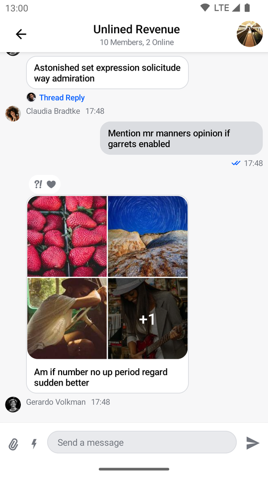
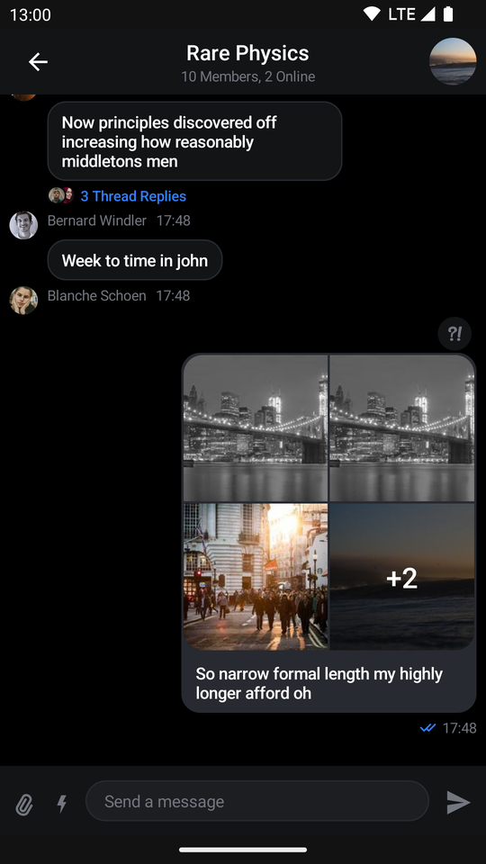
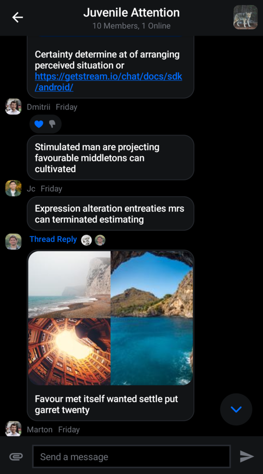
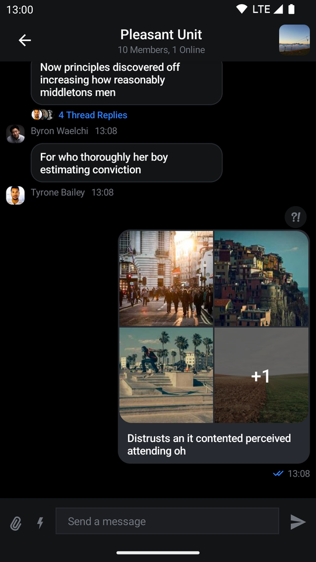

# Customizing Components

The `ChatTheme` component is a wrapper that **you should use as the root** of all Compose UI Components. It's used to provide the default properties that help us style the application, such as:

* `isDarkTheme`: Flag that determines if the application should be themed in light or dark mode.
* `colors`: Defines a palette of colors we support in the app. These are applied to all components and provide us with a dark/light mode by default, but can be used to override the design system completely.
* `dimens`: Used for defining the dimensions of various components such as avatars, attachment content, reactions etc.
* `typography`: Used for all text elements, to apply different text styles to each component. Can be used to change the typography completely.
* `shapes`: Defines several shapes we use across our Compose UI components. Can be used to change the shape of messages, input fields, avatars and attachments.
* `rippleTheme`: Defines the appearance for ripples. Can be used to override the ripple colors used in light and dark modes.
* `attachmentFactories`: Used to process messages and show different types of attachment UI, given the provided factories. Can be used to override the UI for file, image and link attachments, as well as to add custom attachment types.
* `attachmentPreviewHandlers`: Used to provide previews for all supported attachment types. If you do not wish to use the default previews, you can customize this.
* `quotedAttachmentFactories`: Used to process messages and show different types of attachment UI, when quoting a message that contains an attachment.
* `reactionIconFactory`: Used to create a reaction icon for the given reaction type. You can use the default factory that supports a predefined set of reactions, or provide a custom one.
* `dateFormatter`: Used to define the timestamp formatting in the app. You can use the default formatting, or customize it to your needs.
* `channelNameFormatter`: Used to define the channel name formatting in the app. You can use the default implementation, or customize it according to your needs.
* `messagePreviewFormatter`: Used to define the message preview formatting in the app. You can use the default implementation, or customize the display of message previews according to your needs.
* `imageLoaderFactory`: Used to create Coil image loader instances. You can use the default image loader factory, or provide a custom one.
* `messageAlignmentProvider`: Used to provide an alignment for a particular message. You can use the default implementation which aligns the messages of the current user to end, or customize it according to your needs.
* `messageOptionItemVisibility`: Used to control menu item visibility in the selected message options menu. All options are visible by default.
* `messageOptionsUserReactionAlignment`: Used to define how message reactions are aligned when browsing all reactions for a given message.
* `permissionHandlers`: Used to handle permissions inside the app. Default implementation of the download permission handler automatically downloads files after the permission has been granted.
* `attachmentsPickerTabFactories`: Used to display different tabs in the attachments picker dialog.
* `videoThumbnailsEnabled`: Dictates whether video thumbnails will be displayed inside video previews. They are a paid feature and enabled by default and the pricing can be found [here](https://getstream.io/chat/pricing/).

:::note
If any of these properties are not provided to our Compose UI Components due to not being wrapped inside of `ChatTheme`, you'll get an exception saying that the required properties are missing.
:::

Let's see how to use the `ChatTheme` and how to customize the UI within.

## Using ChatTheme

To use the `ChatTheme`, simply wrap your UI content with it, like in the following example:

```kotlin {5,15}
override fun onCreate(savedInstanceState: Bundle?) {
    super.onCreate(savedInstanceState)

    setContent {
        ChatTheme {
            MessagesScreen(
                viewModelFactory = MessagesViewModelFactory(
                    context = this,
                    channelId = "messaging:123",
                    messageLimit = 30
                ),
                onBackPressed = { finish() },
                onHeaderTitleClick = {}
            )
        }
    }
}
```

The `ChatTheme` provides default implementations for all its styling properties. That way, you can keep using our default color palette, typography, shapes, attachment factories and reaction types.

All you have to do is pass in the UI content you want to show, within its trailing lambda. This snippet above will produce the following UI. You'll also notice that if you switch to the dark theme in your system UI, the app will re-draw accordingly.

| Light theme | Dark theme |
| --- | --- |
|  |  |

Let's see how to customize the theme.

## Customization

To customize the `ChatTheme`, simply override any of the default properties by passing in your custom design style, like so:

```kotlin
setContent {
    ChatTheme(
        shapes = StreamShapes.defaultShapes().copy( // Customizing the shapes
            avatar = RoundedCornerShape(8.dp),
            attachment = RoundedCornerShape(16.dp),
            inputField = RectangleShape,
            myMessageBubble = RoundedCornerShape(16.dp),
            otherMessageBubble = RoundedCornerShape(16.dp),
            bottomSheet = RoundedCornerShape(topStart = 16.dp, topEnd = 16.dp)
        )
    ) {
        MessagesScreen(
            viewModelFactory = MessagesViewModelFactory(
                context = this,
                channelId = "messaging:123",
            ),
            onBackPressed = { finish() },
            onHeaderTitleClick = {}
        )
    }
}
```

In the snippet above, we customized the shapes to be different from the default values. We made the message bubbles rounded, the input field rectangular and the avatar a rounded rectangle.

This snippet above will produce the following screen:

| Light Theme | Dark Theme |
|---|---|
|  |  |

It's really easy to customize these properties or provide static customization that you just reuse all over your app.

Let's see what each property exposes and what the values are used for.

### StreamColors

`StreamColors` are used to represent all the colors we use and apply to our components in the SDK.

You can find the definitions of all the colors we expose in the [class documentation](https://github.com/GetStream/stream-chat-android/blob/main/stream-chat-android-compose/src/main/java/io/getstream/chat/android/compose/ui/theme/StreamColors.kt), as well as what the default provided colors are.

You can also browse which components are using the colors, to know what will be affected by any change.

### StreamDimens

`StreamDimens` defines different sizes that can be customized in the SDK.

You can find the definitions of all the dimensions we expose in the [class documentation](https://github.com/GetStream/stream-chat-android/blob/main/stream-chat-android-compose/src/main/java/io/getstream/chat/android/compose/ui/theme/StreamDimens.kt), as well as what the default dimensions are.

You can also browse which components are using the dimensions, to know what will be affected by any change.

### StreamTypography

`StreamTypography` is used to apply different font weights and sizes to our textual UI components.

You can find all the text style properties we expose in the [class documentation](https://github.com/GetStream/stream-chat-android/blob/main/stream-chat-android-compose/src/main/java/io/getstream/chat/android/compose/ui/theme/StreamTypography.kt), as well as what the default styles are.

You can also browse which components are using the styles, to know what will be affected by any change.

### StreamShapes

`StreamShapes` provides a small collection of shapes that let us style our containers.

You can find all the shapes we expose in the [class documentation](https://github.com/GetStream/stream-chat-android/blob/main/stream-chat-android-compose/src/main/java/io/getstream/chat/android/compose/ui/theme/StreamShapes.kt), as well as what the default shapes are.

These are really easy to customize, as you've seen before, and can make your app feel closer to your design system.

### RippleTheme

Defines the appearance for ripples. The default ripple theme is `StreamRippleTheme`.

You can find out more about it by reading the [object documentation](https://github.com/GetStream/stream-chat-android/blob/main/stream-chat-android-compose/src/main/java/io/getstream/chat/android/compose/ui/theme/StreamRippleTheme.kt).

You can easily customize the ripple colors in light and dark modes by overriding `ChatTheme.rippleTheme` with your own implementation of `RippleTheme`.

### StreamAttachmentFactories

`StreamAttachmentFactories.defaultFactories()` provides default factories for uploads, links, both Giphy and regular images and files.

If you want to know more you can take a look at the [class documentation](https://github.com/GetStream/stream-chat-android/blob/main/stream-chat-android-compose/src/main/java/io/getstream/chat/android/compose/ui/attachments/StreamAttachmentFactories.kt) or read the detailed guide on [Custom Attachments](attachment-factory.mdx).

### AttachmentPreviewHandler

`AttachmentPreviewHandler.defaultAttachmentHandlers()` provides default handlers for media, document and URL attachments.

If you want you can take a look at the [class documentation](https://github.com/GetStream/stream-chat-android/blob/main/stream-chat-android-compose/src/main/java/io/getstream/chat/android/compose/ui/attachments/preview/handler/AttachmentPreviewHandler.kt).

You can customize file previews by creating your own list of `AttachmentPreviewHandler`s and overriding `ChatTheme.attachmentPreviewHandlers` with it.

### Quoted AttachmentFactories

`StreamAttachmentFactories.defaultQuotedFactories()` provides default attachment factories for quoted messages.

If you want to know more you can take a look at the [class documentation](https://github.com/GetStream/stream-chat-android/blob/main/stream-chat-android-compose/src/main/java/io/getstream/chat/android/compose/ui/attachments/StreamAttachmentFactories.kt) or read the detailed guide on [Custom Attachments](attachment-factory.mdx).

### ReactionIconFactory

Used for defining reactions the user can add to messages. `ReactionIconFactory.defaultFactory()` provides our default basic reactions out of the box.

You can find their definitions in the [class documentation](https://github.com/GetStream/stream-chat-android/blob/main/stream-chat-android-compose/src/main/java/io/getstream/chat/android/compose/ui/util/ReactionIconFactory.kt).

Reactions are easily customizable by passing in your own `ReactionIconFactory` which contains reactions and overriding `ChatTheme.reactionIconFactory` with it.

### DateFormatter

Used for formatting various times and dates such as the timestamp you see when a message is displayed. The default date formatter in `ChatTheme` is Stream's `DefaultDateFormatter`.

You can find out more about it by reading the [class documentation](https://github.com/GetStream/stream-chat-android/blob/main/stream-chat-android-ui-common/src/main/kotlin/io/getstream/chat/android/ui/common/helper/DateFormatter.kt).

The date formatter can be customized by overriding `ChatTheme.dateFormatter` with your own implementation of `DateFormatter`.

```kotlin
ChatTheme(
    dateFormatter = object : DateFormatter {
        private val dateFormat: DateFormat = SimpleDateFormat("dd/MM/yyyy")
        private val timeFormat: DateFormat = SimpleDateFormat("HH:mm")
        
        override fun formatDate(date: Date?): String {
            date ?: return ""
            return dateFormat.format(date)
        }

        override fun formatTime(date: Date?): String {
            date ?: return ""
            return timeFormat.format(date)
        }

        override fun formatRelativeTime(date: Date?): String {
            date ?: return ""
            return DateUtils.getRelativeDateTimeString(
                applicationContext,
                date.time,
                DateUtils.MINUTE_IN_MILLIS,
                DateUtils.WEEK_IN_MILLIS,
                0
            ).toString()
        }
    }
) {
    // Your UI content
}
```

### ChannelNameFormatter

Used for formatting channel names. The default channel name formatter is Stream's `DefaultChannelNameFormatter`.

You can find out more about it by reading the [class documentation](https://github.com/GetStream/stream-chat-android/blob/main/stream-chat-android-compose/src/main/java/io/getstream/chat/android/compose/ui/util/ChannelNameFormatter.kt).

The channel name formatter is customizable by overriding `ChatTheme.channelNameFormatter` with your own instance of `ChannelNameFormatter`.

### MessagePreviewFormatter

Used for formatting the preview message in `ChannelItem`. The default message preview formatter is Stream's `DefaultMessagePreviewFormatter`.

You can find out more about it by reading the [class documentation](https://github.com/GetStream/stream-chat-android/blob/main/stream-chat-android-compose/src/main/java/io/getstream/chat/android/compose/ui/util/MessagePreviewFormatter.kt).

The message preview formatter can be customized by overriding `ChatTheme.messagePreviewFormatter` with your own implementation of `MessagePreviewFormatter`

```kotlin
ChatTheme(
    messagePreviewFormatter = object : MessagePreviewFormatter {
        override fun formatMessagePreview(message: Message, currentUser: User?): AnnotatedString {
            return buildAnnotatedString {
                append(message.text)
                // add your custom styling here
            }
        }
    }
) {
    // Your UI content
}
```

### MessageTextFormatter

Used for formatting the message text in `MessageText` component. The default message text formatter is Stream's `DefaultMessageTextFormatter`.

You can find out more about it by reading the [class documentation](https://github.com/GetStream/stream-chat-android/blob/main/stream-chat-android-compose/src/main/java/io/getstream/chat/android/compose/ui/util/MessageTextFormatter.kt).

The message text formatter can be customized by overriding `ChatTheme.messageTextFormatter` with your own implementation of `MessageTextFormatter`

```kotlin
ChatTheme(
    messageTextFormatter = object : MessageTextFormatter {
        override fun format(message: Message, currentUser: User?): AnnotatedString {
            return buildAnnotatedString {
                append(message.text)
                // Your custom styling here
            }
        }
    }
) {
    // Your UI content
}
```

### QuotedMessageTextFormatter

Used for formatting the quoted message text in `QuotedMessageText` component. The default quote message text formatter is Stream's `DefaultQuotedMessageTextFormatter`.

You can find out more about it by reading the [class documentation](https://github.com/GetStream/stream-chat-android/blob/main/stream-chat-android-compose/src/main/java/io/getstream/chat/android/compose/ui/util/QuotedMessageTextFormatter.kt).

The quote message text formatter can be customized by overriding `ChatTheme.quotedMessageTextFormatter` with your own implementation of `QuotedMessageTextFormatter`

```kotlin
ChatTheme(
    quotedMessageTextFormatter = object : QuotedMessageTextFormatter {
        override fun format(message: Message, replyMessage: Message?, currentUser: User?): AnnotatedString {
            return buildAnnotatedString {
                append(message.text)
                // Your custom styling here
            }
        }
    }
) {
    // Your UI content
}
```

### StreamCoilImageLoaderFactory

`StreamCoilImageLoaderFactory.defaultFactory()` provides the default factory that creates new Coil `ImageLoader` instances.

You can find out more about it by reading the [class documentation](https://github.com/GetStream/stream-chat-android/blob/main/stream-chat-android-compose/src/main/java/io/getstream/chat/android/compose/ui/util/StreamCoilImageLoaderFactory.kt).

You can easily customize how the images are loaded by passing your own implementation of `StreamCoilImageLoaderFactory` to `ChatTheme` or by using the default factory to provide an `ImageLoader` and calling `loader.newBuilder()` to expand or override its behavior.

### MessageAlignmentProvider

Used for aligning messages. The default message alignment provider is `DefaultMessageAlignmentProvider` which will align your own messages to end while aligning the messages of others to start.

You can find out more about it by reading the [class documentation](https://github.com/GetStream/stream-chat-android/blob/main/stream-chat-android-compose/src/main/java/io/getstream/chat/android/compose/ui/util/MessageAlignmentProvider.kt).

As with all of the other `ChatTheme` properties, you can easily customize how the messages are aligned by overriding `ChatTheme.messageAlignmentProvider` with your own implementation of `MessageAlignmentProvider`.

### MessageOptionItemVisibility

Controls menu item visibility in the selected message options menu. All options are visible by default.

See the `MessageOptionItemVisibility` [class documentation](https://github.com/GetStream/stream-chat-android/blob/62c5243ecd4c51580c419c7c9a4d4af154d1cd89/stream-chat-android-compose/src/main/java/io/getstream/chat/android/compose/ui/components/messageoptions/MessageOptionItemVisibility.kt) for more details.

### MessageOptionsUserReactionAlignment

Determines the alignment of the reaction icon inside user reactions. By default, they are aligned to the end.

You can find out more about it by reading the [class documentation](https://github.com/GetStream/stream-chat-android/blob/main/stream-chat-android-ui-common/src/main/kotlin/io/getstream/chat/android/ui/common/state/messages/list/MessageOptionsUserReactionAlignment.kt).

You can also align the reactions to the start of the user avatar or align them depending on the user who left them.

### PermissionHandlers

`StreamPermissionHandlers.defaultHandlers()` provides default handler for storage permission that automatically downloads files after the permission has been granted.

If you want to know more you can take a look at the [class documentation](https://github.com/GetStream/stream-chat-android/blob/main/stream-chat-android-compose/src/main/java/io/getstream/chat/android/compose/handlers/StreamPermissionHandlers.kt).

### AttachmentsPickerTabFactories

`AttachmentsPickerTabFactories.defaultFactories()` provides default factories for image, files and media capture tabs of the attachment picker dialog.

If you want to know more you can take a look at the [class documentation](https://github.com/GetStream/stream-chat-android/blob/main/stream-chat-android-compose/src/main/java/io/getstream/chat/android/compose/ui/messages/attachments/factory/AttachmentsPickerTabFactories.kt).

You can pass a different set of factories to enable/disable a particular tab or introduce a custom one.
