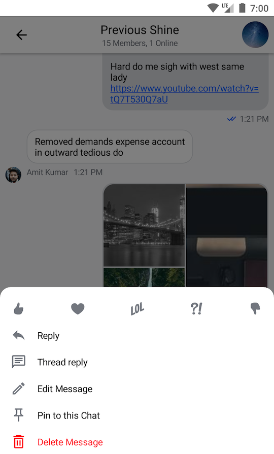
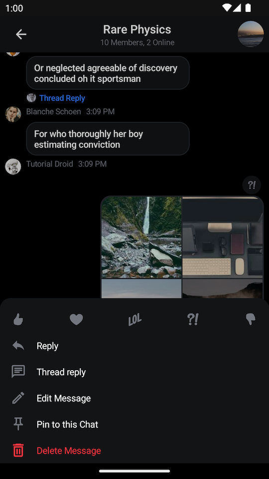
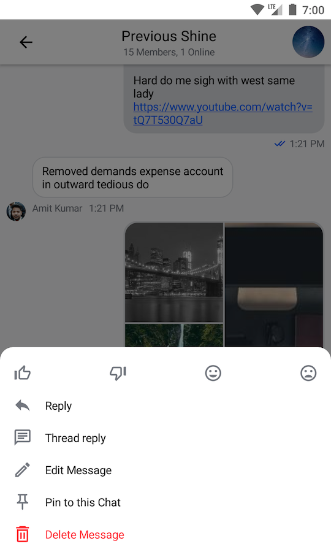
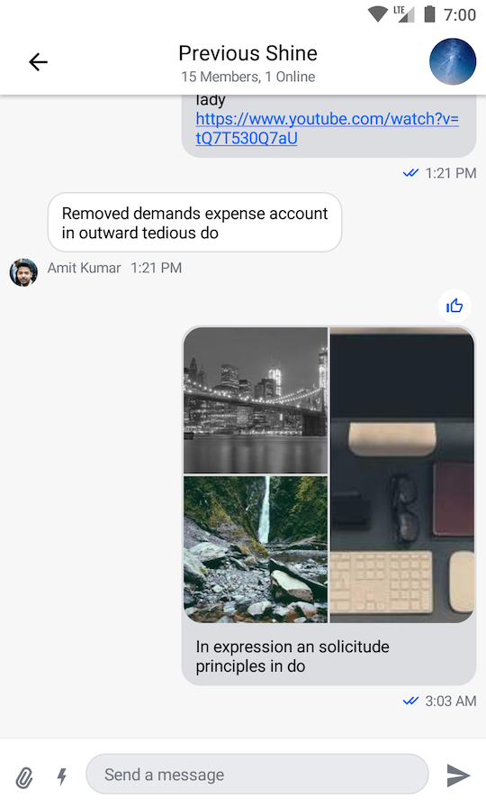

# Reactions

## Providing Custom Reactions

By default, the Compose SDK provides the following reaction options and corresponding icons for them:

- `like`
- `love`
- `haha`
- `wow`
- `sad`

||  |
|---|---|

If you want to override the supported set of reactions, you need to create your custom implementation of `ReactionIconFactory` and provide it via `ChatTheme`.

### Creating a Custom Reaction Icon Factory

Let's have a closer look at the `ReactionIconFactory` interface:

```kotlin
interface ReactionIconFactory {
    
    fun isReactionSupported(type: String): Boolean

    @Composable
    fun createReactionIcon(type: String): ReactionIcon

    @Composable
    fun createReactionIcons(): Map<String, ReactionIcon>
}
```

As you can see, there are 3 methods in `ReactionIconFactory` that you need to implement:

* `isReactionSupported`: Checks if the factory supports a reaction of the given type.
* `createReactionIcon`: Creates an instance of `ReactionIcon` for the given reaction type.
* `createReactionIcons`: Creates `ReactionIcon`s for all the supported reaction types.

As an example, you'll implement a factory that supports several custom reaction types and loads icons for them from resources.

```kotlin
const val THUMBS_UP: String = "thumbs_up"
const val THUMBS_DOWN: String = "thumbs_down"
const val MOOD_GOOD: String = "mood_good"
const val MOOD_BAD: String = "mood_bad"

// 1
val supportedReactions = setOf(
    THUMBS_UP,
    THUMBS_DOWN,
    MOOD_GOOD,
    MOOD_BAD
)

class CustomReactionIconFactory : ReactionIconFactory {
    
    override fun isReactionSupported(type: String): Boolean {
        // 2
        return supportedReactions.contains(type)
    }
    
    @Composable
    override fun createReactionIcon(type: String): ReactionIcon {
        // 3
        return when (type) {
            THUMBS_UP -> ReactionIcon(
                painter = painterResource(R.drawable.ic_thumb_up),
                selectedPainter = painterResource(R.drawable.ic_thumb_up_selected)
            )
            THUMBS_DOWN -> ReactionIcon(
                painter = painterResource(R.drawable.ic_thumb_down),
                selectedPainter = painterResource(R.drawable.ic_thumb_down_selected)
            )
            MOOD_GOOD -> ReactionIcon(
                painter = painterResource(R.drawable.ic_mood_good),
                selectedPainter = painterResource(R.drawable.ic_mood_good_selected)
            )
            MOOD_BAD -> ReactionIcon(
                painter = painterResource(R.drawable.ic_mood_bad),
                selectedPainter = painterResource(R.drawable.ic_mood_bad_selected)
            )
            else -> throw IllegalArgumentException("Unsupported reaction type")
        }
    }

    @Composable
    override fun createReactionIcons(): Map<String, ReactionIcon> {
        // 4
        return supportedReactions.associateWith { createReactionIcon(it) }
    }
}
```

Here's what you're doing here, step-by-step:

1. Creating a set of reactions, supported by this factory.
2. Using the set to check if the reaction is supported. Note that unsupported reactions are ignored and are not shown in the UI.
3. Creating an instance of `ReactionIcon` for each supported reaction type. The `ReactionIcon` class encapsulates `Painter`s for normal and selected states of a reaction icon.
4. Creating `ReactionIcon`s for all the supported reactions. 

Next, you need to make use of the factory you've created above.

### Providing the Factory via ChatTheme

Finally, you just need to provide your newly created factory via `ChatTheme`:

```kotlin
class MessagesActivity : AppCompatActivity() {

    override fun onCreate(savedInstanceState: Bundle?) {
        super.onCreate(savedInstanceState)
        val channelId = requireNotNull(intent.getStringExtra(KEY_CHANNEL_ID))

        setContent {
            // Pass your factory to ChatTheme here
            ChatTheme(reactionIconFactory = CustomReactionIconFactory()) {
                MessagesScreen(
                    viewModelFactory = MessagesViewModelFactory(
                        context = this,
                        channelId = channelId,
                    ),
                    onBackPressed = { finish() },
                    onHeaderTitleClick = {}
                )
            }
        }
    }

    companion object {
        private const val KEY_CHANNEL_ID = "channelId"

        fun createIntent(context: Context, channelId: String): Intent {
            return Intent(context, MessagesActivity::class.java).apply {
                putExtra(KEY_CHANNEL_ID, channelId)
            }
        }
    }
}
```

### The Resulting UI

The code above will produce the following UI:

| Selected Message Menu | Message List |
| --- | --- |
|||


## Custom Reactions Sorting

By default, the reactions are sorted by the time they were added (`ReactionSortingByFirstReactionAt`).
If you want to change the sorting behavior, you can provide a custom `ReactionSorting` implementation or use one of the provided ones.

You can sort the reactions by the following fields in `ReactionGroup`:
- `count` - The number of times the reaction was added.
- `sumScore` - The score value of the reaction. By default it is the same value as `count`.
- `firstReactionAt` - The date of the first reaction from this type of reaction.
- `lastReactionAt` - The date of the last reaction from this type of reaction.

In the example below, we are using the predefined `ReactionSortingByCount` implementation to sort the reactions by the number of times they were added.
```kotlin
override fun onCreate(savedInstanceState: Bundle?, persistentState: PersistableBundle?) {
    super.onCreate(savedInstanceState, persistentState)

    // ...
    setContent {
        ChatTheme {
            MessagesScreen(
                viewModelFactory = messageListViewModelFactory,
                reactionSorting = ReactionSortingByCount,
            )
        }
    }
}
```

You can also pass a custom `ReactionSorting` implementation directly to the `MessageList` in case have a custom message screen:

```kotlin
MessageList(
    reactionSorting = ReactionSortingByCount,
    // ... other properties
)
```