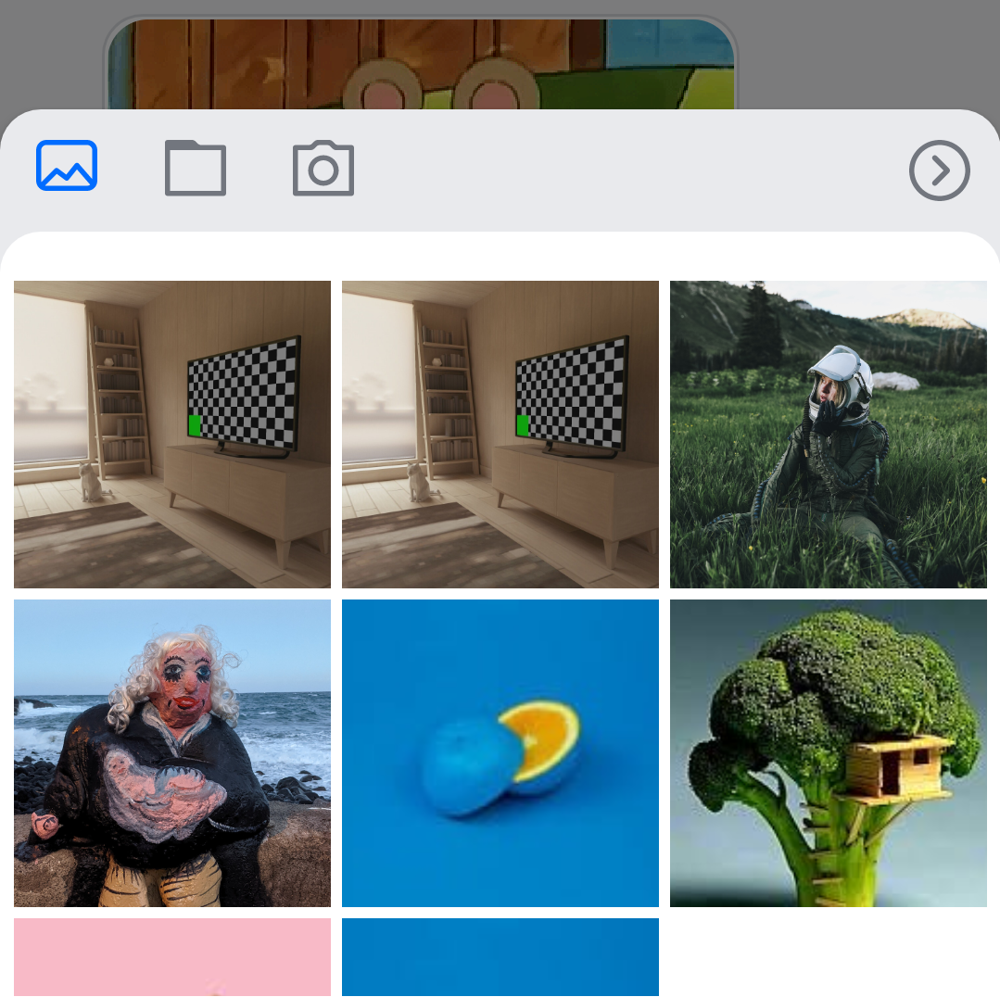
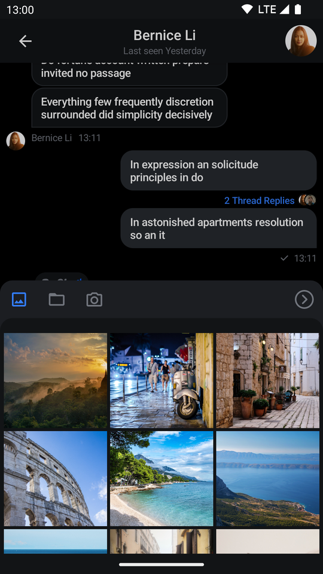
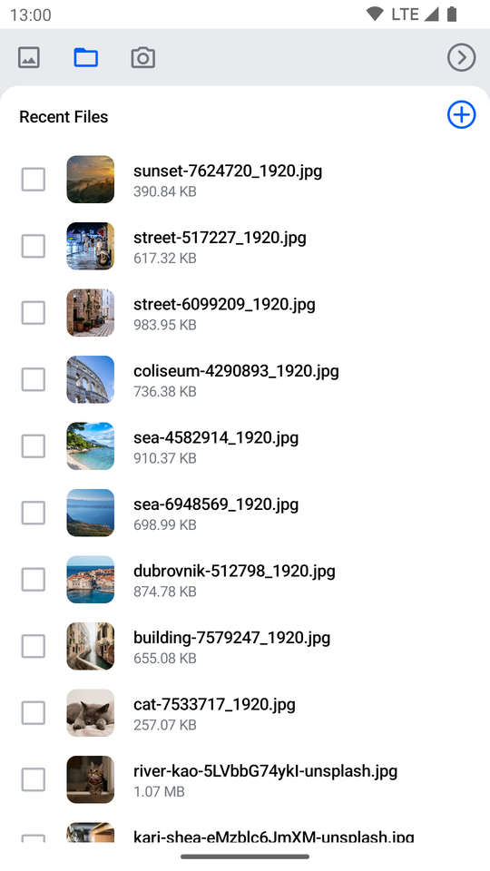
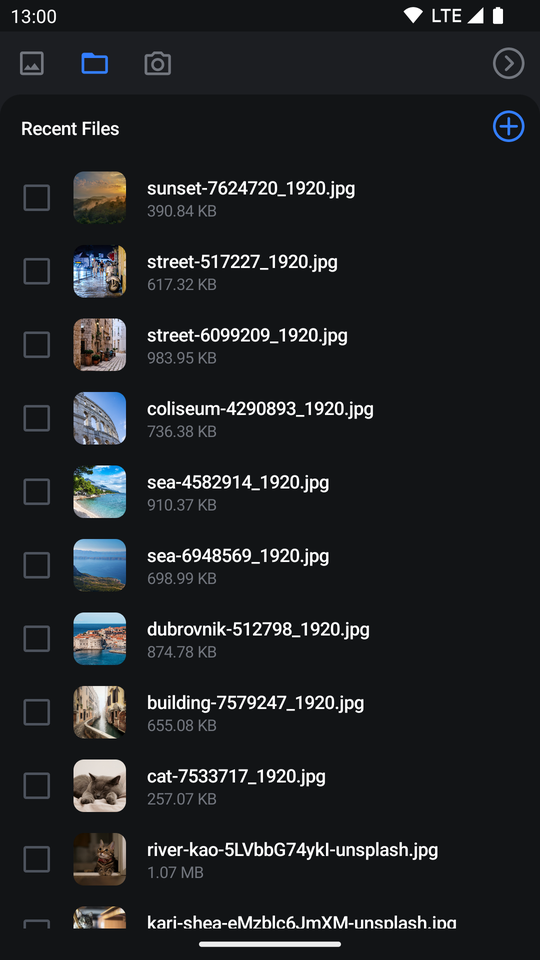
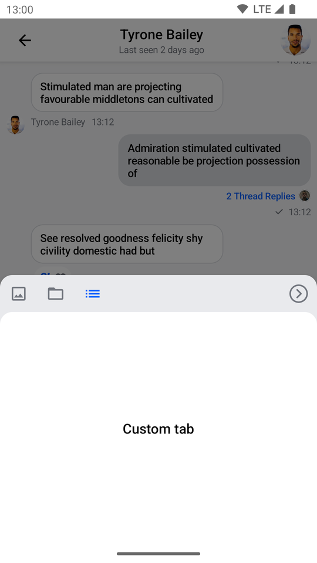
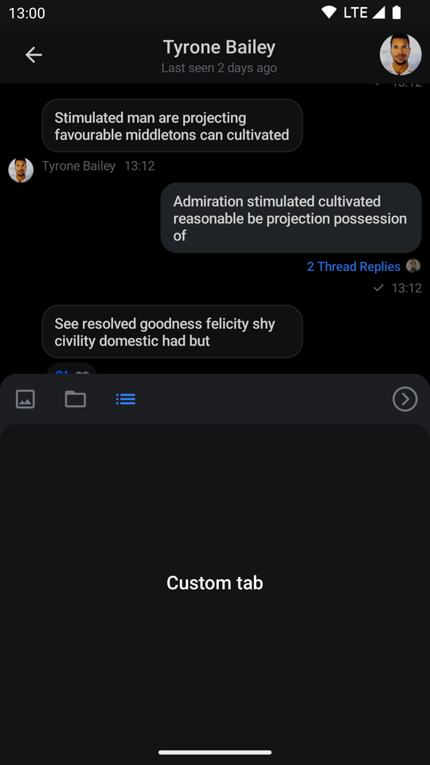

# AttachmentsPicker

The `AttachmentsPicker` component allows users to pick media, file or capture media attachments to send to the chat. The picker is a **bound component** that loads all the data and prepares it for the user.

Internally, it sets up the following components:

* **Picker options**: The header in the picker that shows different types of attachment options people can choose from; media, files or media capture, as well as the **Confirm selection** button.
* **Image picker**: Shows a gallery of images to choose from the device.
* **File picker**: Shows a list of files on the device to choose from. Also allows the user to open the file browser and pick more files from the system.
* **Media capture**: Shows the media capture option to the user and opens a media capture `Activity`.

The picker also handles required permissions for browsing files and capturing images.

Let's see how to use it.

## Usage

If you're using **screen** components, like the [`MessagesScreen`](messages-screen.mdx), you don't have to do any setup for the `AttachmentsPicker`. If you're building custom screens, you can add the `AttachmentPicker` to the rest of your UI:

```kotlin
// The state if we need to show the picker or not
val isShowingAttachments = attachmentsPickerViewModel.isShowingAttachments
        
if (isShowingAttachments) {
    AttachmentsPicker( // Add the picker to your UI
        attachmentsPickerViewModel = attachmentsPickerViewModel,
        modifier = Modifier
            .align(Alignment.BottomCenter)
            .height(350.dp),
        onAttachmentsSelected = { attachments ->
            // Handle selected attachments
        },
        onDismiss = {
            // Handle dismiss
        }
    )
}
```

Because the `AttachmentsPicker` is a **bound** component, you should rely on the `AttachmentsPickerViewModel`'s state, to know if you should show the picker or not. To make sure the picker is shown only when it should be, wrap the component call in an `if` statement.

The code above will show the following UI:

| Light | Dark |
|---|---|
|  |  |

As you can see, the picker is really easy to add to the UI, and it lets your users choose from different types of attachments when sending their messages.

## Handling Actions

As per the signature, the `AttachmentsPicker` exposes the following actions for customization:

```kotlin
@Composable
fun AttachmentsPicker(
    onAttachmentsSelected: (List<Attachment>) -> Unit,
    onDismiss: () -> Unit,
)
```

* `onAttachmentsSelected`: Handler used when the user selects attachments and confirms the selection by clicking on the **Confirm selection** button.
* `onDismiss`: Handler used when the picker is dismissed by clicking outside of the picker area or by pressing the system back button.

To customize the behavior of the picker, simply override these actions to fit your UI needs, like in the following example:

```kotlin
AttachmentsPicker(
    ..., // State and UI customization
    onAttachmentsSelected = { attachments -> 
        // Dismiss the picker and store the attachments
        attachmentsPickerViewModel.changeAttachmentState(showAttachments = false)
        composerViewModel.addSelectedAttachments(attachments)
    },
    onDismiss = { // Reset the UI state and dismiss the picker
        attachmentsPickerViewModel.changeAttachmentState(showAttachments = false)
        attachmentsPickerViewModel.dismissAttachments()
    }
)
```

In the example above, when `onAttachmentsSelected()` is triggered, you call `onShowAttachments()` and dismiss the picker from the UI, but you also store the selected attachments in the `MessageComposerViewModel`, so that you can show them in the `MessageInput` component.

Alternatively, in `onDismiss()`, you hide the picker again and you call `attachmentsPickerViewModel.onDismiss()` to reset the picker state, such as the loaded files or images and the `AttachmentPickerMode`.

This is a very simple way to customize the behavior and connect the `AttachmentPicker` to the rest of your components.

## Customization

### Theming

The `AttachmentsPicker` component can be themed using the `AttachmentPickerTheme` class.
The theme allows you to customize the appearance of the attachment picker.
```kotlin
val colors = if (isSystemInDarkTheme()) StreamColors.defaultDarkColors() else StreamColors.defaultColors()
ChatTheme(
    // ...
    attachmentPickerTheme = AttachmentPickerTheme.defaultTheme(colors).copy(
        backgroundOverlay = colors.overlayDark,
        backgroundPrimary = colors.barsBackground,
        backgroundSecondary = colors.inputBackground,
    ),
    // ...
) {
    // Rest of the UI
}
```

### Customizing the existing UI

You can customize the `AttachmentsPicker` using the following parameters:

```kotlin
fun AttachmentsPicker(
    ..., // ViewModel and action handlers
    modifier: Modifier = Modifier,
    tabFactories: List<AttachmentsPickerTabFactory> = ChatTheme.attachmentsPickerTabFactories,
    shape: Shape = ChatTheme.shapes.bottomSheet,
)
```

* `modifier`: Allows you to customize the root content component of the picker and change its size, padding and more.
* `tabFactories`: Used to customize the tabs shown in the picker.
* `shape`: Allows you to override the `AttachmentsPicker` shape.

Here's an example of a full-screen `AttachmentsPicker` dialog:

```kotlin
AttachmentsPicker(
    attachmentsPickerViewModel = attachmentsPickerViewModel,
    modifier = Modifier.fillMaxSize(), // Fill all the available space
    shape = RectangleShape, // Use a shape without rounded corners
    onAttachmentsSelected = { attachments ->
        // Handle selected attachments
    },
    onDismiss = {
        // Handle dismiss
    }
)
```

This snippet will provide the following UI:

| Light | Dark |
|---|---|
|  |   |

As you can see, the `AttachmentsPicker` component now occupies the whole screen.

### Providing a custom tab

Now let's see how to use the `tabFactories` parameter to replace the media capture tab in the picker with a custom one.

We'll need to create a custom `AttachmentsPickerTabFactory` for our custom tab and implement the methods to render the icon and the content of the tab:

```kotlin
class AttachmentsPickerCustomTabFactory: AttachmentsPickerTabFactory {

    override val attachmentsPickerMode: AttachmentsPickerMode
        get() = CustomPickerMode()

    override fun isPickerTabEnabled(): Boolean {
        // Place your custom logic here to be able to disable the tab if needed.
        // Return true if the tab should be enabled.
        return true
    }

    @Composable
    override fun PickerTabIcon(isEnabled: Boolean, isSelected: Boolean) {
        Icon(
            imageVector = Icons.Default.List,
            contentDescription = "Custom tab",
            tint = when {
                isSelected -> ChatTheme.colors.primaryAccent
                isEnabled -> ChatTheme.colors.textLowEmphasis
                else -> ChatTheme.colors.disabled
            },
        )
    }

    @Composable
    override fun PickerTabContent(
        attachments: List<AttachmentPickerItemState>,
        onAttachmentsChanged: (List<AttachmentPickerItemState>) -> Unit,
        onAttachmentItemSelected: (AttachmentPickerItemState) -> Unit,
        onAttachmentsSubmitted: (List<AttachmentMetaData>) -> Unit,
    ) {

        LaunchedEffect(Unit) {
            onAttachmentsChanged(emptyList())
        }
        
        Box(
            modifier = Modifier.fillMaxSize(),
            contentAlignment = Alignment.Center
        ) {
            Text(
                style = ChatTheme.typography.title3Bold,
                text = "Custom tab",
                color = ChatTheme.colors.textHighEmphasis,
            )
        }
    }
}
```
#### Setup initial attachments list
Please take into account that for the `AttachmentsPicker` component to work correctly, you need to call `onAttachmentsChanged()` with a list of attachments to select from when the tab is first rendered. 
In case you don't have any attachments to select from, you can simply pass an `emptyList()` as shown below:
```kotlin
LaunchedEffect(Unit) {
    onAttachmentsChanged(emptyList())
}
```

#### Attachments selection
The `onAttachmentItemSelected()` is supposed to be used to select attachments from the list you passed to `onAttachmentsChanged()`, but if you don't have any attachments to select from, you can simply ignore this callback.

#### Submitting attachments
Finally, the `onAttachmentsSubmitted()` callback is used to submit the selected attachments to the `MessageComposer` component. This will also dismiss the `AttachmentsPicker`.

```kotlin
val selectedAttachment = AttachmentMetaData(
    type = "custom_type",
    title = "custom_title",
    extraData = hashMapOf(
        "custom_key" to "custom_value",
        // other custom data
    )
)
val selectedAttachments = listOf(selectedAttachment)
onAttachmentsSubmitted(selectedAttachments)
```

### Replacing an existing tab with a custom one

Next, we'll remove the factory for the media capture tab, add a factory for our custom tab and pass the resulting factory list to the picker:
```kotlin
val defaultTabFactories = AttachmentsPickerTabFactories.defaultFactories(takeImageEnabled = false, recordVideoEnabled = false)
val customTabFactories = listOf(AttachmentsPickerCustomTabFactory())
val tabFactories = defaultTabFactories + customTabFactories

AttachmentsPicker(
    ...
    tabFactories = tabFactories
)
```

The code above will produce the following UI:

| Light | Dark |
|---|---|
|  |  |

As you can see, the media capture option is removed and the custom tab is visible on the screen, but it only shows a small text element. Our example is very simple, but you can create custom tabs that handle audio recordings, location sharing, calendar invites and much more.