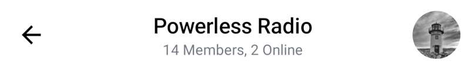
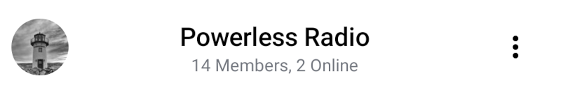

# Message List Header

The `MessageListHeader` component is a clean, stateless component which doesn't require a `ViewModel`. It allows you to customize the data, design style, action
handlers and override the internal composable slots.

Out of the box it sets the following:

* **Back button:** A button to use for navigating back.
* **Header content:** Displays information such as the name of the current channel, number of participants, connection and typing status and message mode.
* **Channel avatar:** The image set for the current channel or tiles of member avatars if no image is set.

Let's see how to use it in your UI.

## Usage

To use the component, simply combine it with the rest of your UI, for example in `setContent`, in you `Activity` or `Fragment`:

```kotlin
override fun onCreate(savedInstanceState: Bundle?) {
    super.onCreate(savedInstanceState)

    // Load the data for the header here

    setContent {
        ChatTheme {
            Column(Modifier.fillMaxSize()) {
                MessageListHeader(
                    modifier = Modifier.wrapContentHeight(),
                    channel = channel,
                    currentUser = currentUser,
                    connectionState = connectionState,
                    messageMode = messageMode,
                    onBackPressed = { },
                    onHeaderTitleClick = { },
                    onChannelAvatarClick = { },
                )

                // Rest of your UI
            }
        }
    }
}
```

This component is stateless and doesn't have its own `ViewModel`. You need to provide the data to the header, otherwise it doesn't know what to render.

We recommend using either our `ChannelState` directly or the `MessageListViewModel` for the required state. For greater ease of use you can use it with the rest of our components.

With the correct data the snippet above generates the following UI:



Now let's see how to handle the header actions.

## Handling Actions

The `MessageListHeader` exposes these actions, as per the signature:

```kotlin
@Composable
fun MessageListHeader(
    ..., // State
    onBackPressed: () -> Unit = {},
    onHeaderTitleClick: (Channel) -> Unit = {},
    onChannelAvatarClick: () -> Unit = {},
)
```

* `onBackPressed`: Handler used when the user clicks on the back button.
* `onHeaderTitleClick`: Handler used when the user clicks on the channel title.
* `onChannelAvatarClick`: Handler used when the user clicks on the channel avatar.

:::note
The `leadingContent` uses `onBackPressed` as its default action, while the `centerContent` uses `onHeaderTitleClick` and the `trailingContent` uses `onChannelAvatarClick`. If you want to keep the same UI but change the behavior, you can override `onBackPressed`, `onHeaderTitleClick` or `onChannelAvatarClick`.

Otherwise, skip over to [Customization](#customization) to learn how to customize the UI.
:::

To customize these actions, simply use the `MessageListHeader` with the rest of your UI components, like within `setContent`, and pass in the required actions:

```kotlin
MessageListHeader(
    ..., // State
    onBackPressed = { finish() },
    onHeaderTitleClick = {
        // Handle clicks on the header title
    },
    onChannelAvatarClick = {
        // Handle clicks on the channel avatar
    },
    ... // Content
)
```

This way it's easy to combine the actions from this component with your custom UI and logic.

## Customization

As the component is fully state-dependent, you can customize the data it shows, as per the signature:

```kotlin
@Composable
fun MessageListHeader(
    channel: Channel,
    currentUser: User?,
    modifier: Modifier = Modifier,
    typingUsers: List<User> = emptyList(),
    messageMode: MessageMode = MessageMode.Normal,
    connectionState: ConnectionState = ConnectionState.CONNECTED,
    color: Color = ChatTheme.colors.barsBackground,
    shape: Shape = ChatTheme.shapes.header,
    elevation: Dp = ChatTheme.dimens.headerElevation,
    ..., // Handlers
    ... // Content
)
```

* `channel`: The information about the current channel, used to show the member count, name and avatar data.
* `currentUser`: Currently logged in user, used to differentiate it from other users, when loading the channel image.
* `modifier`: Modifier for the root component. You can use it to add padding or change the dimensions and such, however attributes such as color, shape and elevation have their own parameters.
* `typingUsers`: List of typing users used to show their names along with a typing indicator.
* `messageMode`: Used to determine the header title. If we're in a thread, we show a title saying who the owner of the parent message is.
* `connectionState`: Used to switch between the member count text and the network status information.
* `color`: The color of the header.
* `shape`: The shape of the header.
* `elevation`: The elevation of the header.

These will change what data is displayed in the header.

You can also customize the content of the header, using the following parameters:

```kotlin
@Composable
fun MessageListHeader(
    leadingContent: @Composable RowScope.() -> Unit = {
        DefaultMessageListHeaderLeadingContent(onBackPressed = onBackPressed)
    },
    centerContent: @Composable RowScope.() -> Unit = {
        DefaultMessageListHeaderCenterContent(
            modifier = Modifier.weight(1f),
            channel = channel,
            currentUser = currentUser,
            typingUsers = typingUsers,
            messageMode = messageMode,
            onHeaderTitleClick = onHeaderTitleClick,
            connectionState = connectionState
        )
    },
    trailingContent: @Composable RowScope.() -> Unit = {
        DefaultMessageListHeaderTrailingContent(
            channel = channel,
            currentUser = currentUser,
            onClick = onChannelAvatarClick,
        )
    },
)
```

* `leadingContent`: Represents the content at the beginning of the header. By default shows a back button that you can override or customize the behavior of by overriding `onBackPressed`.
* `centerContent`: Represents the core and center part of the header. By default shows information about the channel that you can override or customize the behavior of by overriding `onHeaderTitleClick`.
* `trailingContent`: Represents the content at the end of the header. By default shows the channel avatar that you can override or customize the behavior of by overriding `onChannelAvatarClick`.

**Here's an example of customizing the UI:**

First, create a button with a drawable of your choosing:

```kotlin
@Composable
fun InfoButton() {
    IconButton(
        onClick = {
            // Handle on click
        }
    ) {
        Icon(
            modifier = Modifier.height(40.dp),
            painter = painterResource(id = R.drawable.ic_info),
            contentDescription = "info button",
            tint = Color.Black
        )
    }
}
```

Then place that button into the `trailingContent` slot while placing our own `ChannelAvatar` component into the `leadingContent` slot:

```kotlin
MessageListHeader(
    ... // State
    leadingContent = {
        ChannelAvatar(
            modifier = Modifier.size(40.dp),
            channel = channel,
            currentUser = currentUser,
            contentDescription = channelName,
        )
    },
    trailingContent = { InfoButton() }
)
```

The resulting UI looks like this:



:::note
For a more in-depth customization check out [this](../../compose-cookbook/04-custom-message-list-header.mdx) Cookbook page.
:::
