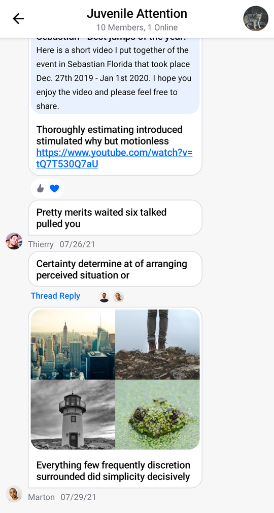
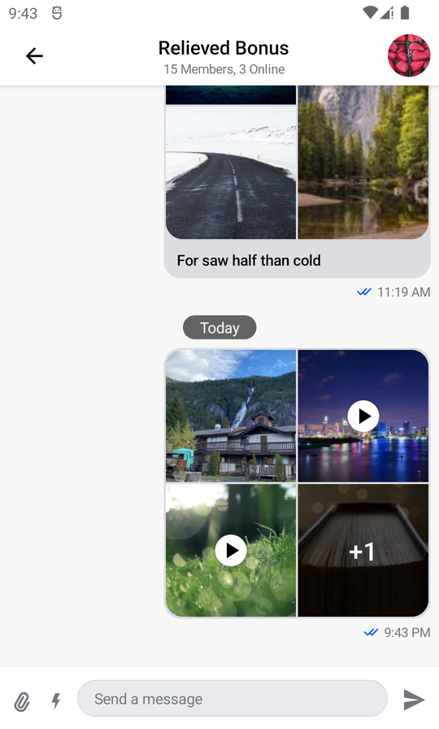
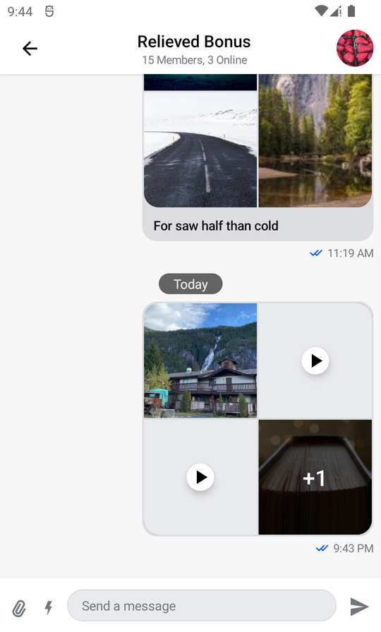
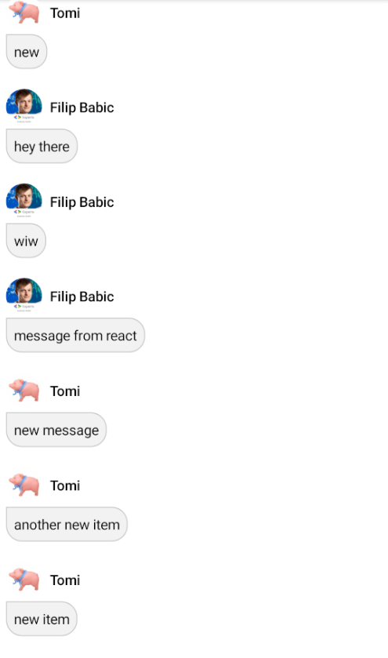

# Message List

The `MessageList` component is a crucial part of building a chat experience. We support two versions of the `MessageList` component:

* **Bound**: This version binds itself to the `MessageListViewModel` and loads all the required data. It also connects single and long item tap, pagination, and bottom reached events to the `ViewModel`.
* **Stateless**: This is a stateless version of the list which doesn't know about the `ViewModel` and depends on pure state from external sources to render its UI.

:::note 
The **bound** version of the list uses the **stateless** list internally. That way, when providing the same state to either component, the behavior remains the same.

Additionally, we cannot provide a default `ViewModel` for this component, as it requires the `channelId` to load the data, so you'll have to build an instance yourself.
:::

Based on the provided state, this component shows the following UI:

* **Loading indicator**: While we're loading the initial data.
* **Empty content**: If there is no data and we've finished loading.
* **Messages**: The list of messages in the channel, including file and image attachments, with various actions like thread clicks, item long taps, pagination and reaching the bottom.

Let's see how to show a list of messages.

## Usage

To use the **bound** `MessageList`, first initialize the `ViewModel` using our `MessagesViewModelFactory`:

```kotlin
val factory by lazy {
    MessagesViewModelFactory(
        context = this,
        channelId = channelId,
    )
}

val listViewModel by viewModels<MessageListViewModel>(factoryProducer = { factory })
```

Then add it to the rest of your UI, for example within `setContent()`:

```kotlin
override fun onCreate(savedInstanceState: Bundle?) {
    super.onCreate(savedInstanceState)
    // Load data

    setContent {
        ChatTheme {
            Column(
                Modifier.fillMaxSize()
            ) {
                MessageListHeader(...)

                MessageList(
                    viewModel = listViewModel,
                    modifier = Modifier.fillMaxSize()
                )

                // Rest of your UI
            }
        }
    }
}
```

As you can see, it's easy to add the component to your UI and combine it with our other components (or your own) to build a custom screen. Additionally, if you choose the **bound** version, as seen here, you just need to provide a `MessageListViewModel` and the component will work on its own.

The snippet above will produce the following UI.

 

Notice how easy it was to integrate this component with other composable functions, like our `MessageListHeader`. You can see that the component shows different types of messages, such as link and image previews. It also handles pagination and various other events when scrolling or receiving new messages.

Let's see how to handle the actions within the list.

## Handling Actions

The `MessageList` component exposes the following actions, as per the signature:

```kotlin
@Composable
fun MessageList(
    ..., // State & UI
    onThreadClick: (Message) -> Unit = { viewModel.openMessageThread(it) },
    onLongItemClick: (Message) -> Unit = { viewModel.selectMessage(it) },
    onReactionsClick: (Message) -> Unit = { viewModel.selectReactions(it) },
    onMessagesPageStartReached: () -> Unit = { viewModel.loadOlderMessages() },
    onLastVisibleMessageChanged: (Message) -> Unit = { viewModel.updateLastSeenMessage(it) },
    onScrollToBottom: () -> Unit = { viewModel.clearNewMessageState() },
    onGiphyActionClick: (GiphyAction) -> Unit = { viewModel.performGiphyAction(it) },
    onQuotedMessageClick: (Message) -> Unit = { viewModel.scrollToMessage(it.id) },
    onMediaGalleryPreviewResult: (MediaGalleryPreviewResult?) -> Unit = {
        if (it?.resultType == MediaGalleryPreviewResultType.SHOW_IN_CHAT) {
            viewModel.scrollToMessage(it.messageId)
        }
    },
    onMessagesPageEndReached: (String) -> Unit = { viewModel.loadNewerMessages(it) },
    onScrollToBottomClicked: (() -> Unit) -> Unit = { viewModel.scrollToBottom(scrollToBottom = it) },
    ... // Content
)
```

* `onThreadClick`: Handler used when the user taps on a message with a thread.
* `onLongItemClick`: Handler used when the user long taps on an item.
* `onReactionsClick`: Handler used when the user taps on a reaction to a message.
* `onMessagesPageStartReached`: Handler used when the user reaches the oldest loaded message, to trigger pagination.
* `onLastVisibleMessageChanged`: Handler used when the user scrolls and the last visible item changes.
* `onScrollToBottom`: Handler used when the user reaches the newest message. Used to remove the "New message" or "Scroll to bottom" actions from the UI.
* `onGiphyActionClick`: Handler used when the user clicks on one of the actions in a Giphy message. Giphy images with actions are displayed only directly after using the Giphy slash command.
* `onQuotedMessageClick`: Handler used when the user clicks on a quoted message. By default will search for the message that has been quoted and will scroll to it.
* `onMediaGalleryPreviewResult`: Handler used when the user receives a result from the Media Gallery Preview screen, after opening an image or a video attachment.
* `onMessagesPageEndReached`: Handler used when the user reaches the newest loaded message, to trigger pagination.
* `onScrollToBottomClicked`: Handler used when the user clicks on the scroll to bottom button.

You can customize the behavior here by providing your own actions, like so:

```kotlin
MessageList(
    ..., // State
    // Actions
    onThreadClick = { message -> },
    onLongItemClick = { message -> },
    onReactionsClick = { message -> },
    onMessagesPageStartReached = { },
    onLastVisibleMessageChanged = { message -> },
    onScrollToBottom = { },
    onGiphyActionClick = { giphyAction -> },
    onQuotedMessageClick = { message -> },
    onMediaGalleryPreviewResult = { mediaGalleryPreviewResult -> },
    onMessagesPageEndReached = { messageId -> },
    onScrollToBottomClicked = { }
     // Content
)
```

If you're using the **bound** version of the component, these actions update the state within the `ViewModel` by default, while the default actions of the **stateless** version are all empty.

If you override the default actions to build your custom behavior, we still recommend storing the data in the `ViewModel`, as most of the behavior like having threads and pagination is already built for you.

We recommend using the **bound** version for ease of use. Alternatively, you can use the stateless version and provide the data manually, for more control.

### Controlling the scroll state

The `MessageList` allows you to control the scroll state of the list by providing a `messagesLazyListState` parameter, like so:

```kotlin
@Composable
fun MessageList(
    ..., // State, UI & Actions
    messagesLazyListState: MessagesLazyListState = rememberMessageListState(parentMessageId = viewModel.currentMessagesState.parentMessageId),
    ... // Content
)
```

* `messagesLazyListState`: The scroll state of the list. While not a handler, you can use it to control the scroll and trigger custom scroll actions.

You can customize this state in the following way:

```kotlin
val myListState = rememberMessageListState(parentMessageId = state.parentMessageId)

MessageList(
    ..., // the rest of the state, UI & actions
    messagesLazyListState = myListState,
)
```

`rememberMessageListState()` keeps a separate instance of `MessagesLazyListState` based on the `parentMessageId`. This helps you keep the scroll state of the main list intact when you enter and leave threads.

You can also provide your own instance of `MessagesLazyListState` where you define the starting scroll position of the state and how the focused message offset is calculated. For example, clicking on the original message contained within the reply will automatically scroll to the message and put it in focus. You can define where on the screen the focused message appears by passing in your own `MessageOffsetHandler`.

## Previewing Attachments

Out of the box previews are provided for the following attachment types: uploading, link, Giphy, image, video and file.

### Image and Video

Image and video attachments are previewed as thumbnails which can be displayed as a single tile or multiple ones depending on how many attachments are contained within the specific message. By default, these are rendered by `MediaAttachmentFactory`.

:::note
Attachment factories are used for previewing attachments. To learn more about factories and how to customize them, click on the link [here](../general-customization/chat-theme.mdx#streamattachmentfactories).
:::

In practice they appear as such:



Video thumbnails are a paid feature, with the pricing listed [here](https://getstream.io/chat/pricing/). They are enabled by default but can be turned off by setting the [ChatTheme](../general-customization/chat-theme.mdx) property `videoThumbnailsEnabled` to `false`.

Once video thumbnails are disabled, messages containing video attachments will be displayed in the following manner:



If you want to read more about how to customize the way these attachments are displayed, head over to the relevant section seen [here](../guides/customizing-image-and-video-previews.mdx)

##  Customization

We allow for a few ways of customizing the `MessageList` component, as per the signature:

```kotlin
@Composable
fun MessageList(
    ..., // State and actions
    modifier: Modifier = Modifier,
    contentPadding: PaddingValues = PaddingValues(...),
    loadingContent: @Composable () -> Unit = { DefaultMessageListLoadingIndicator(modifier) },
    emptyContent: @Composable () -> Unit = { DefaultMessageListEmptyContent(modifier) },
    helperContent: @Composable BoxScope.() -> Unit = {
        DefaultMessagesHelperContent(
            messagesState = viewModel.currentMessagesState,
            messagesLazyListState = messagesLazyListState,
            scrollToBottom = onScrollToBottomClicked,
        )
    },
    loadingMoreContent: @Composable () -> Unit = { DefaultMessagesLoadingMoreIndicator() },
    itemModifier: (index: Int, item: MessageListItemState) -> Modifier = { _, _ -> Modifier },
    itemContent: @Composable (MessageListItemState) -> Unit = { messageListItem ->
        DefaultMessageContainer(
            messageListItemState = messageListItem,
            onMediaGalleryPreviewResult = onMediaGalleryPreviewResult,
            onThreadClick = onThreadClick,
            onLongItemClick = onLongItemClick,
            onReactionsClick = onReactionsClick,
            onGiphyActionClick = onGiphyActionClick,
            onQuotedMessageClick = onQuotedMessageClick,
        )
    },
)
```

* `modifier`: Modifier for the root component. Useful for things like the component size, padding, background and similar.
* `contentPadding`: Padding values to be applied to the message list surrounding the content inside.
* `loadingContent`: Used while loading the message data. By default shows a loading indicator that you can override.
* `emptyContent`: An empty placeholder used when no messages are available. By default displays a message that you can override.
* `helperContent`: Composable that represents helper content for the message list. By default handles the scrolling behavior and shows a floating button that can be used to scroll to the bottom.
* `loadingMoreContent`: Composable that represents the loading more content, when we're loading the next page.
* `itemModifier`: Modifier for each item container in the list. Useful for things like the item size, padding, background and similar.
* `itemContent`: Composable that allows you to fully override the UI and behavior of each message in the list. This function will be applied to each item in the list and you'll gain access to the `MessageListItemState` inside the lambda when building your custom UI.

Here's an example of customizing the `Message` items in the list:

```kotlin
MessageList(
    viewModel = listViewModel,
    modifier = Modifier
        .fillMaxSize()
        .background(ChatTheme.colors.appBackground),
    itemModifier = { index, item ->
        Modifier 
            // Add your customizations here
    },
    itemContent = { item ->
        if (item is MessageItemState) { // we check against other subclasses of 'MessageListItemState'
            val message = item.message

            Column(
                modifier = Modifier
                    .padding(8.dp)
                    .widthIn(max = 300.dp)
            ) {
                Row(verticalAlignment = Alignment.CenterVertically) {
                    Avatar(
                        modifier = Modifier.size(36.dp),
                        imageUrl =  message.user.image,
                        initials = message.user.initials
                    )

                    Text(
                        modifier = Modifier.padding(start = 8.dp),
                        text = message.user.name,
                        style = ChatTheme.typography.bodyBold,
                        fontSize = 14.sp,
                        color = ChatTheme.colors.textHighEmphasis
                    )
                }

                MessageBubble(
                    color = ChatTheme.colors.barsBackground,
                    modifier = Modifier.padding(top = 4.dp),
                    shape = RoundedCornerShape(
                        topEnd = 16.dp,
                        topStart = 0.dp,
                        bottomEnd = 16.dp,
                        bottomStart = 16.dp
                    ),
                    content = {
                        Text(
                            modifier = Modifier.padding(8.dp),
                            text = message.text,
                            color = ChatTheme.colors.textHighEmphasis
                        )
                    }
                )
            }
        }
    }
)
```

This snippet of code prepares a custom message item component, using the `itemContent` parameter. It features a `Column` that hosts a `Row` with an avatar and a text showing the user name, as well as a `MessageBubble` that wraps the message text.

These components also use modifiers and other properties to style them and make them look nicer. With a simple parameter, this snippet will now produce the following UI in the `MessageList`:



As per our description, the `Avatar` and the user name `Text` are shown in a `Row`, after which we see the `MessageBubble`. Note that this approach doesn't automatically display attachments, so you'll have to show attachment UI based on the provided `attachmentFactories` within the `ChatTheme`.

Using this approach, you can completely customize the items to your needs and you can use click, touch and combined modifiers to customize the touch event behavior.

And you can customize the `emptyContent` and the `loadingContent` to your needs, if you need custom UI there.

