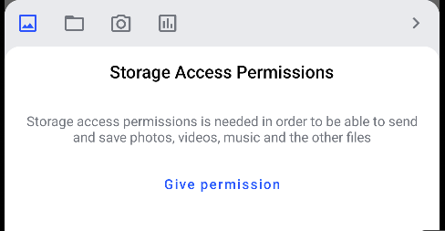
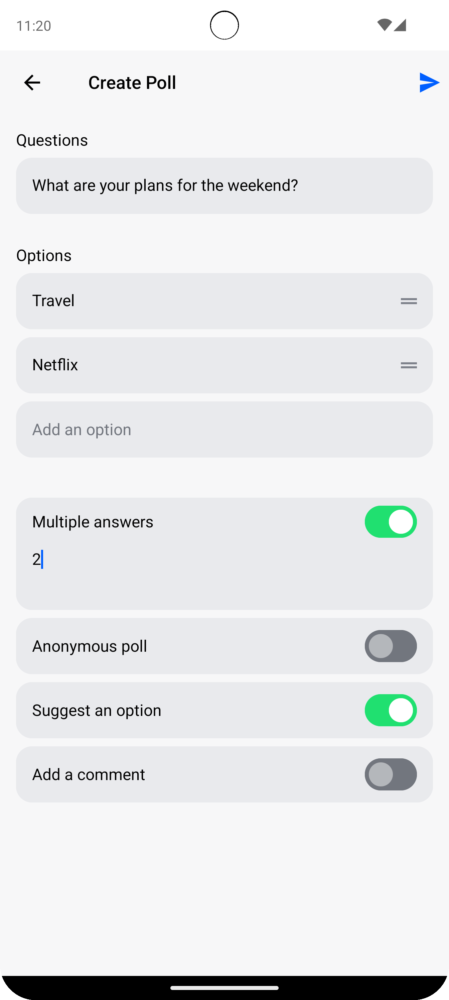
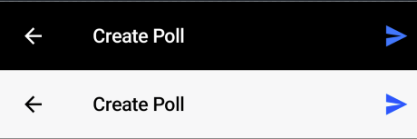
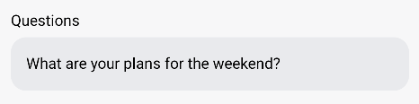
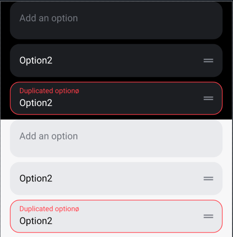
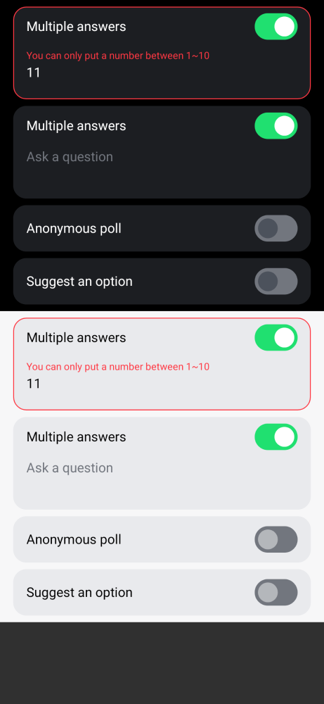
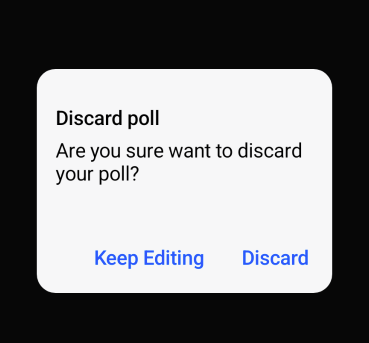
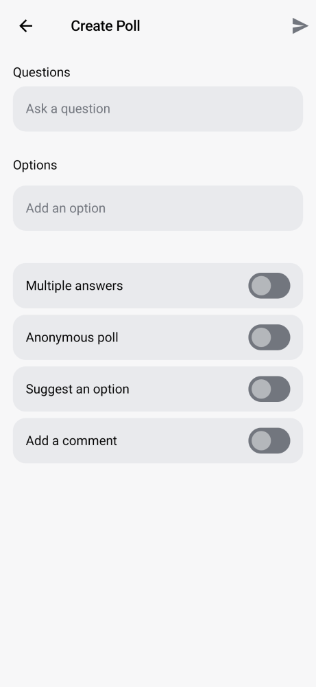
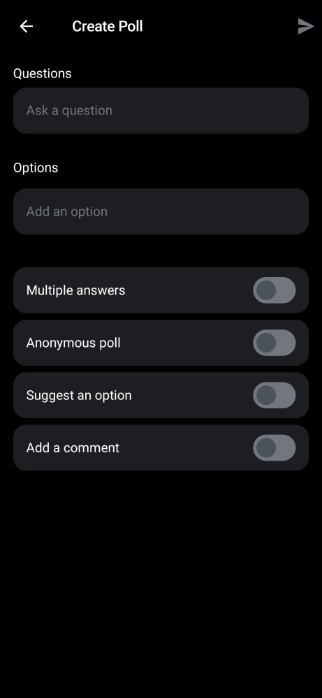
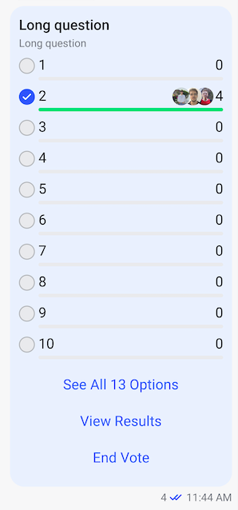

# Polls

Stream Chat's Compose SDK offers the capability to create polls within your chat application. Polls are an effective tool for enhancing user interaction and engagement, providing a dynamic way to gather opinions and feedback from users. This feature allows you to seamlessly integrate interactive polls, making your chat application more engaging and interactive.

:::note
Polls on Compose are available since version **6.5.0**.
:::

Polls are disabled by default. To enable this feature, navigate to the [Stream dashboard](https://getstream.io/dashboard/) for your app and enable the **Polls** flag for your channel type.


Once you enable that feature, an additional "Polls" icon will appear in the attachment picker within the default composer of the SDK.



## Poll Configurations

When you tap the "Polls" icon, a new screen for creating polls will be displayed. Here, you can set up the poll title, the options, and various settings such as the maximum number of votes, whether the poll is anonymous, and if it allows comments. This allows for a customized polling experience within the app.



You can determine which options users can configure when creating a poll by providing your own `PollsConfig`. For instance, you can create a configuration that hides the "Comments" option and allows multiple votes by default. This customization ensures that the polling experience aligns with the desired usage and interaction patterns within your application.

Now it's time to create the poll using `PollConfig` and `AttachmentsPicker`. The `AttachmentsPicker` allows you to define user behavior for poll creation by utilizing the `onAttachmentPickerAction` parameter. Here's an example:

```kotlin
var isFullScreenContent by rememberSaveable { mutableStateOf(false) }
val screenHeight = LocalConfiguration.current.screenHeightDp
val pickerHeight by animateDpAsState(
    targetValue = if (isFullScreenContent) screenHeight.dp else ChatTheme.dimens.attachmentsPickerHeight,
    label = "full sized picker animation",
)

AttachmentsPicker(
    attachmentsPickerViewModel = attachmentsPickerViewModel,
    modifier = Modifier
        .align(Alignment.BottomCenter)
        .height(pickerHeight),
    onTabClick = { _, tab -> isFullScreenContent = tab.isFullContent },
    onAttachmentPickerAction = { action ->
        if (action is AttachmentPickerPollCreation) {
            listViewModel.createPoll(
                pollConfig = PollConfig(
                    name = action.question,
                    options = action.options.filter { it.title.isNotEmpty() }.map { it.title },
                    description = action.question,
                    allowUserSuggestedOptions = action.switches.any { it.key == "allowUserSuggestedOptions" && it.enabled },
                    votingVisibility = if (action.switches.any { it.key == "votingVisibility" && it.enabled }) {
                        VotingVisibility.ANONYMOUS
                    } else {
                        VotingVisibility.PUBLIC
                    },
                    maxVotesAllowed = if (action.switches.any { it.key == "maxVotesAllowed" && it.enabled }) {
                        action.switches.first { it.key == "maxVotesAllowed" }.pollSwitchInput?.value.toString()
                            .toInt()
                    } else {
                        1
                    },
                ),
            )
        }
    },
    ..
)
```

## Customize Poll Creation Screens

You can customize the poll creation screen by implementing your own [AttachmentsPicker](https://getstream.io/chat/docs/sdk/android/compose/message-components/attachments-picker/) and `AttachmentsPickerTabFactory`. The default implementation is provided within `ChatTheme` using `StreamAttachmentFactories.defaultFactories()`. This allows you to tailor the appearance and behavior of the poll creation interface to better fit your application's needs and user experience expectations.

```kotlin
/**
 * Holds the information required to add support for "poll" tab in the attachment picker.
 */
public class AttachmentsPickerPollTabFactory : AttachmentsPickerTabFactory {

    /**
     * The attachment picker mode that this factory handles.
     */
    override val attachmentsPickerMode: AttachmentsPickerMode
        get() = Poll

    /**
     * Emits a file icon for this tab.
     *
     * @param isEnabled If the tab is enabled.
     * @param isSelected If the tab is selected.
     */
    @Composable
    override fun PickerTabIcon(isEnabled: Boolean, isSelected: Boolean) {
        Icon(
            painter = painterResource(id = R.drawable.stream_compose_ic_poll),
            contentDescription = stringResource(id = R.string.stream_compose_poll_option),
            tint = when {
                isEnabled -> ChatTheme.colors.textLowEmphasis
                else -> ChatTheme.colors.disabled
            },
        )
    }

    /**
     * Emits content that allows users to create a poll in this tab.
     *
     * @param onAttachmentPickerAction A lambda that will be invoked when an action is happened.
     * @param attachments The list of attachments to display.
     * @param onAttachmentsChanged Handler to set the loaded list of attachments to display.
     * @param onAttachmentItemSelected Handler when the item selection state changes.
     * @param onAttachmentsSubmitted Handler to submit the selected attachments to the message composer.
     */
    @Composable
    override fun PickerTabContent(
        onAttachmentPickerAction: (AttachmentPickerAction) -> Unit,
        attachments: List<AttachmentPickerItemState>,
        onAttachmentsChanged: (List<AttachmentPickerItemState>) -> Unit,
        onAttachmentItemSelected: (AttachmentPickerItemState) -> Unit,
        onAttachmentsSubmitted: (List<AttachmentMetaData>) -> Unit,
    ) {
        val coroutineScope = rememberCoroutineScope()
        val questionListLazyState = rememberLazyListState()
        val pollSwitchItemFactory = ChatTheme.pollSwitchitemFactory
        var optionItemList by remember { mutableStateOf(emptyList<PollOptionItem>()) }
        var switchItemList: List<PollSwitchItem> by remember { mutableStateOf(pollSwitchItemFactory.providePollSwitchItemList()) }
        var hasErrorOnOptions by remember { mutableStateOf(false) }
        val nestedScrollConnection = remember {
            object : NestedScrollConnection {
                override fun onPreScroll(available: Offset, source: NestedScrollSource): Offset {
                    val delta = -available.y
                    coroutineScope.launch {
                        questionListLazyState.scrollBy(delta)
                    }
                    return Offset.Zero
                }
            }
        }

        Column(
            modifier = Modifier
                .fillMaxWidth()
                .nestedScroll(nestedScrollConnection)
                .verticalScroll(rememberScrollState())
                .background(ChatTheme.colors.appBackground),
        ) {
            val (question, onQuestionChanged) = rememberSaveable { mutableStateOf("") }
            val isEnabled = question.isNotBlank() && optionItemList.any { it.title.isNotBlank() } && !hasErrorOnOptions
            val hasChanges = question.isNotBlank() || optionItemList.any { it.title.isNotBlank() }
            var isShowingDiscardDialog by remember { mutableStateOf(false) }

            PollCreationHeader(
                modifier = Modifier.fillMaxWidth(),
                enabledCreation = isEnabled,
                onPollCreateClicked = {
                    onAttachmentPickerAction.invoke(
                        AttachmentPickerPollCreation(
                            question = question,
                            options = optionItemList,
                            switches = switchItemList,
                        ),
                    )
                    onAttachmentPickerAction.invoke(AttachmentPickerBack)
                },
                onBackPressed = {
                    if (!hasChanges) {
                        onAttachmentPickerAction.invoke(AttachmentPickerBack)
                    } else {
                        isShowingDiscardDialog = true
                    }
                },
            )

            PollQuestionInput(
                question = question,
                onQuestionChanged = onQuestionChanged,
            )

            PollOptionList(
                lazyListState = questionListLazyState,
                onQuestionsChanged = {
                    optionItemList = it
                    hasErrorOnOptions = it.fastAny { item -> item.pollOptionError != null }
                },
            )

            Spacer(modifier = Modifier.height(32.dp))

            PollSwitchList(
                pollSwitchItems = switchItemList,
                onSwitchesChanged = {
                    switchItemList = it
                    hasErrorOnOptions = it.fastAny { item -> item.pollOptionError != null }
                },
            )

            if (isShowingDiscardDialog) {
                PollCreationDiscardDialog(
                    onCancelClicked = { isShowingDiscardDialog = false },
                    onDiscardClicked = {
                        isShowingDiscardDialog = false
                        onAttachmentPickerAction.invoke(AttachmentPickerBack)
                    },
                )
            }
        }
    }
}
```

The `PickerTabContent` composable function in the code above includes several key components: `PollCreationHeader`, `PollQuestionInput`, `PollOptionList`, `PollSwitchList`, and `PollCreationDiscardDialog`. Let's break down each UI component one by one to understand their roles and how they contribute to the overall poll creation screen.

### PollCreationHeader



This is the header of the poll creation screen. It consists of three parts: leading, center, and trailing content, each with its dedicated roles such as navigating back, displaying the title, and submitting the poll creation. You can fully customize the header using the provided parameters as shown in the code below:

```kotlin
public fun PollCreationHeader(
    modifier: Modifier = Modifier,
    color: Color = ChatTheme.colors.appBackground,
    shape: Shape = ChatTheme.shapes.header,
    elevation: Dp = 0.dp,
    onBackPressed: () -> Unit = {},
    enabledCreation: Boolean,
    onPollCreateClicked: () -> Unit,
    leadingContent: @Composable (RowScope.() -> Unit)? = null,
    centerContent: @Composable (RowScope.() -> Unit)? = null,
    trailingContent: @Composable (RowScope.() -> Unit)? = null,
)
```

### PollQuestionInput



The poll input component allows the poll creator to describe the question of the poll. You can use this component to receive the poll title during poll creation. This provides a user-friendly interface for entering and displaying the main question of the poll, ensuring clarity and engagement.

```kotlin
val (question, onQuestionChanged) = rememberSaveable { mutableStateOf("") }

PollQuestionInput(
    question = question,
    onQuestionChanged = onQuestionChanged,
)
```

### PollOptionList



The re-orderable list of options consists of input fields where each entry must be unique. If a duplicate entry is detected, an error message will be displayed. This ensures that all poll options are distinct, maintaining the integrity and clarity of the poll.

```kotlin
val questionListLazyState = rememberLazyListState()
var optionItemList by remember { mutableStateOf(emptyList<PollOptionItem>()) }
var hasErrorOnOptions by remember { mutableStateOf(false) }

PollOptionList(
    lazyListState = questionListLazyState,
    onQuestionsChanged = {
        optionItemList = it
        hasErrorOnOptions = it.fastAny { item -> item.pollOptionError != null }
    },
)
```
The `onQuestionsChanged` lambda provides a list of `PollOptionItem`, which contains information about each option item whenever the input list is modified, reordered, or added to. This ensures that any changes to the poll options are tracked and updated accordingly.

### PollSwitchList



The list of switches configures the poll properties, such as allowing multiple answers, enabling anonymous polling, or suggesting an option. These switches provide flexibility in setting up the poll to match the desired level of engagement and privacy.

```kotlin
val pollSwitchItemFactory = ChatTheme.pollSwitchitemFactory
var switchItemList: List<PollSwitchItem> by remember { mutableStateOf(pollSwitchItemFactory.providePollSwitchItemList()) }
var hasErrorOnOptions by remember { mutableStateOf(false) }

PollSwitchList(
    pollSwitchItems = switchItemList,
    onSwitchesChanged = {
        switchItemList = it
        hasErrorOnOptions = it.fastAny { item -> item.pollOptionError != null }
    },
)
```

The `onSwitchesChanged` lambda provides a list of `PollSwitchItem`, detailing each switch configuration whenever changes occur in the switch list. You can customize the default switch options by implementing your own `PollSwitchItemFactory`, as shown in the example below:

```kotlin
public class MyPollSwitchItemFactory(
    private val context: Context,
) : PollSwitchItemFactory {

    /**
     * Provides a default list of [PollSwitchItem] to create the poll switch item list.
     */
    override fun providePollSwitchItemList(): List<PollSwitchItem> =
        listOf(
            PollSwitchItem(
                title = context.getString(R.string.stream_compose_poll_option_switch_multiple_answers),
                pollSwitchInput = PollSwitchInput(keyboardType = KeyboardType.Decimal, maxValue = 2, value = 0),
                key = "maxVotesAllowed",
                enabled = false,
            ),
            PollSwitchItem(
                title = context.getString(R.string.stream_compose_poll_option_switch_anonymous_poll),
                key = "votingVisibility",
                enabled = false,
            ),
            PollSwitchItem(
                title = context.getString(R.string.stream_compose_poll_option_switch_suggest_option),
                key = "allowUserSuggestedOptions",
                enabled = false,
            ),
            PollSwitchItem(
                title = context.getString(R.string.stream_compose_poll_option_switch_add_comment),
                enabled = false,
            ),
        )
}
```

You can apply your custom `PollSwitchItemFactory` to the `ChatTheme` as shown in the example below:

```kotlin
ChatTheme(
    pollSwitchItemFactory = MyPollSwitchItemFactory(context)
) {
    ..
}
```

### PollCreationDiscardDialog



The dialog that appears when a user attempts to navigate back with unsaved changes on the poll creation screen helps prevent accidental loss of poll information. This safeguard ensures users are prompted to confirm their intent to leave, thereby protecting any data they have entered from being inadvertently discarded.

```kotlin
var isShowingDiscardDialog by remember { mutableStateOf(false) }

PollCreationDiscardDialog(
    onCancelClicked = { isShowingDiscardDialog = false },
    onDiscardClicked = {
        isShowingDiscardDialog = false
        onAttachmentPickerAction.invoke(AttachmentPickerBack)
    },
)
```

In most case, you should use it with the `PollCreationHeader` like the example below:

```kotlin
var isShowingDiscardDialog by remember { mutableStateOf(false) }

PollCreationHeader(
    modifier = Modifier.fillMaxWidth(),
    enabledCreation = isEnabled,
    onPollCreateClicked = {
        onAttachmentPickerAction.invoke(
            AttachmentPickerPollCreation(
                question = question,
                options = optionItemList,
                switches = switchItemList,
            ),
        )
        onAttachmentPickerAction.invoke(AttachmentPickerBack)
    },
    onBackPressed = {
        if (!hasChanges) {
            onAttachmentPickerAction.invoke(AttachmentPickerBack)
        } else {
            isShowingDiscardDialog = true
        }
    },
)

if (isShowingDiscardDialog) {
    PollCreationDiscardDialog(
        onCancelClicked = { isShowingDiscardDialog = false },
        onDiscardClicked = {
            isShowingDiscardDialog = false
            onAttachmentPickerAction.invoke(AttachmentPickerBack)
        },
    )
}
```

By combining all the components mentioned above, you will see the resulting poll creation screen below:

| Light Mode - Poll Creation                                           | Dark Mode - Poll Creation
|---------------------------------------------------------------------------|---------------------------------------------------------------------------|
|  |  |

This setup includes a customizable header, input fields for the poll question, a list of options with unique validation, configurable switches, and a back navigation confirmation dialog.

## PollMessageContent



The [PollMessageContent](https://github.com/GetStream/stream-chat-android/tree/main/stream-chat-android-compose/src/main/java/io/getstream/chat/android/compose/ui/components/messages/PollMessageContent.kt) displays the poll question and answer options, distinguishing between the poll owner and other users. It allows user interaction, showing real-time vote counts and participants, along with the question title, answer items, and additional option buttons.

It is implemented inside the [MessageItem](https://github.com/GetStream/stream-chat-android/blob/b4edd566fce3a009fe326f508f025692e09acc5f/stream-chat-android-compose/src/main/java/io/getstream/chat/android/compose/ui/messages/list/MessageItem.kt#L414), so you can customize the poll content message by implementing your own `MessageItem` composable.

```kotlin
if (messageItem.message.isPoll()) {
    val poll = messageItem.message.poll
    LaunchedEffect(key1 = poll) {
        if (poll != null) {
            onPollUpdated.invoke(messageItem.message, poll)
        }
    }

    PollMessageContent(
        modifier = modifier,
        messageItem = messageItem,
        onCastVote = onCastVote,
        onRemoveVote = onRemoveVote,
        selectPoll = selectPoll,
        onClosePoll = onClosePoll,
        onLongItemClick = onLongItemClick,
    )
}

..
```