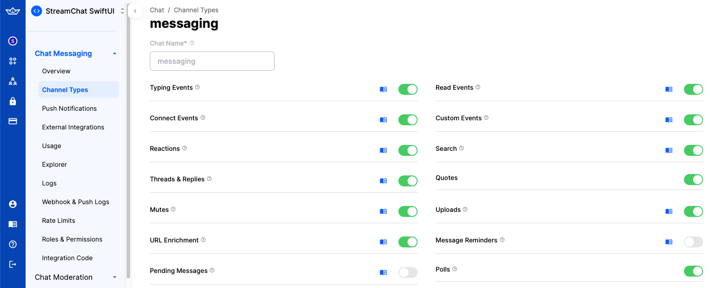

# Polls

Stream Chat's Compose SDK offers the capability to create polls within your chat application. Polls are an effective tool for enhancing user interaction and engagement, providing a dynamic way to gather opinions and feedback from users. This feature allows you to seamlessly integrate interactive polls, making your chat application more engaging and interactive.

:::note
Polls on Compose are available since version **6.5.0**.
:::

Polls are disabled by default. To enable this feature, navigate to the [Stream dashboard](https://getstream.io/dashboard/) for your app and enable the **Polls** flag for your channel type.

Once you enable that feature, an additional "Polls" icon will appear in the attachment picker within the default composer of the SDK.

