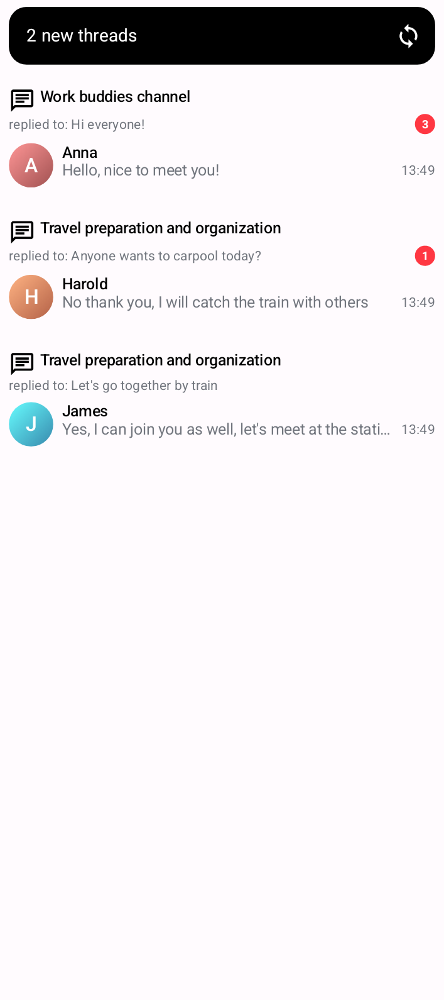

# Thread List

`ThreadList` is a composable component which shows an overview of all threads of which the user is a member of.
It shows information about the channel, the thread parent message, the most recent reply in the thread, and the number of unread replies.

The component is paginated by default, and only the most recently updated threads are loaded initially. Older threads are loaded only when the user scrolls to the end of the thread list.

While this component is visible, and a new thread is created, or a thread which is not yet loaded is updated, the component will show a banner informing the user about the number of new threads, which the user can then click, to reload the thread list and load the newly updated threads.

## Usage

This component is backed by its `ThreadListViewModel`. To instantiate such `ViewModel`, you need to
first create an instance of `ThreadsViewModelFactory`:

```kotlin
private val threadsViewModelFactory by lazy {
   ThreadsViewModelFactory(
       threadLimit = /* ... */,
       threadReplyLimit = /* ... */,
       threadParticipantLimit = /* ... */
   )
}
```
The `ThreadsViewModelFactory` accepts three configurable parameters:
* `threadLimit` - The maximum number of threads to be loaded per page (default: `25`).
* `threadReplyLimit` - The maximum number of (latest) replies to be loaded per thread (default: `10`).
* `threadParticipantLimit` - The maximum number of participants to be loaded per thread (default: `10`).

After the `ThreadsViewModelFactory` is configured, you can instantiate the `ThreadListViewModel` which then can be used to invoke the `ThreadList` composable:

```kotlin
private val viewModel: ThreadListViewModel by viewModels { threadsViewModelFactory }

override fun onCreate(savedInstanceState: Bundle?) {
    super.onCreate(savedInstanceState)

    setContent {
        ChatTheme {
            ThreadList(
                viewModel = viewModel,
                modifier = Modifier.fillMaxSize(),
            )
        }
    }
}
```

This snippet will produce a fully working thread list, together with a loading state, and an empty state for the case without threads:

| No threads | Thread list + new threads banner |
| --- | --- |
|||

Alternatively, you can use the stateless version of the `ThreadList` component, which is backed by a
state object `ThreadListState`.

```kotlin
private val viewModel: ThreadListViewModel by viewModels { threadsViewModelFactory }

override fun onCreate(savedInstanceState: Bundle?) {
    super.onCreate(savedInstanceState)

    setContent {
        ChatTheme {
            val state by viewModel.state.collectAsStateWithLifecycle()
            ThreadList(
                state = state,
                onThreadClick = {
                    // Handle thread clicks
                },
                onUnreadThreadsBannerClick = {
                    // Handle banner clicks
                },
                onLoadMore = {
                    // Handle load more
                }
            )
        }
    }
}
```

## Handling actions

The `ThreadList` component exposes several action handlers:

```kotlin
@Composable
public fun ThreadList(
    viewModel: ThreadListViewModel,
    onUnreadThreadsBannerClick: () -> Unit = { viewModel.load() },
    onThreadClick: (Thread) -> Unit = {},
    onLoadMore: () -> Unit = { viewModel.loadNextPage() },
)
```

* `onUnreadThreadsBannerClick` - The action to be performed when a user taps on the unread threads banner.
By default, tapping on the banner results in reloading the thread list by calling `ThreadListViewModel.load`, in order to fetch the newly created threads.
You can override this method to provide a custom handling of banner clicks.
* `onThreadClick` - The action to be performed when a user taps on a thread item from the list.
By default, this handler is empty, and you can override it to provide a custom handling of the click.
The lambda provides you a `Thread` instance, which you can use to retrieve any data related the clicked thread.
* `onLoadMore` - The action to be performed when the user scrolls to the bottom of the currently loaded thread list,
and a new page of threads should be loaded. By default, this handler loads the next page of threads by calling `ThreadListViewModel.loadNextPage`,
but you can override it to provide custom behaviour.

:::note
If you are using the stateless version of the `ThreadList`, you must handle the `onUnreadThreadsBannerClick` and
`onLoadMore` actions by yourself, as the component doesn't provide a default implementation.
:::

## Customization

The `ThreadList` component allows customization of the following UI components:

```kotlin
public fun ThreadList(
    modifier: Modifier = Modifier,
    unreadThreadsBanner: @Composable (Int) -> Unit = { ... },
    itemContent: @Composable (Thread) -> Unit = { ... },
    emptyContent: @Composable () -> Unit = { ... },
    loadingContent: @Composable () -> Unit = { ... },
    loadingMoreContent: @Composable () -> Unit = { ... },
)
```

* `modifier` - The modifier for the root component. Used for general customization such as size and padding.
* `unreadThreadsBanner` - Composable that represents the banner shown when a new thread is created.
By default, it shows the number of updated threads which are not loaded, and provides a refresh button
which reloads the thread list. The lambda provides an `Int` argument, which represents the number of new/updated threads which are not loaded.
You can use this argument to show the correct number of new/updated threads when overriding this component.
* `itemContent` - Composable that represents a single thread item in the list. This composable is used
to render each item in the list. Override this to provide a customized design of the thread item.
It provides a `Thread` argument, which represents the thread instance for which the item is rendered.
* `emptyContent` - Composable that represents the content shown when there are no threads. Override this to provide a custom empty content.
* `loadingContent` - Composable that represents the content shown during the initial loading of the threads. Override this to provide a custom loading content.
* `loadingMoreContent` - Composable that represents the section shown below the items during the loading of the next batch (page) of threads. Override to provide a custom loading more indicator.

The most commonly customized component is the `itemContent`. Therefore, there are additional customization options for this component.
The base component for this is the `ThreadItem`:

```kotlin
@Composable
public fun ThreadItem(
    thread: Thread,
    currentUser: User?,
    onThreadClick: (Thread) -> Unit,
    modifier: Modifier = Modifier,
    titleContent: @Composable (Channel) -> Unit = { ... },
    replyToContent: @Composable RowScope.(parentMessage: Message) -> Unit = { ... },
    unreadCountContent: @Composable RowScope.(unreadCount: Int) -> Unit = { ... },
    latestReplyContent: @Composable (reply: Message) -> Unit = { ... },
)
```

* `modifier` - The modifier for the root component. You can apply a background, elevation, padding...
* `titleContent` - Composable that represents the title of the thread item. By default, it shows a
thread icon and the channel name in which the thread exists. The lambda provides a `Channel` instance,
which you can utilize to create a custom thread title component.
* `replyToContent` - Composable that represents the parent message of the thread. By default, it shows
a preview of the parent message, with a `replied to:` prefix. The lambda provides a `Message` object,
which represents the parent message of the thread. Override this lambda to provide a custom component
showing the parent message of the thread.
* `unreadCountContent` - Composable representing the unread message count indicator. By default, it
shows a red circle with the number of unread thread messages. The lambda provides an `unreadCount` argument,
which you can use to create a custom unread count indicator.
* `latestReplyContent` - Composable representing the part of the item where the latest thread reply
is rendered. By default, it shows a preview of the latest message in the thread, including the name
and avatar of the user who wrote the message, and a timestamp when the message was created. The lambda
provides a `Message` object, which represents the latest reply in the thread. You can override this
lambda to provide a custom representation of the latest thread reply.

For example, if you would like to override the title and the latest reply content of the thread items,
you can do:

```kotlin
ThreadList(
    viewModel = viewModel,
    itemContent = { thread ->
        ThreadItem(
            thread = thread,
            currentUser = currentUser
            titleContent = { channel ->
                // Custom thread title
            },
            latestReplyContent = { reply ->
                // Custom latest reply content
            },
            onThreadClick = { thread ->
                // Handle item click
            }
        )
    }
)
```

If you would like to keep the same layout as the default item, but you want to show a custom text for
the title, you can also utilize the global channel name formatter `ChannelNameFormatter`, which is
used to format the thread title as well (by default, the thread title shows the channel name).

```kotlin
class CustomChannelNameFormatter: ChannelNameFormatter {
    override fun formatChannelName(channel: Channel, currentUser: User?): String {
        // custom channel name formatting
    }
}

// Usage
@Composable
public fun YourScreen() {
    ChatTheme(
        channelNameFormatter = CustomChannelNameFormatter() // override the default formatter
    ) {
        ThreadList(viewModel = viewModel)
    }
}
```

Similarly, you can customize the message preview formatting for the parent message and the reply message,
by overriding the global message preview formatter `MessagePreviewFormatter`:

```kotlin
class CustomMessagePreviewFormatter: MessagePreviewFormatter {

    // Other methods

    override fun formatMessagePreview(message: Message, currentUser: User?): AnnotatedString {
        // Your implementation for customized message text
    }
}

// Usage
@Composable
public fun YourScreen() {
    ChatTheme(
        messagePreviewFormatter = CustomMessagePreviewFormatter() // override the default formatter
    ) {
        ThreadList(viewModel = viewModel)
    }
}
```