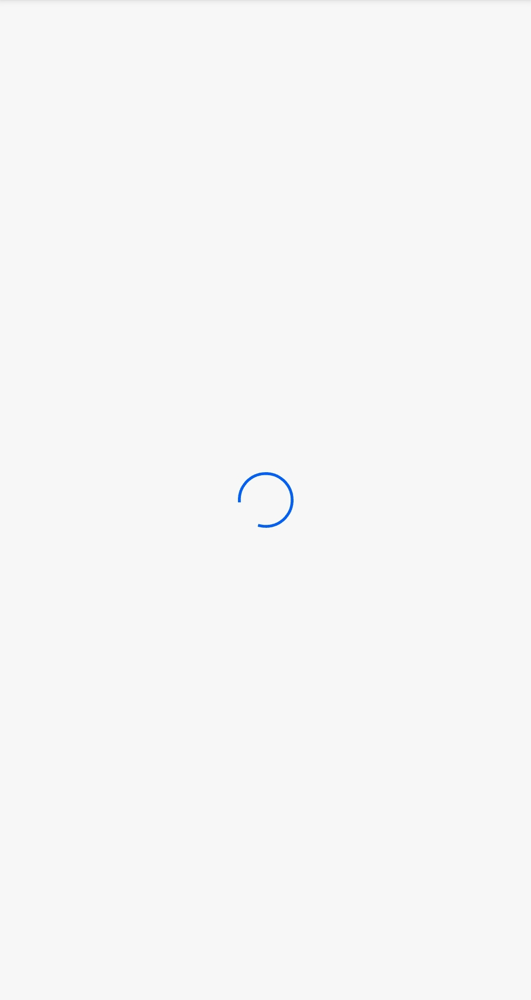
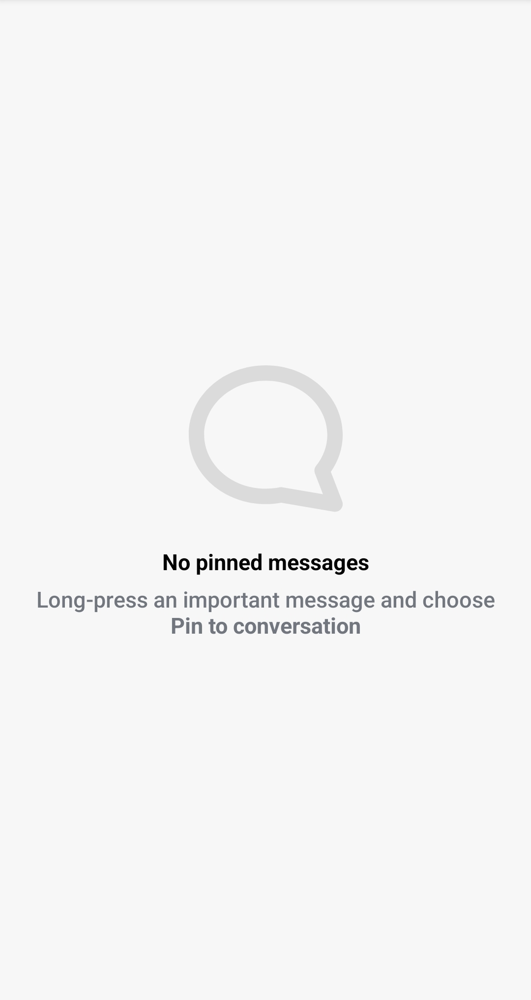
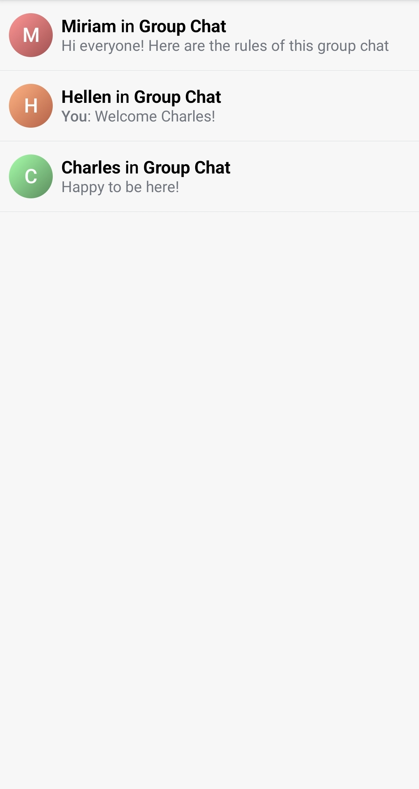

# Pinned Message List

`PinnedMessageListView` is a composable component which shows a list of pinned messages in a given channel.
It includes pagination logic, which ensures that only the 30 most recently pinned messages are initially loaded, and older pinned messages are loaded only when the user scrolls to the bottom of the list.


## Usage

This component is backed by its `PinnedMessageListViewModel`. To use this component in your screens, you need to:

* Create a `PinnedMessageListViewModelFactory` and pass the ID of the channel.
* Instantiate a `PinnedMessageListViewModel` via the factory.
* Pass the ViewModel as an argument to the component.

```kotlin
private val viewModelFactory by lazy {
    PinnedMessageListViewModelFactory(cid = channelId)
}

private val viewModel by viewModels<PinnedMessageListViewModel> { viewModelFactory }

override fun onCreate(savedInstanceState: Bundle?) {
    super.onCreate(savedInstanceState)

    setContent {
        ChatTheme {
            PinnedMessageList(
                modifier = Modifier.fillMaxSize(),
                viewModel = viewModel
            )
        }
    }
}
```

This snippet will produce a fully working list, together with a loading state, and an empty state for the case without pinned messages in the channel:

| Loading | Empty | Loaded |
| --- | --- | --- |
|     |     |     |

## Handling Actions

The `PinnedMessageList` component exposes the action handler for clicking on a pinned message:

```kotlin
@Composable
public fun PinnedMessageList(
    ..., // ViewModel and UI customization
    onPinnedMessageClick: (Message) -> Unit = {},
)
```

The `onPinnedMessageClick` action is empty by default, but you can override it to provide your own click handler:

```kotlin
PinnedMessageList(
    viewModel = viewModel,
    onPinnedMessageClick = { message ->
        // Custom click action
    },
)
```

## Customization

The `PinnedMessageList` component allows customization of the following UI elements:

```kotlin
@Composable
public fun PinnedMessageList(
    modifier: Modifier = Modifier,
    itemContent: @Composable (Message) -> Unit = { ... },
    itemDivider: @Composable (Int) -> Unit = { ... },
    emptyContent: @Composable () -> Unit = { ... },
    loadingContent: @Composable () -> Unit = { ... },
    loadingMoreContent: @Composable () -> Unit = { ... },
)
```

* `modifier` - The modifier for the root component. Used for general customization such as size and padding.
* `itemContent` - Composable that represents a single pinned message item. Override this to provide a completely customized design of the list items.
* `idemDivider` - Composable that represents the divider shown after each item in the list. Override this to change the appearance of the divider, or pass an empty body to remove the divider.
* `emptyContent` - Composable that represents the content shown when there are no pinned messages in the given channel. Override this to provide a custom empty content.
* `loadingContent` - Composable that represents the content shown during the initial loading of the pinned messages. Override this to provide a custom loading content.
* `loadingMoreContent` - Composable that represents the section shown below the items during the loading of the next batch (page) of items. Override to provide a custom loading more indicator.


The most commonly customized element is the `itemContent`. If you want to customize only parts of the item, you can use the `PinnedMessageItem`:

```kotlin
@Composable
public fun PinnedMessageItem(
    message: Message,
    currentUser: User?,
    onPinnedMessageClick: (Message) -> Unit,
    modifier: Modifier = Modifier,
    leadingContent: @Composable RowScope.(Message) -> Unit = { ... },
    centerContent: @Composable RowScope.(Message) -> Unit = { ... },
    trailingContent: @Composable RowScope.(Message) -> Unit = { ... },
)
```
* `modifier` - The modifier for the root component. You can apply a background, elevation, padding...
* `leadingContent` - Composable that represents the leading content of the item. By default, it shows an Avatar of the user who wrote the message. Override this to replace the Avatar and show a custom component instead of it.
* `centerContent` - Composable that represents the central content of the item. By default, it shows a preview of the pinned message: Title holding the name of the user who sent the message, and a body holding a preview of the message text.
* `trailingContent` - Composable that represents the trailing content of the item. By default, it shows the time when the message was created.

For example, if you would like to override the time content from the pinned message, you can do:

```kotlin
PinnedMessageList(
    .. // other customization
    viewModel = viewModel,
    itemContent = { message ->
        PinnedMessageItem(
            .. // other customization
            message = message,
            onPinnedMessageClick = {
                // Handle click
            },
            trailingContent = {
                // Custom implementation
            }
        )
    }
)
```

If you would like to keep the same layout as the default item, but you want to show a custom preview text for the message, you can do that by passing a custom `MessagePreviewFormatter` to the `ChatTheme`:

```kotlin
class CustomMessagePreviewFormatter: MessagePreviewFormatter {

    override fun formatMessageTitle(message: Message): AnnotatedString {
        // Your implementation for customized message title
    }

    override fun formatMessagePreview(message: Message, currentUser: User?): AnnotatedString {
        // Your implementation for customized message text
    }
}

// Usage
@Composable
public fun YourScreen() {
    ChatTheme(
        messagePreviewFormatter = CustomMessagePreviewFormatter() // override the default formatter
    ) {
        PinnedMessageList(viewModel = viewModel)
    }
}
```
