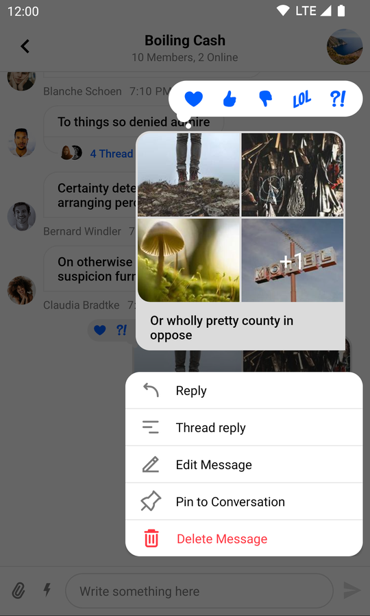
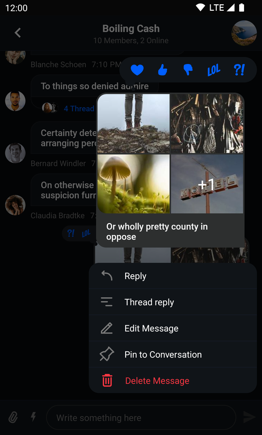

`MessageListView` and `ChannelListView` come with a set of actions out of the box which is available by long-pressing a message. There are multiple available actions:
* Adding reaction
* Reply
* Thread reply
* Copy message
* Edit message (if you are an owner)
* Delete message (if you are an owner)
* Flag message (if it doesn't belong to you)
* Mute user who sends a message (if it doesn't belong to you)
* Block user who sends a message (if it doesn't belong to you)

| Light Mode | Dark Mode |
| --- | --- |
|||

Most of the actions work out of the box but there is a possibility to change its behavior using different listeners and handlers:
```kotlin
messageListHeaderView.setTitleClickListener {
    // Handle title click
}
messageListView.setMessageClickListener { message ->
    // Handle message click
}
messageListView.setAttachmentClickListener { message, attachment ->
    // Handle attachment click
}
messageListView.setMessageEditHandler { message ->
    // Handle edit message
}
messageListView.setMessageDeleteHandler { message ->
    // Handle edit message
}
messageInputView.setOnSendButtonClickListener {
    // Handle send button click
}
```
The full lists of available listeners and handlers are available [here (MessageListHeaderView)](https://getstream.github.io/stream-chat-android/stream-chat-android-ui-components/stream-chat-android-ui-components/io.getstream.chat.android.ui.message.list.header/-message-list-header-view/index.html), [here (MessageListView)](https://getstream.github.io/stream-chat-android/stream-chat-android-ui-components/stream-chat-android-ui-components/io.getstream.chat.android.ui.message.list/-message-list-view/index.html), and [here (MessageInputView)](https://getstream.github.io/stream-chat-android/stream-chat-android-ui-components/stream-chat-android-ui-components/io.getstream.chat.android.ui.message.input/-message-input-view/index.html)
