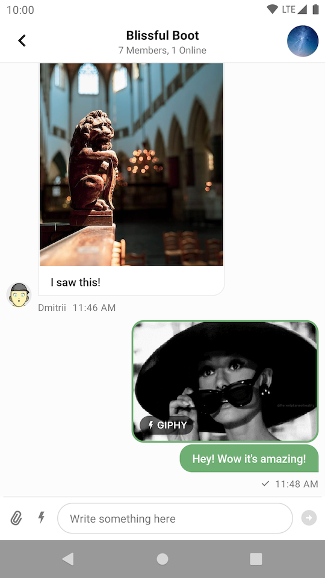

It is possible to change the style of 2 ways: using XML and programatically.

## Changing Messages Style Using XML
Let's change the style of messages sent by the current user.

| Light Mode | Dark Mode |
| --- | --- |
|||

In order to do that, we need to add additional attributes to `MessageListView`:
```xml
    <io.getstream.chat.android.ui.message.list.MessageListView
        android:id="@+id/messageListView"
        android:layout_width="0dp"
        android:layout_height="0dp"
        android:layout_marginHorizontal="0dp"
        android:clipToPadding="false"
        app:layout_constraintBottom_toTopOf="@+id/messageInputView"
        app:layout_constraintEnd_toEndOf="parent"
        app:layout_constraintStart_toStartOf="parent"
        app:layout_constraintTop_toBottomOf="@+id/messagesHeaderView"
        app:streamUiMessageBackgroundColorMine="#70AF74"
        app:streamUiMessageBackgroundColorTheirs="#FFFFFF"
        app:streamUiMessageTextColorMine="#FFFFFF"
        app:streamUiMessageTextColorTheirs="#000000"
        />
```

## Changing Messages Style Programmatically
Both `MessageListView` and its view holders can be configured programmatically (a list of supported customizations can be found [here](https://getstream.github.io/stream-chat-android/stream-chat-android-ui-components/stream-chat-android-ui-components/io.getstream.chat.android.ui.message.list/-message-list-view-style/index.html) and [here](https://getstream.github.io/stream-chat-android/stream-chat-android-ui-components/stream-chat-android-ui-components/io.getstream.chat.android.ui.message.list/-message-list-item-style/index.html)):
Let's make an example and try to modify the default view which allows scrolling to the bottom when the new message arrives:

| Before | After |
| --- | --- |
|||

In order to achieve such effect we need to provide custom _TransformStyle.messageListStyleTransformer_:
```kotlin
TransformStyle.messageListStyleTransformer = StyleTransformer { defaultViewStyle ->
    defaultViewStyle.copy(
        scrollButtonViewStyle = defaultViewStyle.scrollButtonViewStyle.copy(
            scrollButtonColor = Color.RED,
            scrollButtonUnreadEnabled = false,
            scrollButtonIcon = ContextCompat.getDrawable(requireContext(), R.drawable.stream_ui_ic_clock)!!,
        ),
    )
}
```

Let's make another example and apply the green style from the previous paragraph, but this time programmatically:

| Before | After |
| --- | --- |
|||

We are going to use custom _TransformStyle.messageListItemStyleTransformer_:
```kotlin
TransformStyle.messageListItemStyleTransformer = StyleTransformer { defaultViewStyle ->
    defaultViewStyle.copy(
        messageBackgroundColorMine = Color.parseColor("#70AF74"),
        messageBackgroundColorTheirs = Color.WHITE,
        textStyleMine = defaultViewStyle.textStyleMine.copy(color = Color.WHITE),
        textStyleTheirs = defaultViewStyle.textStyleTheirs.copy(color = Color.BLACK),
    )
}
```

NOTE: The transformers should be set before the views are rendered to make sure that the new style was applied.
