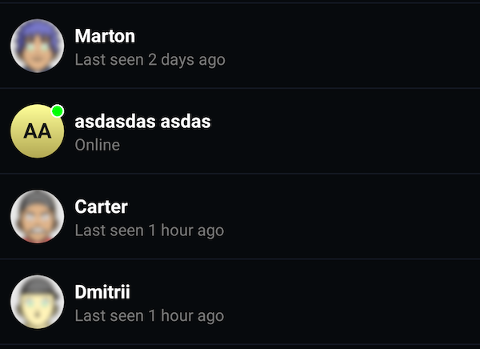

It is possible to customize `AvatarBitmapFactory` so the avatars will
be generated accordingly to the new configuration. It is possible to configure
the user bitmap, user default bitmap, channel bitmap, channel default bitmap, also choose
between blocking and non blocking options and configure the keys for easy bitmap to be used
in the cache system.

To change the default behaviour of this factory, a user needs to extend `AvatarBitmapFactory`,
which is an open class, and set the desired behaviour. This example makes the avatar for offline users blurred:

```kotlin
ChatUI.avatarBitmapFactory = object : AvatarBitmapFactory(context) {
    override suspend fun createUserBitmap(user: User, style: AvatarStyle, avatarSize: Int): Bitmap? {
        val imageResult = context.imageLoader.execute(
            ImageRequest.Builder(context)
                .data(user.image)
                .apply {
                    if (!user.online) {
                        transformations(BlurTransformation(context))
                    }
                }
                .build()
        )

        return (imageResult.drawable as? BitmapDrawable)?.bitmap
    }
}
```
Result:


