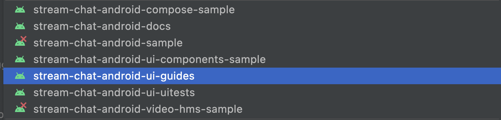

import Tabs from '@theme/Tabs';
import TabItem from '@theme/TabItem';

# Building a Message List Screen

The SDK provides multiple UI Components which can be used together to build a message list screen. This guide will show you how to combine and customize [`MessageListHeaderView`](../message-components/message-list-header.mdx), [`MessageListView`](../message-components/message-list.mdx), and [`MessageComposerView`](../message-components/message-composer.mdx).

This is what a screen made with these three components looks like:

| Light Mode | Dark Mode |
| --- | --- |
||| 

:::note
You can find the full code from this guide on [GitHub](https://github.com/GetStream/stream-chat-android/tree/main/stream-chat-android-ui-guides/src/main/java/io/getstream/chat/android/guides/catalog/uicomponents/messagesscreen). To check the final result, clone the repository, select the `stream-chat-android-ui-guides` module on your Android Studio like the image below, and run the module. 
:::

To add these Views to your app, first create them in an XML layout:

```xml
<?xml version="1.0" encoding="utf-8"?>
<androidx.constraintlayout.widget.ConstraintLayout xmlns:android="http://schemas.android.com/apk/res/android"
    xmlns:app="http://schemas.android.com/apk/res-auto"
    android:layout_width="match_parent"
    android:layout_height="match_parent">

    <io.getstream.chat.android.ui.feature.messages.header.MessageListHeaderView
        android:id="@+id/messageListHeaderView"
        android:layout_width="0dp"
        android:layout_height="wrap_content"
        app:layout_constraintEnd_toEndOf="parent"
        app:layout_constraintStart_toStartOf="parent"
        app:layout_constraintTop_toTopOf="parent" />

    <io.getstream.chat.android.ui.feature.messages.list.MessageListView
        android:id="@+id/messageListView"
        android:layout_width="0dp"
        android:layout_height="0dp"
        android:clipToPadding="false"
        app:layout_constraintBottom_toTopOf="@+id/messageComposerView"
        app:layout_constraintEnd_toEndOf="parent"
        app:layout_constraintStart_toStartOf="parent"
        app:layout_constraintTop_toBottomOf="@+id/messageListHeaderView" />

    <io.getstream.chat.android.ui.feature.messages.composer.MessageComposerView
        android:id="@+id/messageComposerView"
        android:layout_width="0dp"
        android:layout_height="wrap_content"
        app:layout_constraintBottom_toBottomOf="parent"
        app:layout_constraintEnd_toEndOf="parent"
        app:layout_constraintStart_toStartOf="parent"
        app:layout_constraintTop_toBottomOf="@+id/messageListView" />

</androidx.constraintlayout.widget.ConstraintLayout>
```

Just like other components, these three views come with [ViewModels](../overview.mdx#viewmodels) which are responsible for providing all necessary data for them.

After setting up the ViewModels, this screen also requires some additional setup to pass information between the different chat components.

<Tabs>
<TabItem value="kotlin" label="Kotlin">

```kotlin
// Create ViewModels for the Views
val factory = MessageListViewModelFactory(cid = "messaging:123")
val messageListHeaderViewModel: MessageListHeaderViewModel by viewModels { factory }
val messageListViewModel: MessageListViewModel by viewModels { factory }
val messageComposerViewModel: MessageComposerViewModel by viewModels { factory }

// Bind the ViewModels with the Views
messageListHeaderViewModel.bindView(messageListHeaderView, viewLifecycleOwner)
messageListViewModel.bindView(messageListView, viewLifecycleOwner)
messageComposerViewModel.bindView(messageComposerView, viewLifecycleOwner)

// Let both message list header and message input know when we open a thread
messageListViewModel.mode.observe(viewLifecycleOwner) { mode ->
    when (mode) {
        is MessageMode.MessageThread -> {
            messageListHeaderViewModel.setActiveThread(mode.parentMessage)
            messageComposerViewModel.setMessageMode(MessageMode.MessageThread(mode.parentMessage))
        }
        is MessageMode.Normal -> {
            messageListHeaderViewModel.resetThread()
            messageComposerViewModel.leaveThread()
        }
    }
}

// Let the message composer know when we are replying to a message
messageListView.setMessageReplyHandler { _, message ->
    messageComposerViewModel.performMessageAction(Reply(message))
}

// Let the message composer know when we are editing a message
messageListView.setMessageEditHandler { message ->
    messageComposerViewModel.performMessageAction(Edit(message))
}

// Handle navigate up state
messageListViewModel.state.observe(viewLifecycleOwner) { state ->
    if (state is MessageListViewModel.State.NavigateUp) {
        requireActivity().finish()
    }
}

// Handle back button behaviour correctly when you're in a thread
val backHandler = {
    messageListViewModel.onEvent(MessageListViewModel.Event.BackButtonPressed)
}
messageListHeaderView.setBackButtonClickListener(backHandler)

// Override the default Activity's back button behaviour
requireActivity().onBackPressedDispatcher.addCallback(
    viewLifecycleOwner,
    object : OnBackPressedCallback(true) {
        override fun handleOnBackPressed() {
            backHandler()
        }
    }
)
```
</TabItem>

<TabItem value="java" label="Java">

```java
// Create ViewModels for the Views
ViewModelProvider.Factory factory = new MessageListViewModelFactory.Builder()
        .cid("messaging:123")
        .build();
ViewModelProvider provider = new ViewModelProvider(this, factory);
MessageListHeaderViewModel messageListHeaderViewModel = provider.get(MessageListHeaderViewModel.class);
MessageListViewModel messageListViewModel = provider.get(MessageListViewModel.class);
MessageComposerViewModel messageComposerViewModel = provider.get(MessageComposerViewModel.class);

// Bind the ViewModels with the Views
MessageListHeaderViewModelBinding.bind(messageListHeaderViewModel, messageListHeaderView, getViewLifecycleOwner());
MessageListViewModelBinding.bind(messageListViewModel, messageListView, getViewLifecycleOwner());
MessageComposerViewModelBinder.with(messageComposerViewModel).bind(messageComposerView, getViewLifecycleOwner());

// Let both message list header and message input know when we open a thread
messageListViewModel.getMode().observe(getViewLifecycleOwner(), mode -> {
    if (mode instanceof MessageMode.MessageThread) {
        Message parentMessage = ((MessageMode.MessageThread) mode).getParentMessage();
        messageListHeaderViewModel.setActiveThread(parentMessage);
        messageComposerViewModel.setMessageMode(new MessageMode.MessageThread(parentMessage, null));
    } else if (mode instanceof MessageMode.Normal) {
        messageListHeaderViewModel.resetThread();
        messageComposerViewModel.leaveThread();
    }
});

// Let the message composer know when we are replying to a message
messageListView.setMessageReplyHandler((cid, message) ->
    messageComposerViewModel.performMessageAction(new Reply(message))
);

// Let the message composer know when we are editing a message
messageListView.setMessageEditHandler(message ->
    messageComposerViewModel.performMessageAction(new Edit(message))
);

// Handle navigate up state
messageListViewModel.getState().observe(getViewLifecycleOwner(), state -> {
    if (state instanceof MessageListViewModel.State.NavigateUp) {
        requireActivity().finish();
    }
});

// Handle back button behaviour correctly when you're in a thread
MessageListHeaderView.OnClickListener backHandler = () -> {
    messageListViewModel.onEvent(MessageListViewModel.Event.BackButtonPressed.INSTANCE);
};
messageListHeaderView.setBackButtonClickListener(backHandler);

// Override the default Activity's back button behaviour
requireActivity().getOnBackPressedDispatcher().addCallback(getViewLifecycleOwner(), new OnBackPressedCallback(true) {
    @Override
    public void handleOnBackPressed() {
        backHandler.onClick();
    }
});
```
</TabItem>
</Tabs>

:::note
`bindView` sets listeners on the View and the ViewModel. Any additional listeners should be set _after_ calling `bindView`.
:::

This gives you a fully functional messaging screen, where you're able to display and send messages, and perform various actions in the message list.
