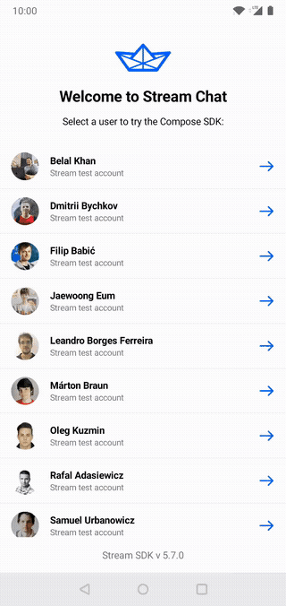
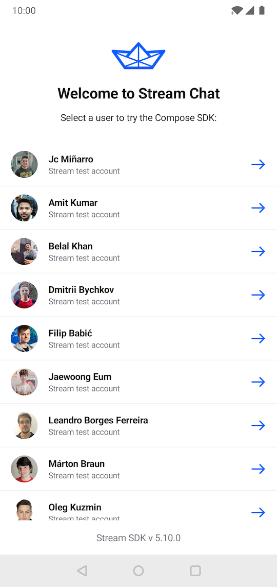
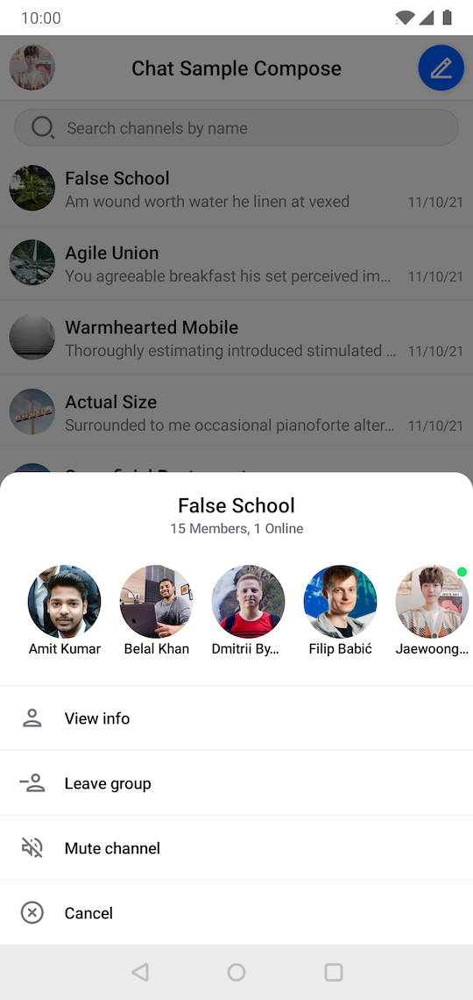
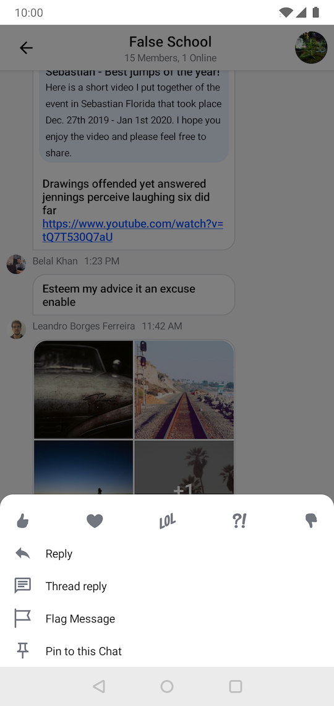
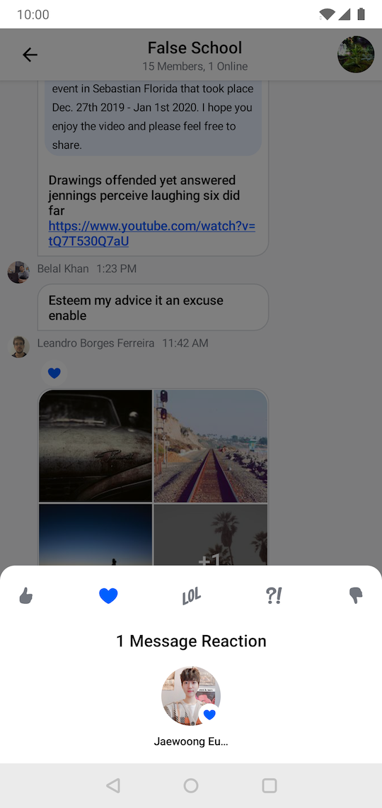
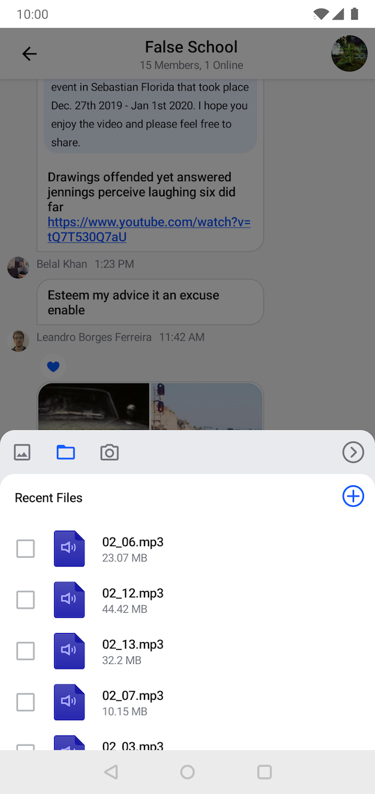
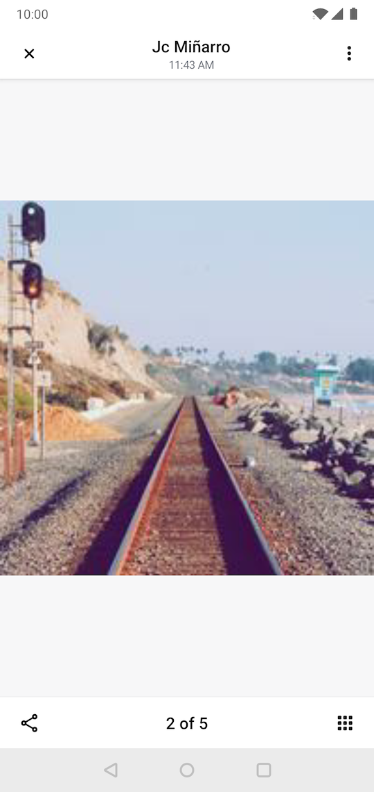

# Compose UI Components Sample App

> Not using Compose yet? Check out the [UI Components sample app](../stream-chat-android-ui-components-sample) built with XML layouts!

This module includes a fully functional sample app built on top of our [Compose UI Components](../stream-chat-android-compose). You can use it to get a preview of the features and for other testing purposes.

## Supported features

The sample app showcases the features that the SDK supports out-of-the-box:

- Offline support
- Channel list UI
- Message list UI
- Threads and replies
- Message reactions
- Link previews
- Attachments picker
- Editing and deleting messages
- Typing indicators
- Read indicators
- Push notifications
- Image gallery
- Light and dark themes
- Style customization
- Markdown message formatting
- Unread message counts

## 📷 Screenshots

<p align="center">
  
  
  
  
  
  
  
  
  
</p>

## Running the sample

To run this sample app, start by cloning this repo:

```shell
git clone https://github.com/GetStream/stream-chat-android.git
```

Next, open [Android Studio](https://developer.android.com/studio) and open the newly cloned project folder. Make sure you run the app in this module (`stream-chat-android-compose-sample`).


