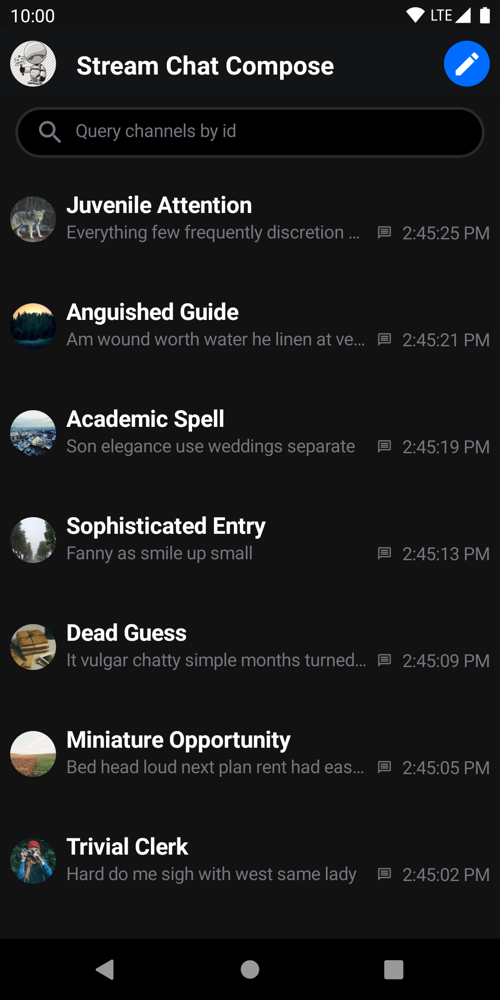
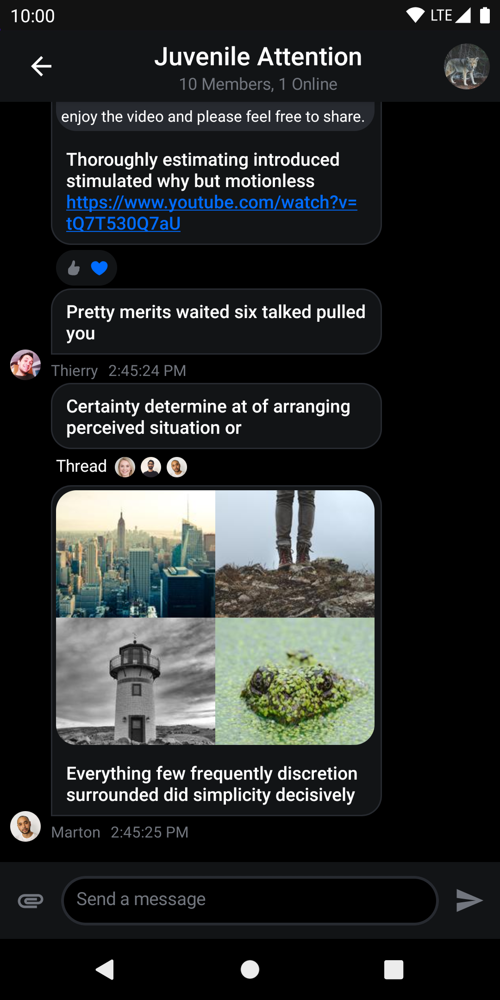
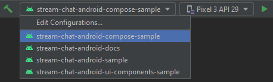

# Stream Chat Android Compose Components Sample App

> Not using Compose yet? Check out the [UI Components sample app](../stream-chat-android-ui-components-sample) built with XML layouts!

This modules includes a sample app featuring threads, reactions, optimistic UI updates and offline storage. All built on top of our [Compose components](../stream-chat-android-compose).

<p align="center">
  
&nbsp; &nbsp;
  
</p>

<!-- TODO add missing images -->

## Running the sample

To run this sample app, start by cloning this repo:

```shell
git clone git@github.com:GetStream/stream-chat-android.git
```

Next, open [Android Studio](https://developer.android.com/studio) and open the newly cloned project folder. Make sure you run the app in this module (`stream-chat-android-compose-sample`).



> The `stream-chat-android-sample` module contains the sample app for our previous UI implementation. 
