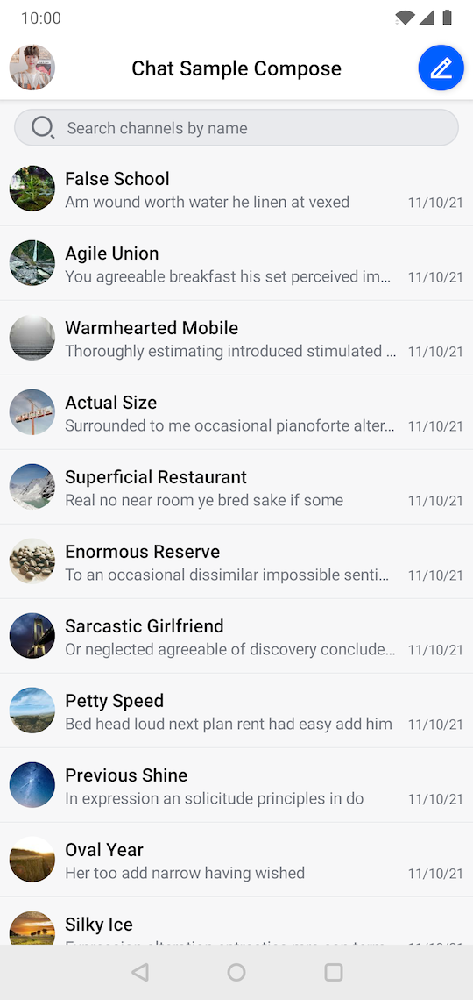
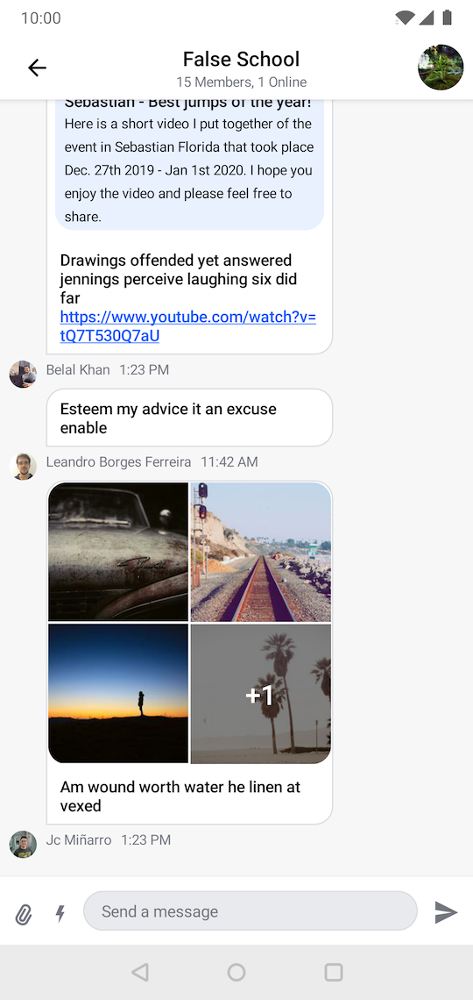

# Stream Chat Android Compose UI Components

This module contains reusable UI components built in Jetpack Compose, which you can use in combination with the [offline support](../stream-chat-android-offline) library. See the [Compose UI Components documentation](https://getstream.io/chat/docs/sdk/android/compose/overview/) for more info.

> Not using Compose yet? Check out the [UI Components](../stream-chat-android-ui-components) library built with XML layouts!

  
&nbsp; &nbsp;
  

## Setup

To start using this library in your project, see [Dependencies](https://getstream.io/chat/docs/sdk/android/basics/dependencies/), and then [Getting Started](https://getstream.io/chat/docs/sdk/android/client/overview/).

## Sample app

To see these components in action, check out our [sample app](../stream-chat-android-compose-sample), which implements a messaging application based on these components.

## Project management and milestones

We keep all of our project planning, management, milestones and ticket tracking open and public, in GitHub projects.

To see what we're working on at the moment, what we have planned for the future and what milestones we have, check out the [Compose Planning](https://github.com/orgs/GetStream/projects/6) project board.