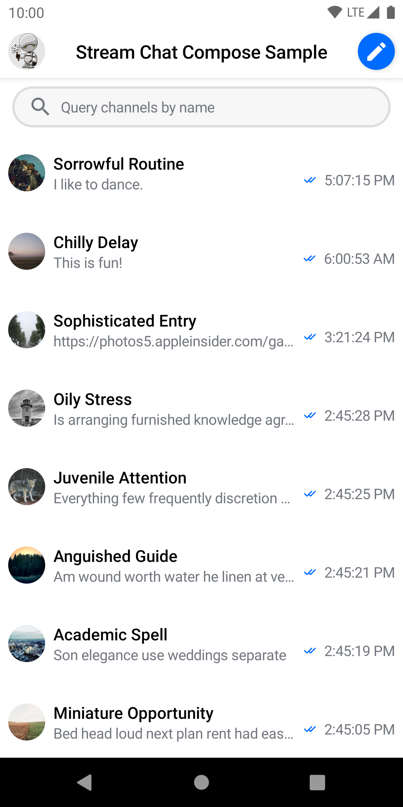
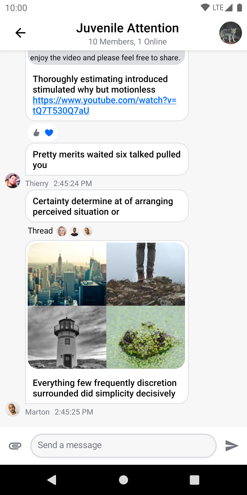

# Stream Chat Android Compose UI Components

This module contains reusable UI components built in Jetpack Compose, which you can use in combination with the [offline support](../stream-chat-android-offline) library. See the [Compose UI Components documentation](https://getstream.io/chat/docs/sdk/android/compose/overview/) for more info.

> Not using Compose yet? Check out the [UI Components](../stream-chat-android-ui-components) library built with XML layouts!

  
&nbsp; &nbsp;
  

## Setup

To start using this library in your project, see [Dependencies](https://getstream.io/chat/docs/sdk/android/basics/dependencies/), and then [Getting Started](https://getstream.io/chat/docs/sdk/android/basics/getting-started/).

## Sample app

To see these components in action, check out our [sample app](../stream-chat-android-compose-sample), which implements a messaging application based on these components.
