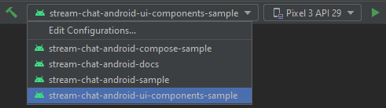

# Stream Chat Android UI Components Sample App

> Already using Compose? Check out the [Compose sample app](../stream-chat-android-compose-sample) instead!

This modules includes a fully functional sample app featuring threads, reactions, typing indicators, optimistic UI updates and offline storage. All built on top of our [UI components](../stream-chat-android-ui-components).

<p align="center">
  
&nbsp; &nbsp;
  
&nbsp; &nbsp;
  
</p>

## Running the sample

To run this sample app, start by cloning this repo:

```shell
git clone git@github.com:GetStream/stream-chat-android.git
```

Next, open [Android Studio](https://developer.android.com/studio) and open the newly cloned project folder. Make sure you run the app in this module (`stream-chat-android-ui-components-sample`).



> The `stream-chat-android-sample` module contains the sample app for our previous UI implementation. 
