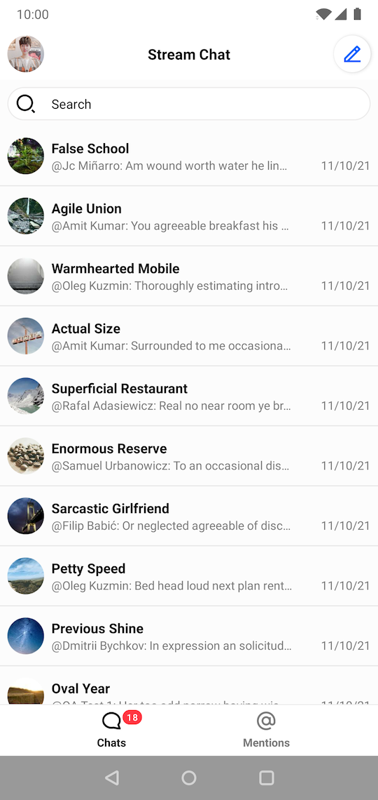
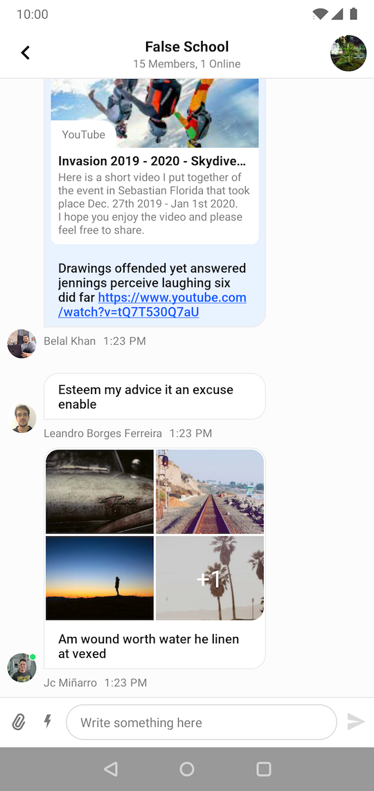

# Stream Chat Android UI Components

This module contains reusable UI components. See the [UI Components documentation](https://getstream.io/chat/docs/sdk/android/ui/overview/) for more info.

> Already using Compose? Check out our [Compose UI Components](../stream-chat-android-compose) instead!

  
&nbsp; &nbsp;
  

## Setup

To start using this library in your project, see [Dependencies](https://getstream.io/chat/docs/sdk/android/basics/dependencies/), and then [Getting Started](https://getstream.io/chat/docs/sdk/android/client/overview/).

## Sample app

To see these components in action, check out our [sample app](../stream-chat-android-ui-components-sample), which implements a fully-featured messaging application based on these components.

## UI components

You'll find the detailed documentation for the components on our website:

- [Channel List Screen](https://getstream.io/chat/docs/sdk/android/ui/channel-components/channel-list-screen/)
- [Channel List View](https://getstream.io/chat/docs/sdk/android/ui/channel-components/channel-list/)
- [Channel List Header View](https://getstream.io/chat/docs/sdk/android/ui/channel-components/channel-list-header/)
- [Message List Screen](https://getstream.io/chat/docs/sdk/android/ui/message-components/message-list-screen/)
- [Message List View](https://getstream.io/chat/docs/sdk/android/ui/message-components/message-list/)
- [Message List Header View](https://getstream.io/chat/docs/sdk/android/ui/message-components/message-list-header/)
- [Message Composer View](https://getstream.io/chat/docs/sdk/android/ui/message-components/message-composer/)
- [Mention List View](https://getstream.io/chat/docs/sdk/android/ui/utility-components/mention-list-view/)
- [Pinned Message List View](https://getstream.io/chat/docs/sdk/android/ui/utility-components/pinned-message-list-view/)
- [Search View](https://getstream.io/chat/docs/sdk/android/ui/utility-components/search-view/)
- [Attachment Gallery](https://getstream.io/chat/docs/sdk/android/ui/utility-components/attachment-gallery/)
